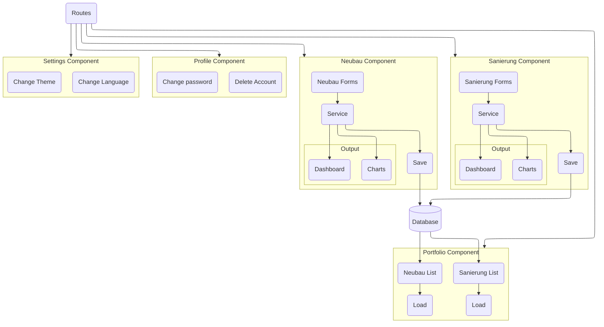
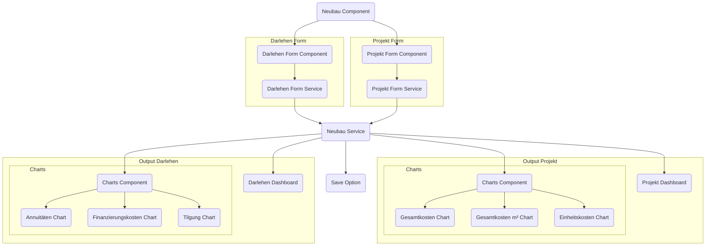
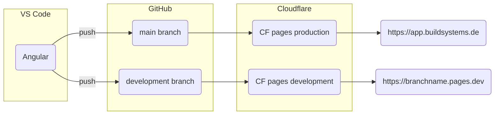
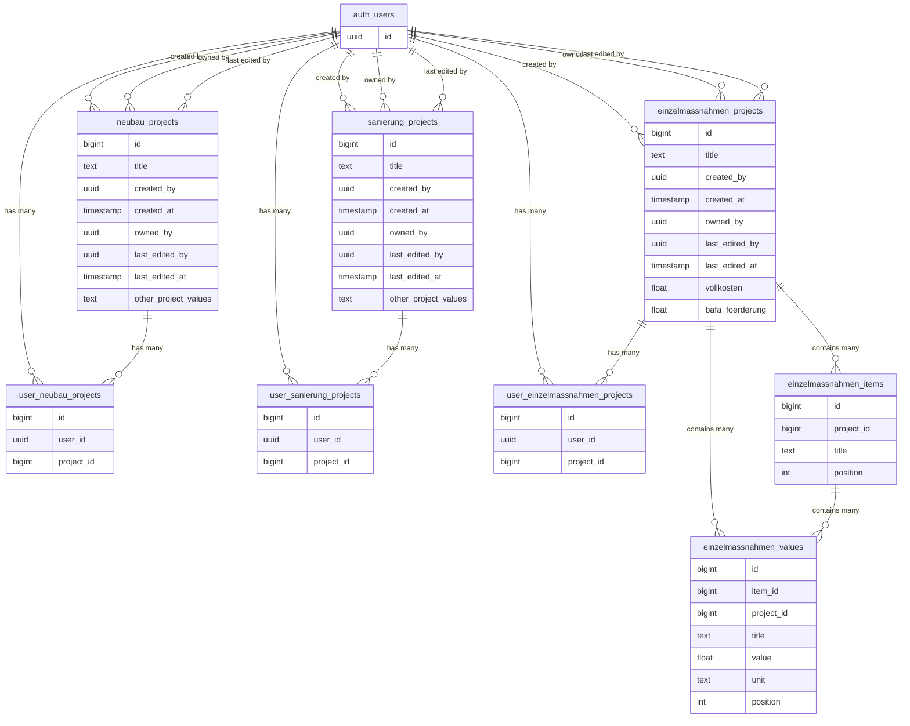

# Calculadora de financiamento imobiliário da BuildSystems

Description: Esta calculadora simula empréstimos e subsídios bancários, tornando construções e reformas sustentáveis acessíveis a incorporadores imobiliários e proprietários de imóveis.
Tags: Software Development, Web Development

## Recursos
- **Estimativa de preço de um edifício**: O aplicativo estima o custo de uma construção ou reforma com base em dados disponíveis publicamente da [Arge e.V.](https://arge-ev.de/arge-ev/publikationen/studien/)
- **Simulação de empréstimo**: Simulação precisa de empréstimos com base na estimativa de preço e eficiência energética de um edifício.
- **Métricas de energia:** Influenciando as possibilidades de subsídio e empréstimo.
- **Segurança de dados**: Garantindo que todos os dados do usuário estejam seguros e sigam os regulamentos da União Européia.
- **Design responsivo**: O aplicativo funciona perfeitamente em todos os dispositivos modernos, de celulares à desktops.
## Stack de tecnologia
- [**GitHub**](https://github.com/build-systems/toolbox): Para o repositório.
- [**Angular**](https://angular.dev/): Uma estrutura JavaScript moderna apoiada pelo Google e usada para aplicativos de grande escala.
- [**ng2-charts**](https://www.npmjs.com/package/ng2-charts): Wrapper para a biblioteca Chart.js. É usado para criar gráficos responsivos e interativos.
- [**Cloudflare**](https://www.cloudflare.com/): Provedor de hospedagem para garantir confiabilidade e escalabilidade, nenhum investimento inicial é necessário.
# Por que desenvolvemos este app?
A Alemanha destaca-se mundialmente como pioneira em tecnologias sustentáveis, com seu forte incentivo a painéis solares e turbinas eólicas através de generosos subsídios governamentais. No entanto, um aspecto menos conhecido, mas igualmente importante, é o robusto sistema de incentivos para construções energeticamente eficientes. Embora essa iniciativa seja louvável, muitos potenciais beneficiários enfrentam um desafio significativo: a complexidade da burocracia alemã, que frequentemente dificulta o acesso a esses valiosos recursos.
Este aplicativo desenvolvido pela [BuildSystems](https://buildsystems.de/) facilita a simulação de um empréstimo do banco nacional [KfW](https://kfw.de/). Ele simplifica o processo ao oferecer uma interface amigável, permitindo que incorporadores imobiliários e proprietários de imóveis entendam suas opções financeiras de forma rápida e fácil.
# Processo de Desenvolvimento
O desenvolvimento do aplicativo aconteceu em três fases principais. Planejamento e Design, Desenvolvimento Frontend, Testes + Garantia de Qualidade.
## Planejamento e Design
Para começar a equipe definiu os requisitos e variáveis para a lógica do aplicativo. Uma vez que isso foi definido, esbocei a arquitetura do frontend e a UI/UX.
### Lógica do aplicativo
Daniel Dieren desenvolveu a lógica do aplicativo no Excel. Minha função era revisá-la, fazer engenharia reversa das fórmulas para garantir que tudo estivesse correto e sugerir melhorias. Esta etapa se sobrepôs a todo o processo de desenvolvimento de software porque, conforme avançávamos, percebemos que poderíamos adicionar mais informações relevantes.
Criei uma documentação simples no Notion a partir do arquivo do Excel para entender cada fórmula completamente e facilitar a transferência para o TypeScript posteriormente.
### Arquitetura do Frontend
Como a equipe já usa o [Figma](https://www.figma.com/), decidi permanecer dentro desse ecossistema. Usei o [FigJam](https://www.figma.com/figjam/) para esboçar um diagrama de arquitetura de software, pensando em quais componentes seriam necessários e a relação entre eles.

### Design de UI e UX
Conceitualmente, minha abordagem para o design foi o de fornecer um dashboard com todas as variáveis acessíveis, sem uma camada de abstração muito grande. Em uma fase posterior, a idéia é de criar uma interface simplificada com um passo-à-passo para reduzir o atrito para usuários leigos.
Para criar protótipos, usei o Figma. Simular comportamentos de mouse over, mouse in, mouse out é possível. Além disso, seu plano pago facilita a cópia de estilos CSS e SVGs com o Modo Dev. Mas mesmo com o plano gratuito, parece muito fácil exportar SVGs.

## Construindo a Interface do Usuário
Este projeto marcou minha metamorfose em um desenvolvedor de software completo. Exigindo que eu aprendesse [Angular](https://angular.dev/), um framework JavaScript e sua estrutura altamente opinativa, que era perfeita para o meu caso.
### Por que escolhemos o Angular?
Muitas pessoas acreditam que o Angular é um dos frameworks mais difíceis para desenvolvimento web. Se compararmos com React ou Vue, por exemplo, parece mais difícil no começo. Mas a verdade é que, como o Angular tem muitos recursos integrados (o que significa que é "opinativo"), ele elimina a necessidade de tomar muitas decisões mais tarde. Então, eu pude pular a parte mais chata de quem aprende programação sozinho: a exaustão mental derivada de se fazer muitas escolhas. E acredite em mim, [fadiga de decisão](https://en.wikipedia.org/wiki/Decision_fatigue) é uma coisa real!
Além disso, o Angular usa uma linguagem de programação chamada [TypeScript](https://en.wikipedia.org/wiki/TypeScript). Pense nisso como JavaScript com um verificador de código que ajuda a detectar erros antes que eles se tornem problemas. Como eu era a única pessoa programando, o TypeScript ajudou bastante! Na verdade, eu só confiaria em mim mesmo para desenvolver este aplicativo com as proteções que o TypeScript cria.
Outro motivo para escolher o Angular é sua reputação de confiabilidade e facilidade de manutenção, especialmente em aplicativos de grande escala. Ele é apoiado pelo Google, que já construiu mais de 2.600 soluções com ele, então está claro que ele pode lidar com projetos complexos e será mantido por um longo tempo.
Com minha formação em arquitetura e engenharia, entendo o quão rápido as coisas podem se tornar complexas neste campo também, e embora a Calculadora KfW pareça simples no início, ela inclui cerca de três centenas de variáveis e mais de cem funções em sua primeira versão. Dado o objetivo da BuildSystems de criar um aplicativo escalável que evoluirá para uma ferramenta abrangente de planejamento inicial, os pontos fortes do Angular foram perfeitos para este projeto.
### Ferramentas de IA como copiloto
Também vale a pena mencionar a importância das ferramentas de IA como um copiloto. O ChatGPT desempenhou um papel crucial na conversão de fórmulas do Excel em código TypeScript. Mas devo dizer que, para recursos de ponta, essas ferramentas de IA não deram boas respostas, porque obviamente elas ainda não têm os dados de treinamento disponíveis.
### Processo
Durante o processo de desenvolvimento, tentei criar um único componente que acomodasse tanto a calculadora Nova Construção (Neubau) quanto a Renovação (Sanierung), tornando o código menos repetitivo seguindo o princípio de [DRY](https://pt.wikipedia.org/wiki/Don%27t_repeat_yourself) (não repita a si mesmo).
Isso, no entanto, tornou o componente muito complexo porque havia muitas variáveis e requisitos exclusivos para cada calculadora. Então, no final, decidi dividi-lo em dois componentes. Embora haja algum código redundante, isso adicionou velocidade ao desenvolvimento.

As estratégias usadas para implementar os recursos também variaram ao longo do desenvolvimento porque, à medida que eu progredia, aprendi maneiras novas e aprimoradas de atingir o mesmo resultado. Por exemplo, a implementação dos formulários já mudou duas vezes. Na primeira vez, decidi refatorar todo o código para garantir que tudo fosse homogêneo e tivesse um código mais claro.
Isso, no entanto, acabou sendo uma decisão ruim de gerenciamento de produto, porque os recursos já estavam funcionando e, embora o código fosse um pouco confuso, alterar não afetou o usuário final de forma alguma. Então, para a segunda mudança, na segunda versão do aplicativo, eu acabei não refatorando o resto do código.
Se você quiser saber mais sobre como estou implementando os formulários atualmente, confira este artigo de Zoaib Khan:

## Testes e Garantia de Qualidade
Eu também mergulhei fundo no tópico de [testes unitários](https://pt.wikipedia.org/wiki/Teste_de_unidade) usando a ferramenta padrão [Karma](http://karma-runner.github.io/6.4/intro/how-it-works.html).
Esse tipo de teste verifica pequenas partes (unidades) do software para garantir que cada uma funcione corretamente por si só. Porém, eu só consegui aprender isso em um estágio tardio, o que significou que tive que refatorar o código para permitir que os testes unitários funcionassem.
Além disso, se eu tivesse que começar de novo, eu concentraria minhas energias em [testes de ponta a ponta](https://pt.wikipedia.org/wiki/Teste_de_sistema) (E2E) usando [Cypress](https://docs.cypress.io/guides/overview/why-cypress). Este teste verifica todo o sistema simulando a interação do usuário, garantindo que os inputs e outputs correspondam à nossa devida diligência.
# Implantação
Inicialmente, implantamos o aplicativo no Netlify. O modelo de negócios deles é "pague conforme você escala", sem custos iniciais. Além disso, é uma solução de implantação sem código; você apenas conecta seu repositório GitHub e eles fazem o resto!
No entanto, alguns usuários do Netlify começaram a espalhar como eles passaram do plano gratuito para serem cobrados dezenas de milhares de dólares, ou até mesmo [US$ 104 mil em um mês](https://www.reddit.com/r/webdev/comments/1b14bty/netlify_just_sent_me_a_104k_bill_for_a_simple/). Tudo por causa de um ataque DDOS que poderia acontecer com qualquer um. Como o Netlify não tinha um mecanismo de prevenção de ataques DDOS, decidimos mudar para o Cloudflare.
O Cloudflare é semelhante ao Netlify. Mesmo modelo de negócios e implantação automatizada usando o GitHub. No entanto, eles tem um sistema anti-bot mais robusto.
A implantação é automática e bem simples:

# Desenvolvimento do aplicativo: principais insights e estratégias
- **Segurança em primeiro lugar**: priorize a segurança dos dados desde o início para evitar problemas de conformidade mais tarde.
- **Planejamento antecipado**: invista tempo no planejamento e entenda os requisitos necessários antes de iniciar o desenvolvimento.
- **Ferramentas de IA**: utilize ferramentas de IA para designs iniciais para gerar rapidamente interfaces de usuário; use copilotos de código, mesmo que seja apenas ChatGPT.
- **Flexibilidade**: esteja ciente de que o aplicativo evoluirá, portanto, não siga estritamente o princípio [DRY](https://en.wikipedia.org/wiki/Don%27t_repeat_yourself).
- **Seleção de estrutura**: escolha uma estrutura que atenda às necessidades do seu projeto e continue com ela. Normalmente, a melhor estrutura é aquela que você já conhece.
- **Teste contínuo**: aposte seus esforços de teste em testes de ponta a ponta.
Um dos principais desafios era tornar o aplicativo "snappy"; em outras palavras, enquanto o usuário move um controle, todos os valores e gráficos são atualizados em tempo real. Além disso, fomos cautelosos sobre os dados dos usuários por causa das regulamentações super restritivas da União Européia.
A primeira decisão foi evitar cálculos no servidor completamente. O aplicativo inteiro funciona apenas do lado do cliente. O que significa que, uma vez carregado, ele não precisa enviar dados para lugar nenhum; o cálculo acontece diretamente no dispositivo. Isso significa que também não tivemos que nos preocupar com o armazenamento de dados para a primeira versão.
Projetar o aplicativo do zero foi uma experiência valiosa, mas agora que entendo o processo, eu começaria o design da interface de usuário (IU) com um assistente de IA. Ferramentas como [Galileo AI](https://www.usegalileo.ai/) ou [Rendition Create](https://www.renditioncreate.com/) podem ajudar a começar com uma interface de aplicativo agradável gerada a partir de prompts (Texto para IU). Começar com um rascunho de IU é sempre mais rápido, mesmo que o rascunho mude drasticamente.
# Próximos passos
No momento, estamos trabalhando na segunda versão do aplicativo. A ideia é trazer outra calculadora e alguns outros recursos, como salvar um projeto e comparar dois projetos. Usaremos [Supabase](https://supabase.com/) para armazenar os dados.

