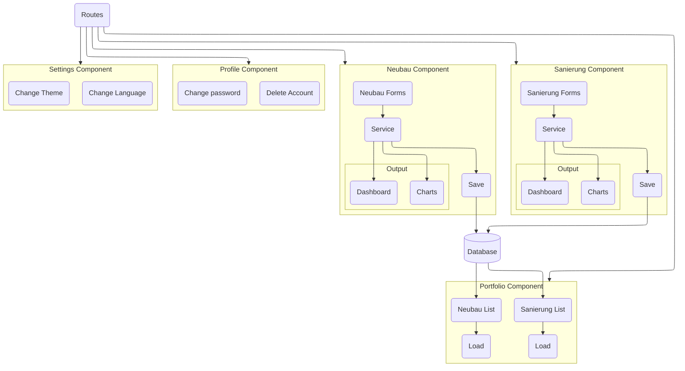
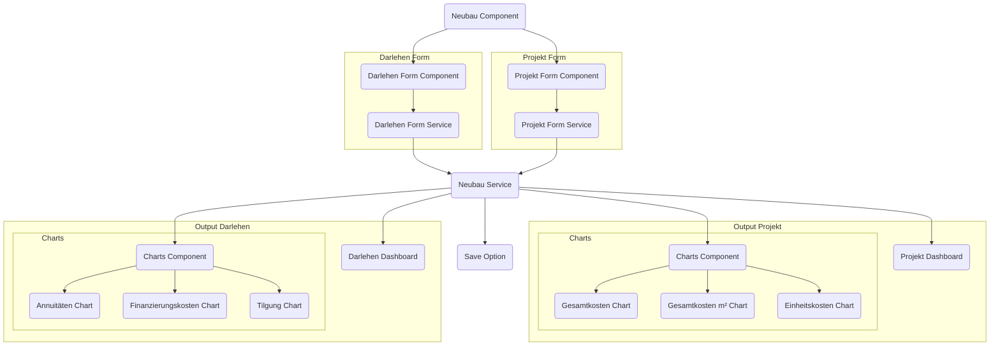
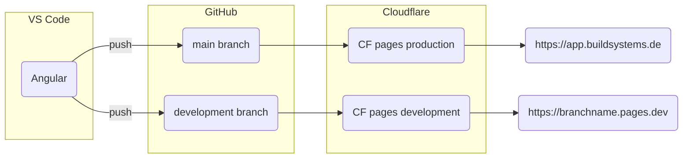
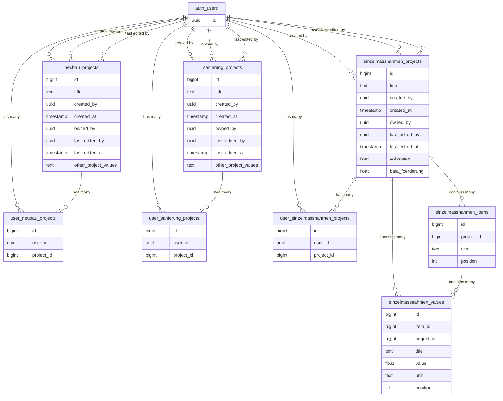

URL: https://daniellocatelli.com/projects/kfw-funding-calculator-by-buildsystems

# KfW Funding Calculator by BuildSystems

Description: This calculator simulates bank loans and subsidies, making sustainable constructions and renovations accessible to real estate developers and homeowners.
Tags: Software Development, Web Development

## Features
- **Price estimation of a building**: The app estimates the cost of a new construction or renovation based on publicly available data from [Arge e.V.](https://arge-ev.de/arge-ev/publikationen/studien/)
- **Loan Simulation**: Accurate simulation of loans based on the price estimation and energy efficiency of a building.
- **Energy metric inputs:** Influencing the subsidy and loan possibilities.
- **Data Security**: Ensuring all user data is secure and follow EU regulations.
- **Responsive Design**: App works seamlessly across all devices.
## Tech stack
- [**GitHub**](https://github.com/build-systems/toolbox): For the Git repository.
- [**Angular**](https://angular.dev/): A modern JavaScript framework backed by Google and used for large-scale applications.
- [**ng2-charts**](https://www.npmjs.com/package/ng2-charts): Angular wrapper for the Chart.js library. It is used to create responsive and interactive charts.
- [**Cloudflare**](https://www.cloudflare.com/): Hosting provider to ensure reliability and scalability, no initial investment is required.
# Why did we build this toolbox?
Germany is known for pushing green tech, such as solar panels and wind turbines, through public subsidies. But did you know that there are also many subsidies for energy-efficient construction? Although these subsidies are attractive, navigating the bureaucracy can be incredibly challenging.
This app developed by [BuildSystems](https://buildsystems.de/) makes it easy to simulate a loan from the national bank [KfW](https://kfw.de/). It simplifies the process by offering a user-friendly interface, allowing real estate developers and homeowners to understand their financial options quickly and easily.
# Development Process
The app development happened in three major phases. The Planning and Design, the Frontend Development and the Test & Quality Assurance.
## Planning and Design
To begin the project, the whole team defined the requirements and variables for the app logic. Once that was settled, I sketched the frontend architecture and the UI/UX.
### App logic
Daniel Dieren developed the app logic in Excel. My role was to review it, reverse engineer the formulas to ensure everything was correct, and suggest improvements. This step overlapped with the whole software development process because, as we advanced, we noticed that we could add more relevant information.
I created a simple documentation on Notion from the Excel file to understand each formula thoroughly and make it easy to bring it to TypeScript later.
### Frontend Architecture
Because the team already uses [Figma](https://www.figma.com/), I decided to stay within its ecosystem. So, I used [FigJam](https://www.figma.com/figjam/) to sketch an initial software architecture diagram, thinking about which components would be necessary and the relationship between them.

### UI & UX Design
Conceptually, my approach for the design was to create a full dashboard with all the variables accessible by the user, without too much abstraction. At a later stage we aim at having another user flow where users have a step-by-step for simulating the loans.
To create prototypes, I used Figma, which was quite a pleasant design experience. Simulating mouse over, mouse in, mouse out behaviors is possible. Besides, their paid plan makes copying CSS styles and SVGs easy with the Dev Mode. But even with the free plan, it feels like a breeze to export SVGs.

## Building the User Interface
This project marked my metamorphosis into a fully-fledged software developer. This required me to learn [Angular](https://angular.dev/), a JavaScript framework, and its highly opinionated structure, which was perfect for my case.
### Why did we choose Angular?
Many people believe that Angular is one of the most difficult frameworks for web development. If we compare it to React or Vue, for example, it does looks harder in the beginning. But the truth is that because Angular has a lot of built-in features (which means it is "opinionated"), it eliminates the need to make a lot of decisions later on. So, I could skip the most painful part for a solo learner: the mental exhaustion that can come from making too many choices. And believe me, [decision fatigue](https://en.wikipedia.org/wiki/Decision_fatigue) is a real thing!
In addition, Angular uses a programming language called [TypeScript](https://en.wikipedia.org/wiki/TypeScript). Think of it as JavaScript with a code checker that helps catch errors before they become problems. Since I was the only person writing the code, TypeScript was a big safety net. In fact, I would only trust myself to develop this app with the guardrails that TypeScript creates. Remember that I had no code reviewer; I was a team of one on the software side.
Another reason to choose Angular is its reputation for reliability and ease of maintenance, especially in large-scale applications. It is backed by Google, which have already built more than 2600 solutions with it, so it is clear that it can handle complex projects and will be maintained for a long time.
With my background in architecture and engineering, I understand how quickly things can become complex in this field too, and even though the KfW Calculator seems simple at first, it includes around a couple of hundred variables and over a hundred functions in its first version. Given BuildSystems' goal to create a scalable app that will evolve into a comprehensive early planning tool, Angular's strengths were a perfect fit for this project.
### AI Tools as a Copilot
It is also worth mentioning the importance of AI tools as a copilot. ChatGPT played a crucial role converting the excel formulas into TypeScript code. But I have to say though, for cutting-edge features these AI tools did not give good answers, because obviously they still don’t have the training data available.
### Process
During the development process, I tried to create a single component that would accommodate both the New Building (Neubau) and the Renovation (Sanierung) calculator, making the code less repetitive following the principle of [DRY](https://en.wikipedia.org/wiki/Don%27t_repeat_yourself) (don’t repeat yourself).
This, however, made the component too complex because there were many variables and requirements unique to each calculator. So in the end I decided to split it into two components. Although there is some redundant code, this added speed to the development.

The strategies used to implement the features also varied throughout the development because as I progressed, I learned new and improved ways to achieve the same result. For example, the implementation of the forms changed twice already. The first time I decided to refactor the whole code to make sure everything was homogeneous and had a more clear code.
That, however, turned out to be a poor product management decision, because the features were already working and although the code was a bit confusing, changing the internals would not affect the end user at all. So for the second change, which is happening for the second version of the app, I won’t be refactoring the rest of the code.
If you want to learn more about how I am currently implementing the forms, check out this article by Zoaib Khan:

## Testing and Quality Assurance
I also went down the rabbit hole on the topic of [unit testing](https://en.m.wikipedia.org/wiki/Unit_testing) using the default [Karma](http://karma-runner.github.io/6.4/intro/how-it-works.html)** **tool.
This type of testing checks small parts (units) of the software to make sure each one works correctly on its own. Unfortunately, though, I could only learn this at a late stage, which meant I had to refactor the code to allow the unit tests to work.
Besides, if I had to start over, I would instead focus my energy on [end-to-end testing](https://en.m.wikipedia.org/w/index.php?title=System_testing&diffonly=true) (E2E) using [Cypress](https://docs.cypress.io/guides/overview/why-cypress). This test checks the whole system by simulating user interaction, ensuring inputs and outputs match our due diligence.
# Deployment
We initially deployed the app on Netlify because they have a super smooth experience. Their business model is “pay as you scale” with no initial costs. Besides, it is a no-code deployment solution; you just connect your GitHub repo, and they do the rest!
However, some Netlify users started to spread how they went from the free plan to being charged tens of thousands of dollars, or even [$104K in a month](https://www.reddit.com/r/webdev/comments/1b14bty/netlify_just_sent_me_a_104k_bill_for_a_simple/). All because of a DDOS attack that could happen to anyone. Because Netlify did not have a DDOS attack prevention mechanism, we decided to move to Cloudflare.
Cloudflare is similar to Netlify. Same business model and automated deployment using GitHub. However, it does have a more robust anti-bot system.
The deployment is automatic and quite simple:

# Ensuring a Smooth App Development: Key Insights and Strategies
- **Security First**: Prioritize data security from the beginning to avoid compliance issues later.
- **Early Planning**: Invest time in planning and understand the requirements you need before starting the development.
- **AI Tools**: Utilize AI tools for initial designs to quickly generate user interfaces; use code copilots even if just ChatGPT.
- **Flexibility**: Be aware that the app will evolve, so don't adhere too strictly to the [DRY](https://en.wikipedia.org/wiki/Don%27t_repeat_yourself) principle.
- **Framework Selection**: Choose a framework that suits your project's needs and stick with it. Usually, the best framework is the one you already know.
- **Continuous Testing**: bet your testing efforts on end-to-end testing.
One of the main challenges was to make the app "snappy"; in other words, while the user moves a slider, all the values and charts are updated in real-time. Also, we were cautious about the users' data because of the super restrictive EU regulations.
The first decision was to avoid server-side calculations altogether. The whole app is client-side only, which means that once it is loaded, it doesn't have to send data anywhere; the calculation happens directly on the device. That means we also didn’t have to worry about data storage for the first version.
Designing the app from scratch was a valuable experience, but now that I understand the process, I would start the UI design with an AI assistant. Tools like [Galileo AI](https://www.usegalileo.ai/) or [Rendition Create](https://www.renditioncreate.com/) can help start with a nice app interface generated from prompts (Text to UI). Starting with a UI draft is always faster, even if the draft changes drastically.
# Next steps
Right now we are working on the second version of the app. The idea is to bring another calculator and some other features, like saving a project and comparing two projects. We will be using [Supabase](https://supabase.com/) to store the data.

