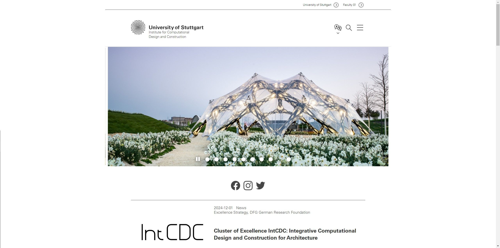

---
{
  "Cover": "/assets/content/projects/icd-research-assistant-in-web-development/cover-cover.jpg",
  "CoverAlt": "Startseite der ICD-Website mit dem BUGA-Faserpavillon.",
  "Description": "Ich half bei der Migration der ICD-Website auf das Template der Universität Stuttgart in OpenCMS. Die Arbeit bestand im Wesentlichen aus Content-Management und etwas SEO. Das Beste war, dass ich dort meinen ersten Kontakt mit der deutschen Sprache hatte.",
  "Name": "ICD Research Assistant in Web Development",
  "Slug": "projects/icd-research-assistant-in-web-development",
  "Tags": [
    "Web Development"
  ],
  "Authors": [
    "ICD - University of Stuttgart"
  ],
  "Category": "Web development",
  "City": [
    "Stuttgart"
  ],
  "DateStart": "2019-12-20",
  "DateEnd": "2020-10-19",
  "Director": ["Achim Menges"],
  "Manager": ["Tobias Schwinn"],
  "Team": ["Cody Tucker", "Daniel Locatelli"],
  "Link": {
    "Text": "ICD Universität Stuttgart",
    "Href": "https://www.icd.uni-stuttgart.de/"
  }
}
---

Ich half bei der Migration der ICD-Website auf das neue zentralisierte System in OpenCMS, das die Universität Stuttgart einführte.

Die Arbeit bestand im Wesentlichen aus Content-Management und etwas SEO. Das Beste war, dass ich dort meinen ersten Kontakt mit der deutschen Sprache hatte.

