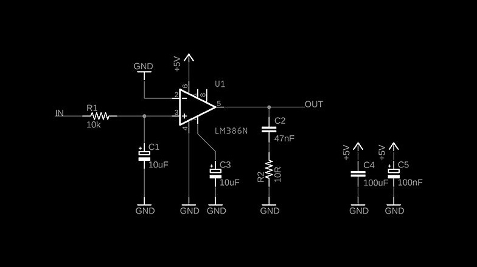

import Video from '@/components/Video.astro'
import YouTube from '@/components/YouTube.astro'

<YouTube id="KucCxUmOM1o" />

## Konzept
> Die Metallsäule verbindet den Untergrund der Stadt mit dem schwebenden Dach und funktioniert praktisch wie eine Antenne, die die Vibrationen der Stadt und die durch das Gebäude verstärkten Magnetfelder einfängt.
Das Werk verwandelt das architektonische Element in ein Musikinstrument, das vom Publikum und der Stadt gespielt werden kann. Eine hybride Schnittstelle, die durch die Vibration der Luft eine sensorische Polyphonie zwischen urbanem Metabolismus und Menschen erzeugt.

*Atelier Marko Brajovic*

Atelier Marko Brajovic entwickelte diese ortsspezifische Installation zur Feier des Air Max Day. In diesem Projekt arbeitete ich eng mit Marko zusammen, gab Impulse und wies darauf hin, wo ich Potenzial für eine Installation in der [Red Bull Station](https://triptyque.com/en/project/redbull-station/) sah. Dieses kürzlich renovierte Gebäude war einst ein Kraftwerk und wurde hauptsächlich zu einem Musiklabor, bot aber auch Raum für andere Kunst- und Technologie-Experimente.
Der Air Max Day feierte die alten und neuen Air-Max-Schuhe und verband gleichzeitig Nike mit Red Bull. Im Kern ging es um Schnittstellen – genauer gesagt um Schnittstellen zwischen dem Alten und dem Neuen, Design und Musik.
Marko entwickelte zwei Konzepte: eines mit aufblasbaren Elementen und die Air Guitar. Das erste war nicht schlecht, aber die Air Guitar war zu gut, um sie abzulehnen.
Während des Meetings mit der Marketingagentur waren sie sehr begeistert von der Installation, aber sie dachten, es fehle etwas. Daraufhin schlug ich vor, sie mit adressierbaren LEDs aufzupeppen.


## Entwicklung
Nachdem das Konzept genehmigt war, übernahm ich auch die Koordination der gesamten Projektentwicklung, und ich bin vielleicht etwas zu ehrgeizig gewesen, denn ich entschied mich, den LED-Teil komplett selbst zu entwickeln.
Für den Gitarrenteil hatte ich keine Ahnung, aber ich kannte den richtigen Mann für die Aufgabe: meinen Freund Lucas Caracik, einen professionellen Gitarrenbauer von [Caracik Guitars](https://www.caracikguitars.com/).
Rafael Ohashi war der Veranstaltungsmann; er hatte bereits bei vielen anderen Events mitgearbeitet und würde uns leiten und die nötige Ausrüstung und Genehmigungen besorgen.
Das System funktionierte folgendermaßen: Die Gitarre wurde aus vier Stahlseilen und vier Bass-Tonabnehmern gebaut (ja, sie hätte eigentlich Air Bass heißen müssen, aber das klingt nicht so sexy, oder?).
Ich dachte auch daran, ein Mikrofon zu verwenden, aber Lucas' Vorschlag, Tonabnehmer zu verwenden, war konzeptionell und funktional auf einem ganz anderen Level, und er wusste alles darüber.
Ursprünglich war das Konzept, die LEDs von unten bis ganz nach oben zu führen. Aber dafür hätten wir jemanden mit einer Sicherheitslizenz zum Klettern gebraucht, den wir leider nicht rechtzeitig finden konnten, sodass wir auf die Höhe beschränkt waren, die eine Hebebühne erreichen konnte.

<Video src="/media/projects/air-guitar-by-atelier-marko-brajovic-for-nike/first-pickup-test.mp4" caption="First test: checking if a pickup would capture the steel cable vibration." />

### Interaktivität
Jeder Bass-Tonabnehmer sendete ein analoges Signal an seinen jeweiligen Arduino Mega, der dann den Wert mappte und in ein digitales Signal umwandelte, um eine bestimmte Anzahl von LEDs einzuschalten.
Theoretisch ziemlich einfach, aber in der Realität trieb es mich ziemlich schnell in den Elektronik-Kaninchenbau, bis ich an eine Wand stieß. Ich kam auf diesen Schaltkreis, aber aus irgendeinem Grund funktionierte er nicht gut. Das Event rückte näher, und das Team wurde zunehmend nervös. Eine Woche vor dem Event kontaktierte ich André Biagioni von [Fiozeira](https://fiozera.com.br/). Glücklicherweise stimmte er zu, teilzunehmen. Er sagte, dem Schaltkreis fehle ein Filter, und erledigte die restliche Arbeit. Er fertigte auch einen Schaltplan an und half bei der Montage.



```arduino
#include "FastLED.h"

#if FASTLED_VERSION < 3001000
#error "Requires FastLED 3.1 or later; check GitHub for latest code."
#endif

#define minDelta 0
#define maxDelta 35
#define firstStrip 6
#define secondStrip 7
#define colorOrder GRB
#define ledType WS2812B
#define numLeds 600
#define maxLED 460
#define pickupPin AO
#define calibrationCycles 5000
#define Component 255
#define Component 0
#define Component 16
#define pickupNumReads 1000

int calibrationDelta = 0;
int pickup Value = 0;
int ledsToLight = 0;

struct CRGB leds[numLeds];

void calibration(){
  int minValue = 1024;
  int maxValue = 0;
  for (int i = 0; i < calibrationCycles; ++i) {
    int val = analogRead(pickupPin);
    minValue = min(minValue, val);
    maxValue = max(maxValue, val);
  }
  calibrationDelta = maxValue - minValue;
}

void pickupRead() {
  int minValue = 1024;
  int maxValue = 0;
  for(int i = 0; i < pickupNumReads; i++){
    int pickupValue = analogRead(pickupPin);
    minValue = min(minValue, pickupValue);
    maxValue = max(maxValue, pickup Value);
  }

  int pickupDelta = maxValue - minValue;
  pickupDelta = pickupDelta - calibrationDelta;

  if(pickupDelta < 0) {
    pickupDelta = 0;
  }
  else if(pickupDelta > 35) {
    pickupDelta = 35;
  }

  ledsToLight = map(pickupDelta, minDelta, maxDelta, O, maxLED);
}

void setup(){
  analogReference(EXTERNAL);
  Serial.begin(9600);
  LEDS.addLeds<ledType, firstStrip, colorOrder> (leds, numLeds);
  LEDS.addLeds<ledType, secondStrip, colorOrder>(leds, numLeds);
  FastLED.clear();
  FastLED.show();
  calibration();
}

void loop(){
  FastLED.clear();
  pickupRead();
  for(int i = 0; i < ledsToLight; i++){
   leds[i] = CHSV(255, 255, 255);
  }
  FastLED.show();
}
```


### Nach dem Air Max Day
Die Leute von der Red Bull Station mochten die Installation so sehr, dass sie darum baten, sie einen ganzen Monat dort zu belassen. Ein Zeitraum, in dem ich regelmäßig vorbeigehen musste, um zu prüfen, ob alles wie erwartet funktionierte. Während dieser Zeit hörten einige der LEDs an der Spitze der Installation auf zu funktionieren, was sehr kompliziert zu ersetzen gewesen wäre. Das Erscheinungsbild war nicht gut, weil die schöne Kontinuität verloren ging. Also habe ich, anstatt die LEDs zu ersetzen, einfach die oberen 10 LEDs direkt im Arduino-Code ausgeschaltet.

### Erkenntnisse
Es gab keine gelöteten Komponenten – ein Fehler, den nur Unerfahrene machen würden. Irgendwann während des Events hörte die Gitarre einfach auf zu funktionieren. Ich bekam einen kleinen Herzinfarkt. Zu meiner Erleichterung funktionierte sie wieder, einfach durch Aus- und Einschalten.
Eine weitere Sache, die ich nicht erwartet hatte, hing mit den Kabeln zusammen. Es wurden längere und dickere Kabel benötigt, als ich dachte. Die LEDs sind stromhungrig und benötigen zwei Kabel für jeden LED-Streifen, sodass sie unten und auch in der Mitte eingespeist wurden – andernfalls wären die LEDs oben schwächer geworden. Es wurden außerdem zwei ziegelsteingroße Netzteile für jedes Tonabnehmer-Arduino-LED-Setup benötigt.

© Fotos und Video von [Eduardo Ohara](https://www.eduardoohara.com/)
