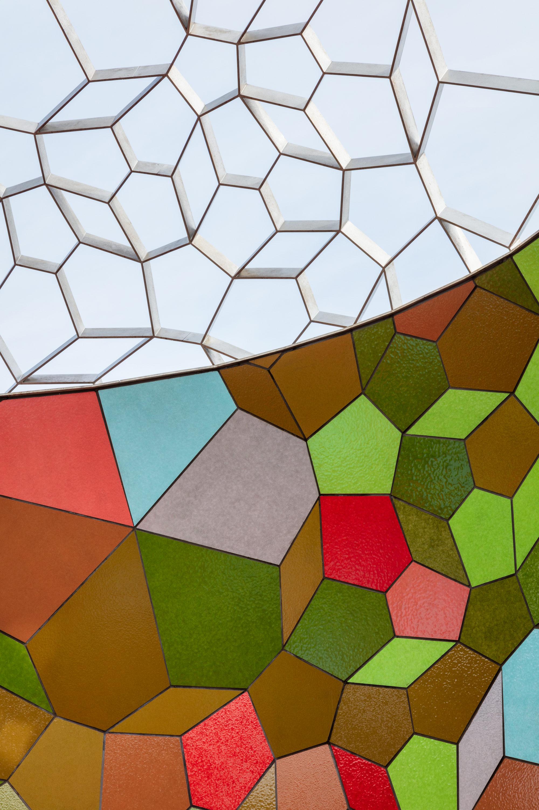
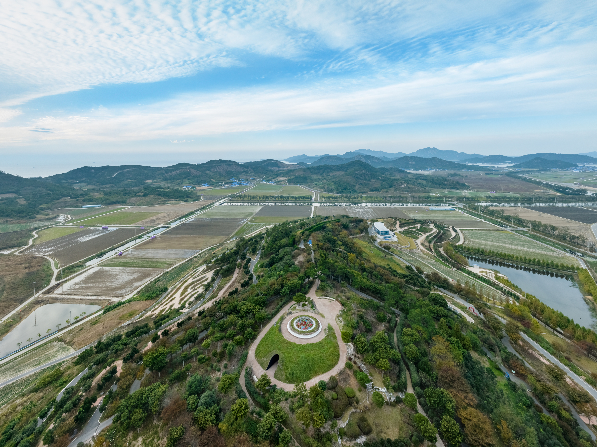
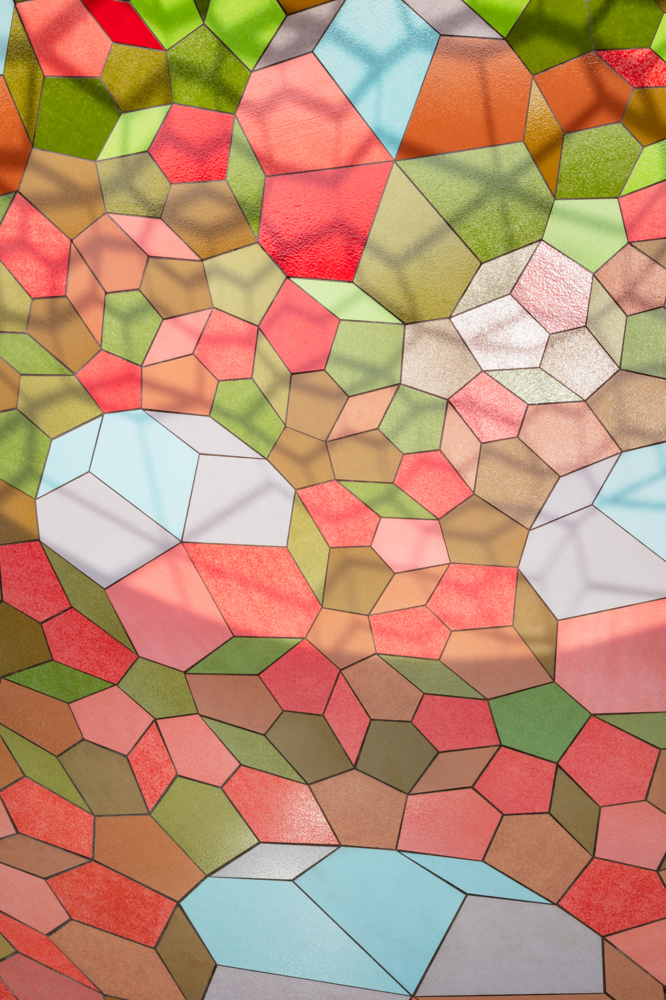

## Einführung
[Olafur Eliasson](https://olafureliasson.net/) beauftragte ArtEngineering mit Computational Engineering, digitaler Fertigung und Logistik für die Breathing earth sphere. Dies war nicht einfach ein weiterer Auftrag -- es war meine Gelegenheit, den gesamten Arbeitsablauf zu erleben: vom Konzept über Computational Engineering und digitale Fertigung bis hin zur Logistik.

## Das Engineering
Mein Schwerpunkt lag auf der Finite-Elemente-Analyse (FEA) mit SOFiSTiK, das hervorragend geeignet ist für komplexe, nicht-standardmäßige Geometrien wie diese. Wir starteten mit dem Basismodell aus Eliassons Studio und führten eine wirklich tiefgehende Analyse und Dokumentation durch: Wind, Erdbeben und sogar "zufällige" Lasten (weil unvermeidlich jemand versuchen wird, eine 10-Meter-Kuppel zu besteigen).
Die interessanteste technische Herausforderung waren die Dehnungsfugen. Da die obere Struktur der Kuppel vollständig aus Edelstahl besteht, ist sie im Grunde ein lebendiges Objekt, das mit der Temperatur atmet. Wir mussten präzise Verbindungen konstruieren, die eine erhebliche thermische Ausdehnung und Kontraktion ermöglichen, ohne die strukturelle oder ästhetische Integrität zu beeinträchtigen.

## **Das Logistik-Puzzle**
Eine große Herausforderung ergab sich jedoch erst, nachdem das digitale Modell fertig war. Wir mussten herausfinden, wie wir eine massive, 10 Meter große Kugel von einer Werkstatt in Deutschland zu einem abgelegenen Standort auf der Insel Docho in Südkorea transportieren konnten. Das bedeutete, dass ich die Kuppel als gigantisches 3D-Puzzle "lösen" musste: die gesamte Struktur in modulare Teile segmentieren, die perfekt in Standard-Schiffscontainer passen.

## **Das Ergebnis**
Die Arbeit wurde 2022 abgeschlossen, aber die Installation wurde erst 2024 fertiggestellt, als ich nicht mehr im Team war. Es war dennoch großartig zu sehen, wie das Projekt von einem SOFiSTiK-Netz auf meinem Bildschirm zu einem fertigen Wahrzeichen auf einer südkoreanischen Insel wurde.

