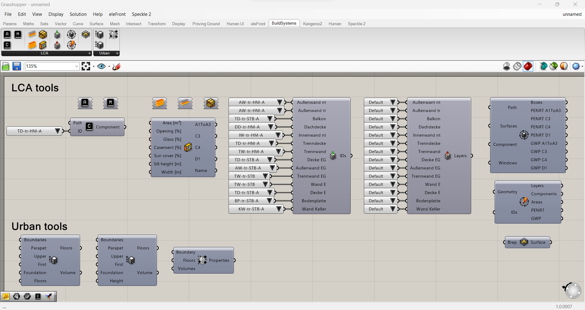

Während meiner Zeit bei BuildSystems leitete ich die Entwicklung eines Grasshopper-Plugins zur Optimierung des architektonischen Entwurfsprozesses. Dieses Toolset wurde entwickelt, um Nutzern die parametrische Definition und Analyse von Gebäudeentwürfen zu ermöglichen und dabei Echtzeit-Feedback zum Materialverbrauch und zur Umweltbelastung durch integrierte Ökobilanzierung (LCA) bereitzustellen.

Zentrale Ergebnisse dieser Entwicklung waren:
- **Detaillierung von Baukomponenten**: Es wurde eine Funktionalität implementiert, um einzelne Baukomponenten mit ihren zugehörigen Materialeigenschaften zu definieren und zu verwalten.
- **Integrierte Ökobilanzanalyse**: Das Plugin bot die Möglichkeit, den ökologischen Fußabdruck von Entwürfen schnell auf Basis von Materialdaten aus Umweltproduktdeklarationen (EPDs) zu bewerten.
- **Datenverwaltung via JSON**: Wir erstellten eine strukturierte JSON-basierte Datenbank zur Speicherung und zum Abruf von Baukomponentendaten. Diese Datenstruktur sollte auch in einer Web-App namens *Circular Component Creator* verwendet werden – eine Idee, die leider nie weiterverfolgt wurde.
- **Intuitive Grasshopper-Oberfläche**: Das Plugin bot eine benutzerfreundliche Oberfläche, die das visuelle Programmierparadigma von Grasshopper nutzte und eine nahtlose Integration in bestehende Arbeitsabläufe ermöglichte.

## Herausforderungen
Es gibt zwei Hauptsprachen für die Entwicklung von Grasshopper-Plugins: Python und C#. Für ein nativeres Erscheinungsbild, schnellere Leistung und tiefere Integration ist jedoch C# die bevorzugte Option. Das liegt daran, dass Grasshopper selbst von David Rutten in C# geschrieben wurde.
Die größte Herausforderung während dieser Entwicklung war, dass McNeel, das Unternehmen hinter Rhino und Grasshopper, sich mitten im Übergang von *.NET Framework 4.8* zu *.NET Core* befand.
### .NET Framework 4.8
- **Vorteile**
    - Wird in Rhino 8 noch unterstützt
    - Kompatibel mit früheren Versionen von Rhino/Grasshopper
    - Funktioniert mit Rhino.Inside Revit, das noch auf .NET Framework basiert
    - Mehr Lernressourcen online verfügbar, was Debugging und Entwicklung erleichtert
- **Nachteile**
    - Wird auslaufen, was eine Migration des Plugins in naher Zukunft erfordern würde
    - Nicht plattformübergreifend – separate Plugins wären für Windows und macOS erforderlich
    - Geringere Leistung

### .NET Core
- **Vorteile**
    - Zukunftssicher, da es die Basis für kommende Rhino/Grasshopper-Versionen ist
    - Plattformübergreifende Unterstützung – ein Plugin funktioniert sowohl auf Windows als auch auf macOS
    - Höhere Leistung
- **Nachteile**
    - Nicht kompatibel mit älteren Versionen von Rhino/Grasshopper
    - Inkompatibel mit der aktuellen Version von Rhino.Inside Revit
    - Weniger Ressourcen und Beispiele online für Entwicklung und Debugging verfügbar
McNeel empfiehlt einen [Multi-Targeting](https://learn.microsoft.com/en-us/nuget/create-packages/multiple-target-frameworks-project-file)-Ansatz – das Plugin soll also beide .NET-Versionen unterstützen – was dem Projekt eine zusätzliche Komplexitätsebene hinzufügte.

## Ausblick
Die letzten Phasen des Projekts konzentrierten sich auf die Etablierung des **BuildSystems Object Model (BSoM)**, um die Erweiterbarkeit und Wartbarkeit des Plugins zu verbessern.
Obwohl voll funktionsfähig, wurde das Projekt schließlich aufgrund einer Schwerpunktverschiebung beim damaligen Startup BuildSystems eingestellt. Zu diesem Zeitpunkt befand sich die deutsche Wirtschaft in einer schwierigen Lage, und es gab keine aktiven Bauprojekte, in denen wir das Plugin richtig hätten testen können. Wir entschieden uns für einen Kurswechsel und investierten unsere Zeit stattdessen in die Entwicklung eines Simulationstools für nachhaltige Wohnungsbaufinanzierung.
