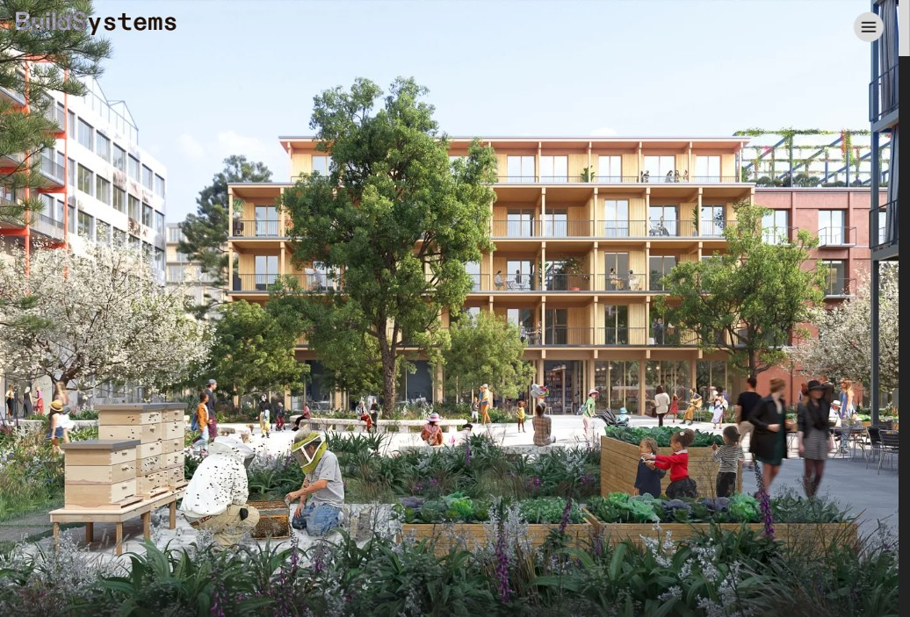
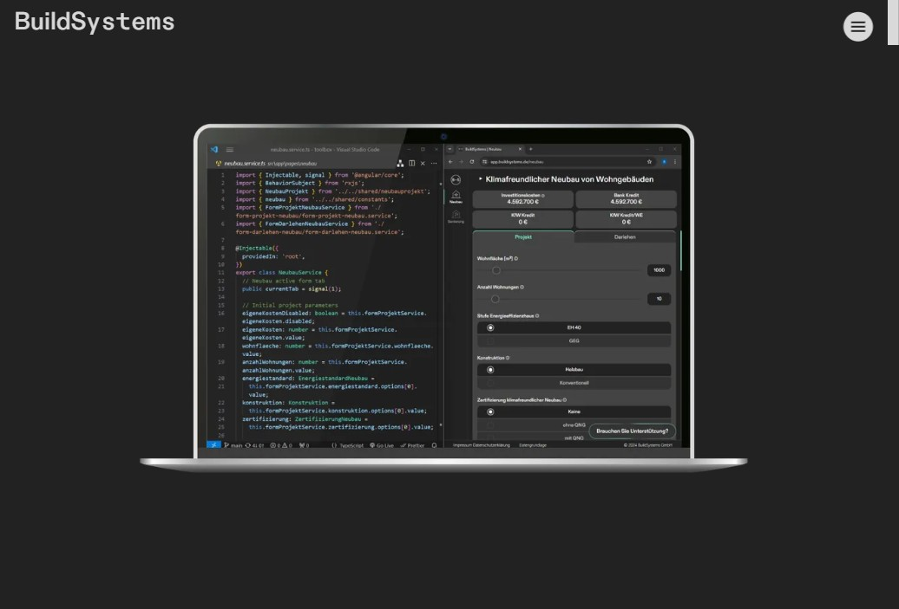

Ich habe die Unternehmenswebsite für [BuildSystems](https://buildsystems.de) entwickelt — eine Nachhaltigkeitsberatung, die die klimaneutrale Transformation im Bau- und Immobiliensektor vorantreibt. Die Website dient als digitale Präsenz des Unternehmens und zeigt Dienstleistungen, Projektportfolio, Team und Blog-Inhalte. Alles verwaltet über Notion als CMS.

Das Design wurde von einer externen Agentur erstellt. Meine Aufgabe war es, das Design und die Funktionalität mit einem hochmodernen Tech-Stack umzusetzen, der auf Performance ausgerichtet ist, um ein hervorragendes SEO zu erzielen.

## Tech-Stack

- [**Astro**](https://astro.build/): Statischer Site-Generator mit TypeScript, gewählt wegen seines Performance-First-Ansatzes und der standardmäßig JavaScript-freien Philosophie.
- [**Tailwind CSS**](https://tailwindcss.com/): Utility-First-Styling mit benutzerdefinierten CSS-Variablen für responsive Typografie über vier Breakpoints.
- [**Notion API**](https://developers.notion.com/): Headless-CMS-Integration — das Team verwaltet alle Inhalte (Blogbeiträge, Teammitglieder, Partner, Portfolio) direkt über Notion.
- [**Cloudflare Pages**](https://pages.cloudflare.com/): Deployment mit Edge-Caching, automatischem HTTPS und DDoS-Schutz.

## Warum Notion als CMS?

BuildSystems nutzte Notion bereits intensiv für interne Dokumentation und Projektmanagement. Anstatt ein separates CMS einzuführen, das das Team erst erlernen müsste, habe ich die Notion-API direkt in die Build-Pipeline integriert. So kann das Team Blogbeiträge schreiben und veröffentlichen, Teamprofile aktualisieren und Portfolio-Inhalte verwalten — alles direkt in Notion.

Die Integration ruft Inhalte zur Build-Zeit aus mehreren Notion-Datenbanken ab (Blogbeiträge, Teammitglieder, Partner, Organisationen) und rendert sie mit über 30 benutzerdefinierten Notion-Komponenten für Überschriften, Absätze, Bilder, Codeblöcke, Tabellen, Embeds und mehr.

## Hauptmerkmale

### CSS-First-Animationen
Eine bewusste Entscheidung war es, reine CSS-`@keyframes`-Animationen anstelle von Lottie-Animationen zu verwenden, um die Seite nicht mit zu viel Inhalt zu überladen, was die Performance beeinträchtigt hätte. Das Homepage-Cover zeigt eine animierte Vollbild-Sequenz, und die „Drei Säulen"-Bereiche nutzen reine CSS-Animationen in horizontalem und vertikalem Layout. Das hält die Seite schlank und performant.

<video autoplay loop muted playsinline preload="metadata" style="height: 60svh; align-items: center; justify-content: center; border-radius: 0.5rem;">
  <source src="/media/projects/buildsystems-website/three-pillars-animation.mp4" type="video/mp4" />
</video>

Homepage-Animation

### Drag-to-Scroll-Karussell
Das Blogbeitrag-Karussell implementiert eine eigene Drag-to-Scroll-Interaktion mit Trägheitsphysik und sanftem Scroll-Snap. Nutzer können das Karussell mit Maus oder Touch ziehen, und es rastet beim Loslassen sanft an der nächsten Karte ein.

<video autoplay loop muted playsinline preload="metadata" style="height: 60svh; align-items: center; justify-content: center; border-radius: 0.5rem;">
  <source src="/media/projects/buildsystems-website/drag-to-scroll-carousel.mp4" type="video/mp4" />
</video>

Drag-to-Scroll-Karussell

### Blogbeiträge aus Notion
Jeder Blogbeitrag wird in Notion verfasst und zur Build-Zeit auf der Website gerendert. Es werden reichhaltige Inhalte unterstützt, einschließlich eingebetteter Medien (Instagram, TikTok, YouTube, CodePen), LaTeX-Gleichungen über KaTeX, Codeblöcke mit Prism.js-Syntaxhervorhebung und Link-Vorschauen über metascraper.

## Architektur

Das Projekt folgt einem reinen Astro-Ansatz — ohne React oder andere JavaScript-Frameworks. Alle Interaktivität ist mit reinem TypeScript und CSS umgesetzt, was zu minimalem clientseitigem JavaScript führt.

Eine eigene Build-Pipeline übernimmt das Caching von Notion-Inhalten. Mit `npm run cache:fetch` werden alle Inhalte und Bilder aus Notion heruntergeladen, mit Sharp verarbeitet (EXIF-Daten entfernt und Formate optimiert) und lokal gespeichert. Das sorgt für schnelle Builds und verhindert unnötige API-Aufrufe während der Entwicklung.

## Responsives Design

Die Seite verwendet CSS Custom Properties für fließende Typografie, die über vier Breakpoints skaliert: Mobil, Tablet, Desktop und Ultra-Wide.

Selbst gehostete ABC-Diatype-Schriften werden vorgeladen, um Flash of Unstyled Text (FOUT) zu vermeiden, und die Seite verwendet SVG-Sprites für Icons, um HTTP-Anfragen zu minimieren.
