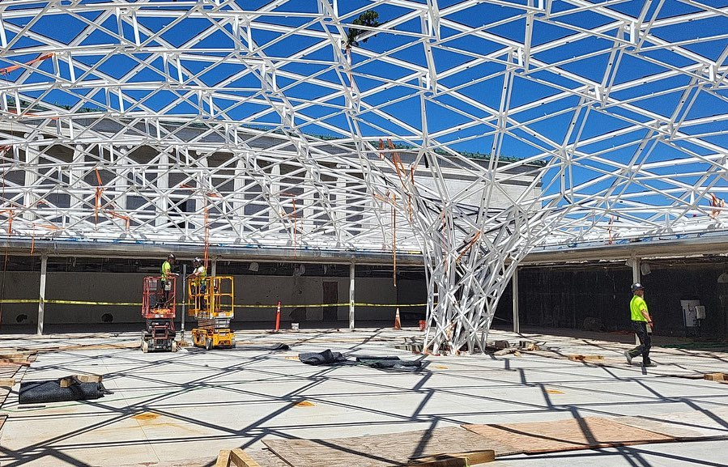
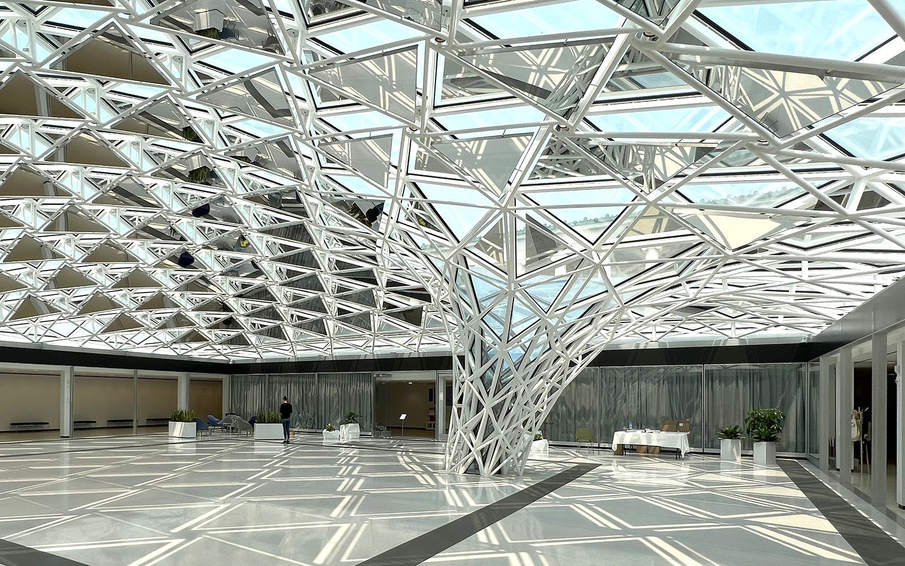
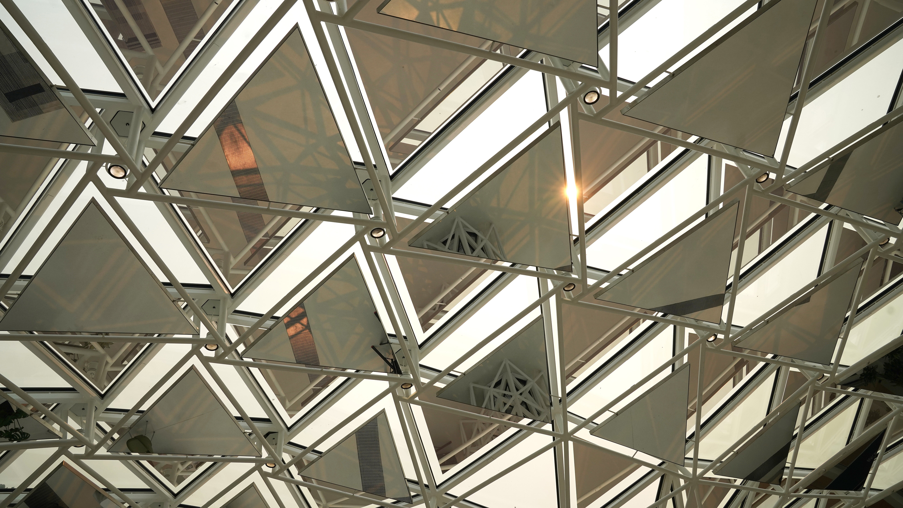
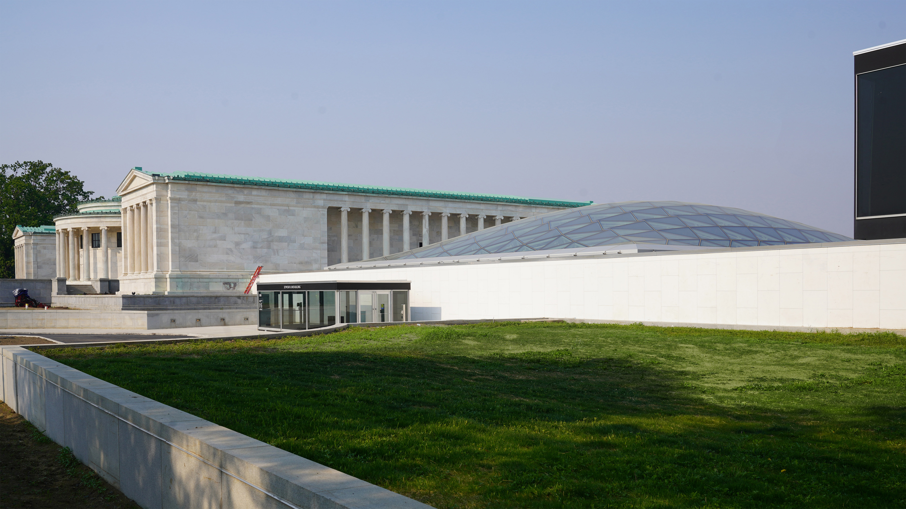

[Studio Other Spaces](https://studiootherspaces.net/) beauftragte ArtEngineering mit Computational Engineering, digitaler Fertigung und Logistik. Ich stieg mitten in der Projektentwicklung ein, nachdem die digitale Fertigung bereits begonnen hatte. Es war genau dieses Projekt, das letztlich meine Festanstellung bei ArtEngineering sicherte.
## Computational Design
Zunächst wurde jemand benötigt, der schnell rund 1.500 2D-Zeichnungen aus Rhino/Grasshopper exportieren konnte, um sie für die digitale Fertigung mit einem Plasmabrenner zu versenden.
Diese erste Aufgabe war in 2 Tagen erledigt. Sie waren begeistert und beschlossen, mir eine Vollzeitstelle anzubieten. Zu dem Zeitpunkt beendete ich gerade meinen ITECH-Masterabschluss und arbeitete noch als Praktikant bei einem anderen Unternehmen. Dieses Angebot kam also genau zur richtigen Zeit.
Als ich anfing, war Alexander Spänig der Projektmanager, und so arbeitete ich in den folgenden sechs Monaten eng mit ihm an diesem Projekt.
Ich nutzte hauptsächlich Grasshopper und das Plugin [Sandbox Topology](https://www.food4rhino.com/en/app/sandbox-topology) von Tobias Schwinn, der zufälligerweise mein Tutor im ITECH-Masterstudium war.

© Fotos von Studio Other Spaces.
