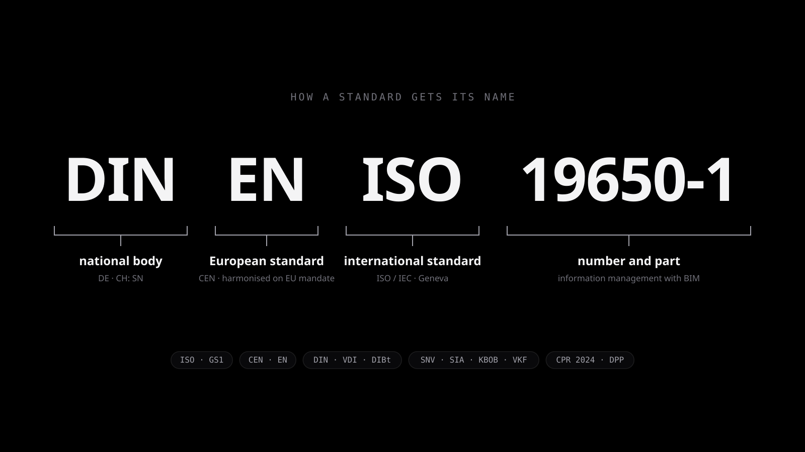
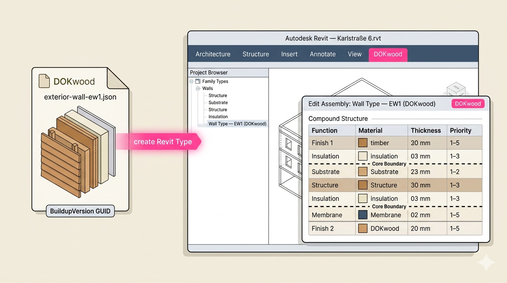
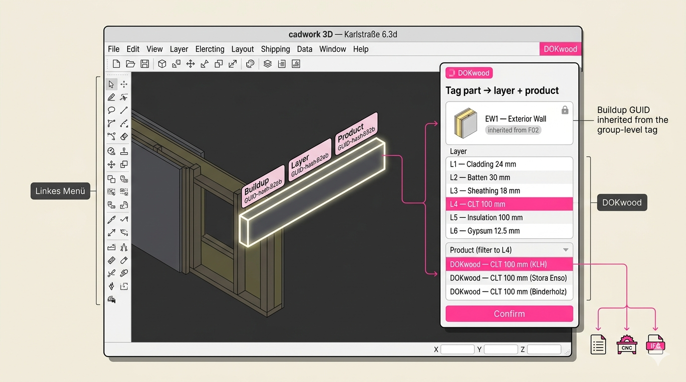

DOKwood ist ein Forschungsprojekt und eine Softwareplattform für die Dokumentation mehrschichtiger Aufbauten im vorgefertigten Holzbau. In einem Holzgebäude ist der Aufbau einer Wand, einer Decke oder eines Dachs (die geordnete Abfolge von Platten, Ständern, Dämmung und Bekleidung) der Ort, an dem Entscheidungen zu Tragwerk, Brandschutz, Schallschutz, Wärmeschutz und Kosten zusammenlaufen. Heute lebt diese Information in PDFs und Tabellen, die bei jedem Schritt von der Ausschreibung bis zur Werkstatt neu abgetippt werden. DOKwood gibt Aufbauten ein Zuhause: eine Webplattform, in der ein Unternehmen seine Aufbauten einmal definiert, gegen Anforderungen prüft, wie Code versioniert und ohne erneute Dateneingabe an die nachgelagerten Werkzeuge übergibt.

Das Projekt wird vom ZIM (Deutschland) und von der Innosuisse (Schweiz) im Rahmen des IraSME-Programms gefördert. Das Konsortium verbindet in jedem Land eine Hochschule mit einem Holzbauunternehmen: die Hochschule München mit Gumpp & Maier und die Berner Fachhochschule mit Schärholzbau. Von Februar 2025 bis Juni 2026 war ich als wissenschaftlicher Mitarbeiter an der Hochschule München am Projekt beteiligt. Meine Arbeit galt den Teilen, die die Plattform interoperabel machen: den Normen, auf denen sie aufbaut, dem Datenwörterbuch, das ihren Begriffen eine gemeinsame Bedeutung gibt, und den Schnittstellen zu den Werkzeugen, die Holzbauer bereits nutzen.

## Normenrecherche

Das erste Ergebnis war eine systematische Recherche der Normen, die die Spezifikation von Materialien und Aufbauten im Holzbau in Deutschland und der Schweiz regeln: ISO und GS1 auf internationaler Ebene, CEN und die harmonisierten EN-Normen in Europa, DIN, VDI und die Muster-Holzbau-Richtlinie in Deutschland, SIA, KBOB und VKF in der Schweiz. Sie umfasst Brandschutz, Akustik, Bauphysik, Tragwerksplanung, technische Zeichnungen, BIM und den kommenden digitalen Produktpass nach der Bauprodukteverordnung von 2024. Ihr praktisches Ergebnis war eine Zuordnung der internen Terminologie der Partner zu kontrollierten Normbegriffen und der Vorschlag eines gemeinsamen Vokabulars. Mehr über diese Studie lesen Sie auf meiner eigenen Seite zu [Normen hinter digitalen Holzbau-Aufbauten](/de/research/timber-construction-standards).

## buildingSMART Data Dictionary (bSDD)

Das in der Normenstudie vorgeschlagene gemeinsame Vokabular wurde zu einem Wörterbuch im buildingSMART Data Dictionary (bSDD), `hm/dokwood`, versioniert von v0.1 bis v0.13. Es definiert die Klassen (Buildup, Wall, Roof, Slab, Product), 129 Merkmale und ihre Gruppen und folgt den Datenvorlagen der ISO 23387: ein System Data Template für einen Aufbau, ein Product Data Template für ein Produkt und eine HasPart-Komposition, die beide verbindet.

Die Rolle dieses Wörterbuchs in der Plattform verdient eine Erklärung, denn sie macht aus DOKwood ein Framework statt eines Werkzeugs. Datenwörterbücher liegen auf zwei Ebenen. Das bSDD-Wörterbuch ist das öffentliche, generische, übergeordnete: ein gemeinsames Vokabular für Holzbau-Aufbauten, das jeder lesen und referenzieren kann. In der App besitzt jeder Mandant (ein Holzbauunternehmen) zusätzlich ein eigenes Datenwörterbuch, und das ist privat: eigene Klassen, Merkmale, Vorlagen und Anforderungen, geprägt von den eigenen Produkten, den nationalen Normen und dem eigenen Arbeitsablauf. Ein neuer Mandant kann das DOKwood-bSDD-Wörterbuch als Basis seines privaten Wörterbuchs übernehmen und von dort aus spezialisieren, oder bei null anfangen und sein eigenes Vokabular mitbringen. DOKwood schreibt also nicht ein Wörterbuch für alle vor; es stellt das Framework bereit, in dem Wörterbücher definiert, versioniert und genutzt werden, plus einen fundierten öffentlichen Ausgangspunkt. Weil ein Mandanten-Wörterbuch das öffentliche referenzieren kann, erlaubt dieselbe Architektur einem Mandanten auch, sein Wörterbuch später zu öffnen und mit den Wörterbüchern anderer Unternehmen zu verknüpfen, sodass zwei Partner Aufbauten und Produkte über ein gemeinsames Vokabular austauschen statt über eine bilaterale Zuordnung.

Jede der folgenden Schnittstellen liest über diese Wörterbuchschicht, und genau das macht sie interoperabel. Entwurf, Build-Pipeline und der Weg zu einem DPP-fähigen Export stehen auf der Seite [DOKwood bSDD-Datenwörterbuch](/de/research/dokwood-bsdd-data-dictionary).

## Revit-Add-in

Für Gumpp & Maier habe ich ein Revit-2026-Add-in in C# und .NET 8 entwickelt, das einen DOKwood-Aufbau als direkt nutzbaren Systemfamilientyp importiert: Es wählt die Hostkategorie anhand der IFC-Entität, auf die die bSDD-Klasse abgebildet ist, baut die Schichtstruktur über die Revit-API auf und setzt Schichtfunktion, Dicke, Wärmeleitfähigkeit, Farbe und Kernschicht-Kennzeichnung. Der Kontext ist entscheidend: Die Kalkulation bei Gumpp & Maier läuft von einer firmenspezifischen Revit-Vorlage über einen GAEB-Export nach Nevaris, und die Materialnamen der Vorlage sind der Schlüssel, über den die Mengenermittlung zugreift. Das Add-in muss sich daher an den vorhandenen benannten Materialien ausrichten, statt neue einzuschleusen, und der wichtigste Roadmap-Punkt aus den Partner-Workshops ist eine bidirektionale Synchronisation der Revit-Materialdatenbank mit der Plattform, während sich die Vorlage weiterentwickelt.

## Cadwork-Plugin

Für Schärholzbau habe ich die erste Funktion eines Cadwork-25-Plugins in Python auf der cwapi3d-API entwickelt: Anmeldung, Auswahl von Mandant und Produkten sowie Import von DOKwood-Produkten mit ihren bSDD-Merkmalen als Cadwork-Materialien, idempotent bei wiederholtem Import. Die entscheidende Erkenntnis aus den Partnertreffen war, dass Schärholzbau das Mehrschicht-Modul von Cadwork nicht einsetzt; sie modellieren Aufbauten Bauteil für Bauteil. Das Plugin schwenkte deshalb von der Steuerung dieses Moduls auf zwei Dinge um, die zu ihrem Arbeitsablauf passen: den Materialkatalog synchron halten und jedes Bauteil mit den DOKwood-GUIDs von Aufbau, Schicht und Produkt kennzeichnen, damit das Produktionsmodell vor dem Gang zur Säge gegen die Spezifikation geprüft werden kann. Die Architektur ist strikt geschichtet, nur zwei Dateien berühren die Cadwork-API, und 48 Unit-Tests decken den Rest ab.

## Vorschlag für einen MCP-Server

Das letzte Stück ist ein begutachteter, aber noch nicht gebauter Vorschlag für einen Model-Context-Protocol-Server vor der Plattform: ein dünner, zustandsloser Adapter, der MCP-Tools, -Ressourcen und -Prompts in authentifizierte GraphQL-Aufrufe übersetzt, sodass ein KI-Assistent Produkte suchen, Aufbauten vergleichen oder Zertifikatslücken prüfen kann, und zwar unter denselben Mandantenregeln wie ein menschlicher Nutzer. Strategisch ersetzt er den ursprünglichen Plan eines maßgeschneiderten ERP-Konnektors pro Partner durch eine einzige standardbasierte Schnittstelle, die jedes MCP-fähige Werkzeug nutzen kann. Die zentrale offene Frage des Gutachters, ob Schreibzugriff überhaupt in MCP gehört, prägt die Roadmap: zunächst nur lesend beginnen und Schreibzugriffe als separate Entscheidung behandeln.

