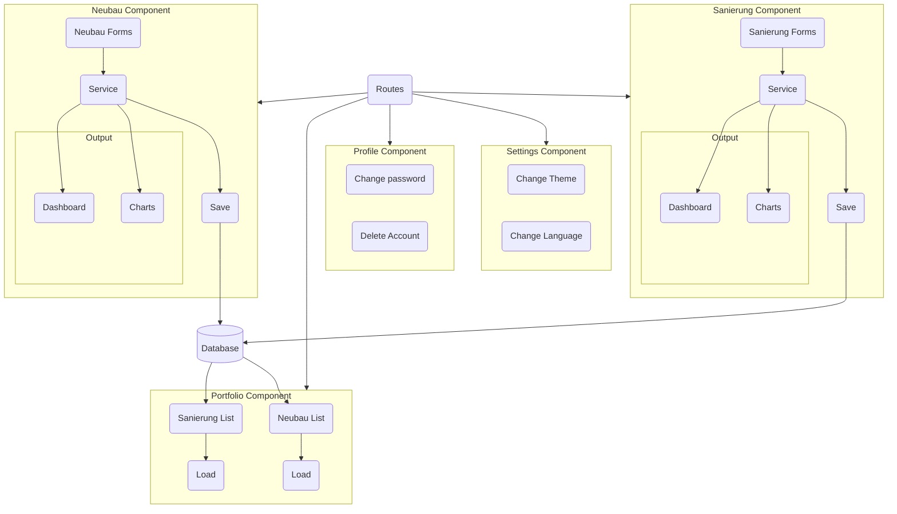
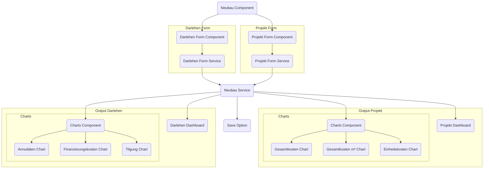
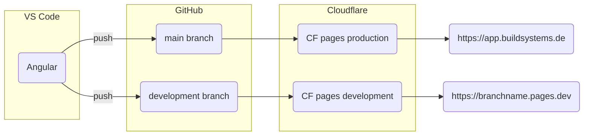
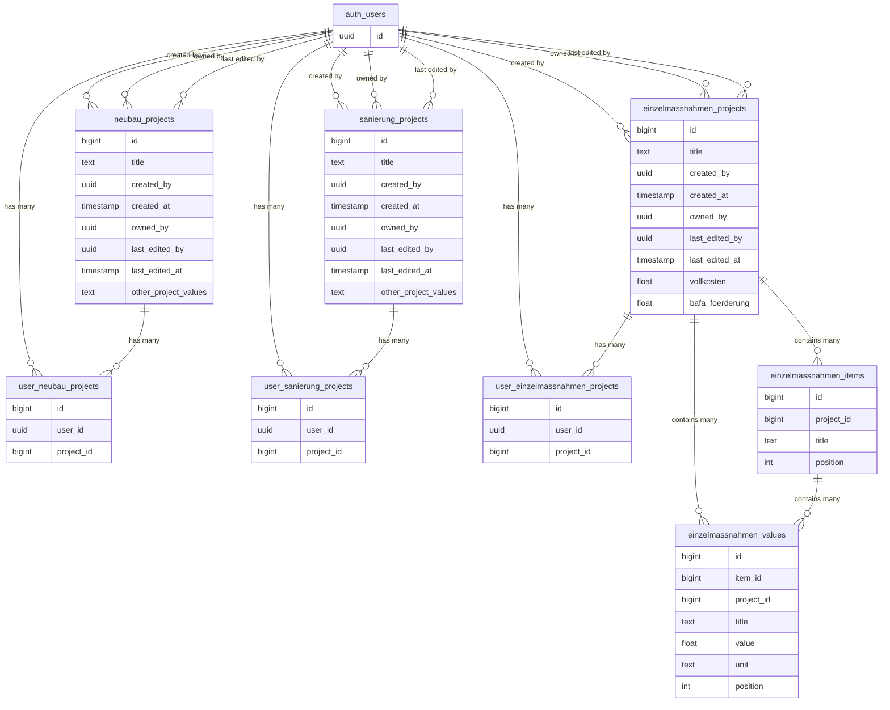

### Funktionen
- **Kostenschätzung eines Gebäudes**: Die App schätzt die Kosten eines Neubaus oder einer Sanierung auf Basis öffentlich verfügbarer Daten von [Arge e.V.](https://arge-ev.de/arge-ev/publikationen/studien/)
- **Darlehenssimulation**: Präzise Simulation von Darlehen basierend auf der Kostenschätzung und der Energieeffizienz eines Gebäudes.
- **Energiekennwert-Eingaben:** Beeinflussung der Förder- und Darlehensmöglichkeiten.
- **Datensicherheit**: Sicherstellung, dass alle Nutzerdaten geschützt sind und den EU-Vorschriften entsprechen.
- **Responsives Design**: Die App funktioniert nahtlos auf allen Geräten.
### Technologie-Stack
- [**GitHub**](https://github.com/build-systems/toolbox): Für das Git-Repository.
- [**Angular**](https://angular.dev/): Ein modernes JavaScript-Framework, unterstützt von Google und eingesetzt für große Anwendungen.
- [**ng2-charts**](https://www.npmjs.com/package/ng2-charts): Angular-Wrapper für die Chart.js-Bibliothek. Wird verwendet, um responsive und interaktive Diagramme zu erstellen.
- [**Cloudflare**](https://www.cloudflare.com/): Hosting-Anbieter für Zuverlässigkeit und Skalierbarkeit, keine Anfangsinvestition erforderlich.
## Warum haben wir diese Toolbox entwickelt?
Deutschland ist bekannt dafür, grüne Technologien wie Solarpanels und Windturbinen durch öffentliche Förderungen voranzutreiben. Aber wussten Sie, dass es auch viele Förderungen für energieeffizientes Bauen gibt? Obwohl diese Förderungen attraktiv sind, kann die Navigation durch die Bürokratie unglaublich herausfordernd sein.
Diese von [BuildSystems](https://buildsystems.de/) entwickelte App erleichtert die Simulation eines Darlehens bei der nationalen Bank [KfW](https://kfw.de/). Sie vereinfacht den Prozess durch eine benutzerfreundliche Oberfläche und ermöglicht es Immobilienentwicklern und Eigentümern, ihre finanziellen Optionen schnell und einfach zu verstehen.
## Entwicklungsprozess
Die App-Entwicklung erfolgte in drei Hauptphasen: Planung und Design, Frontend-Entwicklung sowie Test und Qualitätssicherung.
### Planung und Design
Zu Beginn des Projekts definierte das gesamte Team die Anforderungen und Variablen für die App-Logik. Nachdem dies feststand, skizzierte ich die Frontend-Architektur und das UI/UX-Design.
#### App-Logik
Daniel Dieren entwickelte die App-Logik in Excel. Meine Aufgabe war es, diese zu überprüfen, die Formeln nachzuvollziehen, um sicherzustellen, dass alles korrekt war, und Verbesserungen vorzuschlagen. Dieser Schritt überschnitt sich mit dem gesamten Softwareentwicklungsprozess, da wir im Laufe der Entwicklung feststellten, dass wir weitere relevante Informationen hinzufügen konnten.
Ich erstellte eine einfache Dokumentation in Notion aus der Excel-Datei, um jede Formel gründlich zu verstehen und die spätere Übertragung nach TypeScript zu erleichtern.
#### Frontend-Architektur
Da das Team bereits [Figma](https://www.figma.com/) nutzte, entschied ich mich, im selben Ökosystem zu bleiben. Daher verwendete ich [FigJam](https://www.figma.com/figjam/), um ein erstes Softwarearchitektur-Diagramm zu skizzieren und darüber nachzudenken, welche Komponenten nötig wären und wie sie zusammenhängen.

#### UI- & UX-Design
Konzeptionell war mein Ansatz für das Design, ein vollständiges Dashboard mit allen für den Nutzer zugänglichen Variablen zu erstellen, ohne zu viel Abstraktion. In einer späteren Phase planen wir einen weiteren Benutzerfluss, bei dem die Nutzer eine Schritt-für-Schritt-Anleitung zur Simulation der Darlehen erhalten.
Für die Erstellung von Prototypen verwendete ich Figma, was eine sehr angenehme Design-Erfahrung war. Die Simulation von Mouse-Over-, Mouse-In- und Mouse-Out-Verhalten ist möglich. Außerdem erleichtert der kostenpflichtige Plan das Kopieren von CSS-Stilen und SVGs mit dem Dev Mode. Aber auch mit dem kostenlosen Plan ist der Export von SVGs ein Kinderspiel.

### Aufbau der Benutzeroberfläche
Dieses Projekt markierte meine Metamorphose zum vollwertigen Softwareentwickler. Dafür musste ich [Angular](https://angular.dev/) erlernen, ein JavaScript-Framework mit einer stark vorgegebenen Struktur, die für meinen Fall perfekt geeignet war.
#### Warum haben wir Angular gewählt?
Viele Menschen glauben, dass Angular eines der schwierigsten Frameworks für die Webentwicklung ist. Vergleicht man es beispielsweise mit React oder Vue, wirkt es am Anfang tatsächlich schwieriger. Die Wahrheit ist jedoch, dass Angular viele eingebaute Funktionen mitbringt (was bedeutet, dass es "opinionated" ist) und dadurch viele spätere Entscheidungen überflüssig macht. So konnte ich den schmerzhaftesten Teil für einen Einzellernenden überspringen: die mentale Erschöpfung, die durch zu viele Wahlmöglichkeiten entstehen kann. Und glauben Sie mir, [Entscheidungsmüdigkeit](https://en.wikipedia.org/wiki/Decision_fatigue) ist ein reales Phänomen!
Darüber hinaus verwendet Angular eine Programmiersprache namens [TypeScript](https://en.wikipedia.org/wiki/TypeScript). Man kann sie sich als JavaScript mit einem Code-Prüfer vorstellen, der hilft, Fehler zu erkennen, bevor sie zu Problemen werden. Da ich die einzige Person war, die den Code schrieb, war TypeScript ein großes Sicherheitsnetz. Tatsächlich würde ich mir nur mit den Leitplanken, die TypeScript bietet, zutrauen, diese App zu entwickeln. Bedenken Sie, dass ich keinen Code-Reviewer hatte; ich war ein Ein-Personen-Team auf der Softwareseite.
Ein weiterer Grund für die Wahl von Angular ist sein Ruf für Zuverlässigkeit und einfache Wartung, insbesondere bei großen Anwendungen. Es wird von Google unterstützt, das bereits mehr als 2600 Lösungen damit erstellt hat, sodass klar ist, dass es komplexe Projekte bewältigen kann und langfristig gepflegt wird.
Mit meinem Hintergrund in Architektur und Ingenieurwesen verstehe ich, wie schnell die Dinge auch in diesem Bereich komplex werden können, und obwohl der KfW-Rechner auf den ersten Blick einfach erscheint, umfasst er in seiner ersten Version rund ein paar Hundert Variablen und über hundert Funktionen. Angesichts des Ziels von BuildSystems, eine skalierbare App zu schaffen, die sich zu einem umfassenden Frühplanungstool entwickeln soll, waren Angulars Stärken perfekt für dieses Projekt geeignet.
#### KI-Werkzeuge als Copilot
Diese App wurde zwischen Ende 2023 und Mitte 2024 entwickelt, als KI-gestützte Coding-Assistenten noch eine Neuheit waren und nicht zum Standardwerkzeug eines jeden Entwicklers gehörten. Trotzdem spielte ChatGPT eine entscheidende Rolle bei der Umwandlung der Excel-Formeln in TypeScript-Code. Bei hochmodernen Funktionen lieferten diese Werkzeuge jedoch keine guten Antworten, da die nötigen Trainingsdaten schlicht noch nicht vorhanden waren.
#### Prozess
Während des Entwicklungsprozesses versuchte ich, eine einzelne Komponente zu erstellen, die sowohl den Neubau- als auch den Sanierungsrechner abdecken würde, um den Code weniger repetitiv zu gestalten und dem Prinzip von [DRY](https://en.wikipedia.org/wiki/Don%27t_repeat_yourself) (Don't Repeat Yourself) zu folgen.
Dies machte die Komponente jedoch zu komplex, da es viele Variablen und Anforderungen gab, die für jeden Rechner einzigartig waren. Letztendlich entschied ich mich, sie in zwei Komponenten aufzuteilen. Obwohl es etwas redundanten Code gibt, beschleunigte dies die Entwicklung.

Die Strategien zur Implementierung der Funktionen änderten sich im Laufe der Entwicklung ebenfalls, da ich mit fortschreitendem Wissen neue und verbesserte Wege fand, dasselbe Ergebnis zu erzielen. Beispielsweise änderte sich die Implementierung der Formulare bereits zweimal. Beim ersten Mal entschied ich mich, den gesamten Code zu refaktorieren, um sicherzustellen, dass alles einheitlich und der Code klarer war.
Das stellte sich jedoch als schlechte Produktmanagement-Entscheidung heraus, da die Funktionen bereits funktionierten und obwohl der Code etwas verwirrend war, die Änderung der internen Struktur den Endnutzer überhaupt nicht beeinflusst hätte. Daher werde ich bei der zweiten Änderung, die für die zweite Version der App stattfindet, den restlichen Code nicht refaktorieren.
Wenn Sie mehr darüber erfahren möchten, wie ich derzeit die Formulare implementiere, lesen Sie [diesen Artikel von Zoaib Khan](https://zoaibkhan.com/blog/how-to-use-signals-with-angular-forms/).

### Test und Qualitätssicherung
Ich habe mich auch intensiv mit dem Thema [Unit-Testing](https://en.m.wikipedia.org/wiki/Unit_testing) unter Verwendung des Standard-Tools [Karma](http://karma-runner.github.io/6.4/intro/how-it-works.html) beschäftigt.
Diese Art von Tests prüft kleine Teile (Units) der Software, um sicherzustellen, dass jeder einzelne für sich korrekt funktioniert. Leider konnte ich dies erst in einer späten Phase erlernen, was bedeutete, dass ich den Code refaktorieren musste, damit die Unit-Tests funktionieren konnten.
Wenn ich von vorne anfangen müsste, würde ich meine Energie stattdessen auf [End-to-End-Tests](https://en.m.wikipedia.org/w/index.php?title=System_testing&diffonly=true) (E2E) mit [Cypress](https://docs.cypress.io/guides/overview/why-cypress) konzentrieren. Diese Tests prüfen das gesamte System durch Simulation von Benutzerinteraktionen und stellen sicher, dass Ein- und Ausgaben unserer Sorgfaltspflicht entsprechen.
## Deployment
Wir haben die App zunächst auf Netlify bereitgestellt, da die Nutzung dort äußerst reibungslos ist. Ihr Geschäftsmodell ist "Pay as you scale" ohne Anfangskosten. Außerdem ist es eine No-Code-Deployment-Lösung; man verbindet einfach sein GitHub-Repository und Netlify erledigt den Rest!
Allerdings verbreiteten einige Netlify-Nutzer, wie sie vom kostenlosen Plan zu Rechnungen von Zehntausenden Dollar kamen, oder sogar [$104K in einem Monat](https://www.reddit.com/r/webdev/comments/1b14bty/netlify_just_sent_me_a_104k_bill_for_a_simple/). Alles wegen eines DDoS-Angriffs, der jedem passieren kann. Da Netlify keinen DDoS-Schutzmechanismus hatte, entschieden wir uns für den Wechsel zu Cloudflare.
Cloudflare ist Netlify ähnlich. Gleiches Geschäftsmodell und automatisiertes Deployment über GitHub. Es verfügt jedoch über ein robusteres Anti-Bot-System.
Das Deployment ist automatisch und recht einfach:

## Reibungslose App-Entwicklung: Wichtige Erkenntnisse und Strategien
- **Sicherheit zuerst**: Priorisieren Sie die Datensicherheit von Anfang an, um spätere Compliance-Probleme zu vermeiden.
- **Frühe Planung**: Investieren Sie Zeit in die Planung und verstehen Sie die Anforderungen, bevor Sie mit der Entwicklung beginnen.
- **KI-Werkzeuge**: 2023 war der Griff zu KI noch nicht der Standard, der er heute ist, aber die Lehre aus diesem Projekt ist eindeutig: Nutzen Sie Code-Copiloten von Tag eins an und lassen Sie KI einen ersten Entwurf der Benutzeroberfläche generieren, mit dem Sie weiterarbeiten können.
- **Flexibilität**: Seien Sie sich bewusst, dass sich die App weiterentwickeln wird, und halten Sie sich daher nicht zu strikt an das [DRY](https://en.wikipedia.org/wiki/Don%27t_repeat_yourself)-Prinzip.
- **Framework-Auswahl**: Wählen Sie ein Framework, das zu den Anforderungen Ihres Projekts passt, und bleiben Sie dabei. In der Regel ist das beste Framework dasjenige, das man bereits kennt.
- **Kontinuierliches Testen**: Setzen Sie Ihre Test-Bemühungen auf End-to-End-Tests.
Eine der größten Herausforderungen war es, die App "snappy" zu machen; mit anderen Worten: Wenn der Nutzer einen Schieberegler bewegt, werden alle Werte und Diagramme in Echtzeit aktualisiert. Außerdem waren wir wegen der äußerst restriktiven EU-Vorschriften vorsichtig mit den Daten der Nutzer.
Die erste Entscheidung war, serverseitige Berechnungen komplett zu vermeiden. Die gesamte App ist rein clientseitig, was bedeutet, dass sie nach dem Laden keine Daten mehr versenden muss; die Berechnung erfolgt direkt auf dem Gerät. Das bedeutete auch, dass wir uns für die erste Version keine Gedanken über Datenspeicherung machen mussten.
Die App von Grund auf zu designen war eine wertvolle Erfahrung. 2023 standen KI-Designwerkzeuge erst am Anfang, aber heute würde ich das UI-Design mit einem KI-Assistenten beginnen. Werkzeuge wie [Galileo AI](https://www.usegalileo.ai/) oder [Rendition Create](https://www.renditioncreate.com/) können einen ansprechenden, aus Prompts generierten ersten Entwurf einer App-Oberfläche liefern (Text to UI). Mit einem UI-Entwurf zu beginnen ist immer schneller, selbst wenn sich der Entwurf drastisch ändert.
## Supabase-Backend
Wir haben außerdem die zweite Version der App veröffentlicht, die einen weiteren Rechner sowie Funktionen wie das Speichern eines Projekts und den Vergleich zweier Projekte brachte. Die Datenebene haben wir auf [Supabase](https://supabase.com/) aufgebaut; das untenstehende Schema zeigt, wie Projekte, Benutzer und Bearbeitungsverläufe modelliert sind.

