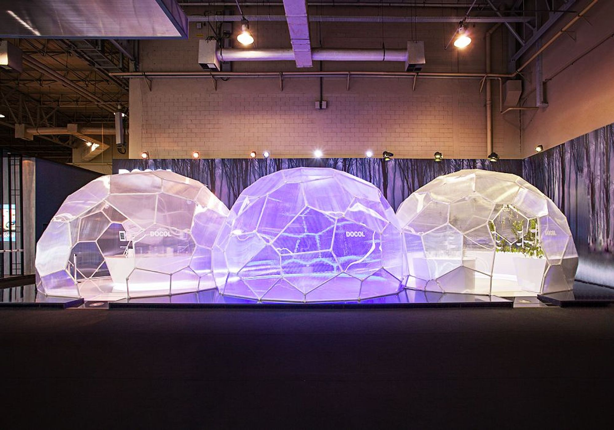
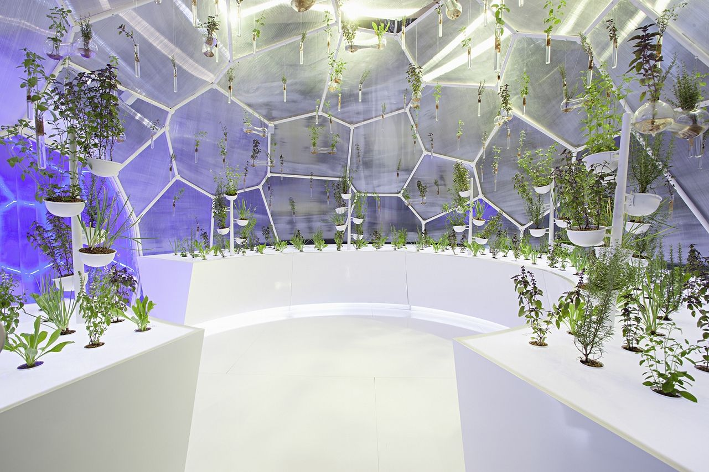
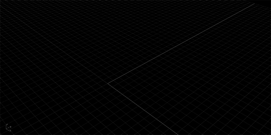

import YouTube from '@/components/YouTube.astro'

<YouTube id="MI3apyOKecs" />

## Konzept
> Der O3-Pavillon wurde vom Ozon-Trioxid-Molekül inspiriert. Die drei Sauerstoffatome werden zu drei Räumen, jeder mit einem einzigartigen multisensorischen Erlebnis.

*Atelier Marko Brajovic*

## Computational Design
Der O3-Pavillon wurde vom Atelier Marko Brajovic zu einer Zeit konzipiert, als ich meine ersten Schritte in der Welt des Computational Design machte. Ich hatte gerade mein Studium an der FAU-USP mit einer Abschlussarbeit beendet, in der ich alle für diesen Pavillon notwendigen Werkzeuge erlernte: Rhino, Grasshopper 3D und Kangaroo Physics.
Meine Rolle in diesem Projekt bestand darin, an der Formfindung und der Erstellung von Daten für die digitale Fabrikation zu arbeiten.
### Formfindung
Die Formfindung war besonders knifflig an den Schnittpunkten zwischen den Kuppeln. Da jede Kuppel eine einzigartige Form hatte, stimmten die Voronoi-Zellen an den Schnittpunkten nicht überein. Ich musste das Kangaroo-Plugin verwenden, um gegenüberliegende Kuppelzellen in dieselbe Form zu zwingen. Dabei musste der Rest des Pavillons relaxieren, während die Planarität der Kuppeln erhalten blieb.

### Fertigung
Der Fertigungsprozess lag allerdings nicht in unseren Händen. Er wurde von einem Subunternehmer im Süden Brasiliens durchgeführt: [Paleta Stands](https://paleta.com.br/). Es gab ein großes logistisches Puzzle bei der Vorfertigung und dem Transport, an dem ich leider nicht beteiligt war. Genau darüber spreche ich in dem Paper, das auf der SIGraDi 2018 Konferenz in São Carlos, Brasilien, präsentiert wurde.
Das Paper ist hier zu finden:
[High-Low as Expression of The Brazilian Digital Fabrication](https://daniellocatelli.com/publications/high-low-as-expression-of-the-brazilian-digital-fabrication/)

© Titelfoto von [Gui Morelli](https://www.guimorelli.com/)
