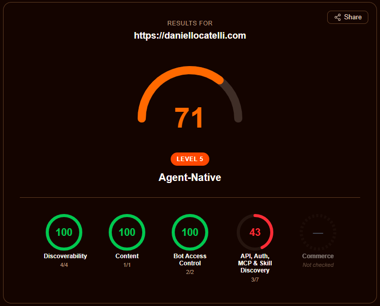
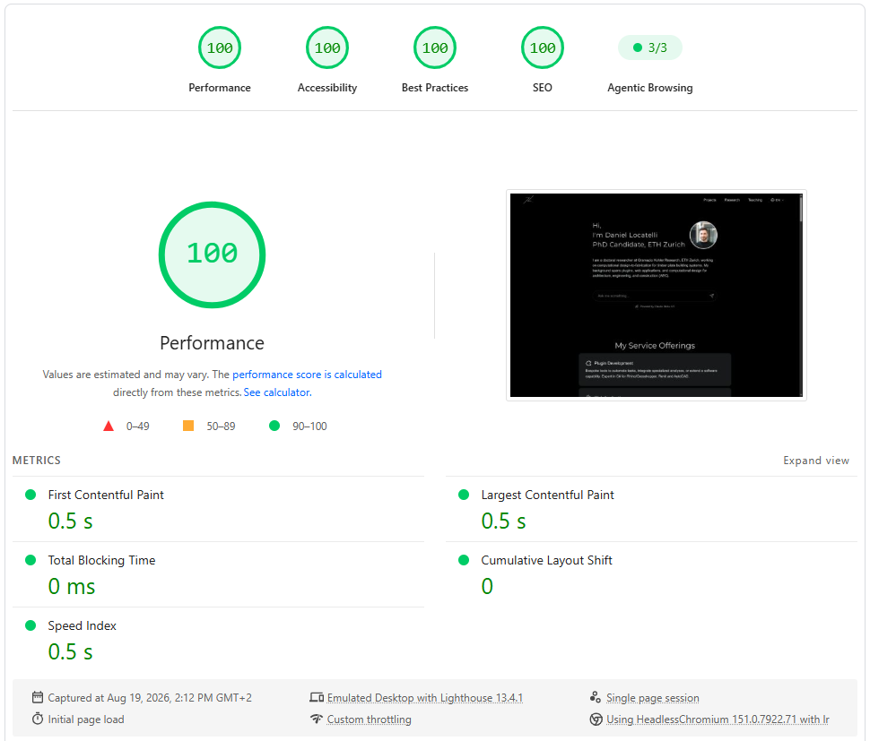

Das ist die Website, die Sie gerade lesen. Sie begann im April 2024 als kleine Astro-Seite und ist seitdem zu einer Spielwiese für die Art geworden, wie ich gerne Dinge baue: schnelle statische Seiten, Inhalte, die sowohl für Menschen als auch für KI-Werkzeuge leicht lesbar sind, und ein paar interaktive Elemente, die das Ganze&nbsp;würzen.

## Tech-Stack

- [**Astro**](https://astro.build/) mit TypeScript für die Website selbst, [**React**](https://react.dev/) für die wenigen Inseln, die Interaktivität brauchen, und [**Tailwind CSS**](https://tailwindcss.com/) für das Styling.
- [**Astro Content Collections**](https://docs.astro.build/en/guides/content-collections/) für sämtliche Inhalte, geschrieben in Markdown und MDX mit typisiertem Frontmatter, das beim Build validiert wird.
- [**Claude**](https://www.anthropic.com/claude) (Anthropic) für den Chat auf der Startseite, mit [**Supabase**](https://supabase.com/) als Vektorspeicher für das Retrieval.
- [**Three.js**](https://threejs.org/) für die geodätische Kugel.
- [**Cloudflare Workers**](https://workers.cloudflare.com/) mit Static Assets für Hosting, Edge-Caching und die Endpunkte für Agenten; vorgerenderte Seiten werden direkt von der Edge ausgeliefert, der Worker läuft nur für die Chat- und MCP-Endpunkte.

## Claude Code als Content-Management-System

Sämtliche Inhalte liegen als einfache Textdateien am selben Ort wie der Code: eine kleine Datei pro Projekt, Forschungseintrag, Publikation, Lehrbeitrag oder Lebenslaufabschnitt, mit einem kurzen Kopf, der die Fakten (Titel, Daten, Tags) über dem Seitentext festhält, und einer Kopie in jeder der drei Sprachen. Hinter den Seiten steht weder eine Datenbank noch ein separates Inhaltssystem.

Sinn dieses Aufbaus ist, die Inhalte für KI-Harnesse wie [Claude Code](https://claude.com/claude-code) direkt zugänglich zu machen. Weil die Inhalte einfach Dateien neben dem Code sind, kann Claude Code Einträge genauso lesen, bearbeiten, anlegen und gegenprüfen, wie es mit Quellcode arbeitet. In der Praxis heißt das: Ich nutze Claude Code als Content-Management-System (CMS), also als das Werkzeug, in das man sich normalerweise einloggt, um eine Seite hinzuzufügen oder einen Tippfehler zu korrigieren. Ich beschreibe ein neues Projekt oder eine Korrektur in einem Satz, und es schreibt oder aktualisiert die Dateien, hält die Kopfdaten konsistent und prüft die zugehörigen Einträge in den anderen Sprachen. Genau diese Seite ist so entstanden. Alles auf dieser Website ist gemeinsam entstanden, vom Code bis zum Inhalt.

Dass alle Inhalte als reiner Text im Repository liegen, hat einen zweiten Nutzen: Es ist einfach, sie in Abschnitte zu zerlegen, Embeddings zu erzeugen und sie einem Sprachmodell zuzuführen. Genau das macht den KI-Chat auf der Startseite möglich.

## Übersetzung durch Claude Code

Die Website ist auf Englisch, Portugiesisch und Deutsch verfügbar. Es gibt keinen Übersetzungsdienst in der Pipeline: Wenn sich eine Inhaltsdatei in einer Sprache ändert, übersetzt Claude Code sie und aktualisiert die entsprechenden Dateien in den beiden anderen. Strukturelle Felder wie Daten, Links und Orte werden synchron gehalten, während übersetzbare Felder wie Länder- und Städtenamen lokalisiert werden. Dasselbe gilt für die Texte der Benutzeroberfläche, die als typisierte Objekte pro Sprache vorliegen.

## KI-Chat auf der Startseite

Die Startseite beginnt mit einem Chat, der von Claude angetrieben wird. Besucher können fragen, woran ich arbeite, wo ich studiert habe, welche Werkzeuge ich benutze oder alles andere, was die Website abdeckt, und erhalten eine Antwort, die auf den tatsächlichen Inhalten beruht statt auf einer generischen Auskunft.

Im Hintergrund verwandelt eine Wissens-Pipeline die Content Collections in kleine Textabschnitte pro Sprache (einzelne Seiten, Lebenslaufeinträge, eine chronologische Zeitleiste und einen Satz vorformulierter FAQ-Antworten auf die häufigsten Besucherfragen), erzeugt mit Voyage AI Embeddings und speichert die Vektoren in Supabase. Trifft eine Frage ein, ruft der API-Endpunkt die ähnlichsten Abschnitte ab und übergibt sie Claude als Kontext. Sobald sich Inhalte ändern, erzeugt ein einziger Befehl die Wissensdateien neu und lädt frische Embeddings hoch, und ein Benchmark-Skript stellt dem Chat einen festen Satz häufiger Fragen, um sicherzustellen, dass er sie weiterhin alle korrekt beantwortet.

## Die geodätische Kugel

Unter dem Chat sitzt eine geodätische Kugel, gerendert mit Three.js. Sie folgt der Konstruktion, die Buckminster Fuller berühmt gemacht hat: Man beginnt mit einem Ikosaeder, unterteilt jede Fläche, projiziert die Eckpunkte auf eine Kugel und bildet das Dual, sodass die zwölf ursprünglichen Eckpunkte zu Fünfecken werden und alles andere zu Sechsecken. Die Kugel dreht sich beim Scrollen und verbindet so die Bewegung der Seite mit der Geometrie.

Sie ist auch eine Anspielung auf meinen eigenen Weg: Geodätische und leichte Tragwerke sind ein wiederkehrendes Thema in den Projekten und Forschungsarbeiten auf dieser Website, von [Common Sky](/de/projects/common-sky-by-artengineering-for-studio-other-spaces) bis zu meiner Doktorarbeit über Holztragwerke. Three.js wird direkt nach dem ersten gezeichneten Bildschirm in einem Leerlaufmoment nachgeladen, sodass es nie im kritischen Pfad des ersten Seitenaufbaus liegt, aber bereit ist, sobald man zur Kugel hinunterscrollt.

## Präsentationsmodus

Inhaltselemente können eine Folienpräsentation mitführen, die neben dem Text liegt, im selben Ordner und im selben Repository. Die Präsentationen werden in MDX geschrieben, mit einer kleinen YAML-Kurzschreibweise für die gängigen Folientypen (Titel, Text, Bild, Bildreihe, Video, Überlagerungen), und im Browser gerendert, mit Tastaturnavigation, einer Übersicht aller Folien und einem Präsentatorfenster. Ich nutze das für Lehre und Vorträge, damit eine Vorlesung und ihre Folien gemeinsam veröffentlicht, gemeinsam versioniert und gemeinsam übersetzt werden.

## Agentenfähig auf Cloudflare

Da ein wachsender Teil des Verkehrs auf einer solchen Website künftig von KI-Agenten statt von Browsern kommen wird, stellt die Website ihre Inhalte in den Formaten bereit, die Agenten erwarten:

- einen `llms.txt`-Index pro Sprache, der beim Build aus den Content Collections erzeugt wird;
- eine Markdown-Fassung jeder Inhaltsseite (einfach `.md` an die URL anhängen) sowie Content Negotiation, sodass eine Anfrage mit `Accept: text/markdown` direkt Markdown erhält;
- eine `robots.txt`, die KI-Crawler ausdrücklich willkommen heißt, eine Sitemap mit Bildeinträgen und einen API-Katalog unter `/.well-known/`;
- einen kleinen, schreibgeschützten [MCP](https://modelcontextprotocol.io/)-Server, damit Agenten die Inhalte der Website als Werkzeuge abfragen können;
- [DNS-AID](https://datatracker.ietf.org/doc/draft-mozleywilliams-dnsop-dnsaid/)-Discovery-Einträge (SVCB-Einträge `_mcp._agents` und `_index._agents`, DNSSEC-signiert), damit Agenten den MCP-Endpunkt allein über den Domainnamen finden;
- einen Skills-Index unter `/.well-known/agent-skills/`, nach Cloudflares [Agent-Skills-Discovery-RFC](https://github.com/cloudflare/agent-skills-discovery-rfc), mit zwei `SKILL.md`-Dateien im [Agent-Skills](https://agentskills.io/specification)-Format, die einem Agenten erklären, wie er die Website per MCP abfragt oder als Markdown liest.

Die Content Negotiation auf vorgerenderten Seiten zum Laufen zu bringen, erforderte einiges Graben darin, wie die Anfrage-Pipeline von Cloudflare, Workers Static Assets und die Build-Zeit-Middleware von Astro zusammenspielen; die Lösung ist ein Cloudflare-Snippet auf Zonenebene, das die URL umschreibt, bevor sie den Worker erreicht. Auf [isitagentready.com](https://isitagentready.com/), dem Prüfwerkzeug zu Cloudflares [Leitfaden zur Agentenfähigkeit](https://blog.cloudflare.com/agent-readiness/), stieg die Website von 25 % auf 71/100, "Level 5, Agent-Native", mit voller Punktzahl bei Auffindbarkeit, Inhalt und Bot-Zugriffskontrolle. Die restlichen Punkte liegen in der Kategorie API und Authentifizierung und bleiben bewusst offen: OAuth-Discovery, Protected-Resource-Metadaten und eine `auth.md` ergeben nur Sinn, wenn es etwas gibt, bei dem man sich anmelden kann, eine A2A-Agent-Card beschreibt einen Agenten, der anderen Agenten Dienste anbietet, und WebMCP stellt Aktionen innerhalb der Seite bereit, etwa Formulare oder Bestellvorgänge. Ein schreibgeschütztes Portfolio hat nichts davon, also führt das Prüfwerkzeug diese Punkte weiter auf, und die Website verzichtet weiter darauf.

## Performance und Lighthouse

Die Website besteht überwiegend aus statischem HTML, was ihr bereits einen Vorsprung verschafft. Darüber hinaus werden Bilder in responsiven Größen mit expliziten Breiten ausgeliefert, damit sich beim Laden nichts verschiebt, Bilder im Textkörper werden bei Bedarf geladen und kurz vor dem sichtbaren Bereich vorgeladen, Schriften werden auf die benötigten Zeichen reduziert und vorgeladen, und schwere Skripte werden aufgeschoben, bis sie tatsächlich gebraucht werden: Three.js wartet auf einen Leerlaufmoment und zeichnet die Kugel danach nur neu, solange sie sich tatsächlich bewegt, und das Chat-Fenster (mit Markdown-Renderer und Animationen) wird erst geladen, wenn ein Besucher zu tippen beginnt, sodass das Eingabefeld selbst nur wenige Kilobyte JavaScript mitbringt. Die Logos in der Kompetenzkarte werden als separate, bei Bedarf geladene Bilddateien ausgeliefert statt in die Seite eingebettet, was das HTML der Startseite von rund 350 KB auf unter 70 KB verkleinert hat, sodass das erste Rendern nicht mehr auf Hunderte Kilobyte Vektorpfade warten muss. Zusammen haben diese Änderungen die Lighthouse-Werte für Performance, Barrierefreiheit, Best Practices und SEO an die Spitze der Skala gebracht.

## Kleinere Details

- **Link-Vorschauen zur Build-Zeit.** Externe Links, die auf einer Seite aufgeführt sind, werden als Vorschaukarten dargestellt. Titel, Beschreibungen, Bilder und Favicons werden einmal abgerufen und im Repository zwischengespeichert, sodass der Build reproduzierbar ist und beim Laden der Seite keine Anfrage an Dritte erfolgt.
- **Fußnoten mit Tooltip.** Markdown-Fußnoten erhalten beim Überfahren mit der Maus einen Tooltip, der die Anmerkung direkt an Ort und Stelle zeigt, sodass Leser nicht ans Seitenende springen müssen.
- **Eine Quelle für jeden Lebenslauf.** Der Kurzlebenslauf, der vollständige Lebenslauf und der auf die Promotion ausgerichtete Lebenslauf werden alle aus denselben Content Collections gerendert, sodass eine Erfahrung oder Publikation nur ein einziges Mal eingetragen werden muss.
