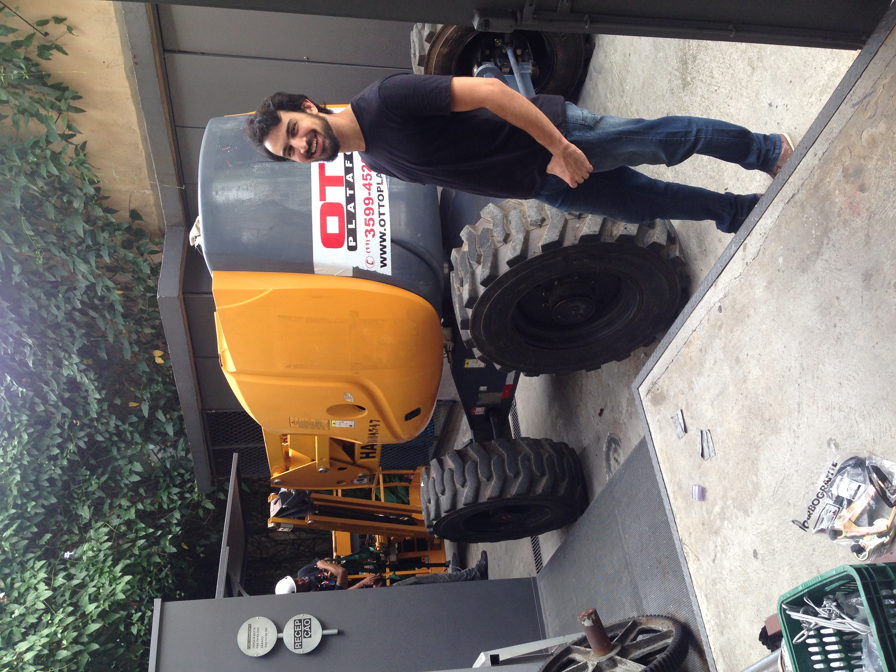

import Video from '@/components/Video.astro'
import YouTube from '@/components/YouTube.astro'
import ImageRow from '@/components/ImageRow.astro'

<YouTube id="KucCxUmOM1o" />
© Video by [Eduardo Ohara](https://www.eduardoohara.com/)

## Concept
> The metal column connects the subsoil of the city with the suspended roof and works practically like an antenna, capturing the vibrations of the city and the magnetic fields potentiated by the building.
The work transforms the architectural element into a musical instrument, to be played by the public and the city. A hybrid interface that generates sensory polyphony between urban metabolism and people through the vibration of the air.

*Atelier Marko Brajovic*

Atelier Marko Brajovic developed this site-specific installation to celebrate the Air Max Day. In this project, I worked closely with Marko, giving insights and pointing out where I thought had potential for an installation at the [Red Bull Station](https://triptyque.com/en/project/redbull-station/). This recently renovated building used to be a power plant facility and had become mainly a music laboratory, but it also had space for other art and technology explorations.
The Air Max Day was about celebrating the old and the new Air Max shoes, while at the same time, connecting Nike with Red Bull. Essentially, it was about interfaces, more specifically interfaces between the old and the new, design and music.
Marko developed two concepts, one involving inflatables and the Air Guitar. The first one wasn’t bad, but the Air Guitar was too good to pass.
During the meeting with the marketing agency, they got really excited about the installation, but they thought something was missing. For which I suggested to spice it up with addressable LEDs.


## Development
After the concept was approved, I was also in charge of coordinating the whole project development, and I may have gotten too greedy here because I decided to develop the LED part all by myself.
For the guitar part, I had no clue, but I knew the right guy for the task: my friend Lucas Caracik, a professional luthier from [Caracik Guitars](https://www.caracikguitars.com/).
Rafael Ohashi was the events guy; he already worked with many other events, so he would guide us and get the necessary equipment and licenses.

The system worked like this: the guitar was built using four steel cables and four bass pickups (yeah, it should have been called Air Bass, but that isn’t so sexy, right?).
I also thought about using a microphone, but Lucas' suggestion to use pickups was just on another level, conceptually and functionally, and he knew everything about them.

<Video src="/media/projects/air-guitar-by-atelier-marko-brajovic-for-nike/first-pickup-test.mp4" caption="First test: checking if a pickup would capture the steel cable vibration." />

Initially the concept was to have the LEDs going from the bottom all the way to the top. But to do that we would need someone with a safety license to climb which we unfortunately couldn’t find on time, so we were limited to the height a work-platform-lift could get.

<ImageRow>
  

  <Video src="/media/projects/air-guitar-by-atelier-marko-brajovic-for-nike/rafael-in-the-work-platform-lift.mp4" caption="Rafael in the work-platform-lift" />
</ImageRow>

### Interactivity
Each bass pickup would send an Analog signal to their respective Arduino Megas, which would then map the value and convert it into a digital signal, turning a specific amount of LEDs on.
In theory, it is pretty simple, but in reality, it drove me down the electronics rabbit hole quite quickly until I hit a wall. I came up with this circuit, but for some reason, it wasn’t working well. The event was getting closer, and the team was growing anxious. A week before the event, I contacted another guy, André Biagioni from [Fiozeira](https://fiozera.com.br/). Luckily, he agreed to participate. He said that the circuit was lacking a filter and finished the work. He also made a circuit diagram and helped with the assembly.


```arduino
#include "FastLED.h"

#if FASTLED_VERSION < 3001000
#error "Requires FastLED 3.1 or later; check GitHub for latest code."
#endif

#define minDelta 0
#define maxDelta 35
#define firstStrip 6
#define secondStrip 7
#define colorOrder GRB
#define ledType WS2812B
#define numLeds 600
#define maxLED 460
#define pickupPin AO
#define calibrationCycles 5000
#define Component 255
#define Component 0
#define Component 16
#define pickupNumReads 1000

int calibrationDelta = 0;
int pickup Value = 0;
int ledsToLight = 0;

struct CRGB leds[numLeds];

void calibration(){
  int minValue = 1024;
  int maxValue = 0;
  for (int i = 0; i < calibrationCycles; ++i) {
    int val = analogRead(pickupPin);
    minValue = min(minValue, val);
    maxValue = max(maxValue, val);
  }
  calibrationDelta = maxValue - minValue;
}

void pickupRead() {
  int minValue = 1024;
  int maxValue = 0;
  for(int i = 0; i < pickupNumReads; i++){
    int pickupValue = analogRead(pickupPin);
    minValue = min(minValue, pickupValue);
    maxValue = max(maxValue, pickup Value);
  }
  
  int pickupDelta = maxValue - minValue;
  pickupDelta = pickupDelta - calibrationDelta;

  if(pickupDelta < 0) {
    pickupDelta = 0;
  }
  else if(pickupDelta > 35) {
    pickupDelta = 35;
  }

  ledsToLight = map(pickupDelta, minDelta, maxDelta, O, maxLED);
}

void setup(){
  analogReference(EXTERNAL);
  Serial.begin(9600);
  LEDS.addLeds<ledType, firstStrip, colorOrder> (leds, numLeds);
  LEDS.addLeds<ledType, secondStrip, colorOrder>(leds, numLeds);
  FastLED.clear();
  FastLED.show();
  calibration();
}

void loop(){
  FastLED.clear();
  pickupRead();
  for(int i = 0; i < ledsToLight; i++){
   leds[i] = CHSV(255, 255, 255);
  }
  FastLED.show();
}
```


### Post Air Max Day
The guys from the Red Bull Station liked so much the installation that they asked to have it there for a full month. A period that I had to go and regularly to check if everything was working as expected. During this time some of the LEDs stopped working at the top of the installation, which would be very complicated to replace. The look wasn’t good because it lost that nice continuity. So instead of replacing the LEDs, I just turned off the top 10 LEDs directly in the Arduino code.

### Learnings
There were no welded components, a mistake that only the inexperienced would make. At some point during the event, the guitar just stopped working. I had a mini heart attack. To my relief, it started to work again just by turning it off and on.
Another thing that I wasn’t expecting was related to the cables. It required longer and thicker cables than I thought, the LEDs are power-hungry and need two cables for each LED strip, so they were being fed at the bottom and also at the middle, otherwise the LEDs would get wicker at the top. It also required two brick-sized power supplies for each Pickup-Arduino-LED setup.

<YouTube id="odFFIfzDSzE" />