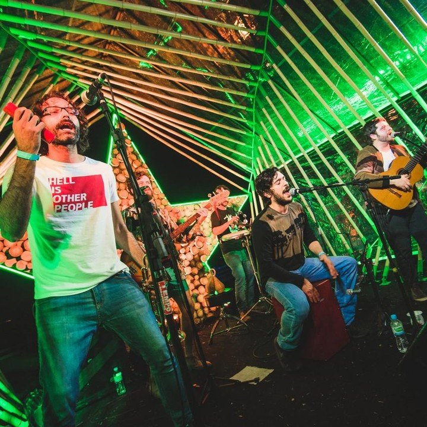
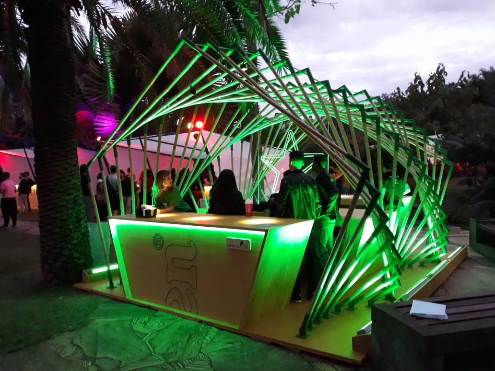
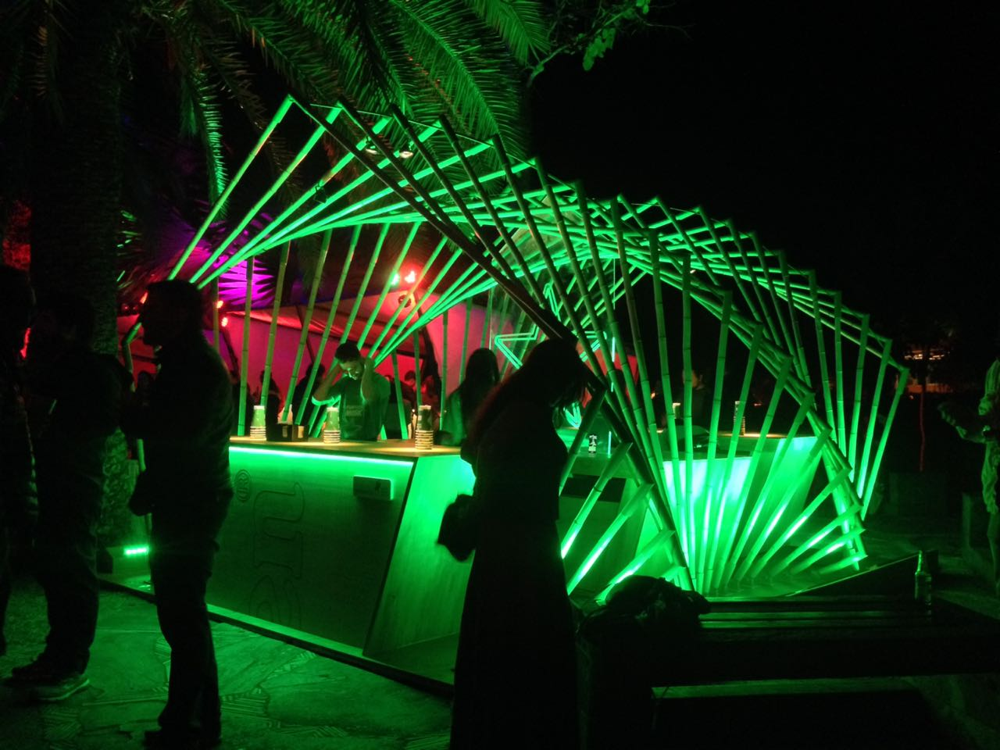
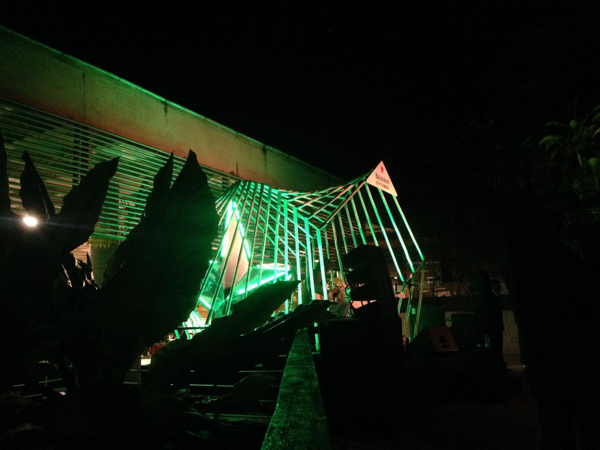
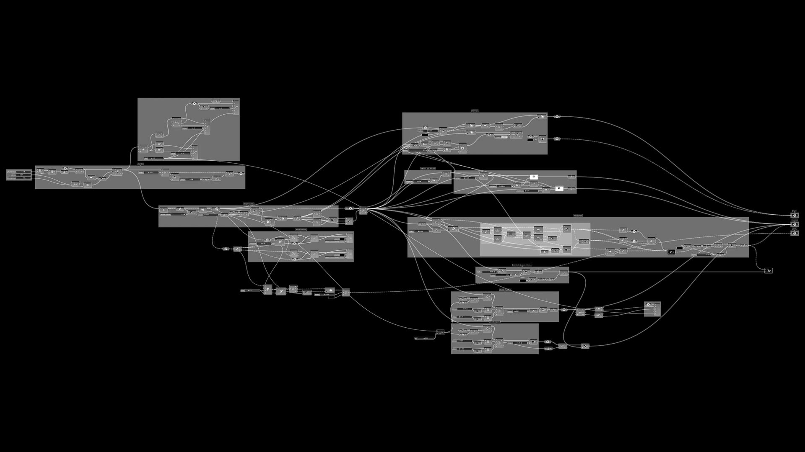
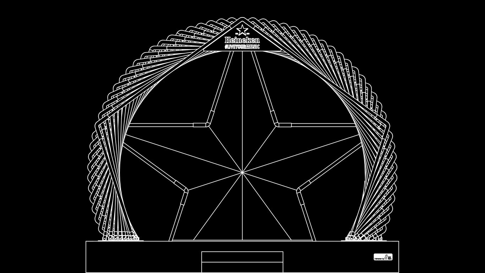
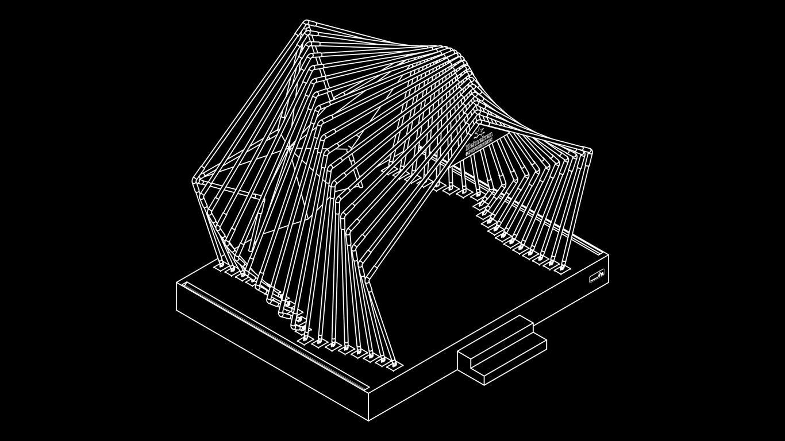
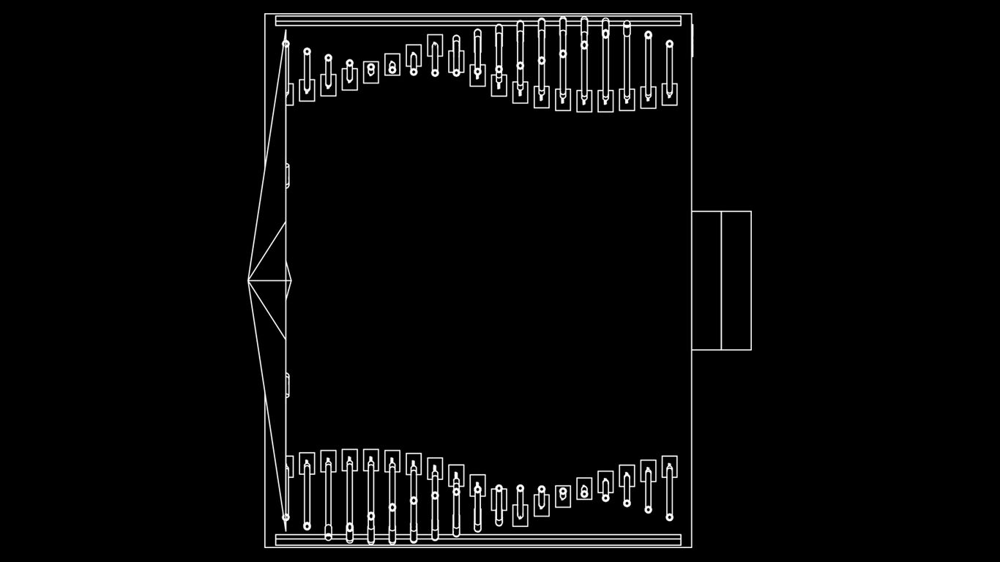
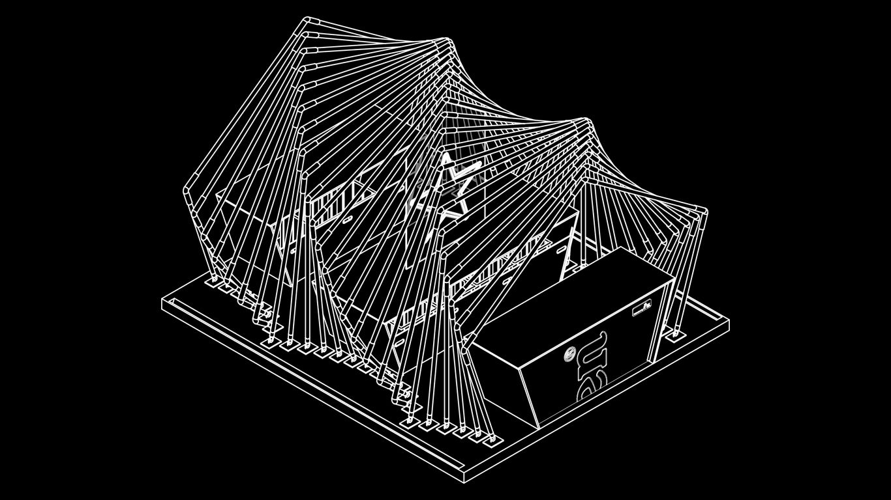
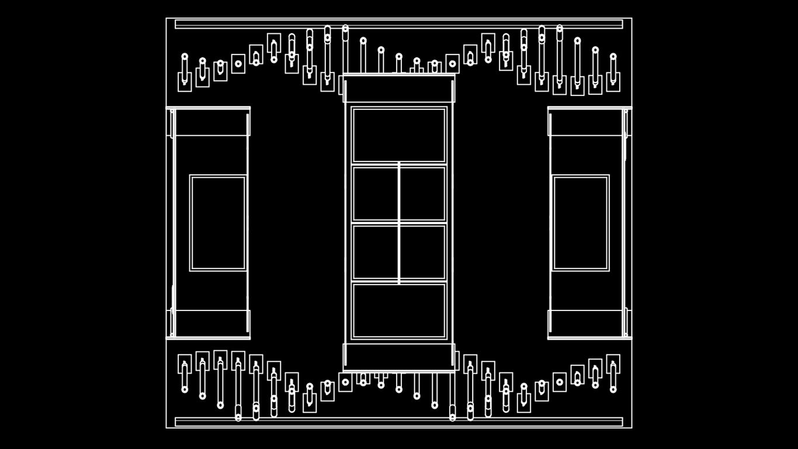

import ImageRow from '@/components/ImageRow.astro'

## Concept

The Atelier was invited to develop installations for the Heineken stage and bar at the 2018 MECA Festival. The design drew inspiration from the brand's visual identity, with the iconic Heineken star serving as the creative starting point. Using parametric software based on the star's geometry, the team created dynamic surfaces and movements oriented toward concert audiences. The structure was constructed from bamboo, designed to make attendees feel integrated into this kinetic architecture.

The Heineken sponsorship was part of the brand's #LiveYourMusic platform initiative to support musical concerts and festivals globally. The installations traveled to multiple cities across Brazil: Inhotim (MG), Maquine (RS), Recife (PE), Sao Paulo (SP) and Rio de Janeiro (RJ).

## Bar

The bar installation featured a circular bamboo structure wrapping around the serving area, with the Heineken star integrated into the front elevation. The parametric definition controlled the rotation and spacing of each bamboo element, creating a flowing, organic surface that captured the brand identity in an architectural form.

<ImageRow>
  

  
</ImageRow>

## Technical Drawings

The parametric design was developed in Grasshopper for Rhino, allowing for flexible adaptation of the structure to different festival venues across Brazil.

### Stage

<ImageRow>
  

  
</ImageRow>

### Bar

<ImageRow>
  

  
</ImageRow>

