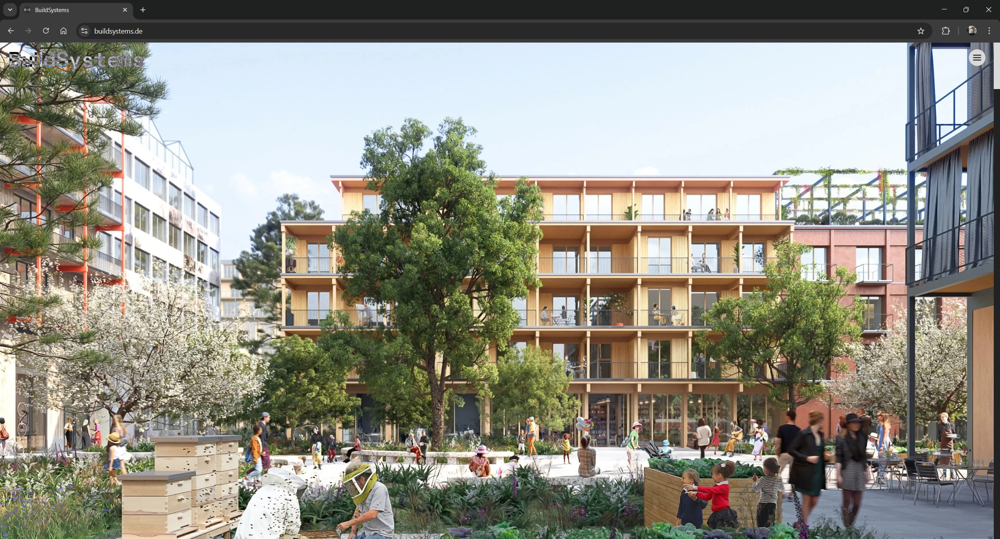
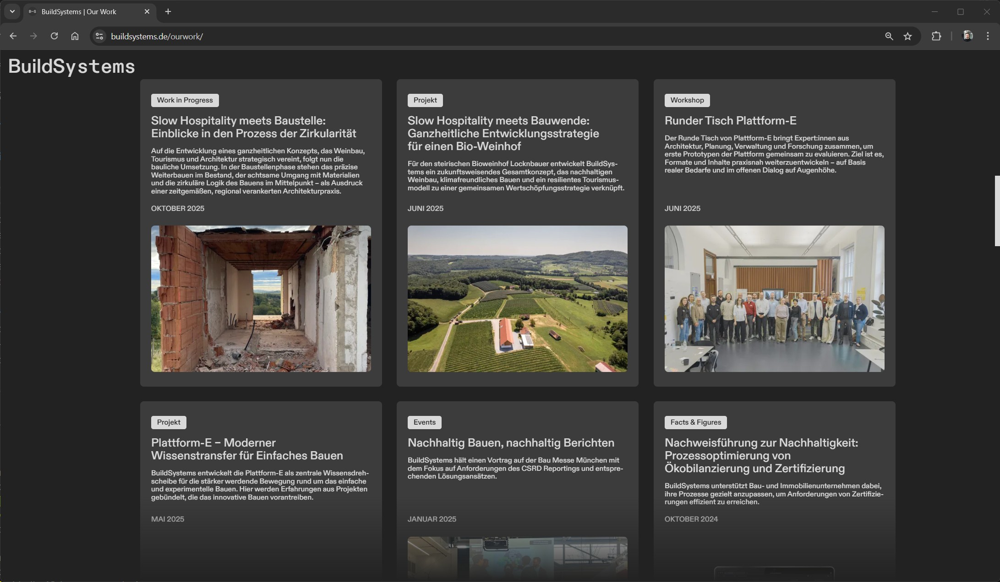

import Video from '@/components/Video.astro'

I developed the corporate website for [BuildSystems](https://buildsystems.de), a sustainability consultancy driving climate-neutral transformation in the building and real estate sector. The website serves as the company's digital presence, showcasing their services, portfolio of projects, team, and blog content. All managed through Notion as CMS.

The design was created by an external agency. My role was to implement the design and functionality using a cutting-edge tech stack focused on performance, to give great SEO.

## Tech Stack

- [**Astro**](https://astro.build/): Static site generator with TypeScript, chosen for its performance-first approach and zero-JS-by-default philosophy.
- [**Tailwind CSS**](https://tailwindcss.com/): Utility-first styling with custom CSS variables for responsive typography across four breakpoints.
- [**Notion API**](https://developers.notion.com/): Headless CMS integration — the team manages all content (blog posts, team members, partners, portfolio) directly from Notion.
- [**Cloudflare Pages**](https://pages.cloudflare.com/): Deployment with edge caching, automatic HTTPS, and DDoS protection.

## Why Notion as a CMS?

BuildSystems already used Notion extensively for internal documentation and project management. Instead of introducing a separate CMS that would require the team to learn a new tool, I integrated the Notion API directly into the build pipeline. This means the team can write and publish blog posts, update team profiles, and manage portfolio content entirely from Notion.

The integration fetches content at build time from multiple Notion databases (blog posts, team members, partners, organizations) and renders it using 30+ custom Notion components that handle headings, paragraphs, images, code blocks, tables, embeds, etc.

The CMS layer started as a fork of [astro-notion-blog](https://github.com/otoyo/astro-notion-blog) by Hiroki Toyokawa (MIT-licensed), which provided the initial scaffolding for fetching Notion content and rendering blocks. From there, I extended the block renderers, added databases for team members, partners, and organizations, and rebuilt the UI to match the BuildSystems brand and design system.

## Key Features

### CSS-First Animations
The design agency originally delivered the homepage cover and "Three Pillars" sections as Lottie animations. After integration, Lighthouse scores dropped sharply because the Lottie animations inflated the DOM well past the recommended size, hurting rendering performance. I rebuilt both animations in pure CSS `@keyframes`, with the "Three Pillars" adapted to work in both horizontal and vertical layouts. This preserved the visual fidelity while keeping the page lightweight and performant.

<Video src="/media/projects/buildsystems-website/three-pillars-animation.mp4" caption="Homepage animation" autoplay />

### Drag-to-Scroll Carousel
The blog post carousel implements a custom drag-to-scroll interaction with momentum physics and smooth scroll-snap. Users can drag the carousel with mouse or touch, and it smoothly snaps to the nearest card when released.

<Video src="/media/projects/buildsystems-website/drag-to-scroll-carousel.mp4" caption="Drag-to-scroll carousel" autoplay />

### Blog Posts from Notion
Each blog post is authored in Notion and rendered on the website at build time. It supports rich content including embedded media (Instagram, TikTok, YouTube, CodePen), LaTeX equations via KaTeX, code blocks with Prism.js syntax highlighting, and link previews via metascraper.

## Architecture

The project follows a pure Astro approach — no React or other JavaScript frameworks. All interactivity is built with vanilla TypeScript and CSS, resulting in minimal client-side JavaScript.

A custom build pipeline handles Notion content caching. Running `npm run cache:fetch` downloads all content and images from Notion, processes images with Sharp (removing EXIF data and optimizing formats), and stores them locally. This ensures fast builds and prevents unnecessary API calls during development.

## Responsive Design

The site uses CSS custom properties for fluid typography that scales across four breakpoints: mobile, tablet, desktop, and ultra-wide.

Self-hosted ABC Diatype fonts are preloaded to prevent Flash of Unstyled Text (FOUT), and the site uses SVG sprites for icons to minimize HTTP requests.
