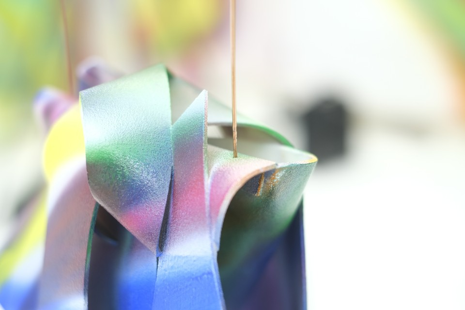
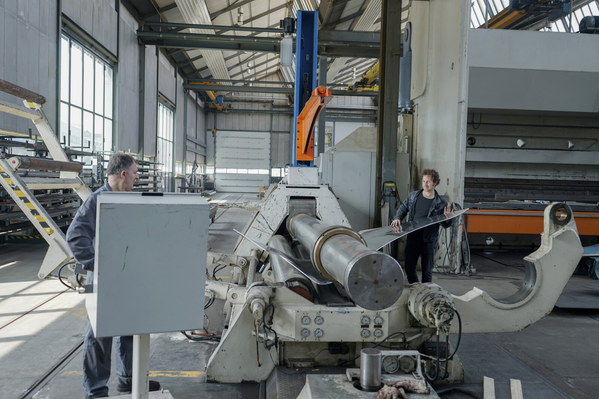
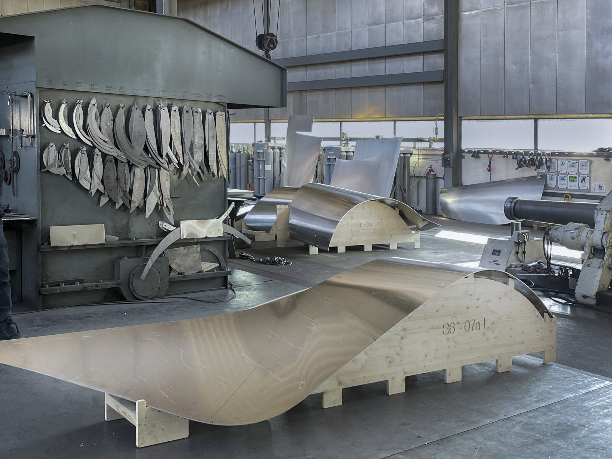
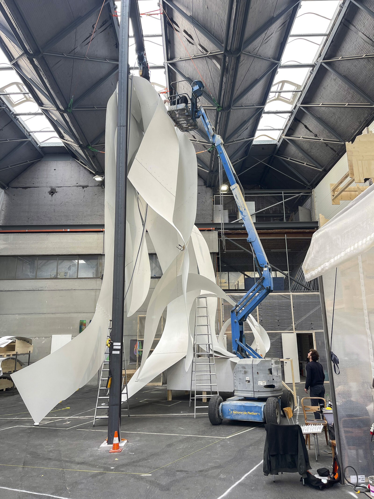
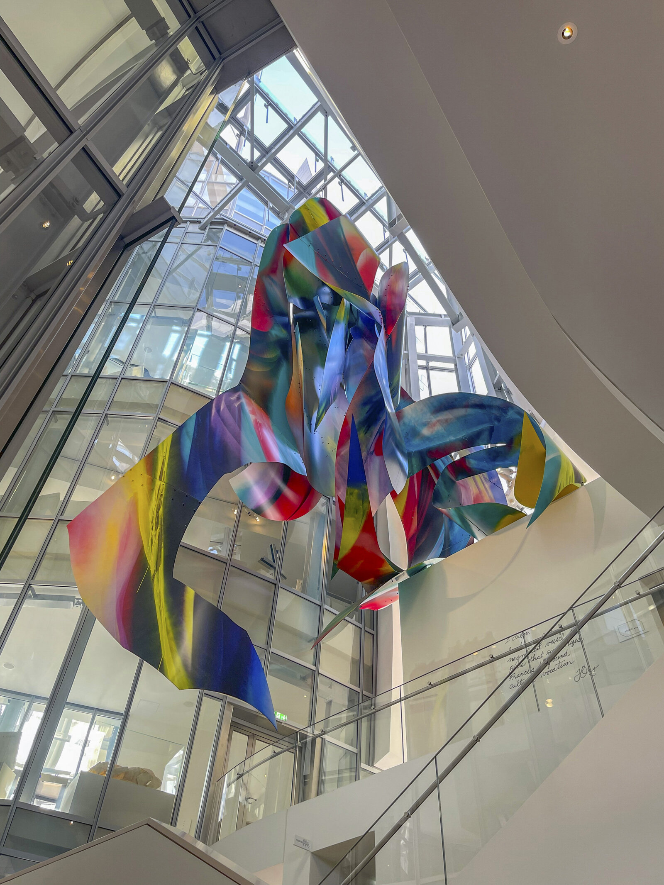

import Figure from '@/components/Figure.astro'

## Intro
At ArtEntineering, sometimes a client would pop up during a critical moment when time is short, and they need to deliver a seemingly simple but deeply complex project.
Canyon was one of those. For this project, Katharina Grosse chose to [sculpt with leather](https://www.katharinagrosse.com/blog/drawings_mock_ups_amp_preparations_for_canyon). The challenge was that she wanted to translate organic leathery strips into bent steel plates.

<Figure credit="Katharina Grosse">
  
</Figure>

What the original contractor did not discover on time was that steel does not behave like leather. Leather can bend and twist in any direction because it is flexible. In contrast, steel can only bend in one direction. The solution was a strategy already used in boat production for millennia: [developable surfaces](https://en.wikipedia.org/wiki/Developable_surface).
## Computational Design
I have tried multiple tools, benchmarking them against each other, including Rhino native developable surface command, Kangaroo 2 definitions, and other paid tools. But in the end, the best tool was [D.Loft](https://www.food4rhino.com/en/app/dloft), a Rhino/GH paid plugin. We used the trial version and later decided to buy it.
Although I had only a weekend to come up with a solution, the project overall was a really fun challenge. And I got to travel with Herwig to see the production process in Switzerland at [Kunstgiesserei St. Gallen](https://www.kunstgiesserei.ch/), a super interesting atelier & digital fabrication laboratory.

<Figure credit="Kunstgiesserei">
  
</Figure>

<Figure credit="Kunstgiesserei">
  
</Figure>

<Figure credit="Kunstgiesserei">
  
</Figure>

<Figure credit="Kunstgiesserei">
  
</Figure>
