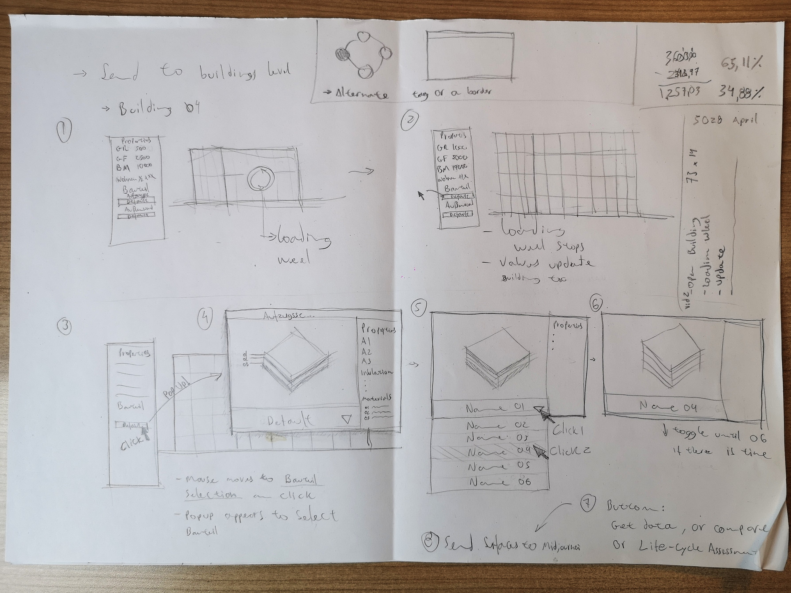
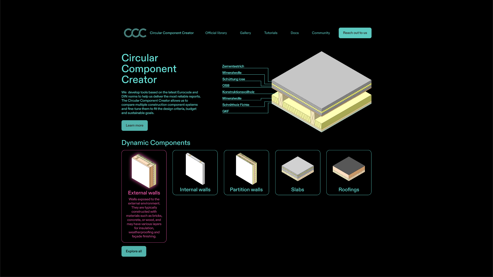
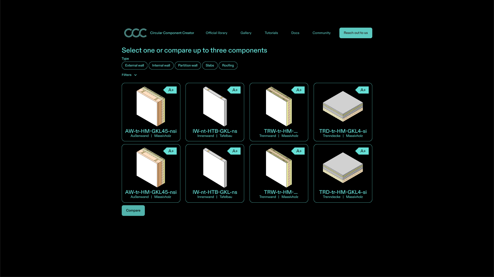
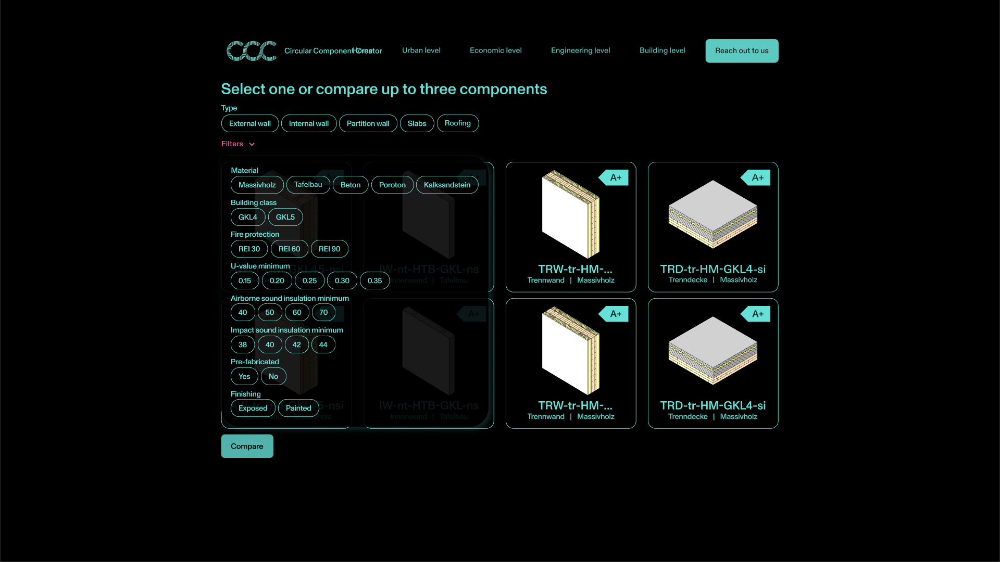
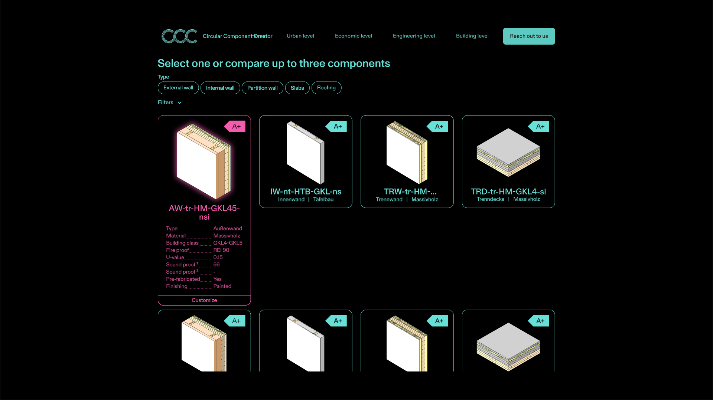
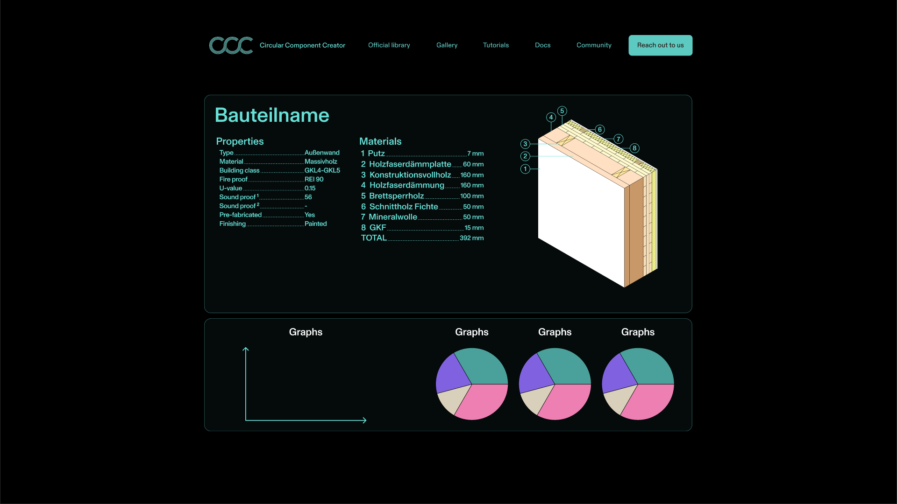
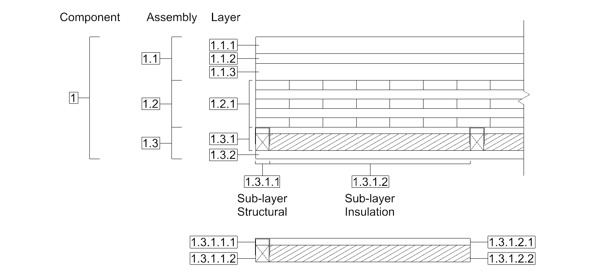

The Circular Component Creator (CCC) was a conceptual design study at [BuildSystems](https://buildsystems.de/) for a web application that would allow users to browse, filter, and compare building components designed for circular construction. The project reached the stage of detailed Figma mockups and a defined data architecture, but was not developed into a working application.

The concept evolved from the [BuildSystems plugin for Grasshopper](/projects/buildsystems-plugin-for-grasshopper), which provided Lifecycle Analysis (LCA) data within the Rhino/Grasshopper design environment. The CCC aimed to bring similar capabilities to a standalone web platform, making the component library accessible to a broader audience beyond Grasshopper users.

## UX Design Process

The design process started with hand-drawn wireframes to map out the user flow and screen structure. These sketches defined six key screens: the landing page, component browsing, filtering, component selection, detail view, and outcome analysis.

This approach allowed the team to quickly iterate on the layout and interaction patterns before moving to the Figma mockups.

## Figma Mockups

### Landing Page

The landing page concept introduces the application with an isometric section of a building component, showing the individual layers that make up a wall or slab assembly.

The five dynamic component categories are displayed below: external walls, internal walls, partition walls, slabs, and roofings. Each category is represented by an isometric icon, giving users an immediate overview of the available component types.

### Component Library

The library page concept presents all available components in a grid layout. Users would select up to three components for side-by-side comparison. Each component card shows a 3D rendering, the component identifier, and key properties.

### Filtering System

A filter panel would allow users to narrow down the component catalog by multiple criteria: material type (solid wood, softwood, concrete, aerated concrete, calcium silicate), dimensions, and framing method.

### Component Preview

Hovering over a component card would reveal a detailed preview with the component's key properties: name, material, U-value, fire resistance rating, and more.

### Component Detail Page

The detail page concept provides a comprehensive view of a single component, divided into three areas:

- **Properties table**: Type, material, building physics values (U-value, R-value), fire resistance classification, and whether the component is pre-fabricated or built on-site.
- **Materials list**: A numbered breakdown of each layer with its material name and thickness in millimeters.
- **Analysis graphs**: Four pie charts displaying the component's performance across different metrics.

A 3D cross-section view on the right side shows the exact layer composition, matching the numbered materials list.

## Data Architecture

The underlying data model follows a hierarchical structure that reflects how real building components are assembled. A Component is composed of Assemblies, which in turn consist of Layers. Each layer can contain Sub-layers, separated into structural and insulation parts.

This hierarchy was designed to allow the application to calculate aggregated properties (total thickness, U-value, weight) while maintaining granular control over individual material specifications.

