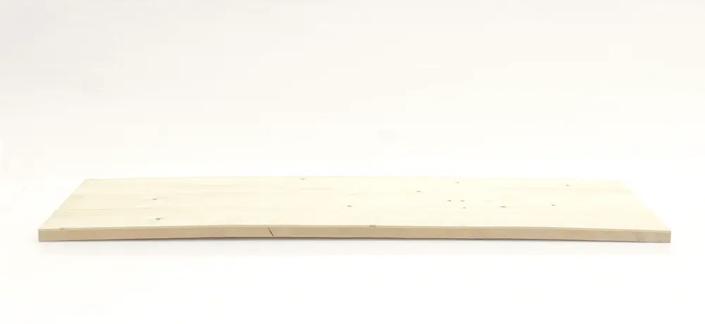
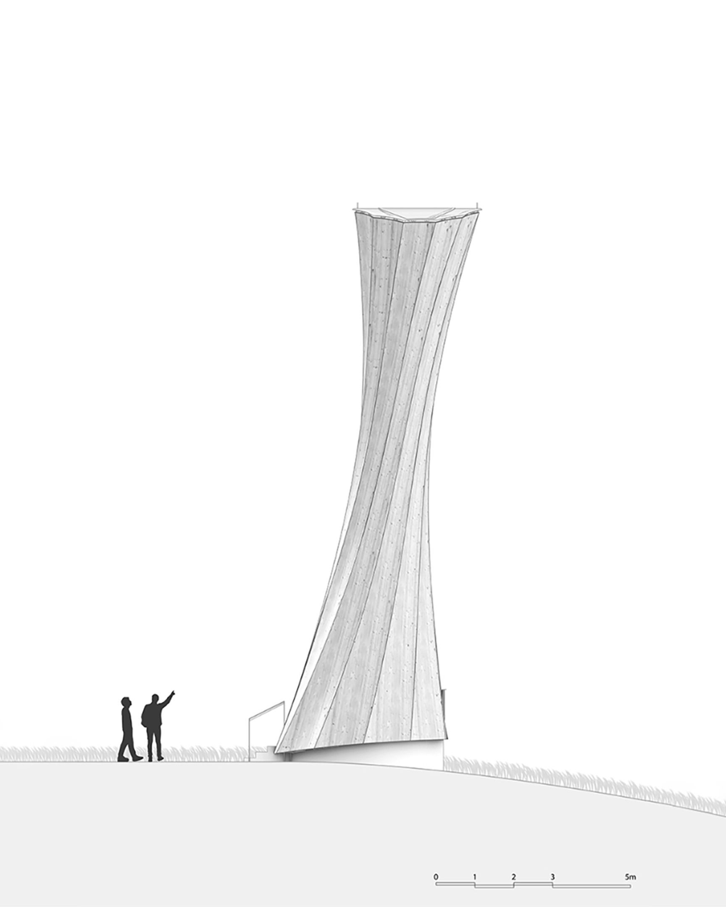
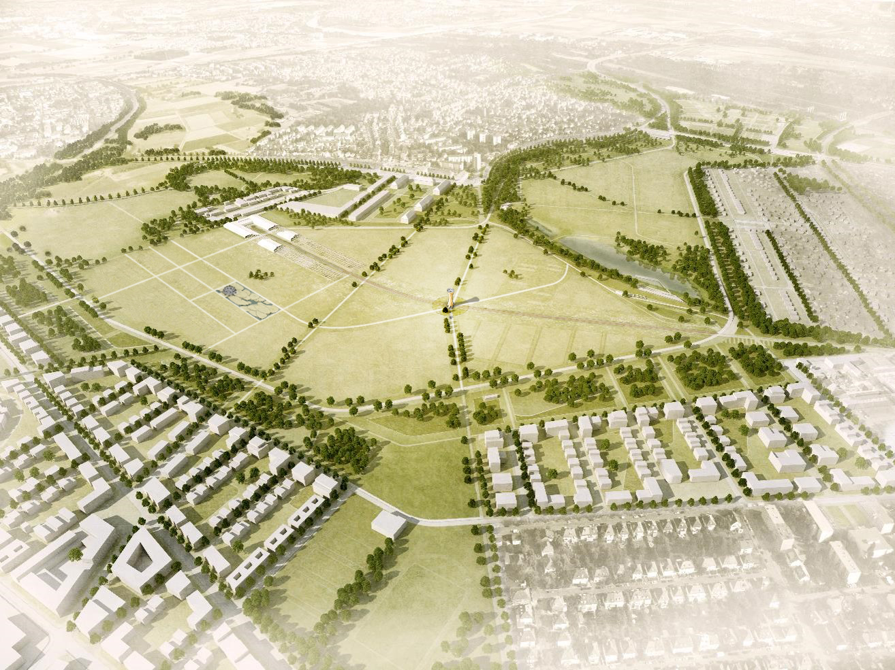

I was the computational designer for a project similar to the [Urbach Tower](https://www.icd.uni-stuttgart.de/projects/remstal-gartenschau-2019-urbach-turm/). The proposal, however, did not move forward because of the pandemic, I suppose.
Nonetheless, it was interesting to understand the computational strategy to generate the geometry for a self-curving cross-laminated timber plate. The trick here is to work with cylinders because timber's natural curvature happens perpendicular to the direction of the fibers.

I also worked on some as-built drawings for the Urbach Tower itself. Because of this, Dylan taught me all the constructive details for this project and also how they added multiple sensors to monitor and track the environmental  behaviors on the structure.

Dylan Wood's research at the ICD was about the natural self-shaping properties of timber when it dries. You can check Dylan Wood's TED Talk to understand more about the process here:

© Drawing and animation by University of Stuttgart, ICD/ITKE
