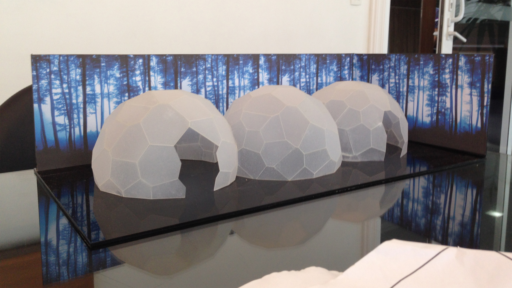

import YouTube from '@/components/YouTube.astro'

<YouTube id="MI3apyOKecs" title="O3 Pavilion by Atelier Marko Brajovic for Docol" />

## Concept
> O3 Pavilion was inspired by the ozone trioxide molecule. The three oxygen atoms become three spaces, each with a unique multi-sensory experience.

*Atelier Marko Brajovic*

## Computational Design
The O3 Pavilion was conceptualized by the Atelier Marko Brajovic at the same time that I was taking my first steps into the computational design world. I had just graduated from FAU-USP with a thesis in which I learned all the tools necessary to finish this pavilion: Rhino, Grasshopper 3D and Kangaroo Physics.
My role in this project was to work on the form-finding and the production of data for digital fabrication.
### Form Finding
The form-finding was specially tricky in the intersection between domes. Because each dome had a unique shape, the Voronoi cells at the intersections did not match. I had to use the Kangaroo plugin to force opposite dome cells into the same shape. And in doing so, the rest of the pavilion had to relax while keeping the domes planarity.

### Fabrication
The fabrication process wasn’t on our hands though. It was under a sub-contractor in the south of Brazil: [Paleta Stands](https://paleta.com.br/). There was a big logistic puzzle on the pre-fabrication and transportation which I was not part of, unfortunately. This is exactly what I talk about in the paper presented at the SIGraDi 2018 conference in São Carlos, Brazil. 
You can check the paper here:

[High-Low as Expression of The Brazilian Digital Fabrication](https://daniellocatelli.com/publications/high-low-as-expression-of-the-brazilian-digital-fabrication/)

© Cover photo by [Gui Morelli](https://www.guimorelli.com/)
