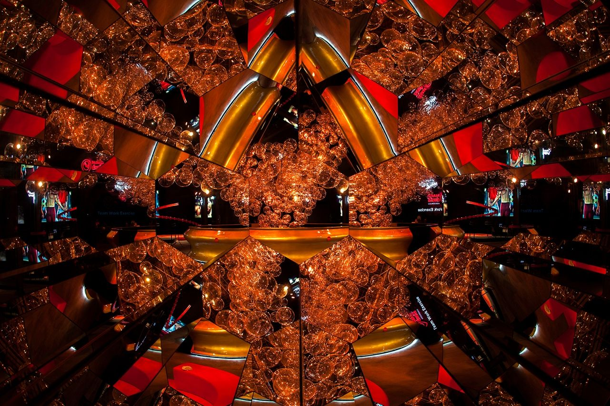
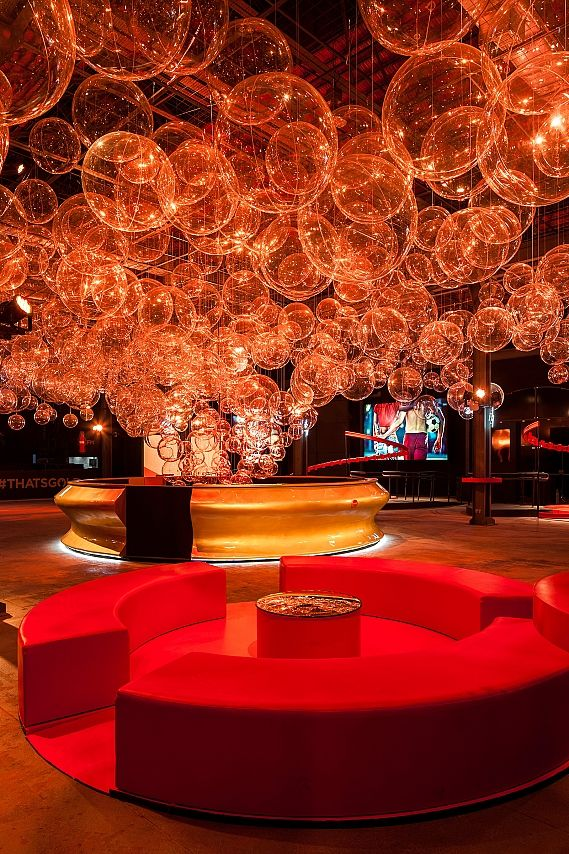

import Figure from '@/components/Figure.astro'

> We used more than 500 transparent acrylic spheres of different sizes suspended from the warehouse's ceiling structure, covering almost 1000m² and lighted it up to create a motion effect of ascending effervescence. Under the main bubble installation, different interactive activations and exhibitions entertain the public and narrate the visual history of the company.

*Atelier Marko Brajovic*

Parada Coca-Cola was my very first project where I applied computational design. This sensorial experience was inspired by the Coca-Cola bottle, mimicking the bubbles and colors of the drink. It also had many other activations, as they call in marketing agencies in Brazil.

<Figure credit="Fernando Martins">
  
</Figure>

<Figure credit="Fernando Martins">
  
</Figure>

## Computational Design
My role in the project was to place the plastic spheres parametrically while avoiding colliding with each other and the cables that connected them to the ceiling. For that, I used Grasshopper and Galapagos.
Another task that came later was to generate a spreadsheet with all the cable lengths and the tags to properly organize all the material to be shipped and deployed. Well, at least this was the idea. Because, at some point, someone thought it would be nice to remove the tags 🤯. It was a nightmare for the girls coordinating the event.

<Figure credit="Fernando Martins">
  
</Figure>
