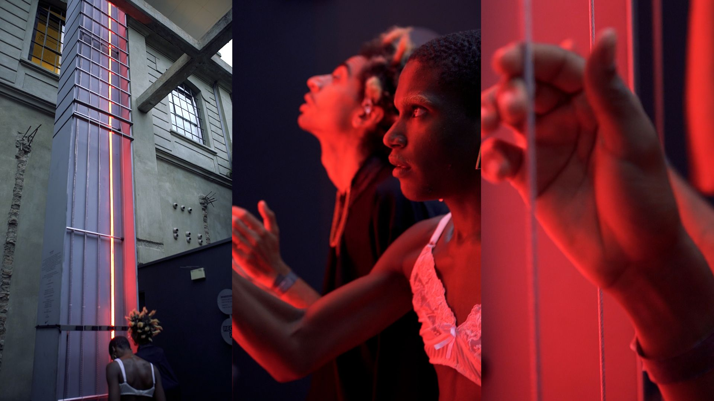

import Video from '@/components/Video.astro'
import YouTube from '@/components/YouTube.astro'

<YouTube id="KucCxUmOM1o" />

## Concept
> Em homenagem à celebração do Air Max Day, o Atelier Marko Brajovic desenvolveu a instalação site-specific Air Guitar.

O Atelier Marko Brajovic desenvolveu esta instalação específica do local para celebrar o Air Max Day. Neste projeto, trabalhei em estreita colaboração com Marko, dando insights e apontando potenciais para uma instalação na [Red Bull Station](https://triptyque.com/en/project/redbull-station/). Este edifício recentemente reformado costumava ser uma usina de energia e se tornou principalmente um laboratório de música, mas também tinha espaço para outras explorações de arte e tecnologia.
O Air Max Day foi sobre celebrar os antigos e novos tênis Air Max, ao mesmo tempo em que conectava a Nike com a Red Bull. Essencialmente, era sobre interfaces, mais especificamente interfaces entre o antigo e o novo, design e música.
Marko desenvolveu dois conceitos, um envolvendo infláveis e o Air Guitar. O primeiro não era ruim, mas o Air Guitar era bom demais para deixar passar.
Durante a reunião com a agência de marketing, eles ficaram super animados com a instalação, mas acharam que faltava algo. Foi então que sugeri os LEDs endereçáveis.


## Desenvolvimento
Depois que o conceito foi aprovado, eu também fiquei responsável por coordenar todo o desenvolvimento do projeto, e talvez eu tenha ficado muito ganancioso porque decidi desenvolver a parte do LED sozinho.
Para a parte da guitarra, eu não fazia ideia de por onde começar, mas eu conhecia o cara certo: meu amigo Lucas Caracik, um luthier profissional da [Caracik Guitars](https://www.caracikguitars.com/).
Rafael Ohashi era o cara dos eventos; ele já trabalhava com muitos outros eventos, então ele nos guiava e conseguia os equipamentos e licenças necessários.
O sistema funcionava assim: a guitarra foi construída usando quatro cabos de aço e quatro captadores de baixo (sim, deveria ter se chamado Air Bass, mas Air Bass não soa tão sexy).
Eu também pensei em usar um microfone, mas a sugestão do Lucas de usar captadores estava em outro nível conceitual e funcional, e ele sabia tudo sobre essa tecnologia.

<Video src="/media/projects/air-guitar-by-atelier-marko-brajovic-for-nike/first-pickup-test.mp4" caption="First test: checking if a pickup would capture the steel cable vibration." />

Inicialmente o conceito era ter os LEDs e os cabos de aço cobrindo toda a altura do pilar. Mas pra fazer isso nós precisaríamos de alguém com licença e equipamento de escalada, o que infelizmente não conseguimos encontrar a tempo, então ficamos limitados à altura que uma plataforma elevatória de trabalho poderia atingir.

### Interatividade
Cada captador de baixo envia um sinal analógico para seus respectivos Arduino Megas, que então mapeiam o valor e os convertem em um sinal digital, acendendo uma quantidade específica de LEDs.
Em teoria, é bem simples, mas na realidade, me levou pra uma espiral estudando eletrônica, até que eu cheguei num beco sem saída. Eu criei esse circuito, mas por algum motivo, ele não estava funcionando bem. O evento estava se aproximando, e a equipe estava ficando ansiosa.
Uma semana antes do evento, entrei em contato com outro cara, André Biagioni da [Fiozeira](https://fiozera.com.br/). Felizmente, ele concordou em participar. Ele disse que faltava um filtro no circuito e terminou o trabalho. Ele também fez um diagrama do circuito e ajudou na montagem.


```arduino
#include "FastLED.h"

#if FASTLED_VERSION < 3001000
#error "Requires FastLED 3.1 or later; check GitHub for latest code."
#endif

#define minDelta 0
#define maxDelta 35
#define firstStrip 6
#define secondStrip 7
#define colorOrder GRB
#define ledType WS2812B
#define numLeds 600
#define maxLED 460
#define pickupPin AO
#define calibrationCycles 5000
#define Component 255
#define Component 0
#define Component 16
#define pickupNumReads 1000

int calibrationDelta = 0;
int pickup Value = 0;
int ledsToLight = 0;

struct CRGB leds[numLeds];

void calibration(){
  int minValue = 1024;
  int maxValue = 0;
  for (int i = 0; i < calibrationCycles; ++i) {
    int val = analogRead(pickupPin);
    minValue = min(minValue, val);
    maxValue = max(maxValue, val);
  }
  calibrationDelta = maxValue - minValue;
}

void pickupRead() {
  int minValue = 1024;
  int maxValue = 0;
  for(int i = 0; i < pickupNumReads; i++){
    int pickupValue = analogRead(pickupPin);
    minValue = min(minValue, pickupValue);
    maxValue = max(maxValue, pickup Value);
  }
  
  int pickupDelta = maxValue - minValue;
  pickupDelta = pickupDelta - calibrationDelta;

  if(pickupDelta < 0) {
    pickupDelta = 0;
  }
  else if(pickupDelta > 35) {
    pickupDelta = 35;
  }

  ledsToLight = map(pickupDelta, minDelta, maxDelta, O, maxLED);
}

void setup(){
  analogReference(EXTERNAL);
  Serial.begin(9600);
  LEDS.addLeds<ledType, firstStrip, colorOrder> (leds, numLeds);
  LEDS.addLeds<ledType, secondStrip, colorOrder>(leds, numLeds);
  FastLED.clear();
  FastLED.show();
  calibration();
}

void loop(){
  FastLED.clear();
  pickupRead();
  for(int i = 0; i < ledsToLight; i++){
   leds[i] = CHSV(255, 255, 255);
  }
  FastLED.show();
}
```

### Depois do Air Max Day
O pessoal da Red Bull Station gostou tanto da instalação que pediu para ficar lá por um mês inteiro. Um período que eu tinha que ir lá regularmente para verificar se tudo estava funcionando como esperado. Durante esse tempo, alguns dos LEDs pararam de funcionar no topo da instalação, o que seria muito complicado de substituir. O visual não ficou bom porque perdeu aquela continuidade, parecia que a instalação estava banguela. Então, ao invés de substituir os LEDs, eu apenas desliguei os 10 LEDs de cima diretamente no código do Arduino.
### Aprendizados
Não haviam componentes soldados, um erro crasso. Todos os componentes ainda usavam os cabos e conexões de prototipagem do Arduino em breadboards.
O evento estava lotado, até mesmo com fila do lado de fora. Em algum momento durante o evento a guitarra simplesmente parou de funcionar. Eu tive um mini ataque cardíaco! Lembro claramento até hoje, eu estava na cobertura da Red Bull Station, já no meu terceiro drink, quando me contaram do problema. Fui correndo pelas escadas até chegar na parte posterior do pilar, onde esatava a caixa de controle. Desliguei tudo, liguei e… Phew! Alívio! A instalação começou a funcionar novamente.
Apesar de eu ter aprendido muito, eu teria poupado alguns cabelos brancos se eu tivesse contratado um especialista desde o começo, testado a instalação uma semana antes da entrega e soldado todas as conexões.
Outra coisa que não esqueço foram os cabos. Exigiu cabos mais longos e grossos do que eu esperava, os LEDs consomem muita energia e precisam de dois cabos para cada tira de LED. Eles precisam ser alimentados na parte inferior e também no meio, caso contrário, os LEDs ficariam mais fracos na metade superior.
A instalação também exigiu duas fontes de alimentação do tamanho de tijolos para cada configuração Captador-Arduino-LED, ou seja oito fontes de alimentação no total (veja foto acima).

© Primeira foto e video by [Eduardo Ohara](https://www.eduardoohara.com/)
