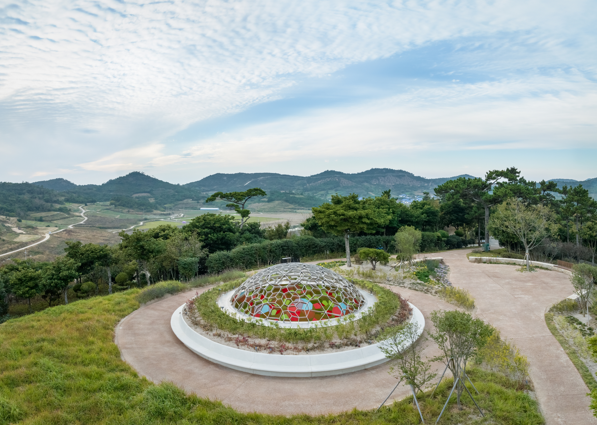
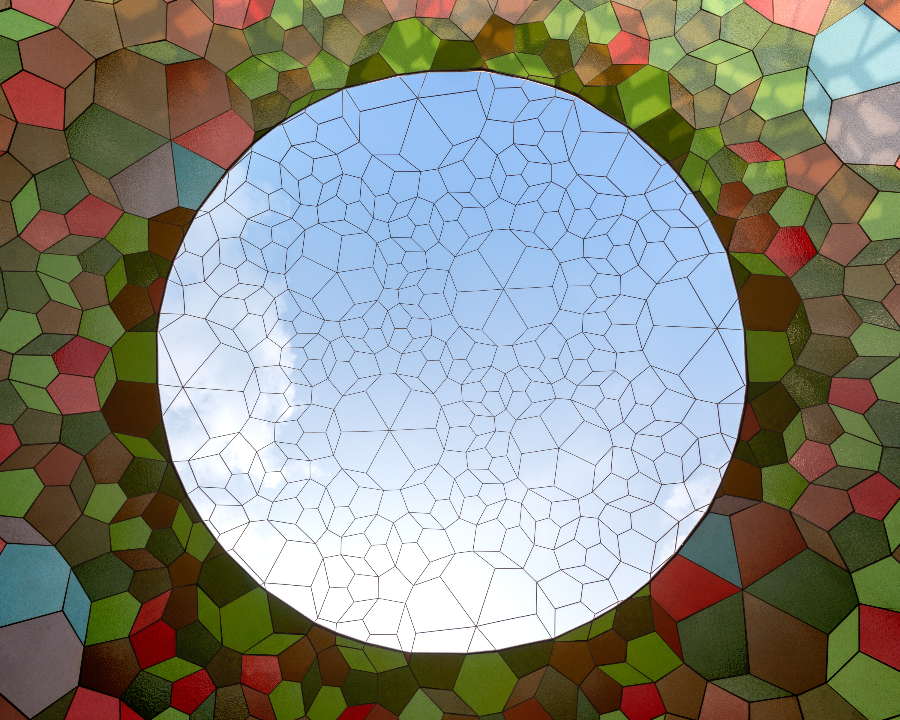
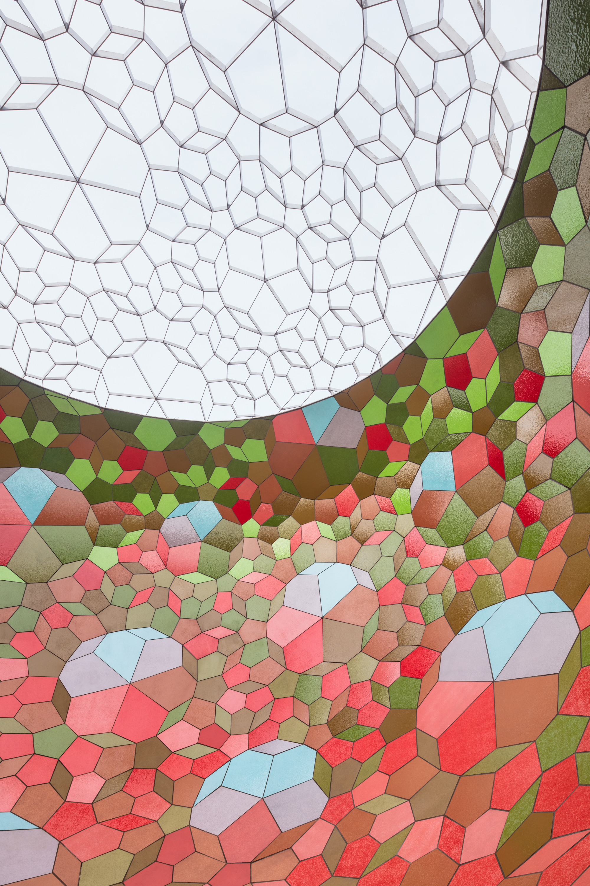
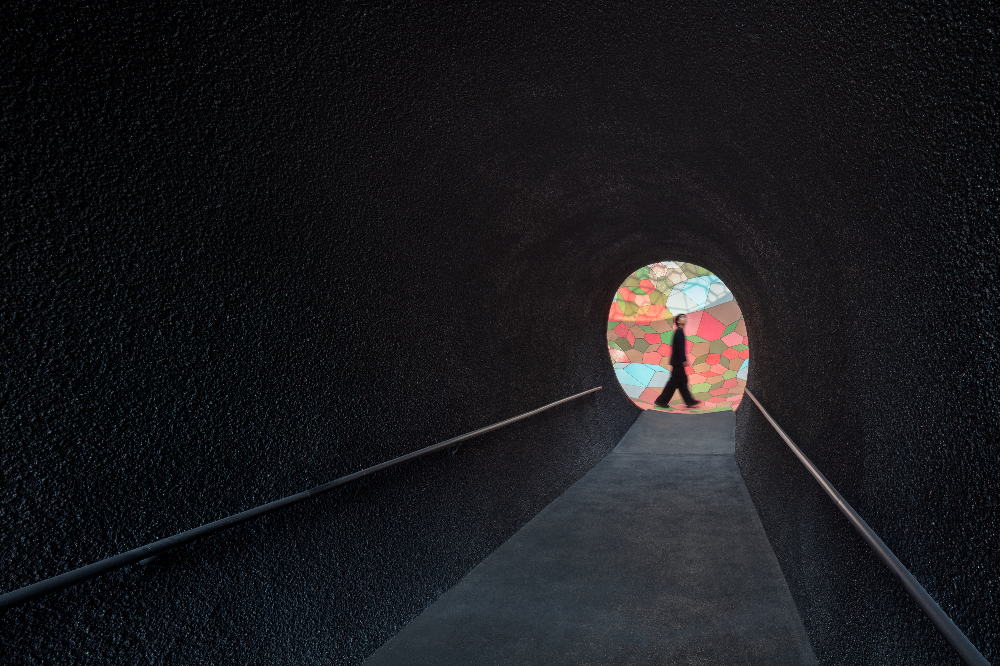
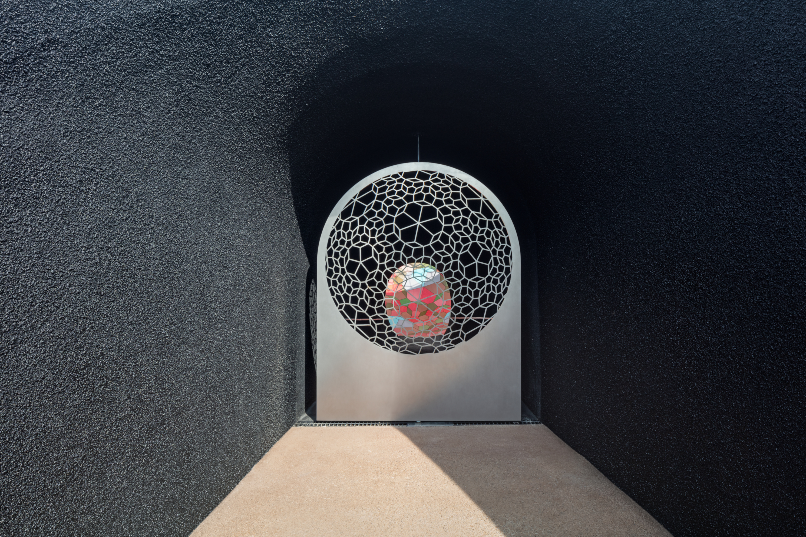

## Intro
[Olafur Eliasson](https://olafureliasson.net/) contatou a ArtEngineering para a engenharia computacional, fabricação digital e logística da Breathing earth sphere. Essa foi minha chance de ver o workflow do ArtEngineering completo: do conceito à engenharia computacional, fabricação digital e logística.

## A Engenharia
Meu foco foi a Análise de Elementos Finitos (FEA) utilizando o SOFiSTiK, que é excelente quando se lida com geometrias complexas e não padronizadas como esta. Partimos do modelo base do estúdio de Eliasson e fizemos uma análise e documentação realmente aprofundada: vento, sísmica e até forças "acidentais" (porque alguém inevitavelmente tentará escalar uma cúpula de 10 metros).
O desafio técnico mais interessante foram as juntas de dilatação. Como a estrutura superior da cúpula é inteiramente em aço inoxidável, ela é essencialmente um organismo vivo que respira com a temperatura. Tivemos que projetar conexões precisas que permitissem expansão e contração térmica significativas sem comprometer a integridade estrutural ou estética.

## **O Quebra-Cabeça Logístico**
Um grande desafio, no entanto, surgiu após a finalização do modelo digital. Precisávamos descobrir como levar uma esfera massiva de 10 metros de uma oficina na Alemanha até um local remoto na Ilha de Docho, na Coreia do Sul. Isso significou que eu tive que "resolver" a cúpula como um quebra-cabeça 3D gigante: segmentando toda a estrutura em peças modulares que se encaixassem perfeitamente em contêineres de transporte padrão.

## **O Resultado**
O trabalho foi feito em 2022, mas a instalação foi concluída em 2024, quando eu já não fazia mais parte da equipe. Foi, no entanto, incrível ver o projeto ir de uma malha do SOFiSTiK na minha tela a um marco arquitetônico em uma ilha sul-coreana.

