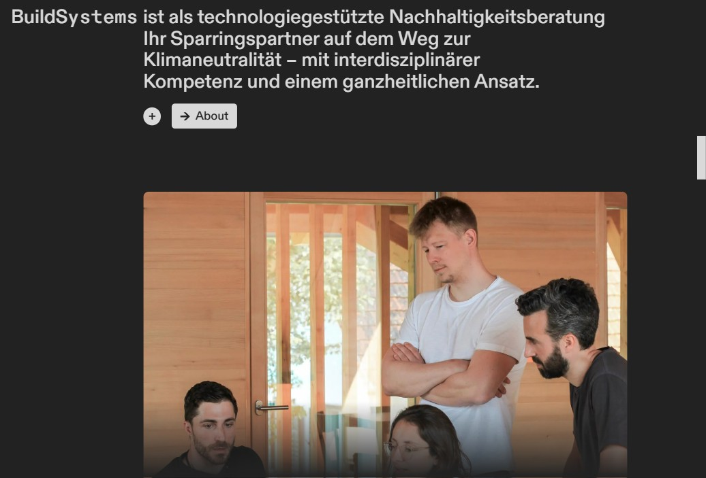
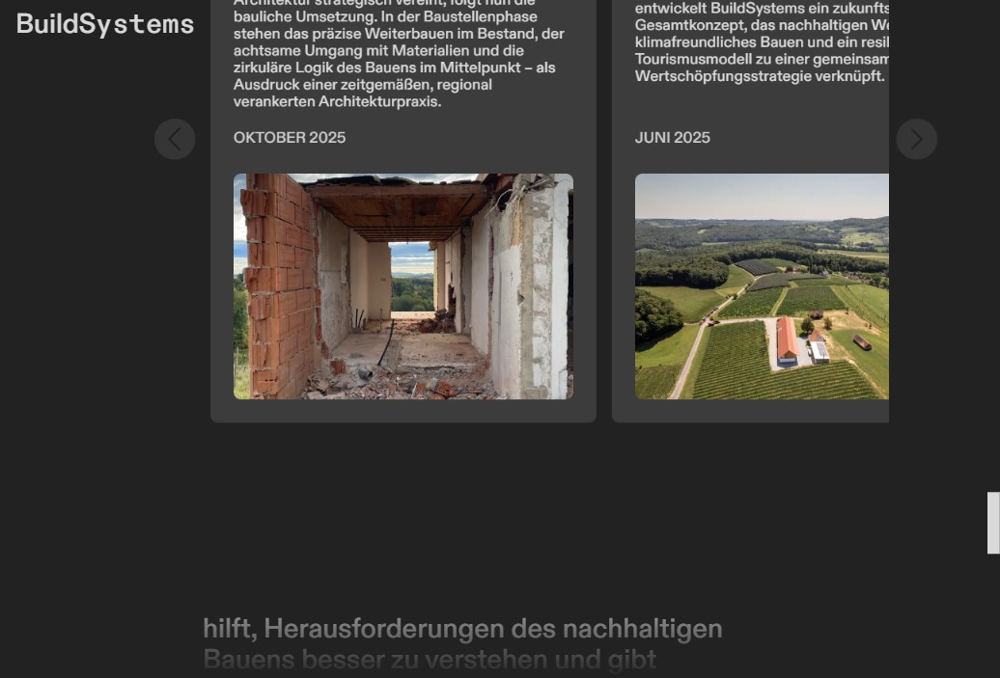
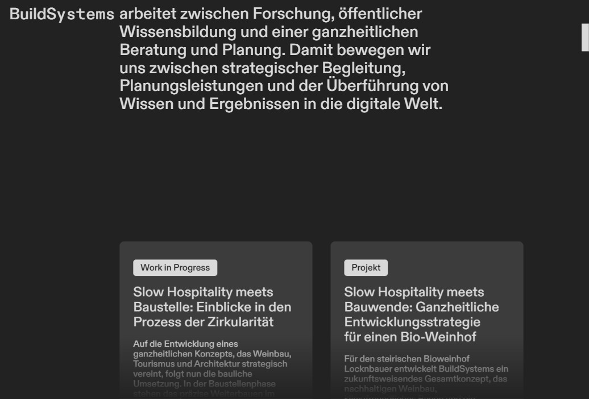

---
{
  "Cover": "/assets/content/projects/buildsystems-website/multistory-timber-building.jpg",
  "CoverAlt": "Captura de tela do site da BuildSystems na versão desktop",
  "Description": "Desenvolvimento do site da BuildSystems com o framework Astro, utilizando a API do Notion como CMS.",
  "Name": "BuildSystems Website",
  "Slug": "projects/buildsystems-website",
  "Tags": [
    "Web Development",
    "Astro",
    "Notion API",
    "TypeScript"
  ],
  "Authors": [
    "BuildSystems GmbH"
  ],
  "Category": "Software",
  "City": [
    "Munique"
  ],
  "Client": "BuildSystems GmbH",
  "DateStart": "2023-08-01",
  "DateEnd": "2024-04-01",
  "Link": {
    "Text": "BuildSystems Website",
    "Href": "https://buildsystems.de"
  },
  "Place": "BuildSystems GmbH",
  "Director": ["Martin Bittmann"],
  "Manager": ["Julia Dorn"],
  "Team": ["Daniel Locatelli"]
}
---

Projetei e desenvolvi o site corporativo da [BuildSystems](https://buildsystems.de), uma consultoria de sustentabilidade que impulsiona a transformação climática neutra no setor de construção e imobiliário. O site funciona como a presença digital da empresa, apresentando seus serviços, portfólio de projetos, equipe e conteúdo de blog — tudo gerenciado pelo Notion como CMS headless.

## Stack Tecnológica

- [**Astro 5**](https://astro.build/): Gerador de sites estáticos com TypeScript, escolhido por sua abordagem performance-first e filosofia de zero JavaScript por padrão.
- [**Tailwind CSS 4**](https://tailwindcss.com/): Estilização utility-first com variáveis CSS customizadas para tipografia responsiva em quatro breakpoints.
- [**API do Notion**](https://developers.notion.com/): Integração CMS headless — a equipe gerencia todo o conteúdo (posts do blog, membros da equipe, parceiros, portfólio) diretamente pelo Notion.
- [**Cloudflare Pages**](https://pages.cloudflare.com/): Deploy com cache de borda, HTTPS automático e proteção contra DDoS.
- [**Sharp**](https://sharp.pixelplumbing.com/): Pipeline de processamento de imagens gerando formatos otimizados em avif/webp.

## Por que o Notion como CMS?

A BuildSystems já utilizava o Notion intensamente para documentação interna e gerenciamento de projetos. Em vez de introduzir um CMS separado que exigiria que a equipe aprendesse uma nova ferramenta, integrei a API do Notion diretamente no pipeline de build. Isso significa que a equipe pode escrever e publicar posts, atualizar perfis de membros e gerenciar conteúdo do portfólio inteiramente pelo Notion — uma ferramenta que já usam diariamente.

A integração busca conteúdo em tempo de build de múltiplos bancos de dados do Notion (posts, membros da equipe, parceiros, organizações) e renderiza usando mais de 30 renderizadores customizados de blocos Notion que lidam com títulos, parágrafos, imagens, blocos de código, tabelas, embeds e mais.

## Principais Recursos

### Animações CSS-First
Uma decisão deliberada foi usar animações CSS puras com `@keyframes` em vez de bibliotecas de animação JavaScript. O cover da homepage apresenta uma sequência animada em tela cheia, e as seções dos "Três Pilares" usam animações exclusivamente CSS em layouts horizontal e vertical. Isso mantém a página leve e performática.

### Animação Orbital Interativa
A seção de serviços apresenta uma animação orbital customizada construída com física de molas em JavaScript puro. Nove tópicos de serviços orbitam em torno de um ponto central, com clique para fixar, hover para pausar e redimensionamento responsivo. Nenhuma biblioteca de animação foi utilizada — apenas equações de física e `requestAnimationFrame`.

### Carrossel com Arraste
O carrossel de posts do blog implementa uma interação customizada de arrastar para rolar com física de inércia e scroll-snap suave. Os usuários podem arrastar o carrossel com mouse ou toque, e ele se ajusta suavemente ao card mais próximo quando solto.

### Posts do Blog via Notion
Cada post é escrito no Notion e renderizado no site em tempo de build. O renderizador customizado de blocos Notion suporta conteúdo rico, incluindo mídia incorporada (Instagram, TikTok, YouTube, CodePen), equações LaTeX via KaTeX, blocos de código com destaque de sintaxe Prism.js e previews de links via metascraper.

### Portfólio e Página "Our Work"
A página de portfólio exibe todos os projetos, eventos, ferramentas e artigos de notícias com cards categorizados. Cada card leva a uma página detalhada renderizada do Notion com perfis de autores, posts relacionados e galerias de imagens.

## Arquitetura

O projeto segue uma abordagem puramente Astro — sem React ou outros frameworks JavaScript. Toda a interatividade é construída com TypeScript puro e CSS, resultando em mínimo JavaScript no lado do cliente. A base de código consiste em 89 componentes Astro, 22 arquivos utilitários TypeScript e 4 variantes de layout.

Um pipeline de build customizado cuida do cache de conteúdo do Notion. Executando `npm run cache:fetch`, todo o conteúdo e imagens são baixados do Notion, processados com Sharp (removendo dados EXIF e otimizando formatos) e armazenados localmente. Isso garante builds rápidos e evita chamadas desnecessárias à API durante o desenvolvimento.

## Design Responsivo

O site usa CSS Custom Properties para tipografia fluida que escala em quatro breakpoints: mobile, tablet, desktop e ultra-wide. O tema escuro (fundo `#222` com texto `#d9d9d9` e verde da marca `#24b54a`) proporciona um visual profissional e moderno que combina com a identidade visual da BuildSystems.

Fontes ABC Diatype auto-hospedadas são pré-carregadas para evitar Flash of Unstyled Text (FOUT), e o site usa SVG sprites para ícones, minimizando requisições HTTP.

