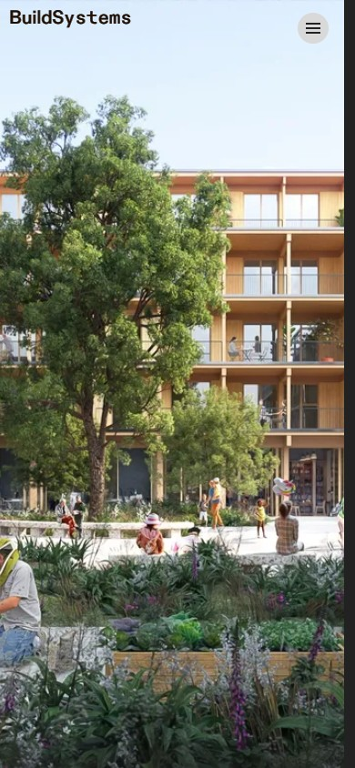

---
{
  "Cover": "/assets/content/projects/buildsystems-website/cover-cover.jpg",
  "CoverAlt": "Captura de tela do site da BuildSystems na versão desktop",
  "Description": "Desenvolvimento do site da BuildSystems com o framework Astro, utilizando a API do Notion como CMS.",
  "Name": "BuildSystems Website",
  "Slug": "projects/buildsystems-website",
  "Tags": [
    "Web Development",
    "Astro",
    "Notion API",
    "TypeScript"
  ],
  "Authors": [
    "BuildSystems GmbH"
  ],
  "Category": "Software",
  "City": [
    "Munique"
  ],
  "Client": "BuildSystems GmbH",
  "DateStart": "2023-08-01",
  "DateEnd": "2024-04-01",
  "Link": {
    "Text": "BuildSystems Website",
    "Href": "https://buildsystems.de"
  },
  "Place": "BuildSystems GmbH"
}
---

Desenvolvimento do site da BuildSystems usando o framework [Astro](https://astro.build/), utilizando a API do Notion como sistema de gerenciamento de conteúdo. O site apresenta os produtos e serviços da BuildSystems para planejamento de construção sustentável.

A stack tecnológica inclui Astro com TypeScript, Tailwind CSS para estilização e a API do Notion para gerenciamento de conteúdo, permitindo que a equipe atualize o conteúdo do site diretamente do seu workspace existente no Notion.

