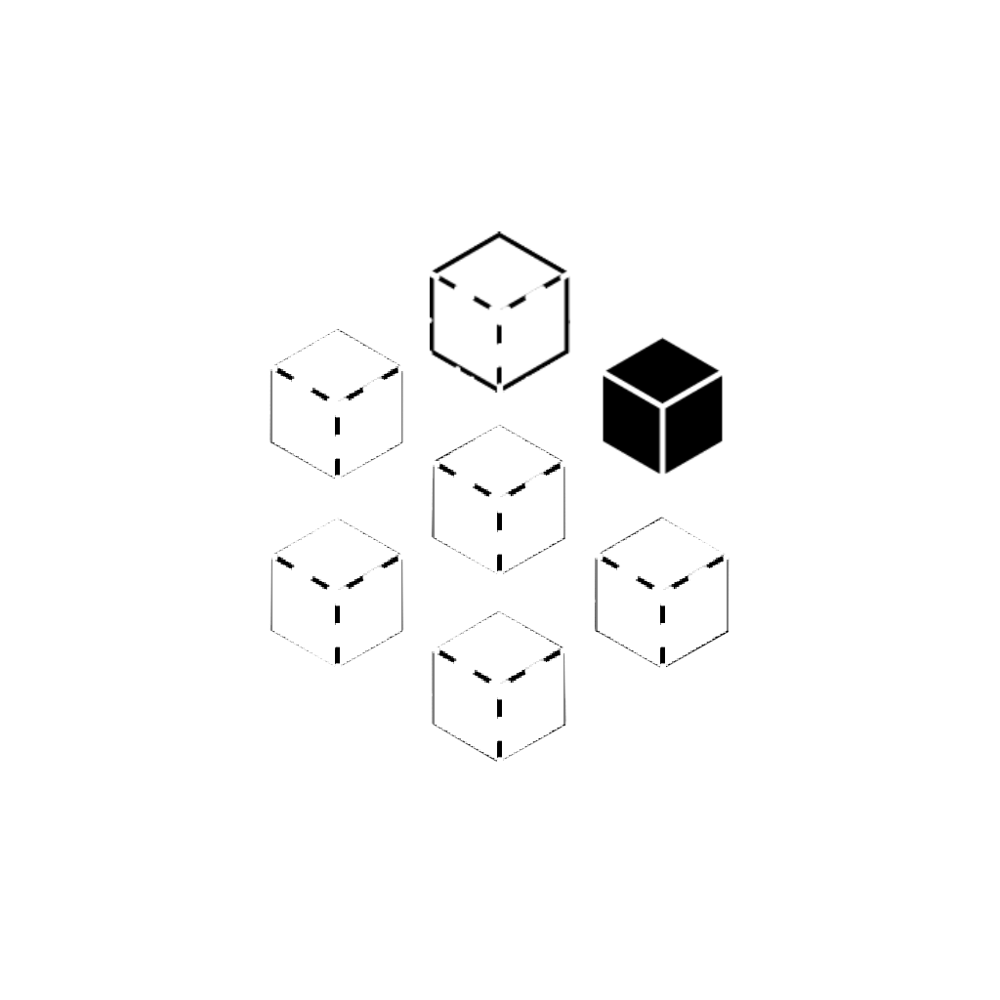

O DOKwood é um projeto de pesquisa e uma plataforma de software para a documentação de composições construtivas multicamadas na construção pré-fabricada em madeira. Em um edifício de madeira, a composição de uma parede, de um piso ou de uma cobertura (a sequência ordenada de placas, montantes, isolamento e revestimento) é onde se encontram as decisões estruturais, de incêndio, acústicas, térmicas e de custo. Hoje essa informação vive em PDFs e planilhas que são redigitados a cada etapa, da licitação à oficina. O DOKwood dá uma casa às composições: uma plataforma web na qual uma empresa define as suas composições uma única vez, verifica-as contra requisitos, versiona-as como código e entrega-as às ferramentas a jusante sem reinserir dados.

O projeto é financiado pelo ZIM (Alemanha) e pela Innosuisse (Suíça) no âmbito do programa IraSME. O consórcio reúne uma universidade e uma construtora de madeira em cada país: a Hochschule München com a Gumpp & Maier, e a Berner Fachhochschule com a Schärholzbau. De fevereiro de 2025 a junho de 2026 trabalhei nele como pesquisador associado na Hochschule München, nas partes que tornam a plataforma interoperável: a sua base normativa, o seu dicionário de dados e as interfaces com as ferramentas que os construtores de madeira já usam.

## Revisão de normas

A primeira entrega foi uma revisão sistemática das normas que regem a especificação de materiais e composições na construção em madeira na Alemanha, na Suíça e na Áustria: ISO e GS1 no nível internacional, CEN e as normas EN harmonizadas na Europa, DIN, VDI e a Muster-Holzbau-Richtlinie na Alemanha, SIA, KBOB e VKF na Suíça. Ela cobre incêndio, acústica, física das construções, projeto estrutural, desenho técnico, BIM e o Passaporte Digital de Produto que chega com o Regulamento dos Produtos de Construção de 2024. O seu resultado prático foi um mapeamento da terminologia interna dos parceiros para termos normativos governados e a proposta de um vocabulário comum. O relato completo está na página [normas para especificações em construção de madeira](/pt/research/timber-construction-standards).

## Dicionário de dados bSDD

Esse vocabulário tornou-se um buildingSMART Data Dictionary, `hm/dokwood`, publicado no bSDD e versionado de v0.1 a v0.13. Ele define as classes (Buildup, Wall, Roof, Slab, Product), 129 propriedades e os seus grupos, e segue os modelos de dados da ISO 23387: um System Data Template para uma composição, um Product Data Template para um produto e uma composição HasPart que os liga. Todas as interfaces abaixo leem o mesmo dicionário, e é isso que as torna interoperáveis. O projeto, o pipeline de construção e o caminho até uma exportação pronta para o DPP estão na página [dicionário de dados bSDD do DOKwood](/pt/research/dokwood-bsdd-data-dictionary).

## Add-in para Revit

Para a Gumpp & Maier, desenvolvi um add-in para o Revit 2026 em C# e .NET 8 que importa uma composição do DOKwood como um System Family Type pronto para uso: ele escolhe a categoria hospedeira a partir da entidade IFC à qual a classe bSDD está mapeada, constrói a estrutura composta pela API do Revit e aplica função da camada, espessura, condutividade, cor e marcação de camada estrutural. O contexto importa: a estimativa de custos da Gumpp & Maier parte de um template Revit da empresa, passa por uma exportação GAEB e chega ao Nevaris, e são os nomes de material do template que a extração de quantidades usa como chave. O add-in precisa, portanto, alinhar-se aos materiais nomeados existentes em vez de injetar novos, e o principal item do roadmap que saiu dos workshops com o parceiro é uma sincronização bidirecional do banco de materiais do Revit com a plataforma à medida que o template evolui.

## Plugin para Cadwork

Para a Schärholzbau, desenvolvi a primeira funcionalidade de um plugin para o Cadwork 25 em Python sobre a API cwapi3d: login, seleção de tenant e de produtos, e importação de produtos do DOKwood com as suas propriedades bSDD como materiais do Cadwork, idempotente em reimportações. A descoberta decisiva das reuniões com o parceiro foi que a Schärholzbau não usa o módulo de camadas múltiplas do Cadwork; eles modelam as composições peça por peça. O plugin mudou então de rumo, de controlar aquele módulo para duas coisas que se encaixam no fluxo de trabalho deles: manter o catálogo de materiais sincronizado e etiquetar cada peça com os GUIDs de composição, camada e produto do DOKwood, de modo que o modelo de produção possa ser validado contra a especificação antes de ir para a serra. A arquitetura é estritamente em camadas, com apenas dois arquivos tocando a API do Cadwork, e 48 testes unitários cobrem o resto.

## Proposta de servidor MCP

A última peça é uma proposta, revisada mas ainda não construída, de um servidor Model Context Protocol na frente da plataforma: um adaptador fino e sem estado que traduz ferramentas, recursos e prompts MCP em chamadas GraphQL autenticadas, de modo que um assistente de IA possa buscar produtos, comparar composições ou verificar lacunas de certificados sob as mesmas regras de tenant que um usuário humano. Estrategicamente, ela substitui o plano original de um conector ERP sob medida por parceiro por uma única interface baseada em padrões que qualquer ferramenta compatível com MCP pode usar. A principal questão em aberto do revisor, se o acesso de escrita pertence ao MCP, molda o roadmap: começar somente leitura e tratar a escrita como uma decisão separada.
