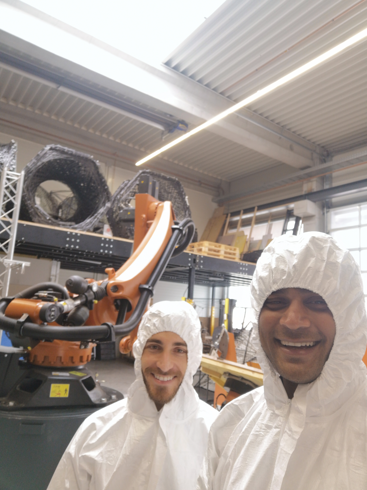
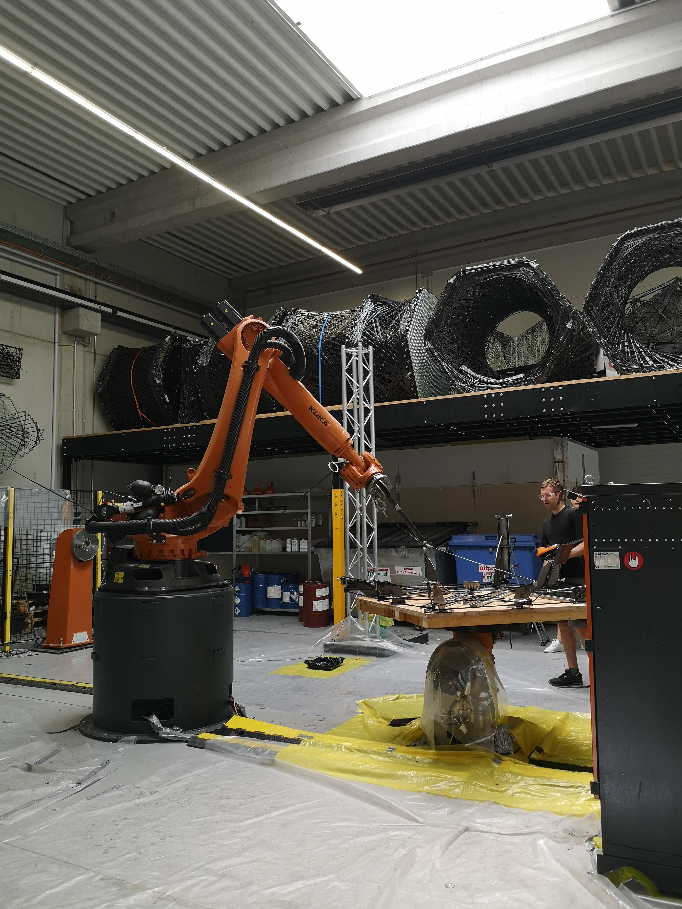
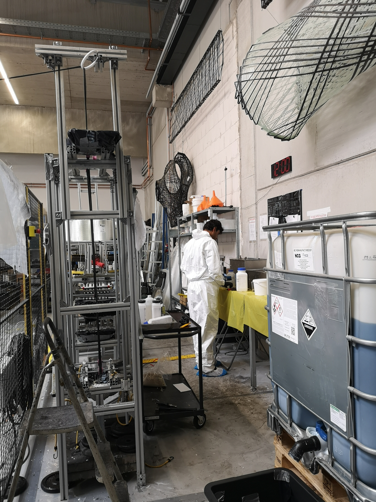
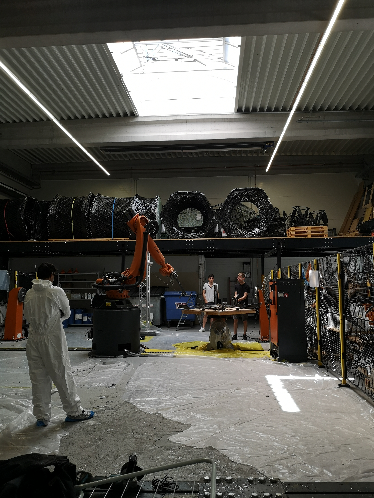

O enrolamento filamentar sem núcleo é uma técnica de fabricação em que um braço robótico enrola fibras embebidas em resina ao redor de uma estrutura para criar elementos estruturais leves e de alto desempenho — sem a necessidade de um molde sólido. O ICD e o ITKE da Universidade de Stuttgart têm sido pioneiros nessa tecnologia, produzindo pavilhões e demonstradores cada vez mais ambiciosos.

## O desafio

À medida que o braço robótico entrelaça as fibras em uma espécie de tecelagem tridimensional, a relação entre essas fibras se torna muito complexa e difícil de prever. Na época, não existia uma ferramenta computacional confiável para simular com precisão como as fibras interagiriam durante o processo de enrolamento. A pesquisa de Christoph Schlopschnat visava preencher essa lacuna.

## Meu papel

Auxiliei Christoph em sua investigação de métodos computacionais para prever a interação das fibras de carbono. Minhas responsabilidades incluíam:

- **Preparação da resina** — mistura e aplicação da resina que une as fibras de carbono. Isso exigia equipamento de proteção completo devido à toxicidade dos materiais.
- **Testes físicos em pequena escala** — execução de experimentos controlados de enrolamento para coletar dados sobre o comportamento das fibras.
- **Fotogrametria** — captura dos corpos de prova enrolados de múltiplos ângulos para criar gêmeos digitais para comparação com as previsões computacionais.

## Aprendizados

O aspecto mais memorável desse trabalho foi o manuseio da resina. A resina epóxi utilizada em compósitos de fibra de carbono é altamente tóxica, exigindo trajes de proteção completos, luvas e preparação cuidadosa do espaço de trabalho com coberturas protetoras. Foi uma introdução prática às realidades de se trabalhar com materiais compósitos avançados — um mundo à parte do lado computacional da pesquisa. E, sinceramente, a toxicidade do material foi algo que me desanimou bastante, razão pela qual acabei me afastando dessa linha de pesquisa. Mas foi uma experiência valiosa que me deu uma apreciação mais profunda das complexidades da ciência dos materiais na fabricação arquitetônica.
