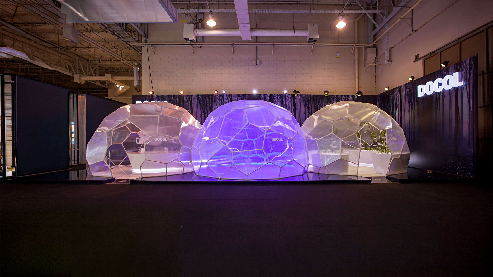
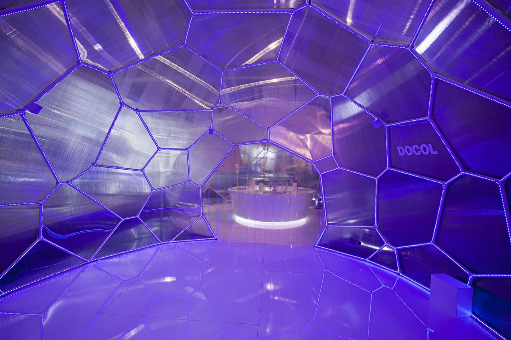
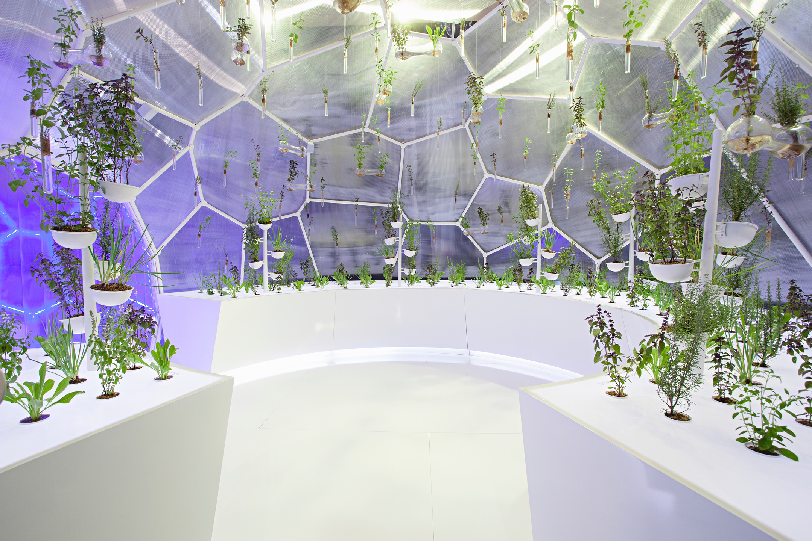
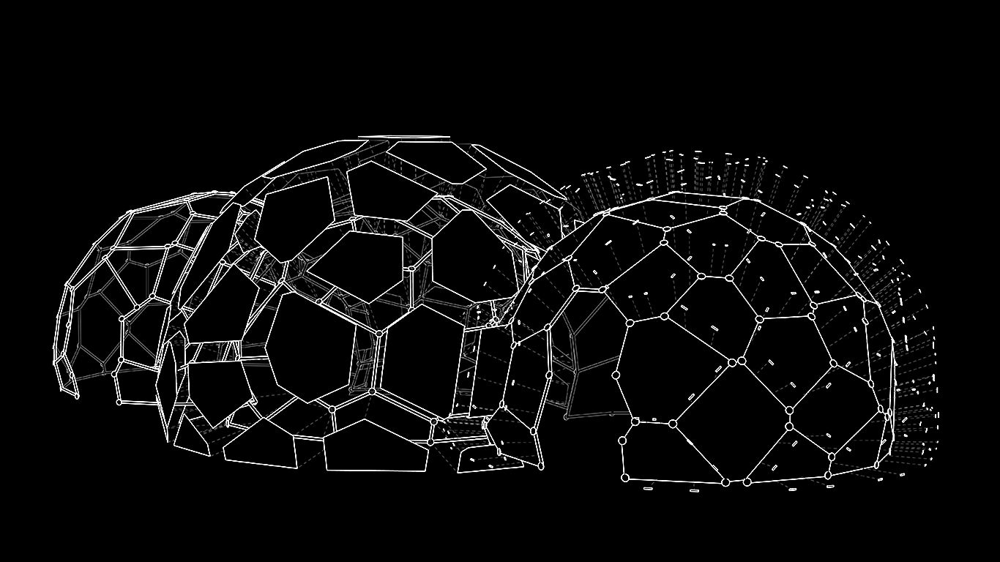

import YouTube from '@/components/YouTube.astro'

<YouTube id="MI3apyOKecs" title="Pavilhão O3 por Atelier Marko Brajovic para Docol" />

## Conceito
> Pavilhão O3 foi inspirado pela molécula trioxigênio do ozônio. Os três átomos de oxigênio se convertem em três espaços de experiência do pavilhão conceito da Docol.

## Design Computacional
O Pavilhão O3 foi idealizado pelo Atelier Marko Brajovic ao mesmo tempo em que eu dava meus primeiros passos no mundo do design computacional. Eu tinha acabado de me formar na FAU-USP com uma tese na qual aprendi todas as ferramentas necessárias para terminar este pavilhão: Rhino, Grasshopper 3D e Kangaroo Physics.
Meu papel neste projeto foi trabalhar na busca de formas e na produção de dados para fabricação digital.
### Busca de Formas
A busca de formas foi especialmente complicada na intersecção entre domos. Como cada domo tinha um formato único, as células Voronoi nas intersecções não combinavam. Eu tive que usar o plugin Kangaroo para forçar as células opostas do domo no mesmo formato. E ao fazer isso, o resto do pavilhão teve que relaxar, mantendo a planaridade dos domos.

### Fabricação
O processo de fabricação não estava em nossas mãos. Foi para uma empresa parceira no sul do Brasil: [Paleta Stands](https://paleta.com.br/). Houve um grande quebra-cabeça logístico na pré-fabricação e transporte do qual eu não fiz parte, infelizmente. É exatamente sobre isso que falo no artigo apresentado na conferência SIGraDi 2018 em São Carlos, Brasil.
Você pode conferir o artigo aqui:
[High-Low as Expression of The Brazilian Digital Fabrication](https://daniellocatelli.com/publications/high-low-as-expression-of-the-brazilian-digital-fabrication/)

