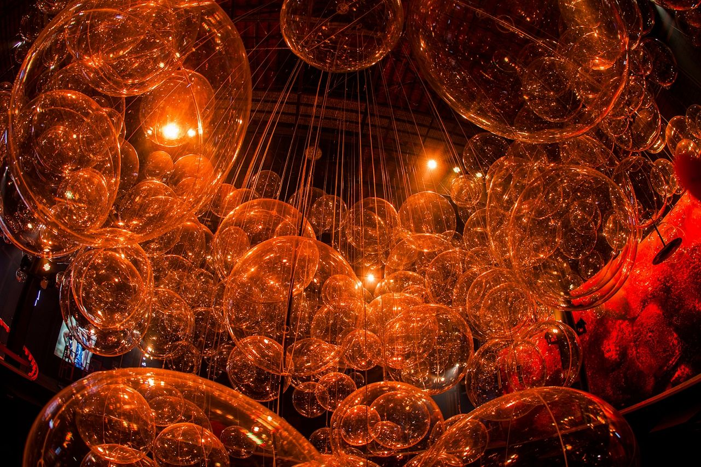

## Conceito

> Utilizamos mais de 500 esferas de acrílico transparente de diferentes tamanhos suspensas na estrutura do teto do armazém, cobrindo quase 1000m² e iluminadas para criar um efeito de movimento de efervescência ascendente. Sob a instalação principal de bolhas, diferentes ativações interativas e exposições entretêm o público e narram a história visual da empresa.

Parada Coca-Cola foi o primeiro projeto no qual apliquei design computacional. Essa experiência sensorial foi inspirada na garrafa da Coca-Cola, imitando as bolhas e cores da bebida. Também teve muitas outras ativações, como chamam nas agências de marketing no Brasil.

## Design Computacional
Meu papel no projeto foi o de posicionar as esferas de plástico parametricamente, evitando colidir umas com as outras e com os cabos que as conectavam ao teto. Para isso, usei o Grasshopper e o Galapagos.
Outra tarefa que veio depois foi gerar uma planilha com todos os comprimentos de cabos e as tags para organizar adequadamente todo o material para ser enviado e instalado. Bom, pelo menos essa era a ideia inicial. Porque, em algum momento, alguém achou que seria uma boa ideia remover as tags 🤯. Foi um pesadelo para as meninas que coordenaram o evento.

Este é o último arquivo Grasshopper que usei no projeto:

© Fotos por Fernando Martins
