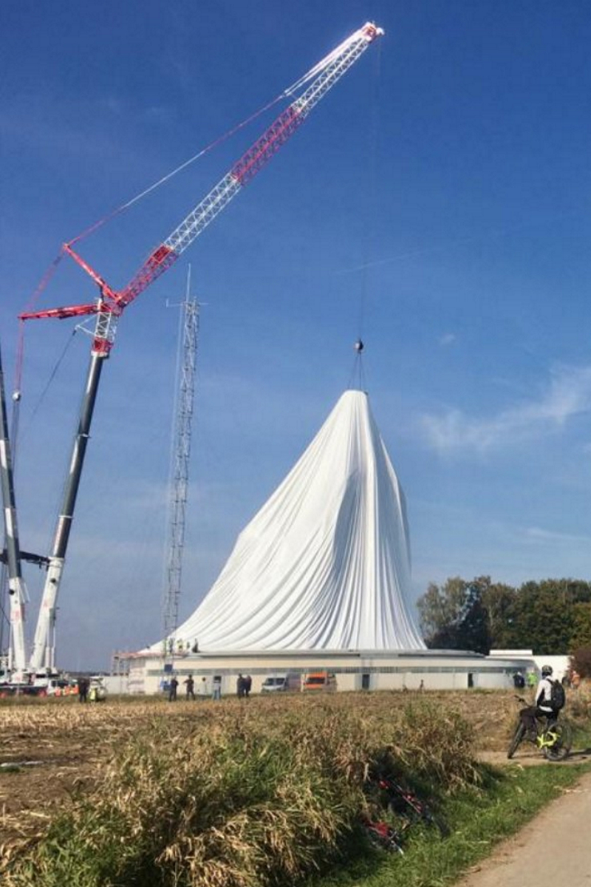

---
{
  "Cover": "/assets/content/projects/radom-raisting-by-ar-ingenieure/cover-cover.jpg",
  "CoverAlt": "Membrana da cúpula sendo entregue pelo guindaste.",
  "Description": "Para proteger uma antena parabólica das intempéries, AR Ingenieure projetou uma membrana esférica pré-esforçada de 48,8m de diâmetro e 34m de altura.",
  "Name": "Radom Raisting por AR Ingenieure",
  "Slug": "projects/radom-raisting-by-ar-ingenieure",
  "Tags": [
    "Computational Design",
    "Structural Analysis",
    "Logistics",
    "Grasshopper3D"
  ],
  "Authors": [
    "AR Ingenieure"
  ],
  "Category": "Membrane",
  "City": [
    "Raisting"
  ],
  "Client": "ITF Technical Fabrics GmbH",
  "DateStart": "2021-08-01",
  "Director": ["Alexander Hub"],
  "Team": ["Daniel Locatelli", "Grant Galloway"],
  "Development": ["Radom Raisting GmbH"],
  "Link": {
    "Text": "Radom Raisting at AR Ingenieure",
    "Href": "https://www.ar-ingenieure.com/projects/radom-raisting"
  }
}
---

<video controls preload="metadata" style="width: 100%; border-radius: 0.5rem;">
  <source src="/media/projects/radom-raisting-by-ar-ingenieure/deployment-sequence.mp4" type="video/mp4">
</video>

Deployment animation.

O cliente precisava cobrir uma de suas antenas parabólicas. A AR Ingenieure entrou na licitação com a proposta de um domo inflável entregue por guindaste. Alexander Hub foi o gerente de projeto, enquanto Grant Galloway foi o engenheiro computacional.
Minha função neste projeto foi a simulação da logística: o transporte e a montagem do domo inflável.
# Design Computacional
Fiz uso extensivo do Kangaroo Physics, um mecanismo física em tempo real para simulação interativa e busca de formas, tudo dentro do ambiente Rhino/Grasshopper. Foi necessário identificar as colisões entre a membrana e a antena para evitar rasgá-la durante a implantação.

© Photos and animation AR Ingenieure
