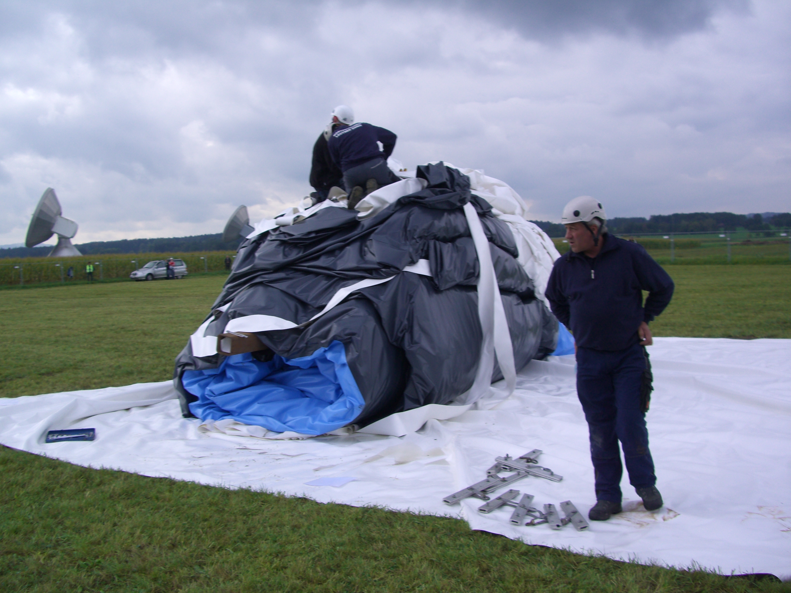
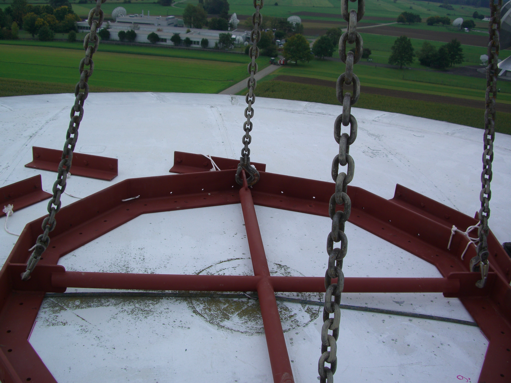
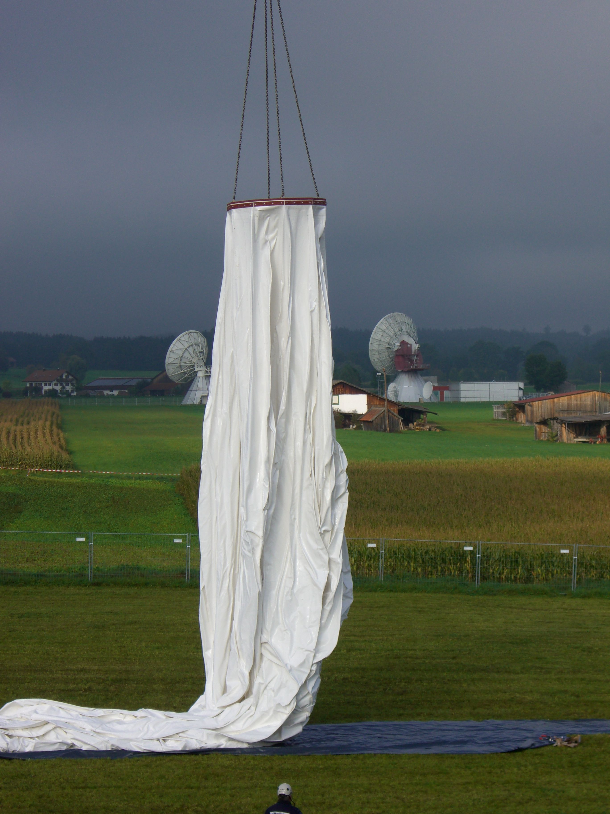
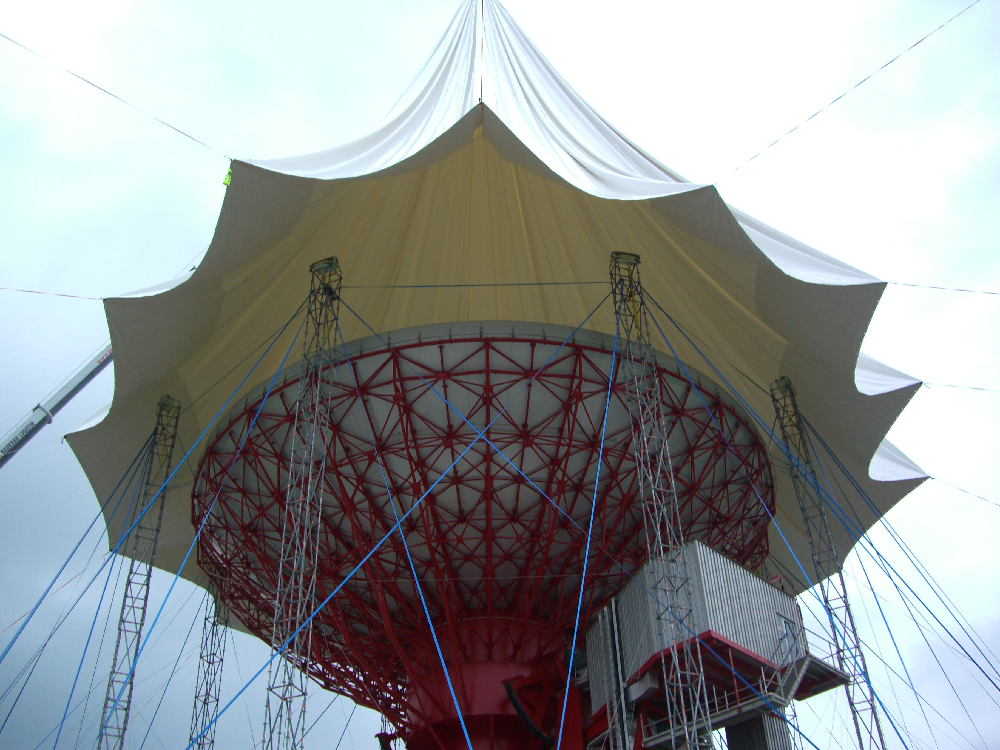
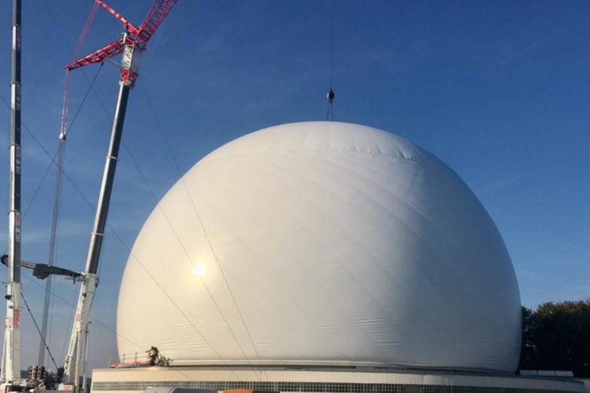

import Video from '@/components/Video.astro'

A estação terrestre de Raisting, na Baviera, Alemanha, abriga diversas grandes antenas parabólicas de satélite. Uma delas precisava de uma cobertura protetora (um radomo) para protegê-la do vento, da chuva e da neve. O cliente, ITF Technical Fabrics, procurou a AR Ingenieure com o desafio de engenharia: projetar uma cúpula de membrana inflável que pudesse ser entregue por guindaste e implantada sem colidir com a antena que deveria proteger.

## O desafio

Um radomo desta escala (48,8 metros de diâmetro e 34 metros de altura) é construído como uma seção esférica de membrana pneumaticamente pré-esforçada. A própria membrana é fabricada a partir de múltiplos painéis costurados, dobrados e transportados ao local. A questão crítica era: como desdobrar uma membrana massiva ao redor de uma antena delicada sem que o tecido se prenda na estrutura?

## Design computacional

Minha função foi simular toda a sequência de implantação usando Kangaroo Physics dentro do ambiente Rhino/Grasshopper. A simulação precisava modelar o comportamento da membrana enquanto ela se desdobrava de um fardo compacto até sua forma esférica final, verificando continuamente colisões com a antena parabólica abaixo.

A simulação foi executada iterativamente, testando diferentes padrões de dobra e velocidades de implantação para encontrar uma sequência que evitasse contato em todas as etapas. O motor de física em tempo real do Kangaroo foi essencial aqui: permitiu-me ajustar parâmetros interativamente e ver imediatamente os efeitos no comportamento da membrana.

<Video src="/media/projects/radom-raisting-by-ar-ingenieure/deployment-sequence.mp4" caption="Simulação da implantação mostrando a membrana se desdobrando ao redor da antena." />

## Implantação no local

A implantação real foi uma operação notável. A membrana dobrada foi levantada pelo guindaste e suspensa acima da antena. À medida que era baixada, os painéis se desdobravam sequencialmente, seguindo o padrão que havíamos validado na simulação.

© Fotos da AR Ingenieure
