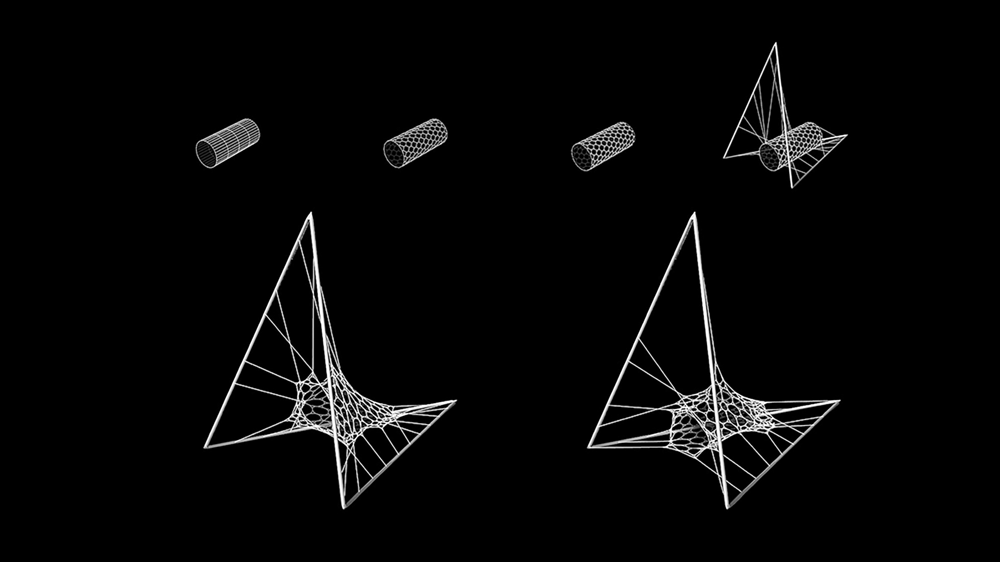
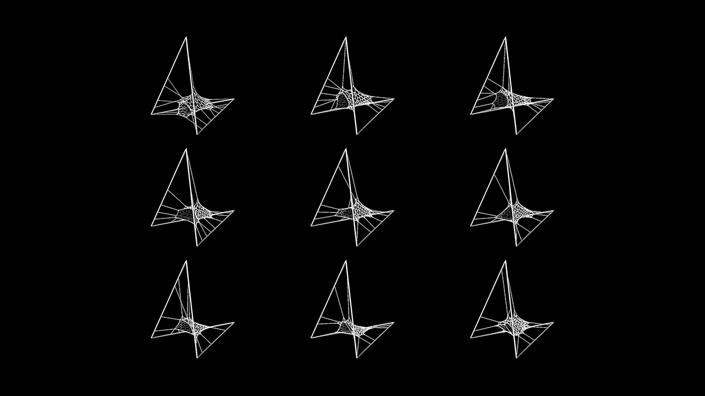
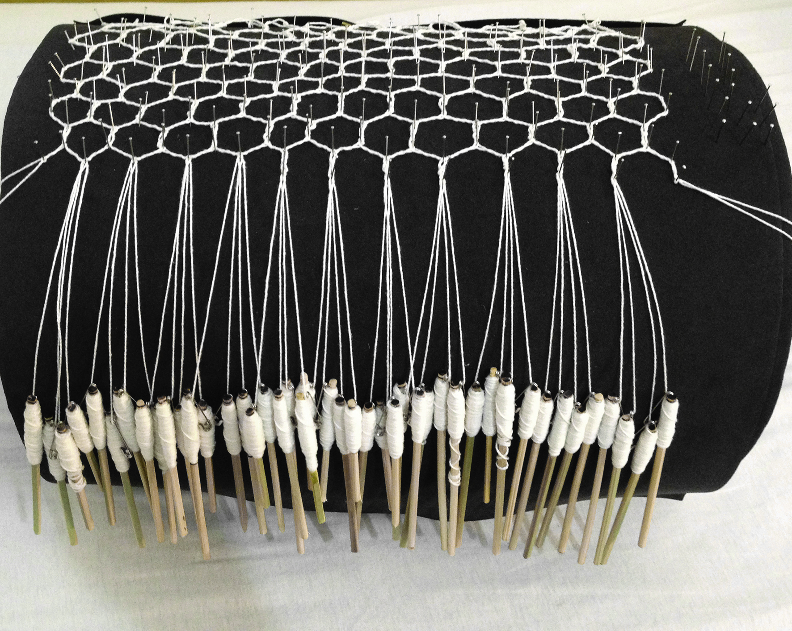
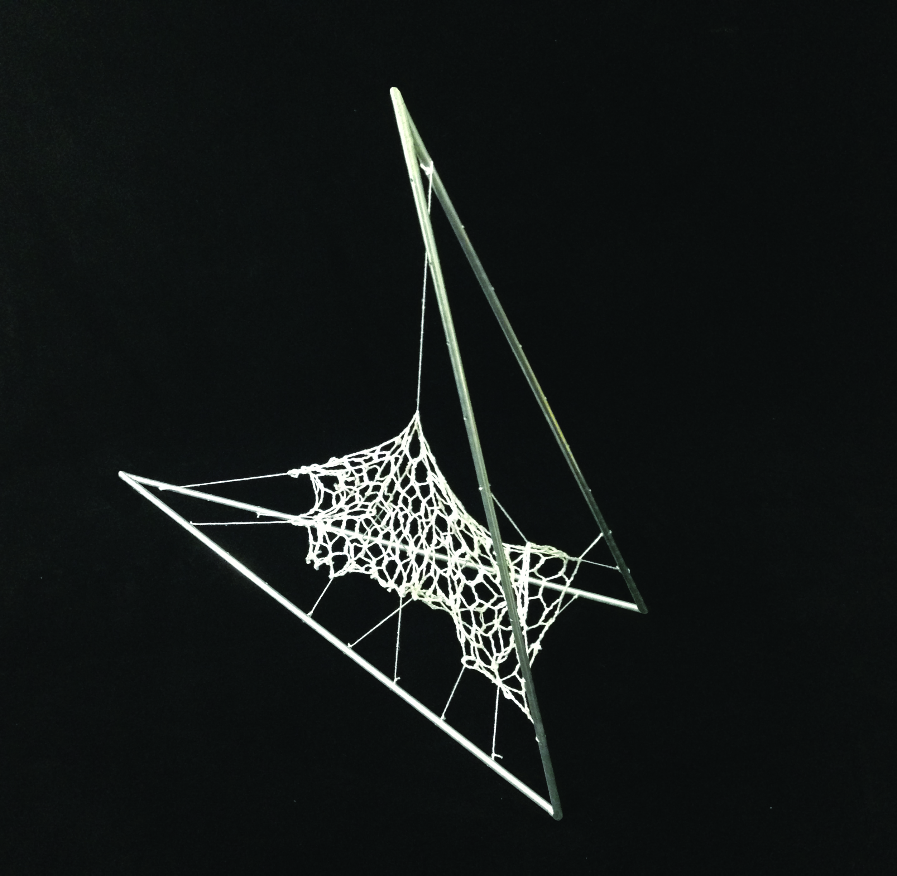
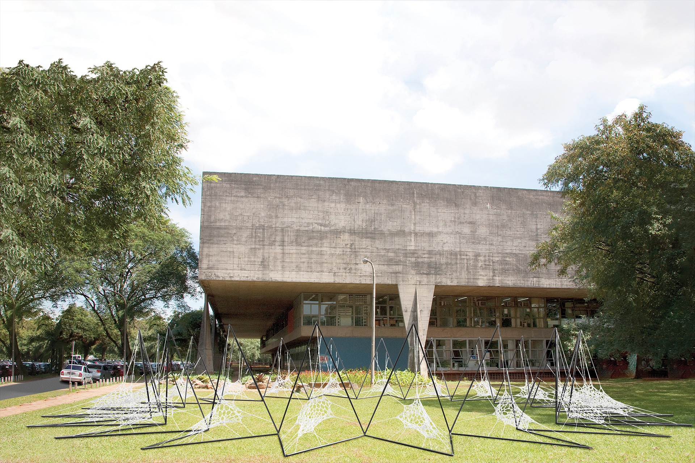

Dieses Paper untersucht die mögliche Anwendung digitaler Werkzeuge beim Entwerfen und Herstellen textiler Gewebe durch die kombinierte Nutzung von Formfindung und der traditionellen Klöppeltechnik.
Die Arbeit erforscht, wie eine traditionelle Handwerksmethode zu einem neuen Ansatz im Bereich des parametrischen und generativen Designs in Verbindung mit digitalen Fertigungstechnologien führen könnte. Die gesamte Untersuchung basiert auf mehreren Fallstudien renommierter Architekten, deren Arbeit von der Natur inspiriert ist, wie Buckminster Fuller und Frei Otto.
Diese Fallstudien analysieren deren Arbeit mittels Reverse Engineering unter Verwendung einer populären visuellen Programmiersprache, die für die meisten Fachleute zugänglich ist. Angesichts der wachsenden Bedeutung digitaler Prozesse im Design aufgrund ihrer schnellen und optimierten Ergebnisse ist es unerlässlich, dass sich Architekten an diesen neuen Workflow anpassen.
Diese Abschlussarbeit zeigt, wie Computational Design ein traditionelles und unerwartetes Thema mit großer räumlicher Kontrolle einbeziehen kann. Sie ist auch eine Einführung in den dynamischen Relaxationsprozess und eine mögliche Anwendung eines evolutionären Algorithmus in Architektur und Design. Der entwickelte Algorithmus wurde schließlich verwendet, um einen Prototyp eines hängemattenartigen Stuhls vorzuschlagen.

