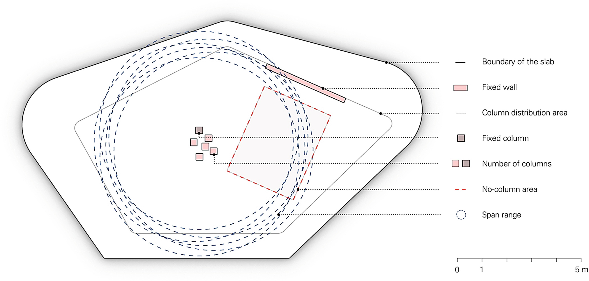

import Video from '@/components/Video.astro'

## Feedbackbasierte Entwurfsmethode für räumlich informierte und strukturell leistungsfähige Stützenplatzierung im Mehrgeschossbau
Dieses Paper präsentiert eine feedbackbasierte rechnerische Methode zur Platzierung von Stützen in der frühen Entwurfsphase komplexer Mehrgeschossbauten. Die Methode integriert einen Circle-Packing-Algorithmus, ein Federsystem und Tragwerksberechnungen in einem einzigen Skript für die reziproke und informierte Anordnung von Stützen im Raum. Während sie den Nutzern einen explorativen Ansatz ermöglicht, erschließt sie vielfältige Potenziale im Mehrgeschossbau, einschließlich zusätzlicher auskragender Flächen am Rand, erhöhter Raumqualitäten mit großen Spannweiten, multidirektionaler Tragwerksanordnungen und Mehrzwecknutzung des Raums.

<Video src="/media/publications/automatic-column-placement/parcticle-spring-system-column-placement.mp4" />

