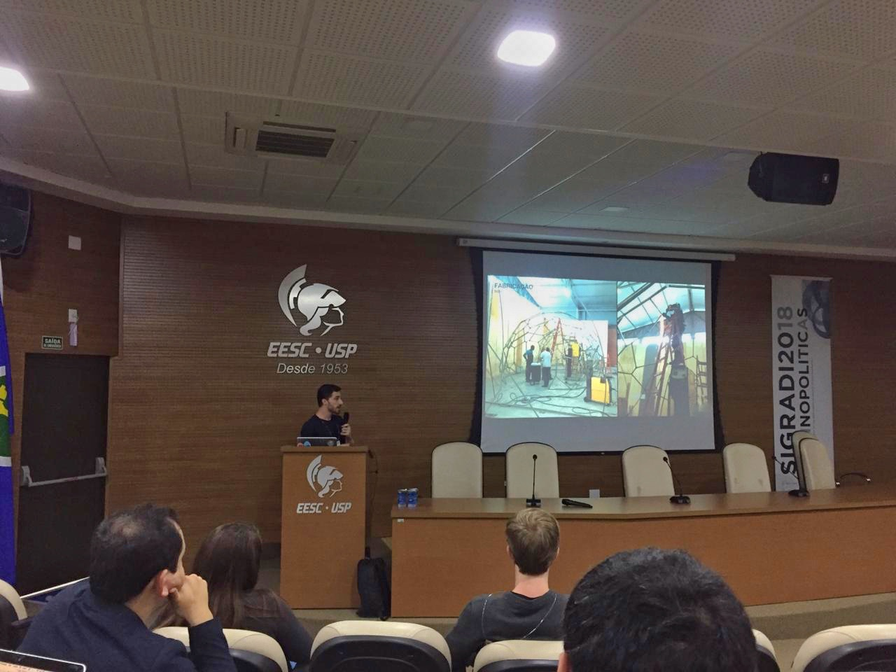

import Video from '@/components/Video.astro'

## Zusammenfassung

Dieses Paper ist das Ergebnis einer Untersuchung über den Einfluss digitaler Prozesse im Design und ihre Bedeutung für Innovation in der ephemeren Architektur durch das Konzept High-Low. Die ephemere Architektur hat das Potenzial, akademisches und künstlerisches Wissen mit der brasilianischen kommerziellen Produktion zu verbinden. Hier wird eine experimentelle Fallstudie vorgestellt, die für die Expo Revestir für Docol im Jahr 2017 entworfen wurde und das Paradigma des Computational Design mit dem akademischen Feld und realisierbaren kommerziellen Anwendungen in Einklang bringt.

## Einleitung

Die Art zu leben und die Welt zu bewohnen hat im Laufe der Geschichte eine große Transformation erfahren, da Innovationen sich mit der lokalen Kultur in der globalisierten Welt verbanden. Vor allem nach der Mitte des zwanzigsten Jahrhunderts transformierte die Bevölkerungsexplosion die urbane Umgebung mit neuen Produktionstechnologien, um aufkommende Probleme zu bewältigen. Als Folge einer globalisierten Welt voller Innovationen können auch die Prozesse des Entwurfs und der Ausführung von Architektur als Entwicklungen genannt werden, die durch verfügbare Technologien stattfanden.

Wie Rivka Oxman (2006) vorschlug, als sie „Theory and Design in the First Digital Age" schrieb, wurde der klassische Entwurfsprozess zuvor als Analyse, Synthese, Bewertung und Entscheidung verstanden; während er in einer digital vermittelten Umgebung die Phasen Generierung, Repräsentation, Evaluation und Performance durchläuft. Diese Veränderung in der Entwurfsvermittlung geschieht nach großen Transformationen, die in der Fertigung mit der Einführung numerisch gesteuerter Maschinen stattfanden, die die gesamte Produktionslinie der Luft-, Schiff- und Automobilindustrie kontrollierten. Die konkrete Ausprägung dieser Technologien in der Architektur geschieht jedoch gemäß der politischen, sozialen, wirtschaftlichen und kulturellen Realität jeder Region.

Seit den 1950er Jahren haben Computer bei der Produktion komplexer Flugzeugteile assistiert. Für Gabriela Carneiro (2014) ist der Computer wie ein Partner des Architekten bei der Formulierung und Generierung von Räumen. „Mehr als Formmodellierung, von ihren Erscheinungen her, war der Fokus des Architekten stets, in der Architektur das Potenzial des Computers zur Simulation natürlicher Prozesse einzusetzen" (Carneiro, 2014, S. 87). Verantwortlich für die Einführung der Computation in die architektonische Praxis, nutzten die ersten Generationen von *Computer Aided Design* (CAD-Software) die digitale Umgebung als eine Art elektronisches Zeichenbrett (anstatt den Computer als Assistenten im kreativen Prozess zu nutzen, wurde er lediglich als grafisches Darstellungswerkzeug eingesetzt), wie Araújo (2018) feststellte.

Für Sedrez (2018) gab es vor der Industrialisierung des Bauens eine Wertschätzung komplexer Formen, wenn handwerkliche Methoden die Architektur bestimmten; in der Nachkriegszeit jedoch erfuhr die Fertigung von Architektur große Veränderungen, und es war dieser Wandel, der als eine der Grundlagen der Moderne bezeichnet wurde. Dies war die Periode, in der ideologische Leitlinien aufkamen, die einfache Formen verteidigten (aufgrund der Vereinfachung und Beschleunigung der architektonischen Fertigung). So war dies ein bestimmender Faktor, der das Verschwinden komplexer Formen katalysierte.

Mit der Weiterentwicklung der Computer und der Zunahme an Geschwindigkeit und Kapazität der Datenverarbeitung begann die digitale Umgebung auch Entwurfsprozesse zu unterstützen, in dem, was als *Digital Design* bekannt wurde. Die Verteidigung dieses neuen Forschungsgebiets wurde von Vorreitern wie William Mitchell in seinem antitektonischen Manifest sowie Rivka und Robert Oxman angeführt, die den neuen Strukturalismus vertraten (der die Reihenfolge des Entwurfsprozesses von Form zu Struktur zu Material umkehrte, hin zu Material zu Struktur und Form), neben mehreren anderen Autoren von gleicher Bedeutung.

In dieser neuen Art, über den digitalen Entwurfsprozess nachzudenken, wurde der Computer neben der Zeichnungsproduktion auch zur Lösung logischer Probleme eingesetzt, die mit dem Entwurfsprozess verknüpft waren. Diese Softwarewerkzeuge, die die architektonische Konzeption unterstützten, eröffneten neue Möglichkeiten, indem sie den Entwurf und die Konstruktion komplexer Formen ermöglichten, die bis vor Kurzem schwierig und teuer zu entwerfen, zu produzieren und mit traditionellen Bautechnologien zusammenzubauen waren. Durch vier industrielle Revolutionen – die Dampfmaschine, die Massenproduktion, die Massenfertigung mit CNC-Maschinen – und Industrie 4.0 wurde eine neue Tradition durch digitale Technologien etabliert, um das Projekt direkt mit der Baustelle zu verbinden.

Vor dem Beginn der Digitalisierung des kreativen architektonischen Prozesses wurde die Entwurfspraxis sowohl für die manuelle als auch für die mechanische Fertigung entwickelt. Durch den Prozess des digitalen Entwurfs und der digitalen Fertigung, hier definiert als die Produktion physischer Objekte aus digitalen Modellen (Tramontano, 2016), gewann die Architektur eine hybride Ebene der Materialisierung, die sich nicht der endlosen Wiederholung unterwerfen muss, um die Produktion zu erleichtern. So übernimmt man durch diesen Prozess die Idee einer Produktion, bei der die digitale Projektdatei direkt an die Industrie gesendet und dort produziert wird, ein Prozess, der als *File-to-Factory* bekannt ist (Tramontano; Soares, 2012). Jede handwerkliche Technik wird innerhalb dieser Sphäre durch Prozessoren und Maschinen neu gedacht, um den Formprozess zu optimieren und seine Möglichkeiten zu erweitern. Auf diese Weise gelingt es der digitalen Fertigung, ein extrem hohes Maß an Formdefinition zu erreichen, das der menschlichen Fähigkeit weit überlegen ist, wenn wir von komplexen Geometrien sprechen, die in Serie mit Präzision produziert werden.

Andererseits ist die Ausbildung eines Architekten in Brasilien sehr umfassend und ermöglicht ein breites Praxisfeld. Der Hochbau, der einer seiner Hauptfokusse ist, neigt zu langen Ausführungszeiten und wenig Offenheit für Erkundung und Erprobung neuer Techniken und Entwurfsmethoden. Gegenwärtig gibt es jedoch „eine langsame, aber unumkehrbare Veränderung in den Produktionsprozessen des Bauens, die aus der Expansion industrieller Prozesse resultiert, nun verstärkt durch das Aufkommen der Computerisierung" (Tramontano, 2016, S. 01). Technologie wurde stets autonom und isoliert gedacht, als Avantgarde von Zukünften und offensichtlichen Lösungen für Probleme, die wir noch nicht kennen. In diesem Szenario gelingt es der ephemeren Architektur, digitale Entwurfsmethoden einzubeziehen, weil sie im Allgemeinen Einzelstücke mit einem hohen Komplexitätsgrad im Vergleich zum traditionellen Bauen produziert. Darüber hinaus sind in diesem Bereich die Zeiträume für die Projektentwicklung und den Bau, die zwischen 1 und 6 Monaten variieren, tendenziell kürzer und mit einem hohen Budget verbunden. In einem typischen ephemeren Architekturprojekt für Veranstaltungen erzeugt die Effizienz in allen Entwicklungsphasen Druck aufgrund der kurzen Frist und hohen Kosten. Auf diese Weise erweist sich dieser Bereich als natürlich fruchtbares Feld für die Entwicklung und Anwendung digitaler Entwurfs- und Fertigungsmethoden.

## High-Low

Laut SUBdV (2017) entsteht der Begriff *High-Low* aus der Vereinigung zweier Konzepte, wobei *High* die Technologie repräsentiert, die für die Generierung von Architektur durch Computation verwendet wird, und *Low* die produzierten Anweisungen, damit ungelernte Arbeitskräfte mit digitaler Fertigung bauen können. In einem ihrer Projekte, CoBLOgó, wurden beispielsweise Positionierungshilfen für die Teile aus einem parametrischen Skript exportiert. Diese Hilfen wurden mit Laserschneidmaschinen aus Kartonmaterial geschnitten und auf einem ebenfalls digital mit einer CNC-Fräse gefertigten Regal platziert, wobei der Vorarbeiter die Blöcke nur neben die Hilfen und die verschränkten Latten für die strukturelle Integrität platzieren musste. Kurz gesagt illustriert dieser Prozess, der parametrisches Design und digitale Fertigung mit einfachen Bautechniken und lokalen Materialien auf der Baustelle vereint, den Prozess namens High-Low (SUBdV, 2017). Dieses Mittel, das Hochtechnologie (parametrische Computation und digitale Fertigung) mit Niedrigtechnologie-Baumethoden und günstigen lokalen Materialien kombiniert, kann eine neue brasilianische Identität im digitalen Design schaffen, um der wachsenden allgegenwärtigen und generischen Tendenz zeitgenössischer parametrischer Ästhetik zu entkommen (SUBdV apud Rojas, 2017).

Basierend auf dem Denken von Anne Save de Beaurecueil ist die geringe Anzahl von Universitäten, die mit digitaler Fertigung und parametrischer Architektur arbeiten, eines der Probleme in der Architektenausbildung in Brasilien, das die Verzögerung bei der Industrialisierung des architektonischen Bauens mit Präzision verursacht. „Wenn Architekten keine neuen Techniken verwenden, werden sie die Bauindustrie nicht unter Druck setzen, sich zu verändern. [...] also denke ich, dass man, um wirklich im Bauwesen voranzukommen, bei den Studierenden beginnen muss, denn sie werden die Industrie unter Druck setzen, sie werden die Industrie inspirieren" (Celani, Sedrez, 2013). High-Low ist somit ein Weg zu innovieren, nicht nur indem man wiederholt, was auf der internationalen Bühne geschieht, sondern indem man brasilianische Architektur und Kultur mit der neuen Technologie aus dem Ausland vereint.

## Fallstudie: Docol-Pavillon 2017

### Erste Phase — Konzeptentwurf

Die erste Phase war der konzeptionelle Entwurf, in dem die Neuheiten der Unternehmensprodukte und deren Marktpositionierung untersucht wurden. So entstand die Idee, die neue Linie von Ozonarmaturen mit dem Konzept zu verbinden. Wenn Ozon mit Wasser gemischt wird, verleiht es hygienische Eigenschaften wie die Bekämpfung von Mikroorganismen und die Beseitigung starker Gerüche, ohne jedoch die Umwelt zu schädigen. Es wurde dann festgelegt, dass die endgültige Struktur des Docol-Pavillons auf das Ozonmolekül verweisen sollte, also drei miteinander verbundene Sauerstoffatome. Die endgültige Form sollte dann aus drei sich schneidenden Kuppeln bestehen, die Hülle sollte Alveoar-Polycarbonat verwenden, und die Kuppeln sollten ein Voronoi-Diagramm nachahmen, das heißt, die Oberflächen dieser drei Kuppeln sollten mit Voronoi-Zellen „beschichtet" sein. Das Konzept ist somit das Ergebnis des Dialogs zwischen einer Idee, die sich mit der Marke verbindet, und einem effizienten konstruktiven System.

Dieses Ergebnis wurde durch einen nichtlinearen Entwurfsprozess erreicht, der Iterationen durchlief, um zum Endprodukt zu gelangen. Das heißt, es gab einen Untersuchungsprozess verschiedener Einflussfaktoren, die sich durch das Feedback mehrerer Zwischentests schrittweise verbanden. Im Atelier Marko Brajovic versteht man, dass im Entwurfsprozess „es keine Rolle spielt, ob man von oben nach unten oder von unten nach oben beginnt. Wenn man den gesamten Zyklus durchläuft, muss er beide Ansätze kombinieren" (Wallisser, 2018, S. 198 bis 205). Als Ergebnis ist die Hierarchie der Geometrien hier klar, und sie kann je nach den Anforderungen der nächsten Phase variieren.

<Video autoplay src="/media/publications/high-low-as-expression-of-the-brazilian-digital-fabrication/o3-pavilion-kangaroo-relaxation-upscaled.mp4" caption="Parametrisches Modell nach Kangaroo-Relaxation" />

### Zweite Phase — Generatives System

In dieser Phase, mit konsolidiertem Konzept, lag der Fokus auf der Generierung eines realisierbaren Projekts, das den Anforderungen des Kunden entsprach. Dafür war die Verwendung der Software Rhinoceros und ihres visuellen Programmier-Plug-ins Grasshopper grundlegend. Der Modellierungsprozess begann mit der Parametrisierung dreier Halbkugeln, begrenzt durch das für die Veranstaltung vorgesehene Volumen, mit Teilen, die sich überlappten, und mit Parametern, die die Änderung des Radius, den Abstand der Kugeln zum Boden, die Position jeder Kugel usw. ermöglichten.

Für die Entwicklung der Hülle wurde die Verschneidung zwischen den Halbkugeln mit einem 3D-Voronoi-Muster verwendet. Dies erzeugte ein gekrümmtes Voronoi-Muster, das der Form der drei Halbkugeln folgte. Für den nächsten Schritt war es notwendig, dieses Voronoi-Muster abzuflachen, um flache Platten zu erhalten, die perfekt passten und für den Laserschnitt bereit waren. Das Grasshopper-Plugin namens Kangaroo wurde dann verwendet, das durch eine dynamische Relaxationsmethode die notwendigen Abmessungen für jede Kuppelkante berechnet, sodass alle Voronoi-Zellen abgeflacht wurden.

Während dieses Prozesses wurde jedoch festgestellt, dass an der Stelle, wo sich die Kugeln schneiden, die Kanten die gleiche Größe und Position beibehalten müssen, während die Fließfähigkeit der Form erhalten bleibt und das Voronoi-Muster nicht verloren geht. Der Algorithmus wurde dann so entwickelt, dass während des Abflachungsprozesses der Zellen die Kanten der Verschneidungen zum Ausgleich gezwungen wurden.

Aus dieser Basisgeometrie wurden die dreidimensionalen Elemente erstellt. Die Platten erhielten Dicke und die Stäbe erhielten Durchmesser. Es war auch möglich, Verbindungsmöglichkeiten zu schaffen, die durch digitale Fertigung hergestellt werden konnten, wie zum Beispiel 3D-Druck.

<Video autoplay src="/media/publications/high-low-as-expression-of-the-brazilian-digital-fabrication/o3-pavilion-assembly-sequence-padded.mp4" caption="Montagesequenz der Paneele" />

### Dritte Phase — Fertigung

Die dritte Phase war die Konstruktion des Projekts selbst. In dieser Phase wurde ein weiteres Unternehmen beauftragt: Paleta Stands, ansässig in der Stadt Joinville in Santa Catarina. Sie waren verantwortlich für das Prototyping und die Fertigung des Pavillons, was den Verlust der Kontrolle über den Fertigungsprozess bedeutete, der während der Programmier- und Geometriekonsolidierungsphase durch digitales Design vorgesehen war. Das Unternehmen verfügte über alle Dokumentationen und Dateien, die für die Produktion des Pavillons ausschließlich mit digitalen Fertigungsmethoden erforderlich waren. Die bereitgestellten Anweisungen ermöglichten ihnen jedoch eine große Flexibilität, das Projekt auf die optimierteste Weise zu lösen, unter Berücksichtigung der verfügbaren Technologie, Kosten und Arbeitskraft.

Während technischer Besuche zur Begleitung der Projektentwicklung wurde festgestellt, dass der Fertigungsprozess eine Vielzahl von Methoden vermischt hatte. Das Schneiden der Alveoar-Polycarbonatplatten erfolgte mit Laserschneidmaschinen, die hohe Präzision und eine hochwertige Endoberfläche garantierten.

Für die Produktion des Metallskeletts wurde ein Team traditioneller Schmiede beauftragt, die es nicht gewohnt waren, ein Projekt von solcher formaler Komplexität zu produzieren. Ihnen wurden nur die Abmessungen der Metallstäbe und Perspektiven mit ordnungsgemäß beschrifteten Stäben gegeben. Die Schmiede begannen, die Teile der Basis im allgemeinen Grundriss zu schweißen, aber für die folgenden Stäbe hatten sie keine räumlichen Referenzen, um den Schweißprozess zu führen. So war es eine immense Arbeit von Versuch und Irrtum, denn während die Stäbe geschweißt wurden, stellten sie fest, dass die nächsten Stäbe auf der Liste nicht genau wie in den Zeichnungen angegeben passten. Es war dann notwendig, die vorherigen Teile zu sägen, um sie neu anzuordnen, damit die nächsten an den vorgesehenen Stellen passten. Das Projekt konnte von den Schmieden erst klarer verstanden werden, als wir ihnen während eines der technischen Besuche ein physisches Modell im Maßstab 1:10 zeigten.

Dieser Prozess, der einem Puzzle glich, verursachte letztendlich Verzerrungen in den Voronoi-Zellen, die während der Entwurfsphase abgeflacht worden waren. Jede Zelle wies schließlich Doppelkrümmungen auf, die durch die Flexibilität des Alveoar-Polycarbonats kompensiert wurden. Dies erzeugte verzerrte Reflexionen auf der Hüllenoberfläche, die in Abbildung 7 zu erkennen sind. Dieses ästhetische Ergebnis war anfangs nicht vorgesehen, wurde aber als natürlicher Aspekt dieser Art handwerklicher Fertigung absorbiert und akzeptiert.

Neben der durch Schweißen erzeugten Unregelmäßigkeiten auf der Hüllenoberfläche war es notwendig, den Pavillon zu segmentieren (Abbildung 6), damit er in einem Lkw mit maximalen Abmessungen von 8,5 x 2,4 m x 2,5 m (Breite, Länge und Höhe) transportiert werden konnte. Dies verursachte einige weitere kleine Inkonsistenzen im Laufe des Prozesses, aber nichts, was das Endergebnis tatsächlich beeinträchtigte.

## Fazit

Architekten erleben einen radikalen Wandel in der Methode des Entwurfs und der Fertigung von Gebäuden. Die Frage ist nicht mehr, ob der Beruf sich diesen neuen Technologien anschließen wird oder nicht. Sondern wie wir sie verschmelzen und nutzen können, ohne die verfügbaren traditionellen Methoden zu ignorieren. Wie Gaudí physische Modelle verwendete, um mit seinen Handwerkern zu kommunizieren, erwies sich in dieser Studie diese Didaktik der Annäherung der digitalen Umgebung an traditionelle Schmiede als sehr nützlich.

Das Entwerfen mit einem generativen System ermöglichte in dieser Fallstudie eine große Flexibilität bei der Entscheidungsfindung und bei der Änderung der Abmessungen jeder Kuppel und jeder Voronoi-Zelle mit nur wenigen Klicks. Das bedeutet, dass die Dokumentation automatisch aktualisiert wurde, wobei das Format und die Abmessungen jeder Polycarbonatplatte, die Länge jedes Metallstabs und die Position der Fundamente auf dem Boden dynamisch generiert wurden, ohne manuelle Nacharbeit.

Schließlich wird die Notwendigkeit deutlich, dass Architekten innovative Lösungen in der Art und Weise suchen, wie Architektur gemacht wird, da diese Nachfrage darüber bestimmen wird, ob es Zulieferer und Arbeitskräfte mit dem erforderlichen Wissen geben wird, um den aktuellen Stand der Architektur in Brasilien voranzubringen.

### Literaturverzeichnis
- ARAÚJO, A. L. Autômatos celulares: Definição e aplicações na arquitetura. In: CELANI, M. G. C.; SEDREZ, M. (Orgs.). Arquitetura contemporânea e automação: prática e reflexão. São Paulo: ProBooks, 2018. P. 68 a 84.
- CARNEIRO, Gabriela. Arquitetura interativa: contextos, fundamentos e design. 2014. Tese (Doutorado em Design e Arquitetura) – Faculdade de Arquitetura e Urbanismo, Universidade de São Paulo, São Paulo, 2014.
- CELANI, M. G. C.; SEDREZ, M. (Organizadores). Arquitetura contemporânea e automação: prática e reflexão. São Paulo: ProBooks, 2018.
- CELANI, M. G. C.; SEDREZ, M. Arquitetura responsiva. Entrevista com Anne Save de Beaurecueil. In: CELANI, M. G. C.; SEDREZ, M. (Organizadores). Arquitetura contemporânea e automação: prática e reflexão. São Paulo: ProBooks, 2018. p. 174 a 181.
- CELANI, Gabriela; SEDREZ, Maycon. Entrevista com Anne Save de Beaurecueil. Entrevista, São Paulo, ano 14, n. 055.01, Vitruvius, jul. 2013. Available: [http://www.vitruvius.com.br/revistas/read/entrevista/14.055/4776](http://www.vitruvius.com.br/revistas/read/entrevista/14.055/4776).
- OXMAN, Rivka (2006) "Theory and Design in the First Digital Age" Design Studies, Vol. 27 No. 3 pp. 229 - 265
- PIKER, Daniel. Kangaroo: Form finding with computational physics. Architectural Design, 2013; 83(2); 136-137
- ROJAS, Cristobal. "CoBLOgó / SUBdV" 5 Ago. 2017. Download CAD Blocks, Drawings, Details, 3D, PSD Blocks. Available: [https://www.caddownloadweb.com/coblogo-subdv/](https://www.caddownloadweb.com/coblogo-subdv/). Acesso em 23 Jun. 2018.
- SEDREZ, M. e MARTINO, J. A. Sistemas Generativos. In: CELANI, M. G. C.; SEDREZ, M. (Orgs.). Arquitetura contemporânea e automação: prática e reflexão. São Paulo: ProBooks, 2018. P. 55 a 68.
- SUBdV. "CoBLOgó / SUBdV" 26 Jun 2017. ArchDaily Brasil. Available: [https://www.archdaily.com.br/br/874036/coblogo-subdv](https://www.archdaily.com.br/br/874036/coblogo-subdv) ISSN 0719-8906. Acesso 16 Jun. 2018.
- TEDESCHI, A. AAD\_Algorithms-Aided Design: Parametric Strategies using Grasshopper, Italy: Le Penseur, 2014.
- TRAMONTANO, Marcelo; SOARES, João Paulo. Arquitetura emergente, design paramétricos e o representar através de modelos de informação. V!RUS, São Carlos, n. 8, dez. 2012. Available: [https://www.nomads.usp.br/virus/virus08/?sec=6&item=1&lang=pt](https://www.nomads.usp.br/virus/virus08/?sec=6&item=1&lang=pt). Acesso em: 26 jul. 2016.
- TRAMONTANO, Marcelo. Quando pesquisa e ensino se conectam. Design paramétrico, fabricação digital e projeto de arquitetura. Arquitextos, São Paulo, ano 16, n. 190.01, Vitruvius, mar. 2016. Available: [http://www.vitruvius.com.br/revistas/read/arquitextos/16.190/5988](http://www.vitruvius.com.br/revistas/read/arquitextos/16.190/5988). Acesso em: 21 jun. 2016.
