## Abstract

This paper investigates the potential application of digital tools into the design and fabrication of textile weave through the combined use of form finding and the traditional technique of bobbin lace. The work explores how a traditional handcrafted method could lead to a new approach surrounding parametric and generative design in conjunction with digital fabrication technologies. The complete investigation is grounded on several case studies of renowned architects that have their work inspired by nature, such as Buckminster Fuller and Frei Otto. These case studies tried to reverse engineering their work using a popular visual programing language, accessible to most professionals. Considering the growing importance of digital processes in design due to its fast and optimized results, it is imperative that architects adapt to this new workflow. This is an attempt to show how computational design could incorporate a traditional and unexpected subject with great spatial control. It is also an introduction to the process of dynamic relaxation and a possible application of an evolutionary algorithm in architecture and design. Finally, the algorithm developed was used to propose a hammock-like chair prototype.

## Introduction

For many decades, urban development has used raw resources in such a way that it will not be possible to continue sustaining these excesses for a long time (Fry [4]). It is estimated, for example, that the civil construction in Brazil produces around 50 to 70% of the entire mass of urban solid waste in the country alone, according to Fernandez [3].

As observed by Kieran and Timberlake [5] in their book *Refabricating Architecture* at present there is a modus operandi very similar to the processes in which the architecture of an earlier period was developed. This is because, according to these authors, the architectural production today still takes many years to design and build. In addition, the construction still demands a massive quantity of materials, what could lead to depletion of resources.

These authors state that the architects who are able to understand this context, compare it with the advances in the design and fabrication of automobiles, airplanes and boats. In these field there are enormous possibilities of new materials and processes in which the waste, the cost, and the time of manufacturing decrease with the quality improving.

Algorithmic architecture is an area in full development that tries to tackle this lack of technology in the architecture, engineering and construction (AEC) industries. Traditionally, the word algorithm refers to the process of dealing with a problem by following a finite number of steps. However, nowadays, an algorithm can be understood as the mediator between the human mind and the processing power of the computer (Terzidis [9]).

In this paper, we propose an installation at the Faculty of Architecture and Urbanism at the University of São Paulo, using computational design methods. To make it viable we adopted a simple brief, so that it allowed creating and improving many algorithms throughout the research.

The bibliography was selected in order to allow an overview of the most recent studies in computational design technology. After researching precedents, it was noticed that most of the design converged with biomimicry. Consequently, this present study developed the same approach, as it incorporates the same philosophical and logical basis of renowned architects: Achim Menges, Buckminster Fuller, Frei Otto and Tomas Saraceno.

Buckminster Fuller and Frei Otto were especially important to this study. Buckminster with his studies of synergetic geometry tried to explore the potential of optimization in the design, resulting in inventions like the geodesic dome and the Jitterbug Transformation that "do the most with the least" (Krausse and Lichtenstein [6]). Frei Otto, on the other hand, produced his famous form-finding investigation models that explored physical qualities like foam film, rubber and tensile structures (Barthel [1]).

import ImageRow from '@/components/ImageRow.astro'

## Architecture and Biomimicry

<ImageRow>
  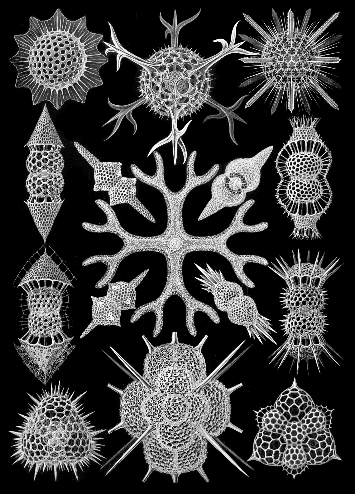

  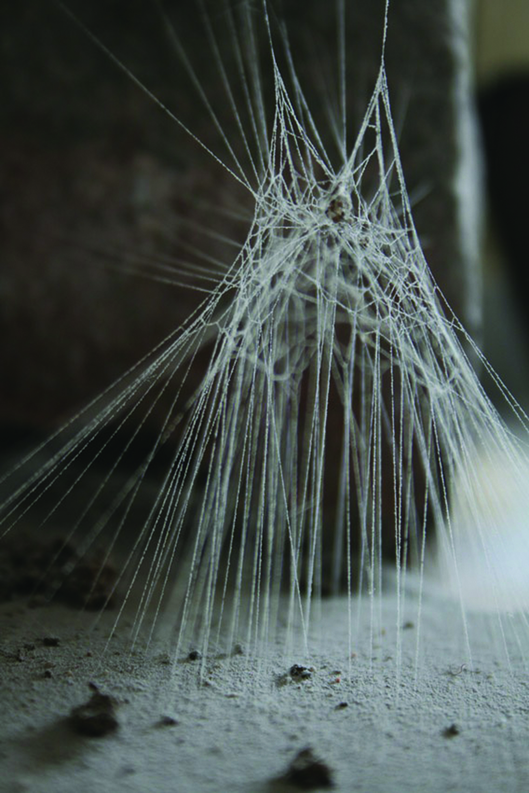
</ImageRow>

According to Benyus [2], biomimetics uses nature as the main design guideline and can be divided into three levels. The first, more superficial, is an attempt to simply mimic forms and patterns of nature regardless of the method used. The second level explores the courses that nature goes through until it achieves its final result, the process. And the third and broadest level is to mimic natural ecosystems, understanding that all individuals and elements make up a single sustainable, interconnected and interdependent biosphere.

In nature, structures that look simple as cobwebs, bee hives and termite mounds are determined by the DNA of the animal that builds it, that is, its genetic information. However, even in cases where there is a clearly defined formal identity, specific adaptations are still necessary for the immediate environment in which it is being installed: each spider web is created slightly different from one another, for example (Kull [7]).

Algorithmic architecture works in a similar way and also explores these natural mechanisms, but instead of starting from genetic information, the design is determined by an algorithm. In short, a complete algorithm would have all the necessary information for the execution of a construction, including several changes required according to each brief.

## The Brief

<ImageRow>
  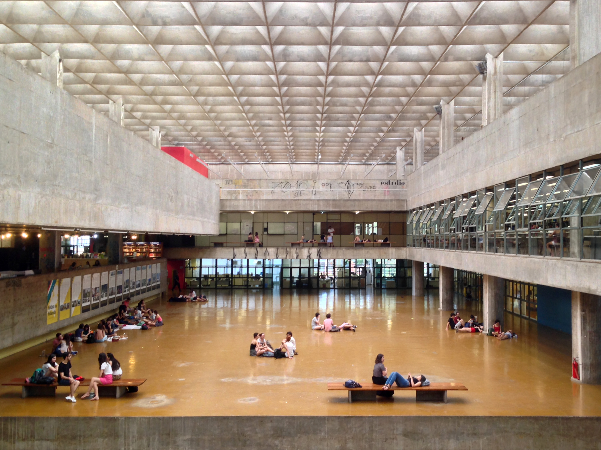

  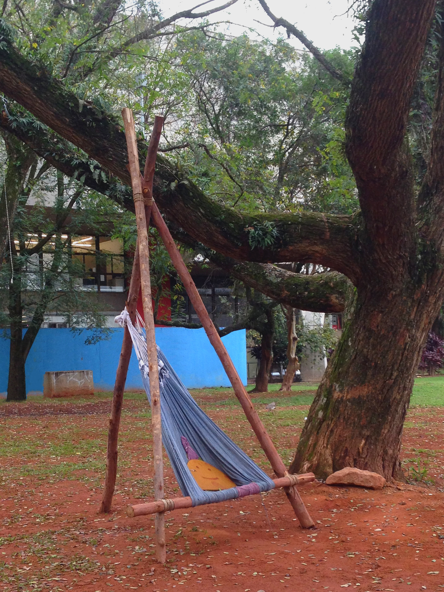
</ImageRow>

In the exploration of spaces in FAU-USP, it is evident that it lacked student life spaces. Furthermore, the research shows that student have the habit to install hammocks around the building in order to supply this need. The idea of subverting the way hammocks are designed, presented a great potential in the field of form finding. By combining computational design with a traditional weaving method, the direction of the project moved to a new design system.

However, before starting the study, it was important to determine a strategy:

### Biomimicry
It should present an approach inspired by nature, fitting at least in the second level of biomimicry (processes).

### Comfort
The final result should have a comfortable material and allow variations so that users can stay in various positions: sitting, leaning and lying down.

### Fabricability
It is essential that the project uses the existing machines and tools available at FAU-USP.

### Identity
The final result should refer to FAU-USP logo with the intention of connecting it to another way of thinking beyond the established modernist vision.

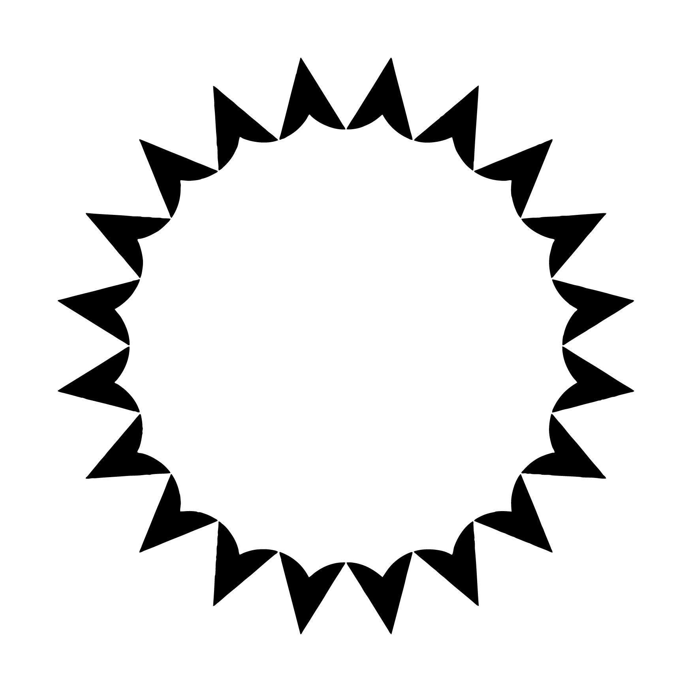

### Location
The proposed area consists of a 12-meter-square (144m²) covered by lawn, located between the main building of FAU-USP and the Laboratory of Models and Tests (LAME).

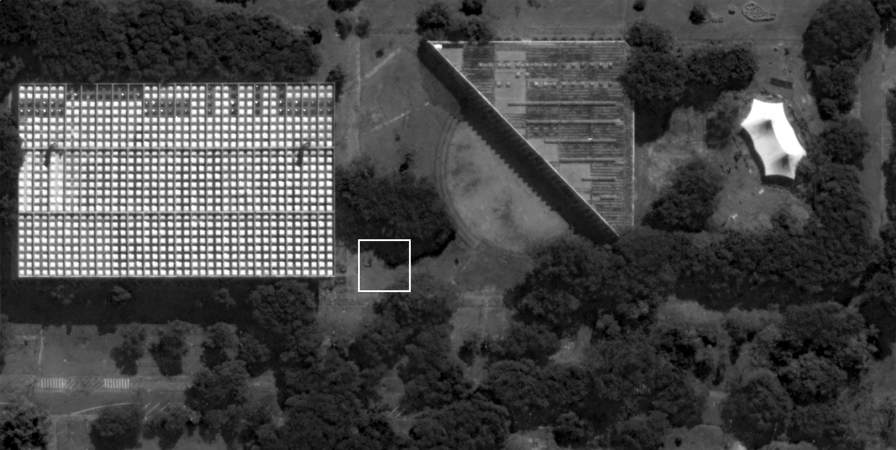

### Optimization
The way it is designed must consider the optimization of form and structure.

### Respect to Historical Heritage
This installation must be temporary, since FAU-USP is a listed building and, therefore, does not allow any type of permanent intervention.

## Technique

The main software used to develop this study was Rhinoceros 3D and its Grasshopper plug-in. Also, the use of plug-ins for Grasshopper such as Kangaroo Physics, Lunchbox, Starling and Weaverbird were crucial. Galapagos, which is an algorithm based on the theory of evolution proposed by Darwin, is largely used, but it is already built into Grasshopper.

The final algorithm developed aims to manipulate a predetermined mesh pattern. In this case, for the technical study, were used a cubic frame and a sphere-shaped mesh.

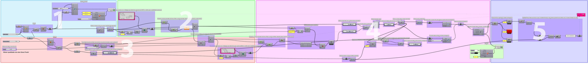

The algorithm works in five steps. The first consists in the creation of a cubic frame with a dimension of 1 meter of edge and the division of all the edges into 116 equidistant points.

The second step is the selection between 1 and 40 vertex-anchors among the 116 initial vertices present in the cubic frame. This process of selection is guided by Galapagos and will be described in the last step.

In the third stage, a ball of 0.80 meters in diameter is created and its mesh is improved until arriving at a specific predetermined pattern. For each vertex-anchor selected in the previous step, there are 16 possibilities of connections to the ball mesh through cables. Out of these 16 options, Galapagos only chooses a single cable for each vertex-anchor.

In the fourth step, with the structure prepared, the Kangaroo physics simulator can finally be activated. In this way, the lines and the sphere mesh are converted into elastic cables. With the resistance of the cables adjusted, it is possible to make the system stable. Next, the vector distances between the original vertices of the static sphere and the vertices with the sphere "relaxed" are calculated.

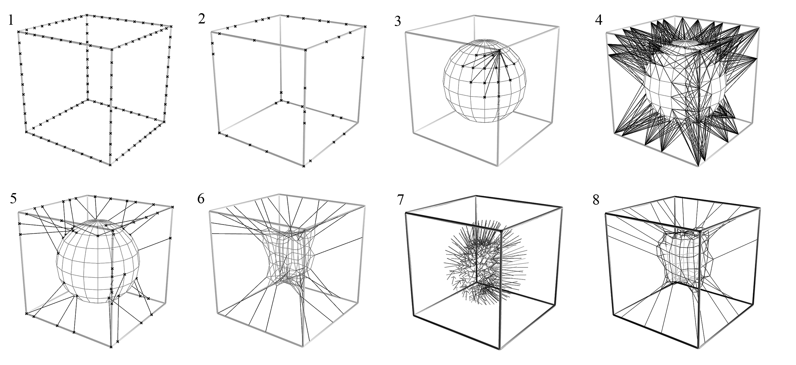

The fifth step uses Galapagos. This algorithm starts generating 50 possible random results, that is, 50 individuals based on the genetic pool, which in this case are the 116 vertices found along the cubic structure and the 190 vertices in the sphere mesh. With this data, it is able to search among the 50 initial individuals, and determine the best. This process is called fitness function, and it selects the individuals that have their final vertices closest to the vertices of the initial sphere shape.

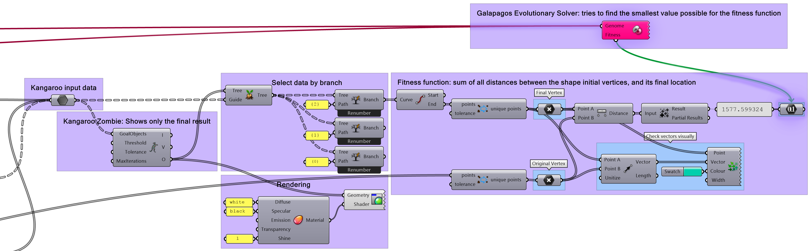

From the initial generation of data points, the optimal individuals combine their genetic markers to create 50 new data points as its own distinct generation. This is repeated until the most favorable result is reached. In this example, the algorithm stabilized at the hundredth generation.

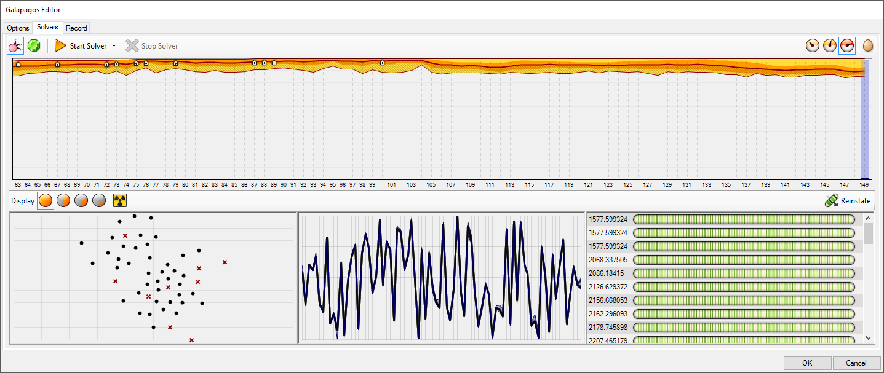

Thereafter, seven other studies were developed, but only the initial mesh pattern of the sphere was changed, and its behavior was analyzed.

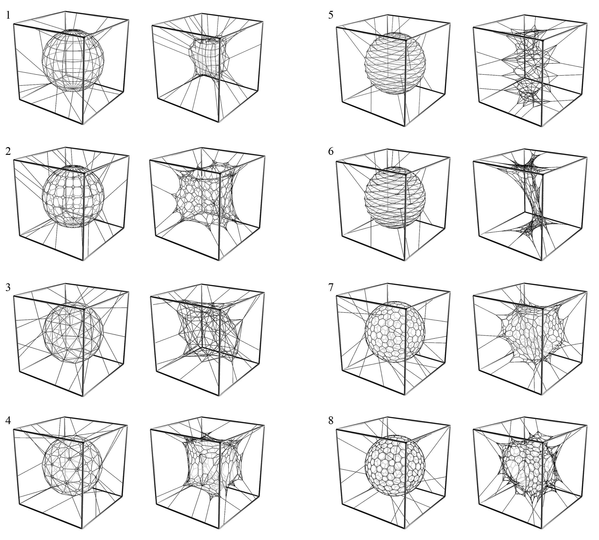

With the results obtained, it was concluded that the best alternative to develop the final proposal was the "truncated hexagonal mesh", since it presents the best control over the final form, as well as being reasonable to manufacture.

## Detailing

To fulfill all items listed in the brief, a structure was developed so it refers directly to one of the modules that compose the FAU-USP logo. From this metal skeleton made of 4 bars, a broad spectrum of 20 solutions was generated.

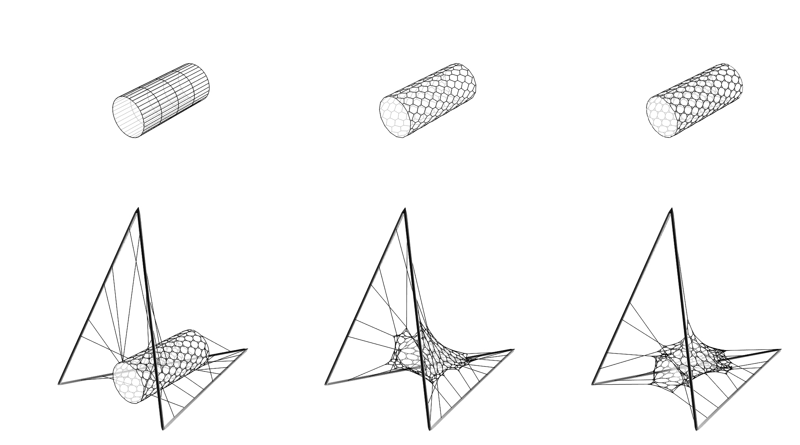

Similar to what happens with evolution in biology, it does not result in a 'perfect solution', but it does accomplish its final goal. This is especially important in design as it becomes a mean in which humans and computers can work together. While humans assemble the algorithm, the computers process it and end up offering a large number of results, so a human can then choose the ones that respect qualities difficult to specify inside the algorithm, as aesthetics or comfort.

### Constructive Method

In order to produce the hexagonal mesh proposed, the traditional bobbin lacing technique was adopted. The structure will consist of 4 steel tubes, 5 centimeters in diameter and 2.5 meters in length; using four pre-fabricated elbow connections with angles of 34 and 71.9 degrees.

### Fabrication

The assembly would happen in 3 steps: the production of the net, the assembly of the structural skeleton, and finally, the fixation of the net with ropes and its traction. All dimensions and fixing points can be documented using Grasshopper, thus avoiding mismatch of information and speeding up the assembly process.

The bobbin lace technique consists of a manual production of fabric that allows to develop complex patterns with rudimentary tools. The traditional fabrication consists of successive braiding and twisting lengths of thread using wooden rods (bobbins) to handle them, pins to keep the pattern stable, and a support cushion.

<ImageRow>
  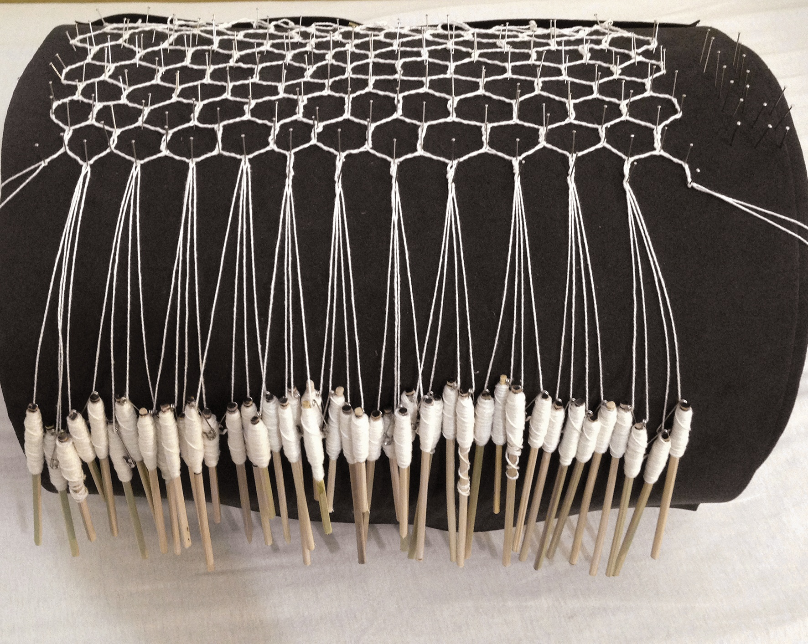

  
</ImageRow>

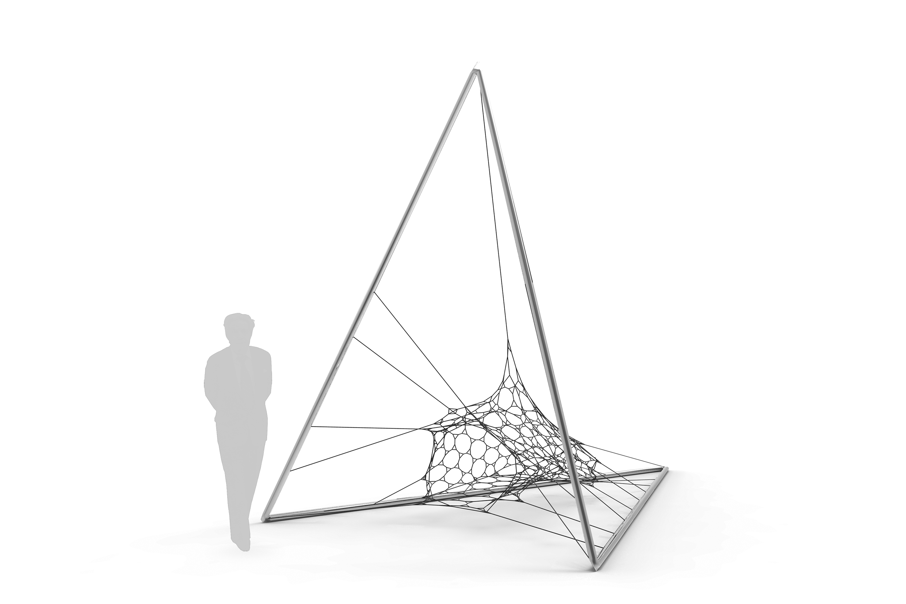

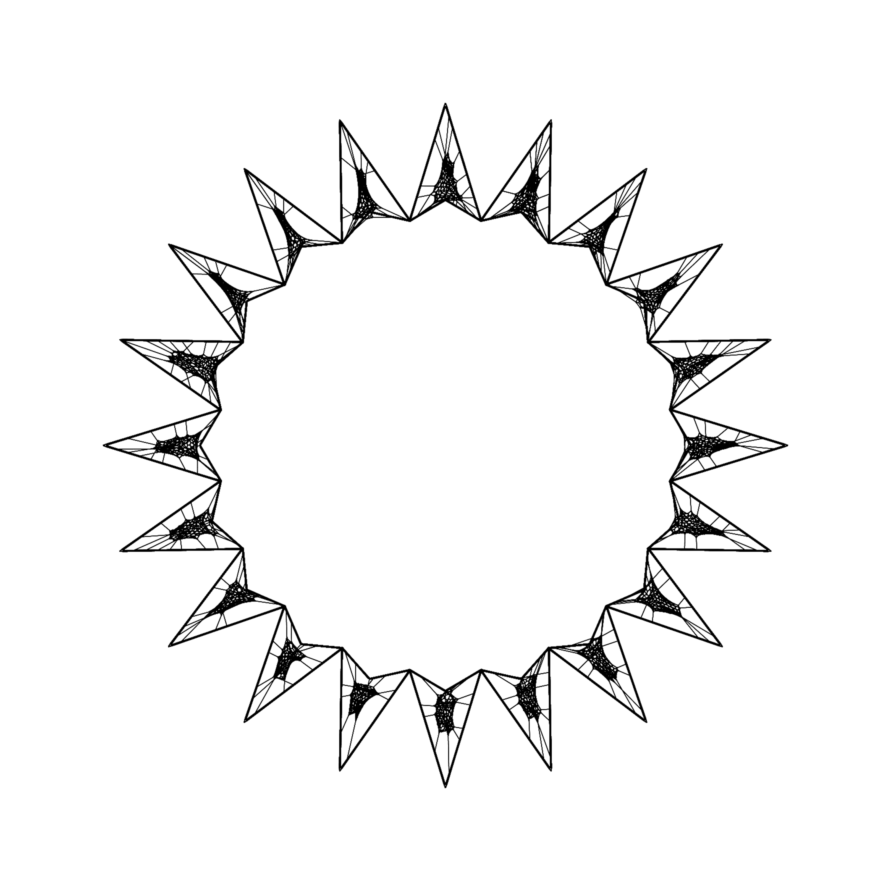

## Conclusion

This study sought to explore some possibilities of incorporating a traditional weaving technique to computational design aiming to develop a hammock-like chair prototype. The algorithm also provides some unexpected outputs that changes the way the designer is envisioning the final project. In other words, this system allows the algorithm and the designer to work together as a team.

Ultimately, the final algorithm works as a creative extension of the human mind, generating a spectrum of multiple solutions.

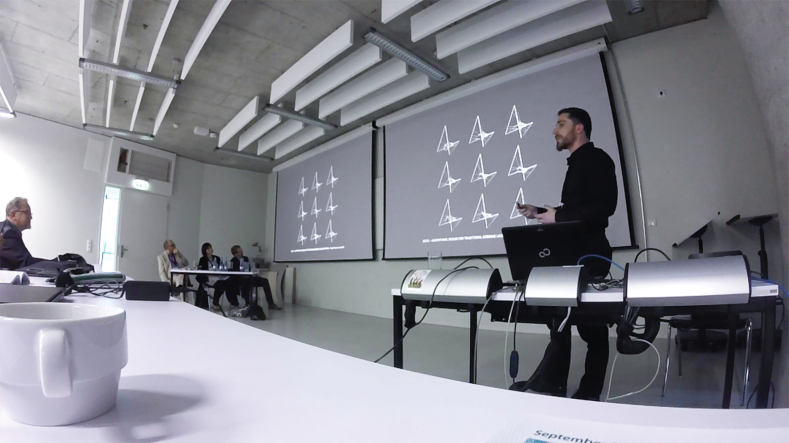

### References
[1] Barthel R. Natural Forms - Architectural Forms. In: FREI OTTO - *Lightweight Construction*, Natural Design, Birkhauser - Publishers for Architecture, 2005.
[2] Benyus J. M. *A Biomimicry Primer*. Biomimicry guide, 2009.
[3] Fernandes J. A. B. *Caderno de Diagnóstico, Resíduos da Construção Civil*. IPEA, 2011.
[4] Fry T., Design Futuring: Sustainable, Ethics and New Practice (Oxford: Berg, 2008), p.2
[5] Kieran S. e Timberlake J. *Refabricating Architecture: How manufacturing methodologies are poised to transform building construction*, McGraw-Hill, 2004.
[6] Krausse J. and Lichtenstein C., Your Private Sky: R. Buckminster Fuller: The Art of Design Science, Lars Müller Publishers, 1999.
[7] Kull U., Frei Otto and Biology, in Frei Otto - Lightweight Construction, Natural Design ([Basel, Switzerland]: Birkhauser - Publishers for Architecture, 2005), p.51
[8] Stabile H., *Entre o físico e o digital. Processos paramétricos, de interação e de fabricação digital aplicados ao design*, São Paulo, 2015.
[9] Terzidis K., *Algorithmic Architecture*, Architectural Press (Elsevier), 2006.
