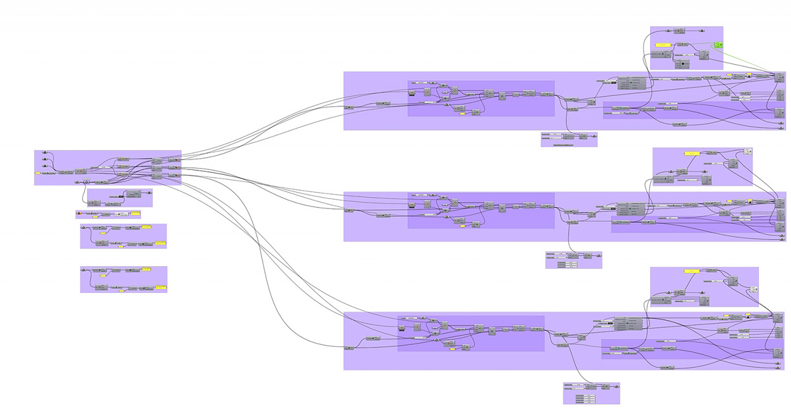

---
{
  "Cover": "/assets/content/publications/high-low-as-expression-of-the-brazilian-digital-fabrication/cover-cover.jpg",
  "CoverAlt": "Fabrication of pavilhão O3 by Paleta Stands. A blacksmith takes photos of the small scale model, while two other appear in the background.",
  "Description": "This paper investigates the concept of high-low: high technology in the design phase with low technology in the fabrication phase. The ephemeral architecture has the potential to combine academic and artistic knowledge in Brazilian commercial production. One experimental case study designed for Expo Revestir for Docol in 2017 is presented here, balancing the paradigm of computational design with the academic field and viable commercial applications.",
  "Name": "High-Low as Expression of the Brazilian Digital Fabrication",
  "Slug": "publications/high-low-as-expression-of-the-brazilian-digital-fabrication",
  "Tags": [
    "High-low",
    "File-to-factory",
    "Ephemeral architecture",
    "Computational design"
  ],
  "Authors": [
    "Daniel Nunes Locatelli",
    "Arthur Hunold Lara",
    "Thiago Henrique Omena",
    "Adalberto de Paula"
  ],
  "City": [
    "São Carlos"
  ],
  "DateStart": "2018-11-01",
  "Language": "Portuguese",
  "Link": {
    "Text": "High-low paper at SIGraDi 2017",
    "Href": "https://papers.cumincad.org/cgi-bin/works/paper/sigradi2018_1797"
  },
  "Place": "SIGRADI 2018 Technopolitics"
}
---

This paper is the result of an investigation about the influence of digital processes in Design and its importance in innovation within ephemeral architecture through the concept of High-Low. The ephemeral architecture has the potential to combine academic and artistic knowledge to Brazilian commercial production. Here is presented one experimental case study designed to Expo Revestir for Docol in 2017 that balances the paradigm of computational design with the academic field and viable commercial applications.

<video controls preload="metadata" style="width: 100%; border-radius: 0.5rem;">
  <source src="/media/publications/high-low-as-expression-of-the-brazilian-digital-fabrication/o3-pavilion-kangaroo-relaxation.mp4" type="video/mp4">
</video>

Parametric model after Kangaroo relaxation.

<video controls preload="metadata" style="width: 100%; border-radius: 0.5rem;">
  <source src="/media/publications/high-low-as-expression-of-the-brazilian-digital-fabrication/o3-pavilion-assembly-sequence.mp4" type="video/mp4">
</video>

Panel assembly sequence.

