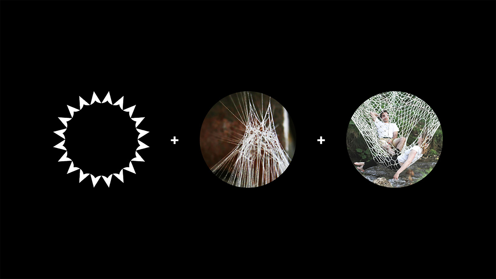
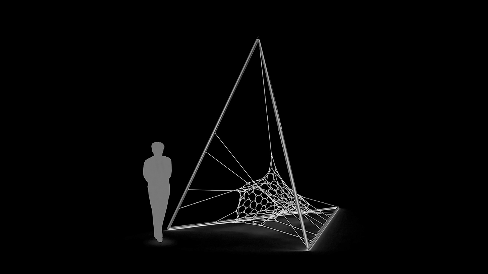

---
{
  "Cover": "/assets/content/publications/algorithmic-design-for-traditional-bobbin-lace-methods/cover-cover.jpg",
  "CoverAlt": "Daniel Locatelli apresentando o artigo na IASS 2017, Hamburgo.",
  "Description": "Este artigo investiga a potencial aplicação de ferramentas digitais no projeto e fabricação de tramas têxteis através do uso combinado de busca de forma (form finding) e da técnica tradicional de renda de bilro. ",
  "Name": "Processo algorítmico para reproduzir rendas de bobina digitalmente",
  "Slug": "publications/algorithmic-design-for-traditional-bobbin-lace-methods",
  "Tags": [
    "Conceptual design",
    "Form finding",
    "Optimization",
    "Dynamic relaxation",
    "Evolutionary algorithm",
    "Computational design",
    "Grasshopper3d"
  ],
  "Authors": [
    "Daniel Nunes Locatelli",
    "Arthur Hunold Lara",
    "Thiago Henrique Omena",
    "Ruy Marcelo de Oliveira Pauletti"
  ],
  "City": [
    "Hamburg"
  ],
  "DateStart": "2017-09-01",
  "Language": "English",
  "Link": {
    "Text": "Paper at IASS 2017",
    "Href": "https://www.ingentaconnect.com/content/iass/piass/2017/00002017/00000009/art00013"
  },
  "Place": "IASS 2017"
}
---

Este artigo investiga a potencial aplicação de ferramentas digitais no projeto e fabricação de tramas têxteis através do uso combinado de busca de forma e da técnica tradicional de renda de bilro.
O trabalho explora como um método artesanal tradicional poderia levar a uma nova abordagem em torno do design paramétrico e generativo em conjunto com tecnologias de fabricação digital.
A investigação completa é baseada em diversos estudos de caso de arquitetos renomados que têm seus trabalhos inspirados na natureza, como Buckminster Fuller e Frei Otto. Nesses estudos de caso foi feito engenharia reversa em seus trabalhos usando uma linguagem de programação visual popular e acessível à maioria dos profissionais.
Considerando a crescente importância dos processos digitais no design devido aos seus resultados rápidos e otimizados, é imperativo que os arquitetos se adaptem a este novo fluxo de trabalho. Essa tese busca mostrar como o design computacional poderia incorporar um tema tradicional e inesperado com grande controle espacial.
É também uma introdução ao processo de relaxamento dinâmico e uma possível aplicação de um algoritmo evolutivo em arquitetura e design. Por fim, o algoritmo desenvolvido foi utilizado para propor uma peça de mobiliário urbano.

