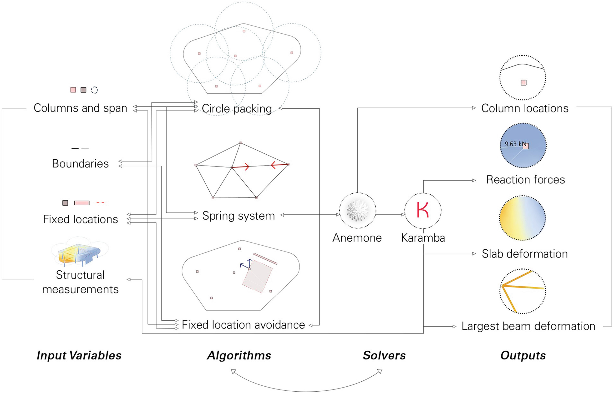
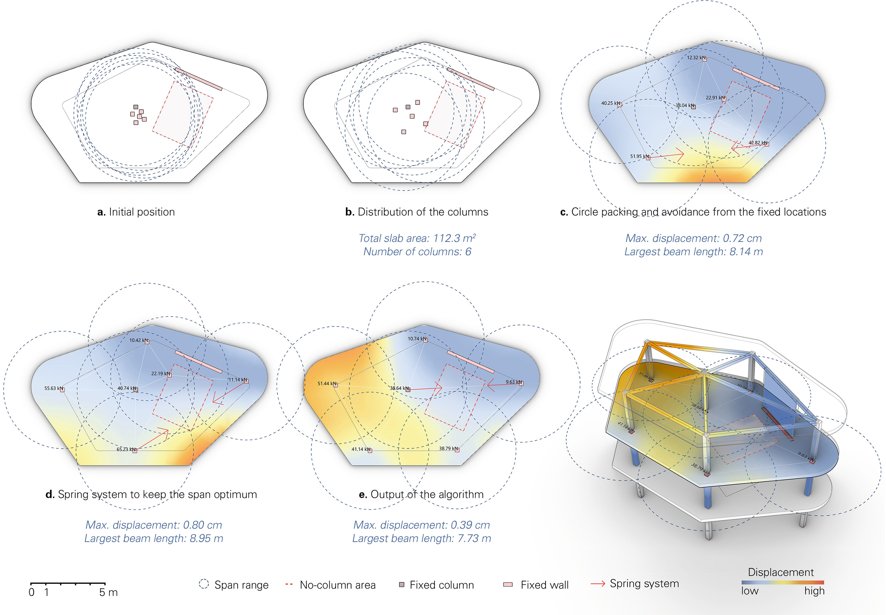
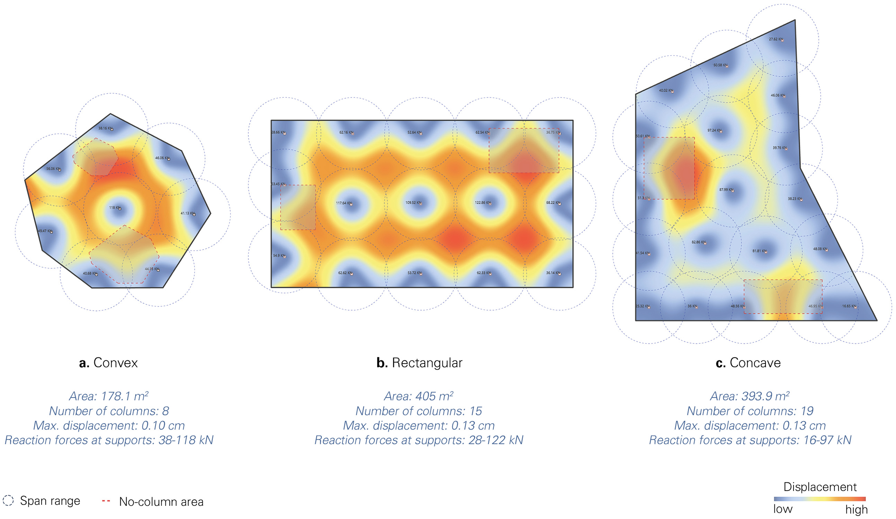
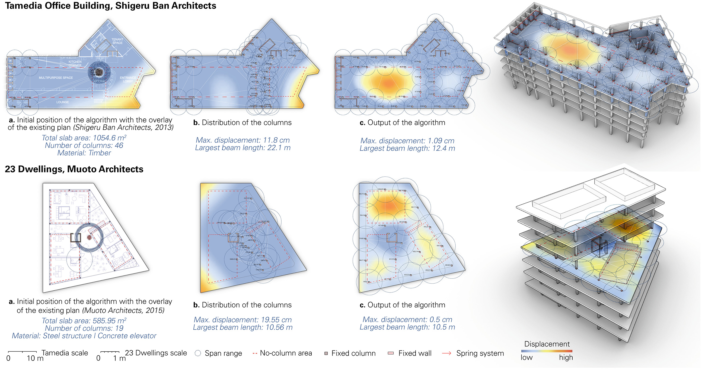

---
{
  "Cover": "/assets/content/publications/automatic-column-placement/cover-cover.jpg",
  "CoverAlt": "Três layouts de construção mostrando o posicionamento final das colunas resultantes do algoritmo.",
  "Description": "Este artigo apresenta um método computacional baseado em feedback para o posicionamento de pilares na fase inicial de projeto de prédios. O método integra um algoritmo de agrupamento de círculos, um sistema de molas e simulações de engenharia estrutural em um único script para o arranjo recíproco e informado de colunas no espaço. Ao mesmo tempo que permite que os usuários tenham uma abordagem exploratória, ele capacita diversos potenciais em construções de vários andares, incluindo espaços adicionais em balanço ao redor dos limites, maiores qualidades espaciais com possibilidades de grandes vãos, arranjos estruturais multidirecionais e uso multifuncional do espaço. Como resultado, o algoritmo desenvolvido permite flexibilidade, aproveitando as possibilidades de projeto de arranjos de colunas irregulares e baseados em grade e promove a integração de restrições estruturais e relacionadas ao projeto na organização espacial de várias tipologias de edifícios.",
  "Name": "Posicionamento automático de pilares",
  "Slug": "publications/automatic-column-placement",
  "Tags": [
    "Computational design",
    "Column placement",
    "Complex networks",
    "Organization of space",
    "Multi-story buildings"
  ],
  "Authors": [
    "Ekin Sila Sahin",
    "Daniel Nunes Locatelli",
    "Lui Orozco",
    "Anna Krtschil",
    "Hans Jakob Wagner",
    "Achim Menges",
    "Jan Knippers"
  ],
  "City": [
    "Tongji"
  ],
  "DateStart": "2023-06-24",
  "Language": "English",
  "Link": {
    "Text": "Springer - Phygital Intelligence",
    "Href": "https://link.springer.com/chapter/10.1007/978-981-99-8405-3_5"
  },
  "Place": "CDRF 2023–Phygital Intelligence"
}
---

## Método de projeto baseado em feedback para posicionamento de colunas espacialmente informado e estruturalmente performático em construções de vários andares
Este artigo apresenta um método computacional baseado em feedback para o posicionamento de colunas na fase inicial de projeto de estruturas complexas de vários andares. O método integra um algoritmo de empacotamento circular, um sistema de molas e simulações de engenharia estrutural em um único script para o arranjo recíproco e informado de colunas no espaço. Ao mesmo tempo em que permite que os usuários tenham uma abordagem exploratória, ele capacita diversos potenciais em construções de vários andares, incluindo espaços adicionais em balanço ao redor do limite, qualidades espaciais aumentadas com grandes possibilidades de vão, arranjos estruturais multidirecionais e uso multifuncional do espaço. Como resultado, o algoritmo desenvolvido permite flexibilidade ao alavancar as possibilidades de projeto de arranjos de colunas irregulares e baseados em grade e promove a integração de restrições estruturais e relacionadas ao projeto na organização espacial de várias tipologias de construção.

Encontre o artigo completo aqui:
[Feedback-Based Design Method for Spatially-Informed and Structurally-Performative Column Placement in Multi-Story Construction](https://link.springer.com/chapter/10.1007/978-981-99-8405-3_5)

