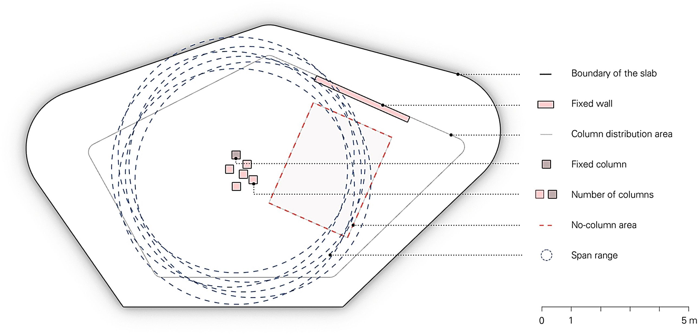
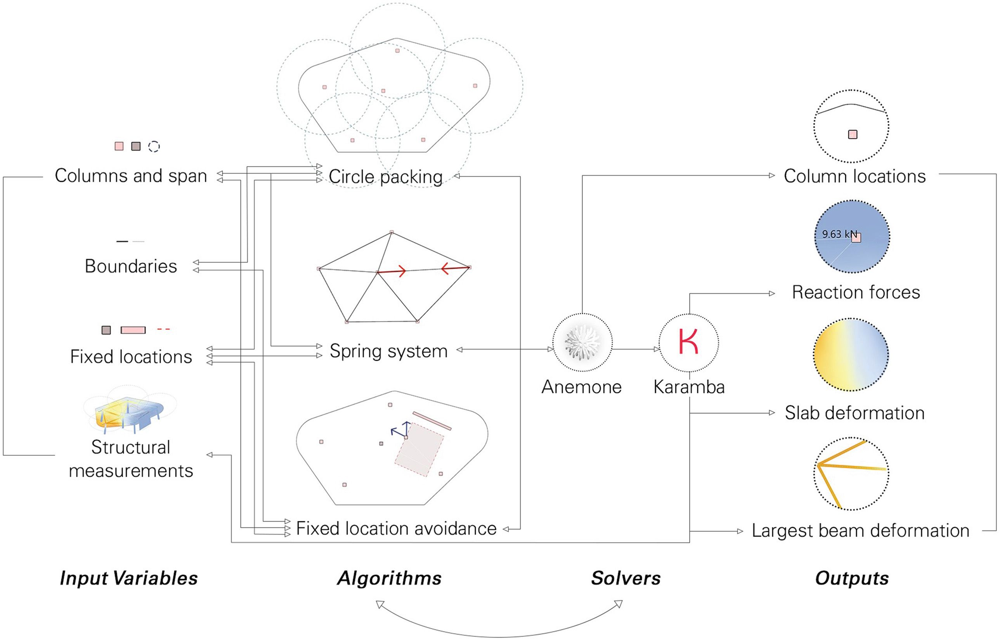
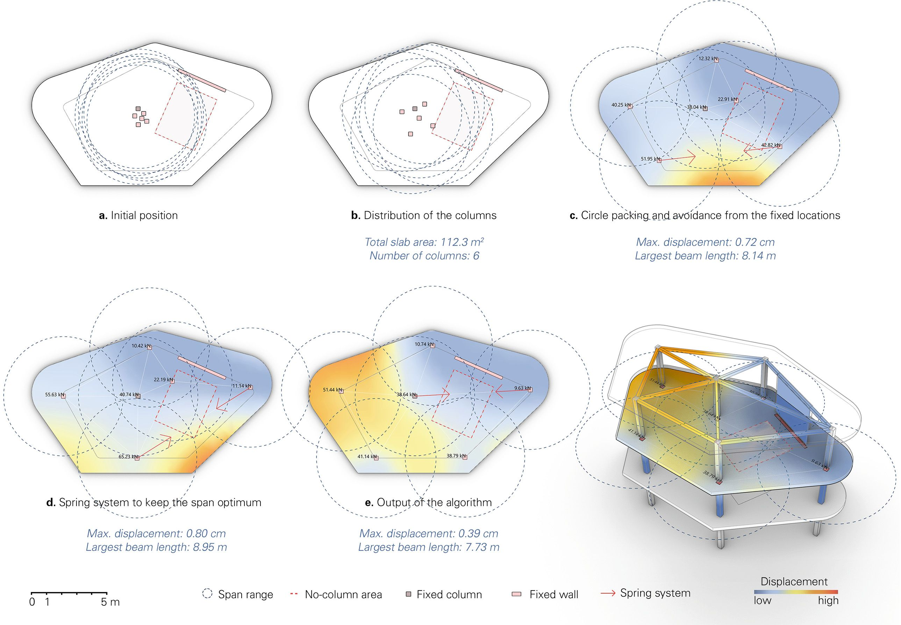
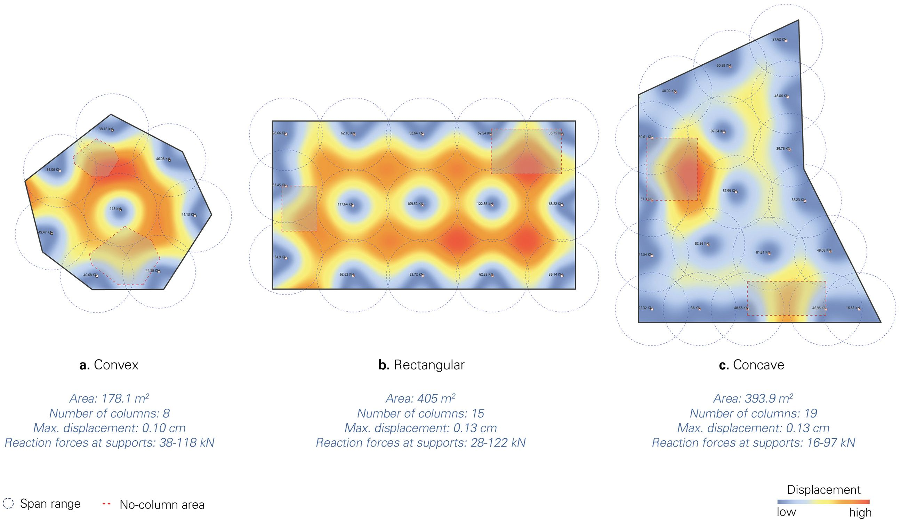
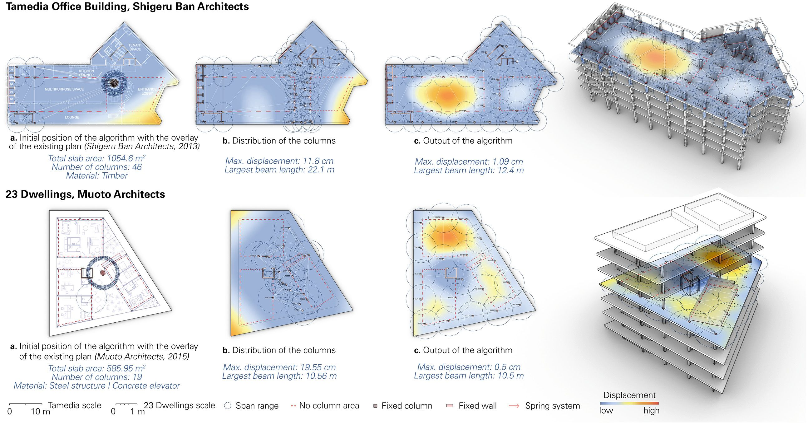

import Video from '@/components/Video.astro'

## Método de projeto baseado em feedback para posicionamento de colunas espacialmente informado e estruturalmente performático em construções de vários andares
Este artigo apresenta um método computacional baseado em feedback para o posicionamento de colunas na fase inicial de projeto de estruturas complexas de vários andares. O método integra um algoritmo de empacotamento circular, um sistema de molas e simulações de engenharia estrutural em um único script para o arranjo recíproco e informado de colunas no espaço. Ao mesmo tempo em que permite que os usuários tenham uma abordagem exploratória, ele capacita diversos potenciais em construções de vários andares, incluindo espaços adicionais em balanço ao redor do limite, qualidades espaciais aumentadas com grandes possibilidades de vão, arranjos estruturais multidirecionais e uso multifuncional do espaço. Como resultado, o algoritmo desenvolvido permite flexibilidade ao alavancar as possibilidades de projeto de arranjos de colunas irregulares e baseados em grade e promove a integração de restrições estruturais e relacionadas ao projeto na organização espacial de várias tipologias de construção.

<Video src="/media/publications/automatic-column-placement/parcticle-spring-system-column-placement.mp4" />

Encontre o artigo completo aqui:
[Feedback-Based Design Method for Spatially-Informed and Structurally-Performative Column Placement in Multi-Story Construction](https://link.springer.com/chapter/10.1007/978-981-99-8405-3_5)

