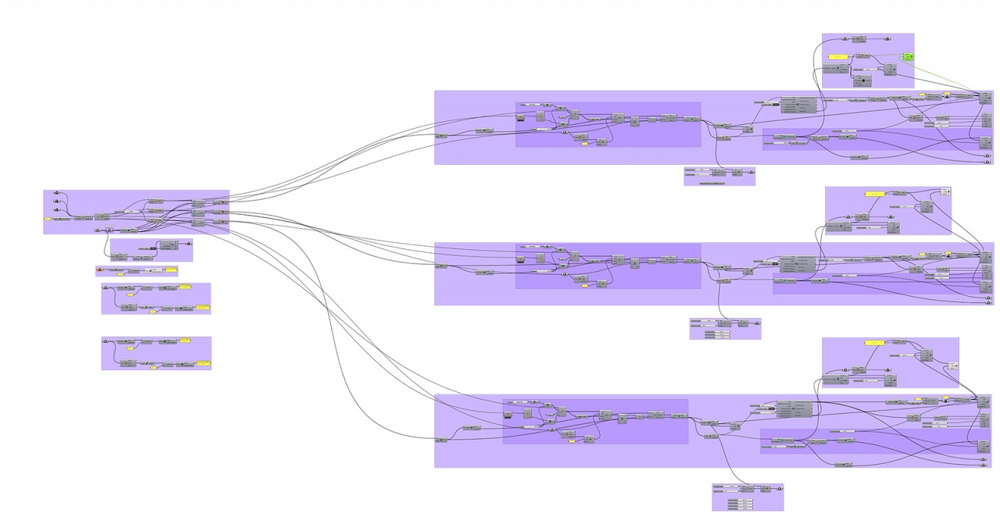
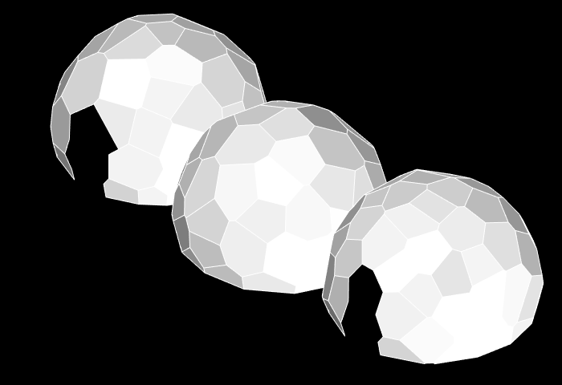
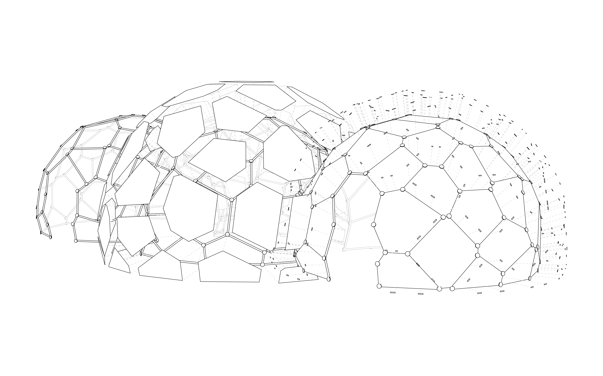
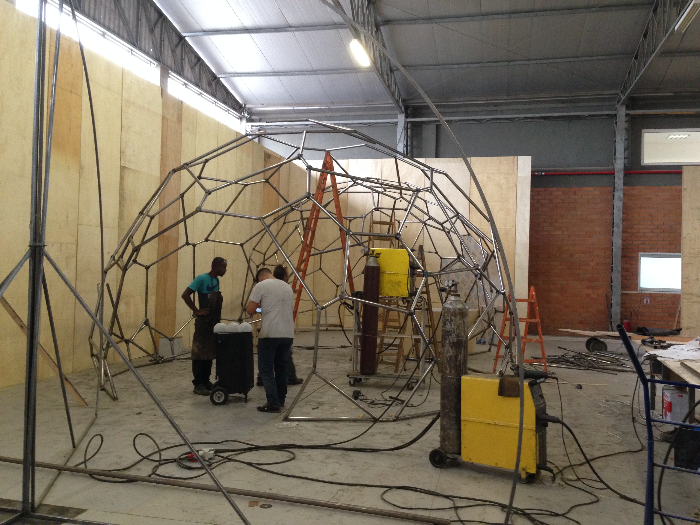
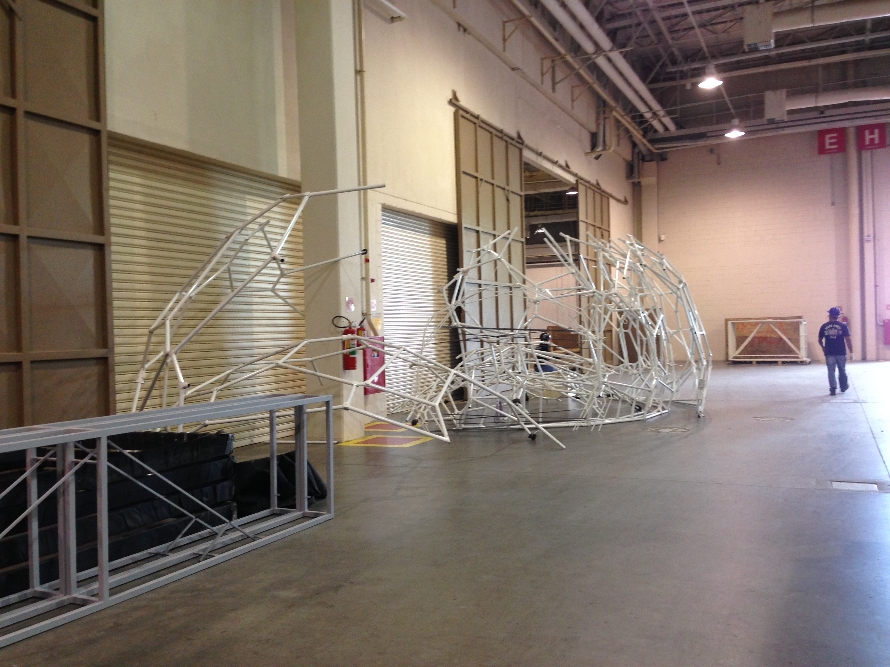
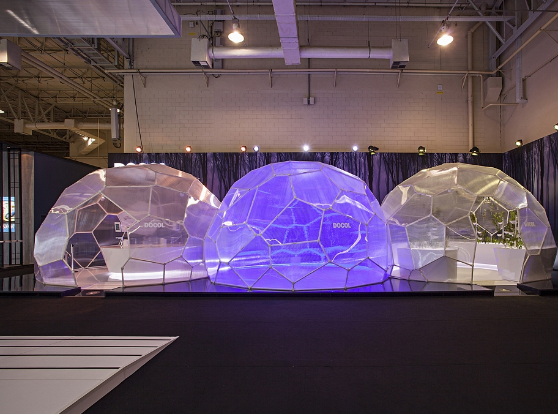
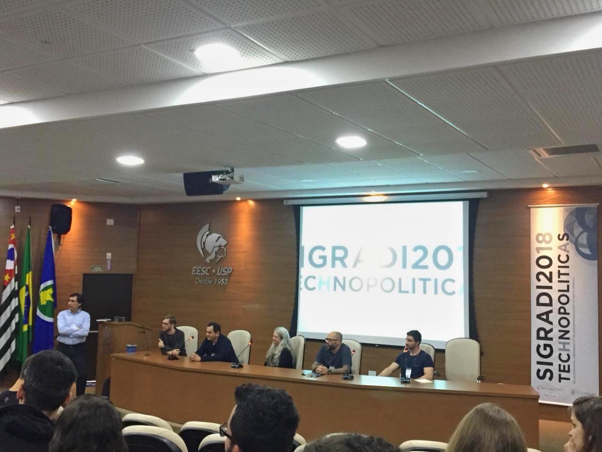

import Video from '@/components/Video.astro'

## Resumo

Este artigo é resultado de uma investigação sobre a influência dos processos digitais no Design e sua importância na inovação dentro da arquitetura efêmera através do conceito High-Low. A arquitetura efêmera tem o potencial de aliar conhecimento acadêmico e artístico à produção comercial brasileira. Aqui é apresentado um estudo de caso experimental projetado para a Expo Revestir para a Docol em 2017 que equilibra o paradigma do design computacional com o campo acadêmico e aplicações comerciais viáveis.

## Introdução

A forma de viver e ocupar o mundo passou por uma grande transformação ao longo da história à medida que inovações se alinhavam com a cultura local no mundo globalizado. Recentemente, após meados do século XX, a explosão demográfica transformou o ambiente urbano com novas tecnologias de produção para atender aos problemas emergentes. Como resultado de um mundo globalizado e repleto de inovações, os processos de projeto e execução da arquitetura também podem ser citados como evoluções que se deram por meio das tecnologias disponíveis.

Como proposto por Rivka Oxman[^oxman-2006] quando escreveu "Theory and Design in the First Digital Age", o processo clássico de projeto era anteriormente compreendido como análise, síntese, avaliação e decisão; quando em ambiente mediado digitalmente ele passa pelas fases de geração, representação, avaliação e performance. Essa mudança na mediação projetual acontece após grandes transformações ocorridas na fabricação com a introdução de máquinas numéricas que passariam a controlar toda a linha de produção das indústrias aeronáutica, naval e automobilística. Porém, a expressão concreta dessas tecnologias na arquitetura se dá de acordo com a realidade política, social, econômica e cultural de cada região.

Desde a década de 1950, computadores auxiliam na produção de peças complexas de aeronaves. Para Gabriela Carneiro[^carneiro-2014], o computador é como um parceiro do arquiteto na formulação e geração de espaços. "Mais do que a modelagem da forma, a partir de suas aparências, o foco do arquiteto sempre foi empregar, na arquitetura, o potencial do computador para simular processos naturais" (Carneiro, p.87)[^carneiro-2014]. Responsáveis pela introdução da computação na prática arquitetônica, as primeiras gerações de softwares *computer aided design* - CAD utilizaram o meio digital como uma espécie de prancheta eletrônica (ao invés de utilizar o computador como assistente ao processo criativo, utilizava-o apenas como ferramenta de representação gráfica) conforme apontado por Araújo[^araujo-2018].

Para Sedrez[^sedrez-martino-2018], antes da industrialização da construção, havia uma valorização de formas complexas quando métodos artesanais eram condicionados à arquitetura; entretanto, no período pós-guerra, a fabricação da arquitetura passou por grandes mudanças, e foi essa mudança apontada como um dos pilares do modernismo. Esse foi o período em que surgiram diretrizes ideológicas que defendiam formas simples (em virtude da simplificação e velocidade na fabricação arquitetônica). Assim, esse foi um fator condicionante que catalisou o desaparecimento de formas complexas.

Com a evolução dos computadores e o aumento da velocidade e capacidade de processamento de dados, o meio digital passou a auxiliar também os processos de projeto no que se convencionou chamar de *Digital Design*. A defesa dessa nova área de estudo foi capitaneada por expoentes como William Mitchell em seu manifesto anti-tectônico, Rivka e Robert Oxman, na defesa do novo Estruturalismo (que invertia a ordem do processo projetual de forma para estrutura para material, para material para estrutura e forma), entre diversos outros autores de igual importância.

Nessa nova forma de pensar o processo de projeto digital, o computador, além de produzir desenhos, era utilizado também para resolver problemas lógicos vinculados ao processo projetual. Essas ferramentas computacionais que auxiliavam a concepção arquitetônica abriram novas oportunidades ao possibilitar o projeto e a construção de formas complexas que, até recentemente, eram difíceis e caras de serem projetadas, produzidas e montadas utilizando tecnologias construtivas tradicionais. Através de quatro revoluções industriais (a máquina a vapor, a produção em massa, a customização em massa com máquinas CNC) e a indústria 4.0, uma nova tradição se estabeleceu por meio de tecnologias digitais para vincular o projeto diretamente ao canteiro de obras.

Antes do início da digitalização do processo criativo arquitetônico, a prática projetual era desenvolvida para servir tanto à fabricação manual quanto à mecânica. Através do processo de design digital e fabricação digital, aqui definido como a produção de objetos físicos a partir de modelos digitais (Tramontano)[^tramontano-2016], a arquitetura ganhou uma camada híbrida de materialização que não precisa se render à repetição infinita para facilitar a produção. Assim, por meio desse processo, adota-se a ideia de uma produção que trabalha com o arquivo digital do projeto sendo enviado e produzido diretamente na indústria, processo conhecido como *file-to-factory* (Tramontano; Soares)[^tramontano-soares-2012]. Cada técnica artesanal, dentro dessa esfera, é repensada através de processadores e máquinas de modo a otimizar o processo formal e expandir suas possibilidades. Dessa forma, a fabricação digital consegue atingir um nível extremamente alto de definição formal, muito superior à capacidade humana quando falamos de geometrias complexas produzidas em série com precisão.

Por outro lado, a formação do arquiteto no Brasil é muito abrangente, permitindo um amplo espectro de atuação. A construção civil, que é um de seus focos principais, tende a ter longos tempos de execução e pouca abertura para exploração e experimentação de novas técnicas e métodos de projeto. Entretanto, atualmente, "há uma lenta, mas irreversível, mudança nos processos produtivos da construção decorrente da expansão dos processos industriais, agora potencializados pelo advento da informatização" (Tramontano, p.01)[^tramontano-2016]. A tecnologia sempre foi pensada de forma autônoma e isolada, como uma vanguarda de futuros e soluções evidentes para problemas que ainda não conhecemos. Assim, dentro desse cenário, a arquitetura efêmera consegue incluir métodos de design digital porque geralmente produz peças únicas com alto nível de complexidade em relação à construção tradicional. Além disso, dentro dessa área os prazos de desenvolvimento e construção do projeto, que variam de 1 a 6 meses, tendem a ser menores e com alto orçamento. Em um projeto típico de arquitetura efêmera para eventos, a eficiência em todas as etapas de desenvolvimento gera pressão pelo curto prazo e alto custo. Dessa forma, essa área se mostra um campo naturalmente fértil para o desenvolvimento e uso de métodos de design e fabricação digitais.

## High-Low

Segundo SUBdV[^subdv-2017], o termo *High-Low* surge da união de dois conceitos, onde *High* representa a tecnologia empregada para a geração da arquitetura por meio da computação e *Low* as instruções produzidas para que uma mão de obra não especializada possa construir com fabricação digital. Por exemplo, em um de seus projetos, o CoBLOgó, guias de posicionamento das peças foram exportadas de um script paramétrico. Essas guias foram cortadas a laser em material de papelão e colocadas em uma prateleira também fabricada digitalmente com router CNC onde o pedreiro precisava apenas colocar os blocos adjacentes às guias e ripas intercaladas para integridade estrutural. Em resumo, esse processo que une design paramétrico e fabricação digital com técnicas construtivas simples e materiais locais no canteiro de obras ilustra o processo chamado High-Low (SUBdV)[^subdv-2017]. Esse artifício que combina alta tecnologia (computação paramétrica e fabricação digital) com métodos construtivos de baixa tecnologia e materiais locais baratos pode criar uma nova identidade brasileira no design digital, para escapar da crescente tendência ubíqua e genérica da estética paramétrica contemporânea (SUBdV apud Rojas)[^rojas-2017].

Baseado no pensamento de Anne Save de Beaurecueil[^celani-sedrez-responsiva], o baixo número de universidades trabalhando com fabricação digital e arquitetura paramétrica é um dos problemas na formação dos arquitetos no Brasil que gera o atraso na industrialização da construção arquitetônica com precisão. "Se os arquitetos não estão usando novas técnicas, eles não vão pressionar a indústria da construção a mudar. [...] então eu acho que, para realmente avançar na construção, deve-se começar pelos estudantes, porque eles vão pressionar a indústria, eles vão inspirar a indústria" (Celani, Sedrez)[^celani-2013]. Assim, o High-Low é uma forma de inovar não apenas repetindo o que está acontecendo na cena internacional, mas unir a arquitetura e a cultura brasileira com a nova tecnologia vinda do exterior.

## Estudo de Caso: Pavilhão Docol 2017

### Projeto Conceitual

A primeira fase foi o projeto conceitual, no qual foram estudadas as novidades dos produtos da empresa e seu posicionamento de mercado. Foi assim que se chegou à ideia de relacionar a nova linha de torneiras de ozônio ao conceito. Quando o ozônio é misturado à água, ele confere propriedades higiênicas como combate a micro-organismos e remoção de odores fortes sem, no entanto, prejudicar o meio ambiente. Determinou-se então que a estrutura final do pavilhão da Docol deveria fazer referência à molécula de ozônio, ou seja, três átomos de oxigênio conectados entre si. A forma final deveria então ser composta por três domos que se intersectam, a casca deveria utilizar policarbonato alveolar e os domos concebidos para mimetizar um diagrama de Voronoi, isto é, as superfícies desses três domos deveriam ser "revestidas" com células de Voronoi. O conceito é então resultado do diálogo entre uma ideia que se conecta com a marca e um sistema construtivo eficiente.

Esse resultado foi alcançado seguindo um processo projetual não-linear que passou por iterações para chegar ao produto final. Ou seja, houve um processo de estudo de diversos fatores condicionantes que foram gradualmente se conectando por meio do feedback de múltiplos testes intermediários. No Atelier Marko Brajovic, entende-se que no processo de projeto "não importa se você começa de cima para baixo ou de baixo para cima. Quando você percorre todo o ciclo tem que combinar ambas as abordagens" (Wallisser, 2018, p. 198 a 205). Como resultado, a hierarquia das geometrias aqui é clara, e pode variar de acordo com as necessidades da próxima fase.

<Video autoplay src="/media/publications/high-low-as-expression-of-the-brazilian-digital-fabrication/o3-pavilion-kangaroo-relaxation-upscaled.mp4" caption="Modelo paramétrico após relaxação com Kangaroo" />

### Sistema Generativo

Nesta fase, com o conceito consolidado, o foco foi gerar um projeto viável que atendesse às necessidades do cliente. Para isso, o uso do software Rhinoceros e de seu plug-in de programação visual Grasshopper[^tedeschi-2014] foi fundamental. O processo de modelagem começou pela parametrização de três hemisférios limitados pelo volume disponibilizado para o evento, com partes que se sobrepunham e com parâmetros que permitiam a alteração do raio, do espaçamento das esferas em relação ao solo, da localização de cada esfera, etc.

Para o desenvolvimento da casca, foi utilizada a intersecção entre os hemisférios com um padrão de Voronoi 3D. Isso gerou um padrão de Voronoi curvo seguindo a forma dos três hemisférios. Para a etapa seguinte, era necessário planificar esse padrão de Voronoi para obter placas planas que se encaixassem perfeitamente e estivessem prontas para corte a laser. Foi então utilizado o plugin do Grasshopper chamado Kangaroo[^piker-2013], que por meio de um método de relaxação dinâmica calcula as dimensões necessárias para cada aresta do domo de modo que todas as células de Voronoi fossem planificadas.

Entretanto, durante esse processo verificou-se que no local onde as esferas se intersectam, as arestas precisam manter o mesmo tamanho e localização mantendo a fluidez da forma e sem perder o padrão de Voronoi. O algoritmo foi desenvolvido então para que durante o processo de planificação das células, as arestas das intersecções fossem forçadas a se igualarem.

A partir dessa geometria base, os elementos tridimensionais foram criados. As placas ganharam espessura e as barras ganharam diâmetro. Foi possível também criar possibilidades de conexão que poderiam ser produzidas por meio de fabricação digital, como impressão 3D por exemplo.

<Video autoplay src="/media/publications/high-low-as-expression-of-the-brazilian-digital-fabrication/o3-pavilion-assembly-sequence-padded.mp4" caption="Sequência de montagem dos painéis" />

### Fabricação

A terceira fase foi a construção do projeto propriamente dito. Nesta fase outra empresa foi contratada: a Paleta Stands, localizada na cidade de Joinville em Santa Catarina. Ela foi responsável pela prototipagem e fabricação do pavilhão, o que significou a perda do controle sobre o processo de fabricação que havia sido idealizado durante a fase de programação e consolidação da geometria por meio do design digital. A empresa possuía toda a documentação e os arquivos necessários para a produção do pavilhão utilizando exclusivamente métodos de fabricação digital. No entanto, as instruções fornecidas lhes permitiram uma grande flexibilidade para resolver o projeto da forma mais otimizada possível, levando em conta a tecnologia disponível, custos e mão de obra.

Durante as visitas técnicas para acompanhar o desenvolvimento do projeto, verificou-se que o processo de fabricação havia misturado uma variedade de métodos. O corte das placas de policarbonato alveolar utilizou máquinas de corte a laser, o que garantiu alta precisão e um acabamento final de alto nível.

Para a produção do esqueleto metálico, foi contratada uma equipe de serralheiros tradicionais que não estavam habituados a produzir um projeto de tamanha complexidade formal. A eles foram entregues apenas as dimensões das barras metálicas e perspectivas com as barras devidamente identificadas. Os serralheiros começaram soldando as peças da base na planta geral do piso, mas para as barras subsequentes eles não possuíam referências espaciais para guiar o processo de soldagem. Assim, foi um imenso trabalho de tentativa e erro, pois à medida que as barras eram soldadas, eles começavam a verificar que as barras seguintes da lista não se encaixavam exatamente como indicado nos desenhos. Era preciso então serrar as peças anteriores para rearranjá-las de modo que as seguintes se encaixassem nos locais especificados. O projeto só pode ser mais claramente compreendido pelos serralheiros quando lhes mostramos uma maquete física na escala 1:10 durante uma das visitas técnicas realizadas.

Esse processo, que se assemelhou a um quebra-cabeça, acabou causando distorções nas células de Voronoi que haviam sido planificadas durante a fase de projeto. Cada célula acabou apresentando duplas curvaturas que foram compensadas pela flexibilidade do policarbonato alveolar. Isso acabou gerando reflexos distorcidos na superfície da casca que podem ser notados na Figura 7. Esse resultado estético não havia sido inicialmente previsto, mas foi absorvido e aceito como um aspecto natural desse tipo de fabricação artesanal.

Além da fabricação por soldagem gerar irregularidades na superfície da casca, foi necessário segmentar o pavilhão (Figura 6) para que pudesse ser transportado em um caminhão com dimensões máximas de 8,5 x 2,4m x 2,5m (largura, comprimento e altura respectivamente). Isso fez com que mais algumas pequenas inconsistências surgissem ao longo do processo, mas nada que de fato afetasse o resultado final.

## Conclusão

Arquitetos estão presenciando uma mudança radical no método de projeto e fabricação de edifícios. A questão não é mais se a profissão irá ou não aderir a essas novas tecnologias. Mas sim, como podemos mesclar e tirar proveito delas sem ignorar os métodos tradicionais disponíveis. Assim como Gaudí utilizava modelos físicos para dialogar com seus artesãos, neste estudo essa didática de aproximar o meio digital dos serralheiros tradicionais se mostrou muito útil.

Projetar utilizando um sistema generativo permitiu neste estudo de caso uma grande flexibilidade na tomada de decisões e na alteração das dimensões de cada domo e de cada célula de Voronoi com apenas alguns cliques. Isso significa que a documentação era automaticamente atualizada, onde o formato e as dimensões de cada placa de policarbonato, o comprimento de cada barra metálica e a localização das bases no piso eram gerados dinamicamente, sem retrabalho manual.

Por fim, fica evidente a necessidade de os arquitetos buscarem soluções inovadoras na forma como a arquitetura é feita, uma vez que essa demanda determinará se haverá fornecedores e mão de obra com o conhecimento necessário para avançar o estado atual da arquitetura no Brasil.

### Referências

[^oxman-2006]: OXMAN, Rivka (2006) "Theory and Design in the First Digital Age" Design Studies, Vol. 27 No. 3 pp. 229 - 265.

[^carneiro-2014]: CARNEIRO, Gabriela. Arquitetura interativa: contextos, fundamentos e design. 2014. Tese (Doutorado em Design e Arquitetura) - Faculdade de Arquitetura e Urbanismo, Universidade de São Paulo, São Paulo, 2014.

[^araujo-2018]: ARAÚJO, A. L. Autômatos celulares: Definição e aplicações na arquitetura. In: CELANI, M. G. C.; SEDREZ, M. (Orgs.). Arquitetura contemporânea e automação: prática e reflexão. São Paulo: ProBooks, 2018. P. 68 a 84.

[^sedrez-martino-2018]: SEDREZ, M. e MARTINO, J. A. Sistemas Generativos. In: CELANI, M. G. C.; SEDREZ, M. (Orgs.). Arquitetura contemporânea e automação: prática e reflexão. São Paulo: ProBooks, 2018. P. 55 a 68.

[^tramontano-2016]: TRAMONTANO, Marcelo. Quando pesquisa e ensino se conectam. Design paramétrico, fabricação digital e projeto de arquitetura. Arquitextos, São Paulo, ano 16, n. 190.01, Vitruvius, mar. 2016. Disponível em: [https://doi.org/10.5151/despro-sigradi2015-100144](https://doi.org/10.5151/despro-sigradi2015-100144). Acesso em: 21 jun. 2016.

[^tramontano-soares-2012]: TRAMONTANO, Marcelo; SOARES, João Paulo. Arquitetura emergente, design paramétricos e o representar através de modelos de informação. V!RUS, São Carlos, n. 8, dez. 2012. Disponível em: [https://revistas.usp.br/virus/en/article/view/228727](https://revistas.usp.br/virus/en/article/view/228727). Acesso em: 26 jul. 2016.

[^subdv-2017]: SUBdV. "CoBLOgó / SUBdV" 26 Jun 2017. ArchDaily Brasil. Disponível em: [https://www.archdaily.com.br/br/874036/coblogo-subdv](https://www.archdaily.com.br/br/874036/coblogo-subdv) ISSN 0719-8906. Acesso 16 Jun. 2018.

[^rojas-2017]: ROJAS, Cristobal. "CoBLOgó / SUBdV" 5 Ago. 2017. Download CAD Blocks, Drawings, Details, 3D, PSD Blocks. Disponível em: [https://www.caddownloadweb.com/coblogo-subdv/](https://www.caddownloadweb.com/coblogo-subdv/). Acesso em 23 Jun. 2018.

[^celani-2013]: CELANI, Gabriela; SEDREZ, Maycon. Entrevista com Anne Save de Beaurecueil. Entrevista, São Paulo, ano 14, n. 055.01, Vitruvius, jul. 2013. Disponível em: [http://www.vitruvius.com.br/revistas/read/entrevista/14.055/4776](http://www.vitruvius.com.br/revistas/read/entrevista/14.055/4776).

[^celani-sedrez-responsiva]: CELANI, M. G. C.; SEDREZ, M. Arquitetura responsiva. Entrevista com Anne Save de Beaurecueil. In: CELANI, M. G. C.; SEDREZ, M. (Organizadores). Arquitetura contemporânea e automação: prática e reflexão. São Paulo: ProBooks, 2018. p. 174 a 181.

[^tedeschi-2014]: TEDESCHI, A. AAD\_Algorithms-Aided Design: Parametric Strategies using Grasshopper, Italy: Le Penseur, 2014.

[^piker-2013]: PIKER, Daniel. Kangaroo: Form finding with computational physics. Architectural Design, 2013; 83(2); 136-137.
