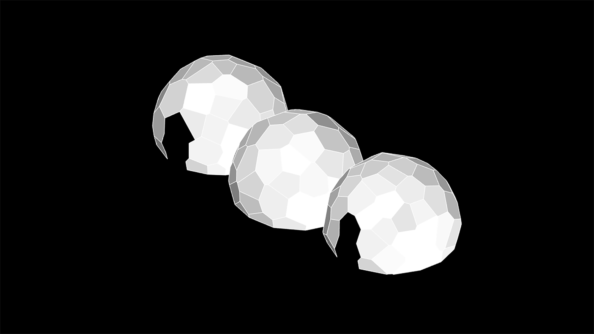

import Video from '@/components/Video.astro'

Este artigo é resultado de uma investigação sobre a influência dos processos digitais no Design e sua importância na inovação dentro da arquitetura efêmera através do conceito High-Low. A arquitetura efêmera tem o potencial de aliar conhecimento acadêmico e artístico à produção comercial brasileira. Aqui é apresentado um estudo de caso experimental projetado para a Expo Revestir para a Docol em 2017 que equilibra o paradigma do design computacional com o campo acadêmico e aplicações comerciais viáveis.

<Video src="/media/publications/high-low-as-expression-of-the-brazilian-digital-fabrication/o3-pavilion-kangaroo-relaxation.mp4" caption="Parametric model after Kangaroo relaxation." />

<Video src="/media/publications/high-low-as-expression-of-the-brazilian-digital-fabrication/o3-pavilion-assembly-sequence.mp4" caption="Panel assembly sequence." />

