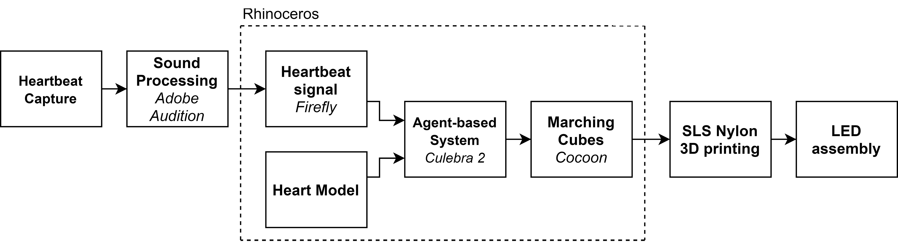

import Video from '@/components/Video.astro'

Life Lamp representou um esforço duplo, servindo tanto como um projeto quanto como uma iniciativa de pesquisa. Como freelancer, dediquei minhas tardes a colaborar com o Estúdio Guto Requena, contribuindo com a estratégia computacional para dar vida ao conceito já estabelecido. O processo de design é um híbrido entre abordagens top-down e bottom-up. Trabalhamos tanto com modelos 3D predefinidos em forma de coração para a base do design quanto com modelagem baseada em agentes, amplamente explorada por Craig Reynolds na década de 1980.

A parte de programação foi desenvolvida usando Grasshopper 3D, o plugin Culebra v2.0 para a modelagem baseada em agentes em conjunto com o plugin Firefly para capturar os batimentos cardíacos. Este trabalho se tornou mais tarde um artigo apresentado no ECAAD 2020: [Connecting Design and People Through Emotion](http://papers.cumincad.org/data/works/att/ecaade2020_389.pdf)

Hoje em dia é possível usar tecnologia para alcançar produtos orientados à emoção do usuário. O objetivo deste artigo é abordar uma exploração de design que combina o uso de modelagem algorítmica que busca expressar significado por meio de vínculos emocionais com as pessoas. Life Lamp foi criado para representar um ciclo de vida como um objeto sensível composto por três camadas e uma tonalidade única que produz uma imagem complexa, expressando os caminhos e surpresas da nossa existência. Os designers trabalharam tanto com um modelo 3D predefinido em forma de coração como base de design quanto com modelagem baseada em agentes, amplamente explorada por Craig Reynolds na década de 1980. Life Lamp é um produto que surgiu como resultado da pesquisa do Estúdio Guto Requena que investiga o impacto da cultura digital por meio do design buscando fundir tecnologia e afeto.

<Video src="/media/publications/life-lamp-connecting-design-and-people-through-emotion/life-lamp-animation-01.mp4" caption="Agents creating the structure using the heartbeat of a preborn." />

<Video src="/media/publications/life-lamp-connecting-design-and-people-through-emotion/life-lamp-animation-02.mp4" caption="Intermediate step: connecting the preborn shape with the adult shape." />

<Video src="/media/publications/life-lamp-connecting-design-and-people-through-emotion/life-lamp-animation-03.mp4" caption="Agents creating the structure using the heartbeat of an adult." />

