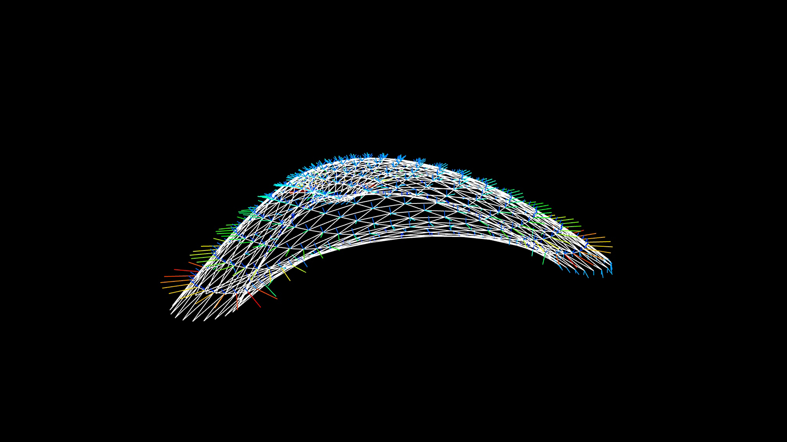
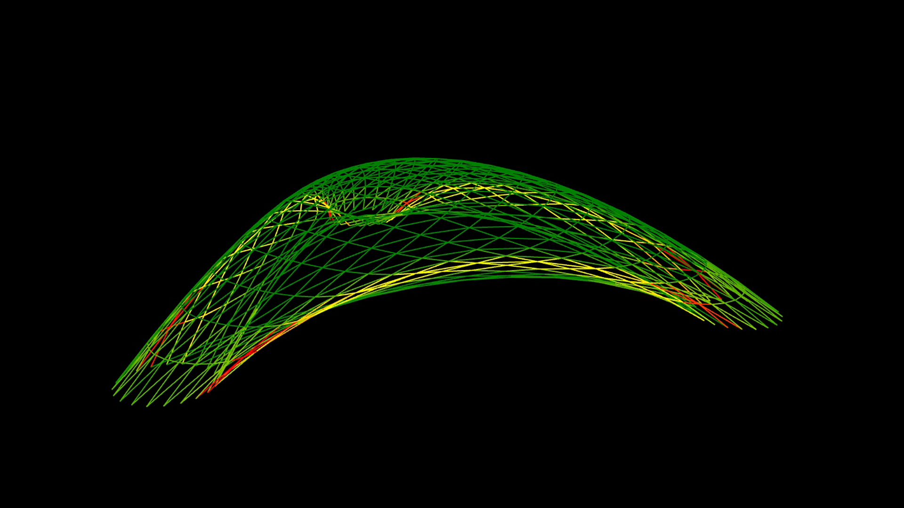
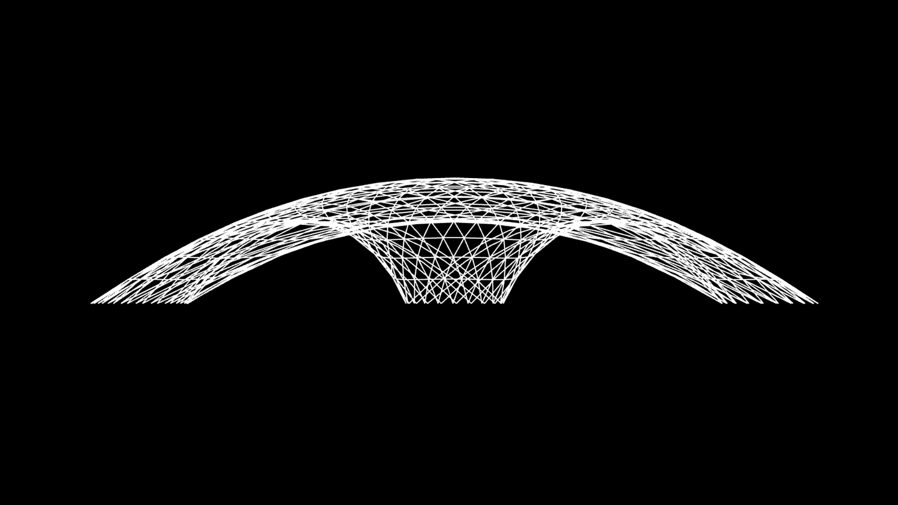
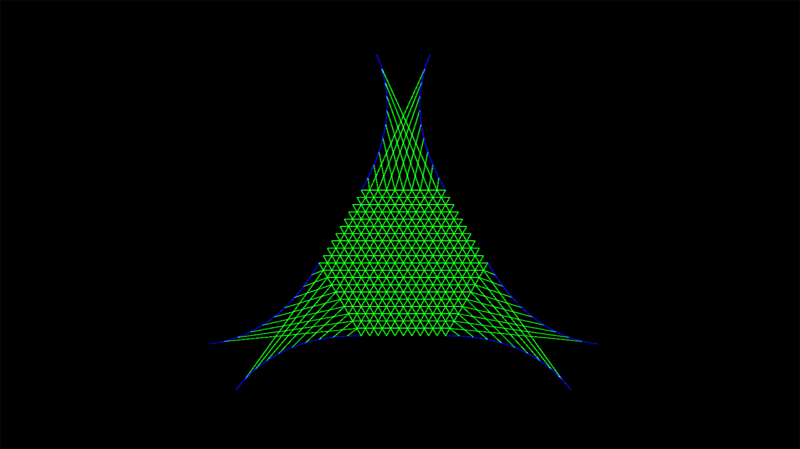

import Video from '@/components/Video.astro'

<Video src="/media/research/bending-active-bamboo/form-finding.mp4" caption="Form-finding process." />

Dies war die Arbeit, die Lena Strobel und ich für den ITECH-Kurs Form und Struktur erstellt haben. Wir ließen uns vom ZCB Bamboo Pavilion inspirieren, entwickelten aber unseren eigenen Workflow mit Grasshopper, Kangaroo Physics und K2Engineering.

Weitere Informationen zum Originalpavillon finden Sie hier:

