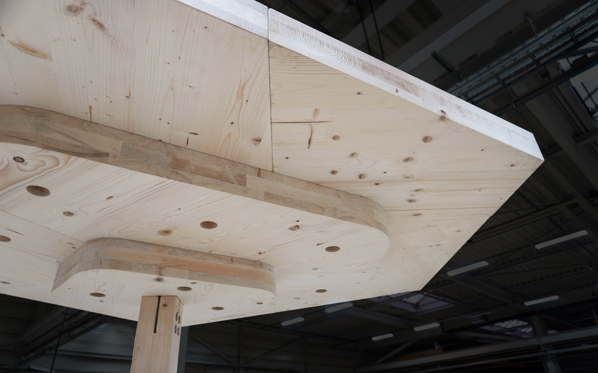

## Zusammenfassung
**Building Across Scales: Ein robotisches Holzfabrikationssystem für das Verpressen von Klebeverbindungen vor Ort**

Die Forschung schlägt ein heterogenes multiskalares robotisches Bausystem zur weiteren Automatisierung des Holzbaus vor Ort vor. Konkret wird der nächste Schritt in der Automatisierung des Klebens vor Ort vorgestellt, indem ein maßgeschneidertes robotisches Klemmgerät für das Anpressen von Holzelementen vor Ort eingeführt wird. Im Kern der Forschung steht daher die Entwicklung des Klemmroboters als Teil eines größeren robotischen Bauteams, bestehend aus einem Industrieroboter und einem Kran, im Co-Design mit dem Material- und Bausystem.
Ingenieurholz hat neue Möglichkeiten in der Art und Weise eröffnet, wie moderne Holzkonstruktionen gebaut und entworfen werden. Durch einfaches Aufeinanderstapeln von Holzlamellen und deren Kreuzverleimung ist es möglich, eine starke Verbindung zwischen den einzelnen Schichten herzustellen. Aufgrund von Transportbeschränkungen sind diese Holzelemente jedoch in ihrer Größe begrenzt, was zu modularen Bauteilen führt. Da dies eine schwache Verbindung zwischen den Elementen vor Ort darstellt, beschränkt es das System folglich auf lineare Spannweiten und resultiert in einer rasterbasierenden Architektur.
Diese Forschung führt ein Vor-Ort-Fabrikationssystem als Strategie ein, um über diese Einschränkungen hinauszugehen. Durch die Integration von Konstruktionslogiken in das Material wird ein Ansatz vorgestellt, der hohe Präzision während der Montage ermöglicht und den Betrieb eines Krans automatisiert. Ermöglicht durch die robotische Klemme, zielt es darauf ab, die Kreuzlaminierungs-Fertigungslogik von Ingenieurholz vor Ort fortzusetzen, um eine quasi-monolithische Platte zu schaffen. Dies ermöglicht eine punktgestützte Holzplatte von unbegrenzten Abmessungen, was mehr Gestaltungsflexibilität im Grundriss eröffnet und den architektonischen Entwurfsraum erweitert.
## Einführung
> Diese Forschung beabsichtigt, den Holzbau vor Ort durch die Entwicklung eines maßgeschneiderten **robotischen Klemmgeräts** für das Anpressen von **In-situ-Klebeverbindungen** weiter zu automatisieren.
Ingenieurholz hat neue Möglichkeiten in der Art und Weise eröffnet, wie moderne Holzkonstruktionen gebaut und entworfen werden [1]. Durch einfaches Aufeinanderstapeln von Holzlamellen und deren Kreuzverleimung ist es möglich, eine starke Verbindung zwischen den einzelnen Schichten herzustellen. Vor Ort wird diese Logik jedoch durchbrochen, da die einzelnen Elemente wie Balken, Platten und Wände lediglich nebeneinander platziert werden. Dadurch entstehen schwache Verbindungen zwischen den Bauteilen, was das System auf lineare Spannweiten beschränkt und in einer rasterbasierenden Architektur resultiert.
Stattdessen setzt diese Forschung die Fertigungslogik von Ingenieurholz fort. Durch die Skalierung nach oben zielt sie darauf ab, eine quasi-monolithische Platte zu schaffen, die sich über das gesamte Geschoss erstreckt, um mehr architektonische Freiheit zu ermöglichen.
Da die Skala eines gesamten Geschosses viel größer ist als die eines einzelnen BSP-Panels, gibt es derzeit keine Technologie, um diesen Ansatz zu automatisieren. Durch die Entwicklung einer maßgeschneiderten robotischen Klemme soll dieser Prozess automatisiert werden.
### Relevanz
#### Bauautomatisierung
Ein aktueller UN-Bericht zeigt einen stetigen Anstieg der städtischen Bevölkerung in den kommenden Jahrzehnten. Derzeit leben etwa 55 % der Weltbevölkerung in städtischen Gebieten, und bis 2050 wird erwartet, dass dieser Anteil auf 68 % steigt [2]. Dieser Trend unterstreicht die Notwendigkeit eines Bausystems, das sicher, erschwinglich, nachhaltig und automatisiert ist [3].
Obwohl der Bausektor einer der größten der Weltwirtschaft ist, hat er eine lange Geschichte niedriger Produktivität [4]. Studien zeigen, dass die Produktivität in den letzten Jahrzehnten kontinuierlich gesunken ist – im Gegensatz zum stetigen Produktivitätswachstum in anderen Branchen wie der Fertigung [5] (Abbildung 02).

Es gibt viele Faktoren, die zu dieser schlechten Leistung führen. Die Branche verfügt über ein breites Spektrum an Vorschriften, ist stark von der Nachfrage des öffentlichen Sektors abhängig und ist stark fragmentiert [4]. Dies stellt jedoch eine Chance für neue Marktteilnehmer dar, und eine mögliche Lösung zur Bewältigung des Produktivitätsproblems ist die Implementierung von Automatisierung und Robotik [5].
Obwohl Automatisierung und Robotik bereits seit 1970 im Bauwesen eingesetzt werden, haben sie noch nicht die notwendige Produktivitätssteigerung erreicht, um zu einer wirtschaftlich tragfähigen Alternative zu werden. Dies sollte jedoch nicht als Scheitern betrachtet werden, sondern als natürlicher Prozess, wenn ein bedeutender Technologiewandel im Gange ist [6]. Wesentliche technologische Fortschritte wie Big Data, drahtlose Sensornetzwerke und Building Information Modeling schaffen ein günstiges Umfeld zur Unterstützung effizienter Automatisierungs- und Robotersysteme im Bauwesen [7].
Laut Thomas Bock (2016) finden derzeit zwei bedeutende Technologiezyklen im Bauwesen statt. Einer umfasst die traditionellen Bausysteme, während der neue sich auf Digitalisierung, Automatisierung und Robotik bezieht (Abbildung 03). Technologiezyklen durchlaufen drei verschiedene Phasen: Innovation, Wachstum und Reife. Derzeit treten wir in die zweite Phase dieses neuen Zyklus ein, das Wachstum. In dieser Phase wird er die traditionellen Bausysteme schließlich übertreffen und in seiner letzten Phase, der Reife, in eine Massenadoption in der gesamten Branche münden [6].
#### Automatisierungsstrategien
Seit den Anfängen der Automatisierung im Bauwesen wurden viele Strategien erforscht, entwickelt und eingesetzt. Eine davon ist das Konzept der Vorfertigung, bei dem ein großer Teil des Bauprozesses in eine Fabrikumgebung verlagert wird, wodurch es einfacher wird, Bauteile sicherer und zuverlässiger in Serie zu produzieren (Abbildung 04). Diese strukturierte Umgebung ähnelt den Fabriken vieler anderer Branchen, wie der Automobil- und der Fertigungsindustrie, die bekannt dafür sind, günstige Bedingungen für den Einsatz konventioneller Industrieroboter an festen Standorten zu bieten. In der Bauindustrie müssen die Teile jedoch noch zu ihrem endgültigen Standort transportiert werden. Die Transportmodule sind in der Regel wesentlich größer als das Rohmaterial, wodurch Kosten, Logistik und lokale Vorschriften zu limitierenden Faktoren werden, die die endgültige Gestaltungsflexibilität beeinflussen [8].

Eine weitere Strategie, die seit den 1970er Jahren erforscht wird, ist die Baustellenfabrik. Anstatt die Fertigung von Teilen in eine externe Fabrik zu verlagern, wird die Baustelle selbst zur Fabrik. In diesem Szenario erhält die Baustelle, die sonst eine unstrukturierte Umgebung wäre, den Rahmen, der es Robotern erleichtert zu navigieren und den Bau eines Gebäudes zu beschleunigen. Diese Strategie hat beispielsweise zur Entwicklung von „fliegenden Fabriken" für Turmtypologien geführt, bei denen nach Fertigstellung jedes Stockwerks die gesamte Fabrik ein Stockwerk nach oben wandert (Abbildung 05). Die Probleme bei dieser Strategie sind, dass sie kostspielig ist, vor Baubeginn zu viel Zeit für den Aufbau der Fabrik benötigt und nur für repetitive Turmtypologien geeignet ist, was die Möglichkeit der Gestalter einschränkt, die Gesamtform individuell anzupassen [9] [8].
Ein flexiblerer Ansatz für Baustellenfabriken ist die transportable robotische Holzbau-Plattform (Abbildung 06). Sie besteht aus einem Container, der mit Robotern und Werkzeugen ausgestattet ist und direkt zur Baustelle geliefert werden kann. Sie ermöglicht die Integration von robotischer Montage in bereits bestehende Baumethoden. Die Stärke des Systems liegt darin, dass es standortunabhängig und rekonfigurierbar ist. Die vielfältigen Anpassungsmöglichkeiten der Plattform ermöglichen hohe Flexibilität. Dadurch wird es möglich, traditionelles Handwerk zu erweitern statt zu ersetzen und Qualität sowie Produktivität vor Ort zu steigern [10].

Eine dritte Strategie, die insbesondere im Forschungskontext erforscht wird, ist der Einsatz mobiler Roboter beim Bau des Tragwerks (Abbildung 07). Dieser Ansatz ist interessant, weil er die Idee der verteilten robotischen Montage erforscht, die zur Entwicklung ausgefeilter Algorithmen führt, die eine ausfallsichere dezentrale Bausequenz ermöglichen. Mit anderen Worten: Wenn bei einem Roboter etwas schiefgeht, würden die anderen die Lücke füllen, ohne die gesamte Montagelogik zu stören. Mobile Roboter haben zudem mehr Flexibilität als Baustellenfabriken oder die transportable Plattform und erreichen Orte, die beispielsweise für ein Portalsystem unmöglich wären. Allerdings sind mobile Systeme wesentlich komplexer in Sensorik und Steuerung, weniger präzise und aufgrund ihrer geringen Tragfähigkeit weniger energieeffizient [8].
Bislang ging es bei der Automatisierung im Bauwesen hauptsächlich um die Schaffung vollständig neuer Systeme. Deren Akzeptanz in der bestehenden Bauindustrie ist jedoch noch begrenzt. Wie bereits erwähnt, ist zu beobachten, dass sich die Baubranche im Vergleich zu anderen Branchen nicht so schnell entwickelt. Folglich ist es essenziell, bereits bestehende Bautechnologie zu integrieren, wenn man Montageprozesse automatisieren möchte.
Aufgrund der unstrukturierten und komplexen Natur des Bauwesens ist es entscheidend, die verschiedenen Aufgaben vor Ort zu betrachten, da einige besser für einen zentral gesteuerten großen Roboter wie einen Kran geeignet sein könnten. Andere hingegen könnten von einem Kollektiv aus Hunderten kleinerer Roboter profitieren [8].
Anstatt ein weiteres vollständig neues System zu entwickeln, könnte ein heterogenes Robotersystem einen großen Mehrwert bei der Automatisierung von Vor-Ort-Prozessen bieten. Laut Vasey et al. (2020) ist ein heterogenes Robotersystem ein „System bestehend aus Robotern mit unterschiedlichen Spezifikationen, Werkzeugen und Steuerungslogiken, die von verschiedenen Herstellern stammen oder aus handelsüblichen Komponenten und Steuerungen angepasst sein können" [9].
Blickt man auf die Spitzenforschung, sieht man, dass die Kombination von Robotern bereits in gewissem Maße stattfindet. Das Sequential Roof der ETH in Zürich ist ein Beispiel. Es hatte einen hochgradig automatisierten Vorfertigungsprozess (Abbildung 08), während die Montage vor Ort noch auf manuelle Arbeit angewiesen war [11] (Abbildung 09).

#### Holzbau
Holz ist eine geeignete Wahl zur Unterstützung von Automatisierungsprozessen vor Ort, da es ein etabliertes Baumaterial mit einem hohen Festigkeits-Gewichts-Verhältnis ist und leicht zu verarbeiten ist [12]. Insbesondere durch die frühe Implementierung modernster Fertigungstechnologien im Holzbau und die Leichtigkeit, mit der das Material bearbeitet werden kann, wurde die Automatisierung von Vorfertigungstechniken ermöglicht, beispielsweise durch computergesteuerte (CNC) Fräsbearbeitung in den 1970er Jahren [13]. Neben den technischen und strukturellen Vorteilen lässt sich mit dem steigenden Bewusstsein für nachhaltiges Bauen ein starker politischer Vorstoß in Richtung Holz erkennen. So schreibt beispielsweise die Holzbau Offensive Baden-Württemberg vor, dass jedes neue öffentliche Gebäude nach Möglichkeit aus Holz gebaut werden soll (Abbildung 10) [14]. Holzelemente sind jedoch aufgrund von Transportbeschränkungen in ihrer Größe begrenzt, was zu modularen Bauteilen führt, die vor Ort verbunden werden müssen. Dadurch entsteht eine schwache Verbindung zwischen den Elementen, was folglich zu linearen Spannweiten führt und eine gerichtete, rasterbasierte Architektur ergibt (Abbildung 11).

Abbildung 11 – Aktuelle Typologien von Holzbausystemen (Kaufmann, 2018).

Das Kleben vor Ort hat das Potenzial, die Herausforderungen zu überwinden, die sich aus einer modularen Bauarchitektur ergeben, da es eine starke Verbindung zwischen den einzelnen Teilen herstellen kann. Da bisher nur Klebstoff eine ausreichend starke Verbindung für einen kontinuierlichen Steifigkeitsgradienten bietet, bedeutet dies, dass Klebeverbindungen wesentlich stärker sind als traditionelle Methoden (Abbildung 12) [12] und ein mehrachsiges lasttragendes Plattenlayout ermöglichen könnten [15].

### Umfang
Der Umfang der Thesis ist die Automatisierung einer In-situ-Klebeverbindung, integriert in ein Holzbausystem. Daher ist der zentrale Aspekt der Forschung die Entwicklung eines maßgeschneiderten robotischen Geräts, das für das Verpressen der In-situ-Verbindung verantwortlich ist. Das Co-Design zwischen der robotischen Klemme und dem Holz ermöglichte die Vereinfachung des robotischen Entwurfs und die Entwicklung eines Materialsystems, das die vorgeschlagenen Technologien optimal nutzen kann.
Weiterhin wird die Möglichkeit diskutiert, die gesamte Baukette zu automatisieren, realisiert durch die Implementierung einer cyberphysischen Holzfabrikationsplattform (TIM), die für die Vorfertigung von Holzelementen vor Ort zuständig ist. Eingebettete Sensorstrategien im robotischen Gerät ermöglichen die Echtzeit-Lokalisierung und Überwachung des Montageprozesses und erlauben die Kommunikation und Koordination mit einem Kran zur Automatisierung der In-situ-Positionierung vorgefertigter Elemente.
Der Umfang der Forschung kann in zwei Teile unterteilt werden:
- Die Untersuchung eines Materialsystems, das Holzelemente und die Automatisierung einer In-situ-Verbindung nutzt.
- Die Entwicklung eines heterogenen Robotersystems, einschließlich der Koordination zwischen allen Akteuren – von der Vor-Ort-Fertigung bis zur In-situ-Fügung.
Beide Systeme müssen koordiniert entworfen werden, sodass sich die Einschränkungen und Parameter gegenseitig kontinuierlich informieren (Abbildung 13).

## Forschung
### Kontext
#### Kleben vor Ort
Üblicherweise müssen Klebeverbindungen in einer kontrollierten Umgebung hergestellt werden, da die Anwendung von klimatischen Parametern wie Luftfeuchtigkeit und Temperatur abhängt. Jüngste Forschungen in der Holzklebstofftechnologie und Materialwissenschaft zeigen jedoch eine vielversprechende Richtung [16].
Ein Beispiel für ein erfolgreiches Vor-Ort-Klebeverfahren ist die neue Technologie von TS3 (Abbildung 14), die es ermöglicht, verschiedene Holzelemente vor Ort zu verbinden, um mehrachsig lasttragende Platten herzustellen [17, S. 3]. Der Nachteil ist, dass der Prozess des Klebstoffauftrags vollständig manuell und sehr arbeitsintensiv ist (Abbildung 15). Zudem vergrößert der Spalt zwischen den Holzelementen, der manchmal einige Millimeter breit ist, die benötigte Klebstoffmenge drastisch.

Ein Ansatz zur Reduzierung der Klebstoffmenge ist die Verwendung von Schrauben (Abbildung 16). Durch das Verpressen des Klebstoffs während des Trocknungsprozesses ist es möglich, eine starke Verbindung herzustellen, wobei nur ein Bruchteil des ursprünglich benötigten Klebstoffs verwendet wird [18].
Der Nachteil ist jedoch, dass dieser Prozess wiederum sehr arbeitsintensiv ist. Da die Schrauben zudem eine temporäre Funktion erfüllen, werden sie üblicherweise im Holz belassen, weil die Arbeitskosten für ihre Entfernung deutlich höher sind als der Wert der Schraube selbst.

Abbildung 16 – Sequenz des In-situ-Klebeprozesses unter Verwendung von Schrauben zur Erzeugung des notwendigen Pressdrucks.
### Stand der Technik
#### Chicago Horizon [19]
Chicago Horizon ist ein öffentlicher Pavillon im Grant Park mit Blick auf den Michigansee (Abbildung 17). Er verkörpert modernistische Schönheit in seiner minimalistischen Komposition: Eine flache Holzdachebene wird einfach von einem Feld aus Holzstützen getragen.

Das Ziel ist die Schaffung einer monolithischen Holzplatte durch Aufeinanderstapeln von BSP-Platten und deren Verschraubung. Die Lösung besteht in zwei senkrecht aufeinander gestapelten Schichten von BSP-Platten (Abbildung 18). BSP-Platten sind anisotrop und spannen nur in eine Richtung, aber durch die senkrechte Stapelung erhalten sie bidirektionale Eigenschaften.

#### Mass Timber Fastening [20]
Ein Versuch, das Verschrauben zu automatisieren, ist das Projekt Mass Timber Fastening mit robotischen Befestigungsmaschinen (Abbildung 19), die es ermöglichen, eine Vielzahl von Schrauben gleichzeitig einzusetzen. Sie werden jedoch weiterhin manuell bedient, und die Logistik des Transports dieser Maschinen mit all ihren Kabeln von einem Bereich zum anderen macht diesen Prozess kaum effizienter als manuelles Verschrauben.

Jede BSP-Schicht besteht aus 3-Schicht-BSP aus Schwarzfichte mit einer Grundfläche von 2,4 m × 17,0 m (105 mm dick). In der ersten Schicht werden die BSP-Platten mit Sperrholzleisten an der Naht verschraubt. Die zweite Schicht von Platten, die senkrecht zur ersten liegt, wird nach dem gleichen Verfahren verbunden und dann mit einer Anordnung von Schrauben an der darunter liegenden Schicht befestigt. Auf diese Weise kombiniert das Endprodukt BSP-Platten, die durch Nagellaminierung verbunden sind (NLT). Das Ergebnis ist eine Dachkonstruktion von 210 mm Dicke mit Spannweiten von bis zu 9 m zwischen den Stützen. Obwohl dies zu einer insgesamt geringen Plattendicke führt und sogar eine freie Stützenplatzierung ermöglicht, ist es strukturell auf ein einzelnes Geschoss beschränkt. Zudem fehlt bei fast 50 Schrauben pro Quadratmeter die Skalierbarkeit.
#### Automatische Montage gefügter Holzstrukturen mit verteilten robotischen Klemmen [21]
Das Projekt der ETH in Zürich verfolgt einen anderen Ansatz. Anstatt zu versuchen, eine große Maschine zur Automatisierung einer Bauaufgabe zu entwickeln, verwenden sie verteilte Klemmen zur Montage der Verbindungen einer komplexen Holzstruktur (Abbildung 20). Durch die Zusammenarbeit mit einem Industriearm überwinden diese Klemmen die Notwendigkeit, große Montagekräfte aufzubringen und Fehlausrichtungen während der Montage zu korrigieren. Das System mangelt jedoch an Skalierbarkeit, da es weiterhin auf die Reichweite eines Industrieroboters beschränkt ist.

## Entwicklung
### Methode
Wie bereits erwähnt, lassen sich unsere Methoden in zwei Teile gliedern: Auf der einen Seite die Untersuchung und Entwicklung eines Materialsystems, das Holzelemente und eine In-situ-Klebeverbindung nutzt. Auf der anderen Seite die Entwicklung eines heterogenen Robotersystems, einschließlich der Koordination aller Akteure – von der Vor-Ort-Fertigung bis zur In-situ-Fügung.

### Forschungsentwicklung
Die Forschung begann mit der Untersuchung akademischer und industrieller Akteure vor Ort und deren Vergleich unter verschiedenen Aspekten, um potenzielle Übereinstimmungen für ein kollaboratives Bauszenario zu finden. Es zeigt sich, dass keiner der Akteure alle Bereiche allein abdecken kann, aber durch die Kombination vieler Akteure können die Schwächen jedes Systems kompensiert werden. Während verteilte Roboter beispielsweise nicht die Traglasten eines traditionellen Krans erreichen können, punkten sie in anderen Bereichen wie der Präzision, da sie für eine spezifische Aufgabe angepasst werden können. Durch die Kombination beider Systeme – Kran und verteilte Roboter – könnten sie voneinander profitieren und Aufgaben mit hoher Traglast bei gleichzeitig hoher Präzision ausführen. Eine potenzielle Kombination aus Kran, TIM und verteiltem Roboter leitete die nächsten Schritte dieser Forschung.

Abbildung 23 – Vergleich verschiedener robotischer Akteure vor Ort.
#### Maßgeschneidertes robotisches Gerät
Aufbauend auf verfügbarer Bautechnologie wurde eine neue robotische Spezies für die In-situ-Verbindung vorgeschlagen. Das Ziel war es, eine In-situ-Klebeverbindung zwischen den verschiedenen Holzelementen herzustellen. Anstatt eine große Maschine zum Verschrauben und Erzeugen des nötigen Drucks zu entwickeln, wie es beim Stand-der-Technik-Projekt „Mass Timber Fastening" geschieht (Abbildung 24), folgt unsere Forschung einer ähnlichen Richtung wie das andere erwähnte Stand-der-Technik-Projekt „Automatic Assembly of Jointed Timber Structure Using Distributed Robotic Clamps" [21]. Wir dachten: Warum nicht ein kleineres Gerät schaffen, das den Druck ebenso gut aufbringen kann wie eine Ansammlung von Schrauben, aber danach automatisch entfernt werden kann (Abbildung 25)?

Die Idee, wie dieses Gerät funktioniert, ist, dass vorgebohrte Löcher im Holz vorhanden sind, durch die das Gerät vor Ort eingeführt werden kann, um seinen Druck zu entfalten. Dafür muss es zwei Dinge tun: Es muss sich im Holz verklemmen und den für die Trocknung des Klebstoffs erforderlichen Druck aufbringen. Nach dem Einsatz kann das Gerät dann seinen Druck vom Loch lösen und zu Boden fallen. Dies ermöglicht die Automatisierung der In-situ-Verbindung.
Durch die Wiederverwendbarkeit dieses Geräts ist es zudem möglich, kein Metall in der Struktur zurückzulassen, was mehr Möglichkeiten für ein Nachleben am Ende der Lebensdauer einer Struktur eröffnet. Laut Jianmei Wu ist der Engpass bei der Demontage von Holzgebäuden die Entfernung der Verbindungen. Daher wird mehr Zeit für den Rückbau der Struktur aufgewendet als für das schnelle Abreißen [22].
#### Heterogenes Robotersystem
Durch die enge Verknüpfung aller verschiedenen Baustellen-Akteure ist es möglich, ein heterogenes Robotersystem zu schaffen, das in verschiedenen Maßstäben arbeiten kann, um sich gegenseitig zu ergänzen. Um das Gerät optimal zu nutzen, besteht dieses System aus drei Schritten: einer mobilen industriellen Roboterplattform zur Vorbereitung der vorgefertigten Holzelemente, einschließlich des Auftrags von Klebstoff auf die Platten; einem Kran für den Transport; und schließlich der In-situ-Fügung der Elemente durch unser Gerät. Jeder dieser Schritte ist eng aufeinander abgestimmt, um einen kollaborativen Arbeitsablauf zu erreichen.

#### Bausystem
Da Gestaltungsabsichten und Baustellenbedingungen variieren können, ist es essenziell, dass das Bausystem nicht statisch ist, sondern vielmehr ein adaptiver Rahmen, der darauf reagieren kann. Die beiden Hauptkomponenten bestehen aus der Material- und der Roboterseite.
Wenn wir etwas herauszoomen, sehen wir, dass viele Unterparameter sich gegenseitig beeinflussen. Durch ein Co-Design dieser Parameter ist es möglich, ein Fabrikationssystem zu erreichen, das auf ein globales Design zugeschnitten ist.
Beispielsweise ist einer der kritischen Aspekte der Paneellogik die maximale montierbare Plattengröße, da sie durch den maschinellen Morphospace [23] der mobilen Roboterplattform definiert wird. Mit dem Setup von TIM wären Platten von 3 × 2 m möglich [10]. Je nach Setup (z. B. durch Hinzufügen einer Linearachse) könnten sich diese Dimensionen ändern, sodass das System in verschiedenen Auflösungen von Plattenabmessungen arbeiten kann. Die folgenden Kapitel demonstrieren den rechnerischen Workflow des Bausystems unter Berücksichtigung dieser Einschränkung.

*** Paneellogik***
Die Paneellogik beginnt am Mittelpunkt jeder Stützenposition. Diese können je nach bestimmter Gestaltungsabsicht festgelegt werden. Alternativ ist es durch die Vorgabe einer bestimmten Grundstücksgrenze möglich, mit einem Stützenverteilungsalgorithmus zu beginnen, um eine gleichmäßige Verteilung sicherzustellen. Mit Hilfe von Karamba3D wird dann das Biegemoment der Platte berechnet. Die Paneele werden so angeordnet, dass die Paneelfugen die Bereiche mit hohem Biegemoment vermeiden. Dies mündet natürlich in einer „Pilzstützen"-Ästhetik, da die maximalen Biegemomente üblicherweise an der Stützenoberkante und in der Mitte der Spannweite zwischen den Stützen zu finden sind. Die Paneele werden dann aufeinander gestapelt, von der Stütze nach außen, wobei ein letztes Paneel die Mittelspannweite zwischen benachbarten Stützen überbrückt. Neben dem strukturellen Aspekt wird die Paneellogik auch von der Fertigungsseite und, wie bereits erwähnt, von den standortspezifischen Einschränkungen wie Transportlimitierungen und dem maschinellen Morphospace der mobilen Industrieplattform geleitet.

***Klebstoffverteilungslogik***
Nach der Festlegung der Paneellogik wird das Strukturmodell erneut analysiert, um die Klebstoffverteilungslogik zu informieren, die letztlich den Abstand der Löcher des Holzsystems für das In-situ-Verpressen definiert. In diesem Entwicklungsschritt war eine zentrale Frage: Wie können wir den Klebstoffverbrauch reduzieren und den Arbeitsaufwand vor Ort minimieren?
Da der Klebstoff immer stärker als Holz ist und Kräfte nur in Form von Schub übertragen kann, treten Systemversagen tendenziell als In-plane-Abscherung von Holzfasern neben der Klebstoffgrenzfläche auf. Daher werden die Querschnittsspannungen, die von der Platte in die Stütze fließen, berechnet und durch die In-plane-Scherfestigkeit des BSP geteilt. Daraus ergibt sich eine Heatmap, die Bereiche hervorhebt, in denen mehr Klebstoff benötigt wird. Abhängig von der Dimensionierung des maßgeschneiderten robotischen Geräts ist es möglich, die entsprechende Gerätekraft und die resultierende Einflussfläche zu berechnen, die verpresst werden kann. Mit diesen Informationen kann die Heatmap dann mit der richtigen Anzahl robotischer Geräte bestückt werden, sodass das erforderliche Druckniveau überall erreicht wird. Die Klebstofflinien werden dann für die spätere Anwendung vor Ort ausgerichtet, um den robotischen Werkzeugpfad zu optimieren.

***Ausrichtungskanäle***
Um mit den Toleranzen des Krans arbeiten zu können, werden zusätzliche Informationen in das Material eingebettet, um den Prozess der automatisierten Montage effizienter zu gestalten. Dies geschieht durch das Einfräsen von Ausrichtungskanälen in ein Paneel und das Einsetzen von Ausrichtungsdübeln in das andere. Dieses System funktioniert ähnlich wie LEGO-Steine. Dieser Prozess wird abhängig von der Paneellogik und der entsprechenden Montagereihenfolge der einzelnen Paneele generiert.
Die Sequenz ist wie folgt: Zuerst wird die Platte abgesenkt, bis die Dübel auf die darunterliegende Plattenoberfläche treffen; dann kann die Platte entlang der Oberfläche gezogen werden, bis die Holzdübel in die Ausrichtungskanäle gleiten. Dadurch wird die Bewegung der Platte in einer Richtung minimiert; sie kann dann durch den eingefrästen Kanal gezogen werden, bis die Dübel in ihre zugewiesenen Löcher gleiten.

#### Konstruktionsszenario
Nun vor Ort angekommen, wird der Montageprozess demonstriert. Im ersten Schritt werden die vorgefertigten Holzpaneele durch die mobile Roboterplattform (TIM) für die Montage vorbereitet, bevor sie in situ platziert werden.

Abbildung 49 – Und nach einer bestimmten Zeit, nachdem der Klebstoff getrocknet ist, kann das Gerät seinen Druck vom Loch lösen und zu Boden fallen, um wieder in das System zurückgeführt zu werden.
#### Hardware-Entwicklung
Das Gerät kann in vier Komponenten unterteilt werden: Das Steuerungssystem und ein Anker oben, der Kontraktionsmechanismus in der Mitte und ein weiterer Anker unten.
Grundsätzlich muss das Gerät zwei Dinge tun: Es muss sich im Holz verklemmen und den für die Trocknung des Klebstoffs erforderlichen Druck aufbringen. Eine der größten Herausforderungen dabei ist, dass das Gerät so klein wie möglich sein muss, während es so viel Druck wie möglich aufbringt.

Wir haben uns daher für einen pneumatischen Ansatz entschieden, da diese Systeme ein hervorragendes Leistungsgewichtsverhältnis aufweisen. Sie benötigen zudem wenig Wartung, sind kostengünstig und sehr robust, da sie feuer- und wasserbeständig sind. Um den erforderlichen Druck im Gerät bereitzustellen, verwenden wir eine nachfüllbare CO2-Patrone. Hier wird CO2 in flüssiger Form gespeichert, was es ermöglicht, das gesamte Gerät auf einen Betriebsdruck von 6 bar aufzublasen.
In unserem Fall verwenden wir einen pneumatischen Muskel, der aktiviert werden kann, um eine lineare Zugbewegung auszuführen. Wenn der Muskel aufgeblasen wird, dehnt er sich radial aus und kontrahiert entlang der Achsen, wodurch eine Zugkraft erzeugt wird.
Diese Bewegung wird dann mit dem unteren Anker gekoppelt. Durch eine Feder am unteren Ende wird die erste Bewegung des Muskels in eine Faltbewegung des Ankers umgewandelt, die dann zum Einhaken in das Holz führt.

Durch die Positionierung beider Anker an der Außenseite der Platten ist es möglich, die größtmögliche Fläche zu erreichen. Abhängig von der Tiefe der beiden verpressten Platten und der Stärke des Geräts kann die mögliche Einflussfläche mit den zuvor erklärten Methoden berechnet werden. Das Gerät selbst kann über eine WLAN-Verbindung gesteuert werden, sodass Zeit und Dauer der Inflation je nach Öffnungs- und Presszeit des gewählten Klebstoffs angepasst werden können.
Nachdem der Klebstoff getrocknet ist, kann das CO2 aus dem System abgelassen werden, um den Druck auf die Anker zu lösen, sodass das Gerät für den nächsten Einsatz zu Boden fallen kann.
Wir haben auch verschiedene Möglichkeiten untersucht, das Gerät während des Verpressens des Klebstoffs zu schützen. Dazu gehörten Vaseline, gefräste Kanten um die Innenseite des Lochs und verschiedene Arten von Papier. Letztlich haben wir uns für ein dünnes Blatt Papier entschieden, das um das Gehäuse des Geräts gewickelt wird, da dies die einfachste Lösung zu sein schien. Abhängig von der Wahl des Klebstoffs sehen wir dies jedoch nicht als zwingend notwendig an. Beispielsweise führte das Belassen eines 1-cm-Abstands vom Lochrand bei Verwendung eines nicht schäumenden Klebstoffs wie 2K-PUR-Klebstoff nicht dazu, dass Klebstoff in das Loch gedrückt wurde.

#### Festigkeitstest
Um die Festigkeit unseres Geräts zu bewerten, führten wir einen Zugfestigkeitstest durch. Dies geschah, indem das Gerät zwischen Decke und Boden aufgehängt und der Muskel mit CO2 aufgeblasen wurde.
Der Festigkeitstest wurde mit verschiedenen Kontraktionslängen wiederholt, die von 5 % bis 25 % der Gesamtkontraktion des pneumatischen Muskels reichten. Dies wurde durch Anpassung der Seilspannung eingestellt. Im aufgeblasenen Zustand bei 5 % Kontraktion erreichte unser kleiner Muskel ca. 500 N, während der große Muskel 2000 N erzielte – beides etwa die Hälfte der geschätzten Festigkeit, die theoretisch in einem industriellen Setup möglich wäre. Der Grund dafür ist, dass unsere CNC-gefrästen Teile nicht 100 % luftdicht waren, was es unmöglich machte, das maximale Druckniveau aufrechtzuerhalten, für das der pneumatische Muskel ausgelegt war. Wir sind jedoch der Ansicht, dass mit einer weiteren Iteration des Ventildesigns und präziser Fertigung die geschätzte Festigkeit erreicht werden könnte.

#### Berechnung des Lochabstands
Die Berechnung der Einflussfläche für das robotische Gerät basiert auf der Berechnung des Schraubenabstands für eine Klebstoff-Druckanwendung. Alle Berechnungen wurden mit einer 200 mm dicken Fichtenplatte und einer Klebstoffmenge von 300 g/m² durchgeführt.
Die erste Studie basierte auf einem Mindestdruck von 0,1 N/mm², da dies die aktuelle Anforderung der DIN-Norm ist. Durch verschiedene Abstände zwischen den Geräten ändert sich die Einflussfläche und damit auch die erforderliche Kraft, die von jedem Gerät aufgebracht werden muss. Diese relativ benötigte Kraft bestimmt dann die Dimensionierung und den Durchmesser des robotischen Geräts.
Die zweite Studie basiert auf einem Mindestdruck von 0,03 N/mm², wie in einem Artikel der Helsinki University of Technology [18] angegeben, der Tests auf diesem Druckniveau durchführte und feststellte, dass es möglich ist, eine Klebefuge zu erreichen, deren Scherfestigkeit genauso gut ist wie die bei normalen Drücken verpressten. Die Bedingung für erfolgreiches Kleben ist, dass die geklebten Flächen ausreichend glatt sind.
Die letzte Studie verwendet einen Mindestdruck von 0,01 N/mm², der optimistischer ist, aber wie bereits erwähnt, zeigt die jüngste Forschung in der Materialwissenschaft eine vielversprechende Richtung. Dies würde bereits eine Einflussfläche von 150.000 mm² für ein Gerät mit einem Durchmesser von 40 mm ergeben.

#### Ausrichtungsstrategie
Obwohl wir uns im aktuellen Entwicklungsschritt hauptsächlich auf den Verpressmechanismus konzentriert haben, haben wir auch über eine Erweiterung des Geräts nachgedacht, um bei der Fügung und Montage der Paneele zu helfen. Während die Ausrichtungskanäle im Holz bei der Ausrichtung der Paneele auf den letzten Zentimetern helfen, könnte ein Kamerasystem den Kran während seines Betriebs navigieren, um in den Toleranzbereich der Ausrichtungskanäle zu kommen. Dies könnte durch die Erweiterung des robotischen Geräts mit einer eingebetteten Kamera im unteren Anker oder durch die Entwicklung eines zusätzlichen Geräts mit einer Kamera mit höherer Rechenleistung erfolgen. Zusätzlich könnten stabilere Stifte für die passive Ausrichtung der Elemente verwendet werden. Alternativ könnten dies Holzdübel sein, die nach der Montage in der Struktur verbleiben.
Die Idee ist, dass die Platte abgesenkt wird, bis die Dübel auf die Oberfläche der Holzstruktur treffen, von wo aus die Platte dann entlang der Oberfläche gezogen werden kann, bis die Holzdübel in den Ausrichtungskanal gleiten. Dadurch wird die Bewegung der Platte in einer Richtung minimiert; sie kann dann durch den eingefrästen Kanal gezogen werden, bis die Dübel in ihre zugewiesenen Löcher gleiten.

Die Ausrichtungskanäle wurden in zwei verschiedenen Versuchsanordnungen getestet. Die erste bestand aus 80 × 50 × 2 cm Holzplatten mit 1,5 cm dicken Dübeln, und die zweite aus einer 120 × 80 × 10 cm BSP-Platte mit 4 cm dicken Dübeln. Beide Tests validierten das geometrische Konzept des Ausrichtungskanals, da es möglich war, die Platten ohne manuelle Anpassungen in der richtigen Position zu montieren. Das Gleiten der Dübel war jedoch nicht so einfach wie erwartet, da die Reibung an der Dübelspitze oft dazu führte, dass die Dübel nicht entlang des Kanals glitten, sondern einen Drehpunkt der Platte um die Achse des Dübels erzeugten.
Ein Ansatz zur Lösung dieses Problems bestand darin, die Seile des Krans nicht an einem einzelnen Punkt mit freier Rotation an der Kranspitze zu befestigen, sondern vier einzelne Befestigungspunkte zu verwenden, die voneinander beabstandet sind. Weitere Iterationen am System, wie das Hinzufügen eines dritten Dübels pro Paneel oder das Anfasen der Kanäle, müssten vorgenommen werden, um das Konzept als effizient genug für den Betrieb durch einen autonomen Kran zu validieren.

Durch maschinelle Bildverarbeitung könnte das Gerät die Löcher während der Montage erkennen, während es mit dem Kran abgesenkt wird. Der Abstand zwischen den Löchern könnte dann mit dem digitalen Modell abgeglichen werden, um die aktuelle Position und Rotation des zu montierenden Paneels zu berechnen. Der gesamte Montagevorgang könnte dann durch ein Feedbacksystem automatisiert werden, das mit dem Betriebssystem des Krans verbunden ist. Die Dübel und Ausrichtungskanäle würden dann dazu dienen, das Paneel in seine endgültige Position gleiten zu lassen.
Die Platte würde abgesenkt, bis die Dübel auf die Oberfläche der Holzstruktur treffen, von wo aus sie dann entlang der Oberfläche gezogen werden kann, bis die Holzdübel in den Ausrichtungskanal gleiten. Dadurch wird die Bewegung der Platte in einer Richtung minimiert; sie kann dann durch den eingefrästen Kanal gezogen werden, bis die Dübel in ihre zugewiesenen Löcher gleiten.

Abbildung 62 – Locherkennung der Holzelemente mittels maschineller Bildverarbeitung.

Erste Tests wurden als Machbarkeitsnachweis für die vorgeschlagene Idee durchgeführt. Der Test wurde durchgeführt, indem eine externe Kamera am Paneel montiert wurde, das am Kran befestigt war. In unserem Fall verwendeten wir die IntelRealSense D435. Mit Hilfe der realsense2- und openCV-Bibliothek war es dann möglich, die Löcher zu erkennen. Dies geschah durch progressives Filtern des aufgenommenen Bildes, um ihre relative Entfernung als Koordinaten zur Kamera zu extrahieren. Es bestand aus einer Graustufen-Konvertierung des Bildes, gefolgt von einer Verwischung zur Rauschreduzierung und schließlich einer Schwellenwertfilterung für einen bestimmten Graustufenwert. Daraus konnten die Konturen herausgefiltert und deren Fläche überprüft werden, um sie mit der erwarteten Pixelgröße der Löcher abzugleichen. Diese Methode erwies sich unter guten Lichtverhältnissen als sehr zuverlässig. Da die Baustelle jedoch eine unstrukturierte Umgebung ist, müssten diese Methoden feinjustiert werden, um konsistentere Ergebnisse zu liefern.
#### Demonstrator
Ein verkleinerten Abschnitt des Holzsystems wurde als Demonstrator ausgewählt, um den Montageprozess zu validieren und die Systemtoleranzen zu bewerten. Er besteht aus einer Stütze mit drei Schichten von BSP-Platten mit einem Querschnitt von 10 cm, die kreuzlaminiert aufeinander gestapelt sind. Er erreicht einen Durchmesser von drei Metern an der Spitze und eine Gesamthöhe von 2,70 Metern.
Die Paneele wurden mit einer 3-Achs-CNC-Maschine gefräst, einschließlich der Bohrung der Löcher, der Einfräsung der Ausrichtungskanäle und des Zuschnitts der Konturen. Anschließend wurden die Paneele in das IntCDC-Labor in Waiblingen gebracht, um die Montage zu demonstrieren.

Das robotische Setup bestand hier aus TIM, einer mobilen Roboterplattform für die Holzfabrikation, einem Spinnenkran und unserem maßgeschneiderten Gerät. Zusätzlich wurde ein Endeffektor entwickelt, der bei der automatisierten Positionierung der Geräte und der Dübel hilft. Zwei Prozesse konnten bei der endgültigen Gerätemontage nicht demonstriert werden: Einerseits wurde das Auftragen des Klebstoffs manuell durchgeführt, da zu diesem Zeitpunkt die Klebepistole von TIM nicht betriebsbereit war, und andererseits wurden M20-Bolzen verwendet, um den Druck in situ aufzubringen, da ein einzelner betriebsfähiger Prototyp des robotischen Geräts nicht ausreichte, um die gesamte Struktur zu montieren.

Abbildung 66 – Aufnahme der Holzplatte und Platzierung im Arbeitsbereich der mobilen Roboterplattform.

Abbildung 67 – Dübel werden vom maßgeschneiderten Endeffektor platziert.

Abbildung 68 – Magazin für robotische Geräte.

Abbildung 69 – Klemmgerät wird in die Löcher eingesetzt.

Abbildung 70 – Kran hebt die Platte an.

Abbildung 71 – Kran positioniert die Platte auf der Struktur.

Abbildung 72 – Erkennung der Löcher zur Führung des Krans während der Montage.

Abbildung 73 – Dübel gleiten in den Ausrichtungskanal zur passiven Ausrichtung der Platten.

Abbildung 74 – Gerät fällt nach dem Verpressen heraus, bereit zum Einsammeln.

### Diskussion
Die Montage des finalen Demonstrators zeigte das Potenzial des Systems in einer 1:1-Anwendung. Obwohl der Prototyp des vorgeschlagenen Geräts die geschätzte Festigkeit nicht erreichte, sehen wir eine vielversprechende Entwicklung in diese Richtung. Wir sind optimistisch, dass diese Festigkeitswerte in weiteren Iterationen erreicht werden können. Ein weiterer Entwicklungspunkt des Geräts betrifft den Fallmechanismus. Obwohl der Mechanismus funktioniert, bestehen Bedenken hinsichtlich der Langlebigkeit des Geräts in einem realen Bauszenario. Frühere Ideen zur Lösung dieses Problems umfassen die Entwicklung eines Dämpfungsmechanismus am unteren Ende des Geräts. Ein anderer Ansatz könnte konzeptionell verfolgt werden, um die Notwendigkeit des Fallens des Geräts zu Boden zu überdenken.
Dank der Ausrichtungskanäle war es möglich, die Paneele mit sehr hoher Präzision zu montieren, ohne die Position der Paneele in situ anpassen zu müssen. Ein zusätzlicher Nebeneffekt der Dübel war, dass sie es ermöglichten, die gesamte Struktur ohne Gerüst zu montieren, da sie die Platten in einer ausreichend stabilen Position fixierten, um mit der In-situ-Druckanwendung fortzufahren. Dies war besonders wichtig, da der Schwerpunkt der „Blätter" zu diesem Zeitpunkt nicht auf der Hauptstruktur lag, was sie sonst hätte umkippen lassen. Befürchtungen wie das Abtropfen des Klebstoffs während des Paneeltransports mit dem Kran traten während der Montage nicht auf.
### Ausblick
Das vorgeschlagene Holzsystem zeigt das Potenzial zur Schaffung einer quasi-monolithischen Platte. Dies ermöglicht eine punktgestützte Holzplatte von unbegrenzten Abmessungen, was mehr Gestaltungsflexibilität im Grundriss eröffnet und den architektonischen Entwurfsraum erweitert. Um es jedoch vollständig als funktionierendes Bausystem zu validieren, müssen weitere Aspekte wie Schall- und Brandschutz sowie die Integration von Haustechnik berücksichtigt werden.
Die Forschung demonstrierte die Vorteile des Arbeitens in einem heterogenen Robotersystem und zeigte, wie durch Co-Design mit dem Material der Holzbau vor Ort weiter automatisiert werden kann. Die Integration von Konstruktionslogik in das Material stellt einen Ansatz dar, um hohe Präzision während der Montage zu erreichen und den Betrieb eines Krans zu automatisieren. Die Anwendung des verteilten Geräts für das In-situ-Verpressen von Klebeverbindungen zeigt vielversprechende Ansätze zur Automatisierung dieses Prozesses. Insbesondere angesichts der exponentiellen Entwicklung bei Materialklebstoffen und der Notwendigkeit, dass Holzkonstruktionen mit Beton konkurrenzfähig sein müssen, sehen wir ein großes Potenzial für den Einsatz des Geräts in einem industriellen Umfeld.
## Nachtrag
### Danksagungen
Wir möchten danken…
**Samuel Leder & Hans Jakob Wagner**
für ihre konstante Unterstützung während unserer Masterarbeit und wertvolle Einblicke, ohne die diese Arbeit nicht möglich gewesen wäre. Und natürlich für ihre Geduld und das Beantworten unserer E-Mails am späten Abend.
**Der gesamten ITECH-Klasse 2021**
für eine unglaubliche gemeinsame Zeit in den letzten zwei Jahren.
**Katja Rinderspacher**
für ihre stete Präsenz und Begleitung während unserer Zeit an der Universität.
**Bernhard Rolle**
für wertvolle Einblicke in Spitzenwissen zur Automatisierung und zu Kranen für die Montage vor Ort.
**Anja Lauer**
für das Beibringen von allem rund um den Kranbetrieb und ihr Vertrauen in uns, sie nicht zum Absturz zu bringen.
**Tzu-Ying Chen**
für ihre ingenieurtechnische Beratung und dafür, dass sie sich stets Zeit für unsere statischen Fragen nahm.
**Sergej Klassen & Kai Stiefenhofer**
für ihre Unterstützung und Anleitung während der Fertigung unseres Demonstrators.
**Michael Preisack, Michael Schneider & Michael Tondera**
für ihre Hilfe in der Holz- und Metallwerkstatt und ihre Geduld mit unseren schweren Holzplatten.
**Prof. Achim Menges & Prof. Jan Knippers**
für ihr wertvolles Feedback, ihre Weisheit und die Chance, Teil dieses Programms zu sein.
**Festo, Müllerblaustein und Henkel**
für die Beschaffung der Materialien und Ausrüstung, die nötig waren, um diese Arbeit zum Leben zu erwecken.
**IntCDC**
Teilweise unterstützt durch die Deutsche Forschungsgemeinschaft (DFG) im Rahmen der Exzellenzstrategie Deutschlands – EXC 2120/1 – 390831618.
**Familie & Freunde**
dafür, dass sie immer hinter uns standen und uns angefeuert haben.
### Referenzen
[1] H. Kaufmann, S. Krötsch, and S. Winter, Manual of multi-storey timber construction. Munich: Detail Business Information, 2018. ISBN 978-3955533946
[2] United Nations, Department of Economic and Social Affairs, and Population Division, World urbanization prospects: the 2018 revision. 2019. [Online]. Available: [https://population.un.org/wup/Publications/Files/WUP2018-Report.pdf](https://population.un.org/wup/Publications/Files/WUP2018-Report.pdf), (accessed Feb. 22, 2021) ISBN 978-92-1-148319-2
[3] K. H. Petersen, N. Napp, R. Stuart-Smith, D. Rus, and M. Kovac, "A review of collective robotic construction," Sci. Robot., vol. 4, no. 28, p. eaau8479, Mar. 2019, doi: 10.1126/scirobotics.aau8479.
[4] F. Barbosa et al., "Reinventing Construction: A Route to Higher Productivity," McKinsey & Company. [Online]. Available: [https://www.mckinsey.com/business-functions/operations/our-insights/reinventing-construction-through-a-productivity-revolution](https://www.mckinsey.com/business-functions/operations/our-insights/reinventing-construction-through-a-productivity-revolution), (accessed Feb. 02, 2021).
[5] T. Bock, "The future of construction automation: Technological disruption and the upcoming ubiquity of robotics," Autom. Constr., vol. 59, pp. 113–121, Nov. 2015, doi: 10.1016/j.autcon.2015.07.022.
[6] T. Bock and T. Linner, Robot-Oriented Design: Design and Management Tools for the Deployment of Automation and Robotics in Construction. New York: Cambridge University Press, 2015. doi: 10.1017/CBO9781139924146.
[7] B. G. de Soto and M. J. Skibniewski, "Future of robotics and automation in construction," in Construction 4.0, 1st ed., A. Sawhney, M. Riley, and J. Irizarry, Eds. Routledge, 2020, pp. 289–306. doi: 10.1201/9780429398100-15.
[8] N. Melenbrink, J. Werfel, and A. Menges, "On-site autonomous construction robots: Towards unsupervised building," Autom. Constr., vol. 119, p. 103312, Nov. 2020, doi: 10.1016/j.autcon.2020.103312.
[9] L. Vasey, B. Felbrich, M. Prado, B. Tahanzadeh, and A. Menges, "Physically distributed multi-robot coordination and collaboration in construction: A case study in long span coreless filament winding for fiber composites," Constr. Robot., vol. 4, no. 1–2, pp. 3–18, Jun. 2020, doi: 10.1007/s41693-020-00031-y.
[10] H. J. Wagner, M. Alvarez, O. Kyjanek, Z. Bhiri, M. Buck, and A. Menges, "Flexible and transportable robotic timber construction platform – TIM," Autom. Constr., vol. 120, p. 103400, Dec. 2020, doi: 10.1016/j.autcon.2020.103400.
[11] J. Willmann, F. Gramazio, and M. Kohler, "New paradigms of the automatic," in Advancing Wood Architecture, 1st ed., A. Menges, T. Schwinn, and O. D. Krieg, Eds. New York : Routledge, 2016.: Routledge, 2016, pp. 13–28. doi: 10.4324/9781315678825-2.
[12] M. H. Ramage et al., "The wood from the trees: The use of timber in construction," Renew. Sustain. Energy Rev., vol. 68, pp. 333–359, Feb. 2017, doi: 10.1016/j.rser.2016.09.107.
[13] A. Menges, "The New Cyber-Physical Making in Architecture: Computational Construction: The New Cyber-Physical Making in Architecture: Computational Construction," Archit. Des., vol. 85, no. 5, pp. 28–33, Sep. 2015, doi: 10.1002/ad.1950.
[14] "Ziele Handlungsfelder - Holzbau-Offensive BW." [https://www.holzbauoffensivebw.de/de/p/ziele-der-landesregierung/ziele-handlungsfelder-1075.html](https://www.holzbauoffensivebw.de/de/p/ziele-der-landesregierung/ziele-handlungsfelder-1075.html) (accessed Oct. 19, 2021).
[15] "Design as in reinforced concrete, but build in wood," Holz-Zentralblatt, p. 13, 2021. [Online]. Available: [https://www.ts3.biz/de/medien/pdf/Holzzentralblatt_01_2021Seite-2.pdf](https://www.ts3.biz/de/medien/pdf/Holzzentralblatt_01_2021Seite-2.pdf), access date: 24/02/2021.
[16] H. J. Wagner, H. Chai, Zhixian Guo, A. Menges, and P. F. Yuan, "Towards an On-site Fabrication System for Bespoke, Unlimited and Monolithic Timber Slabs," 2020, doi: 10.13140/RG.2.2.14098.68802/1.
[17] TS3, "Timber Structures 3.0." [Online]. Available: [https://www.ts3.biz/en/technologien/index.php](https://www.ts3.biz/en/technologien/index.php), (accessed Feb. 24, 2021).
[18] M. Kairi, Schraubenverleimungen erlauben neue Möglichkeiten im Ingenieurholzbau, "Screw gluing gives new possibilities for wood engineering," 2000. [Online]. Available: [https://www.forum-holzbau.com/pdf/matti_00.pdf](https://www.forum-holzbau.com/pdf/matti_00.pdf), (accessed Feb. 05, 2021).
[19] B. H. Schneider, A. Forrest, Y. Vobis, D. Croteau, and M. Oberholzer, "Development of a Two-way Column-supported Flat Plate in Cross Laminated Timber," in IABSE Symposium, Vancouver 2017: Engineering the Future, Vancouver, Canada, 2017, pp. 1957–1964. doi: 10.2749/vancouver.2017.1957.
[20] "Innovating to Thrive for the Next 130 Years," Swinerton, Oct. 19, 2020. [https://swinerton.com/blog/innovating-to-thrive-for-the-next-130-years/](https://swinerton.com/blog/innovating-to-thrive-for-the-next-130-years/) (accessed Jul. 27, 2021).
[21] P. Y. V. Leung, A. A. Apolinarska, D. Tanadini, F. Gramazio, and M. Kohler, "Automatic Assembly of Jointed Timber Structure Using Distributed Robotic Clamps," p. 10. [https://doi.org/10.3929/ethz-b-000481928](https://doi.org/10.3929/ethz-b-000481928)
[22] J. Wu, L. Liu, and H. Xu, "Evaluation Method For Wooden Buildings Disassemblability and Case Verification," p. 6, 2017. [https://doi.org/10.3390/su12062220](https://doi.org/10.3390/su12062220)
[23] A. Menges, "Morphospaces of Robotic Fabrication," in Rob | Arch 2012, S. Brell-Çokcan and J. Braumann, Eds. Vienna: Springer Vienna, 2013, pp. 28–47. doi: 10.1007/978-3-7091-1465-0_3.
### Abbildungsverzeichnis
Abb. 1 – Von den Autoren
Abb. 2 – T. Bock, 'The future of construction automation: Technological disruption and the upcoming ubiquity of robotics', Autom. Constr., vol. 59, pp. 113–121, Nov. 2015, doi: 10.1016/j.autcon.2015.07.022.
Abb. 3 – T. Bock, 'The future of construction automation: Technological disruption and the upcoming ubiquity of robotics', Autom. Constr., vol. 59, pp. 113–121, Nov. 2015, doi: 10.1016/j.autcon.2015.07.022.
Abb. 4 – Fertighaus – Vorteile und Bauweise. [Online]. Available: [https://www.bau-welt.de/haus-konfigurator/fertighaus.html](https://www.bau-welt.de/haus-konfigurator/fertighaus.html)
Abb. 5 – T. Bock, 'The future of construction automation: Technological disruption and the upcoming ubiquity of robotics', Autom. Constr., vol. 59, pp. 113–121, Nov. 2015, doi: 10.1016/j.autcon.2015.07.022.
Abb. 6 – H. J. Wagner, M. Alvarez, O. Kyjanek, Z. Bhiri, M. Buck, and A. Menges, "Flexible and transportable robotic timber construction platform – TIM," Automation in Construction, vol. 120, p. 103400, Dec. 2020, doi: 10.1016/j.autcon.2020.103400.
Abb. 7 – S. Lut, T. Stark, L. Siriwardena, S. Bechert, H. J. Wagner, und M. Maierhofer, „Robot team enabled carbon fibre joining strategies for lightweight wood construction", 2020
Abb. 8 – Sequential Roof. [Online]. Available: [https://ita.arch.ethz.ch/archteclab/sequential-roof-.html](https://ita.arch.ethz.ch/archteclab/sequential-roof-.html), (accessed Feb. 24, 2021)
Abb. 9 – Arch_Tec_Lab, ETH Zürich [Online]. Available: [https://www.luechingermeyer.ch/en/project/hib-gebaeude-eth-hoenggerberg-zuerich/](https://www.luechingermeyer.ch/en/project/hib-gebaeude-eth-hoenggerberg-zuerich/)
Abb. 10 – Holzbau Offensive Baden-Württemberg [Online]. Available: [https://www.holzbauoffensivebw.de/de](https://www.holzbauoffensivebw.de/de) (accessed Nov. 01, 2021)
Abb. 11 – H. Kaufmann, S. Krötsch, and S. Winter, Manual of multi-storey timber construction. Munich: Detail Business Information, 2018. ISBN 978-3955533946
Abb. 12 – M. H. Ramage et al., 'The wood from the trees: The use of timber in construction', Renew. Sustain. Energy Rev., vol. 68, pp. 333–359, Feb. 2017, doi: 10.1016/j.rser.2016.09.107.
Abb. 13 – Von den Autoren
Abb. 14 – Geschossdecken. [Online]. Available: [https://www.ts3.biz/de/teaser/Geschossdecken.php](https://www.ts3.biz/de/teaser/Geschossdecken.php) (accessed Nov. 01, 2021)
Abb. 15 – Rethinking Timber Building. [Online]. Available: [https://presse.atp.ag/en/news-detail/490-holzbau-neu-gedacht/1746](https://presse.atp.ag/en/news-detail/490-holzbau-neu-gedacht/1746)
Abb. 16 – Von den Autoren
Abb. 17 und Abb. 18 – B. H. Schneider, A. Forrest, Y. Vobis, D. Croteau, and M. Oberholzer, "Development of a Two-way Column-supported Flat Plate in Cross Laminated Timber," in IABSE Symposium, Vancouver 2017: Engineering the Future, Vancouver, Canada, 2017, pp. 1957–1964. doi: 10.2749/vancouver.2017.1957
Abb. 19 – Mass Timber Fastening by Swinerton's Innovation, 2021. [Online]. Available: [https://swinerton.com/blog/innovating-to-thrive-for-the-next-130-years/](https://swinerton.com/blog/innovating-to-thrive-for-the-next-130-years/)
Abb. 20 – P. Y. V. Leung, A. A. Apolinarska, D. Tanadini, F. Gramazio, and M. Kohler, "Automatic Assembly of Jointed Timber Structure Using Distributed Robotic Clamps," p. 10.
[https://doi.org/10.3929/ethz-b-000481928](https://doi.org/10.3929/ethz-b-000481928)
Abb. 21 bis Abb. 76 – Von den Autoren
## Anhang

