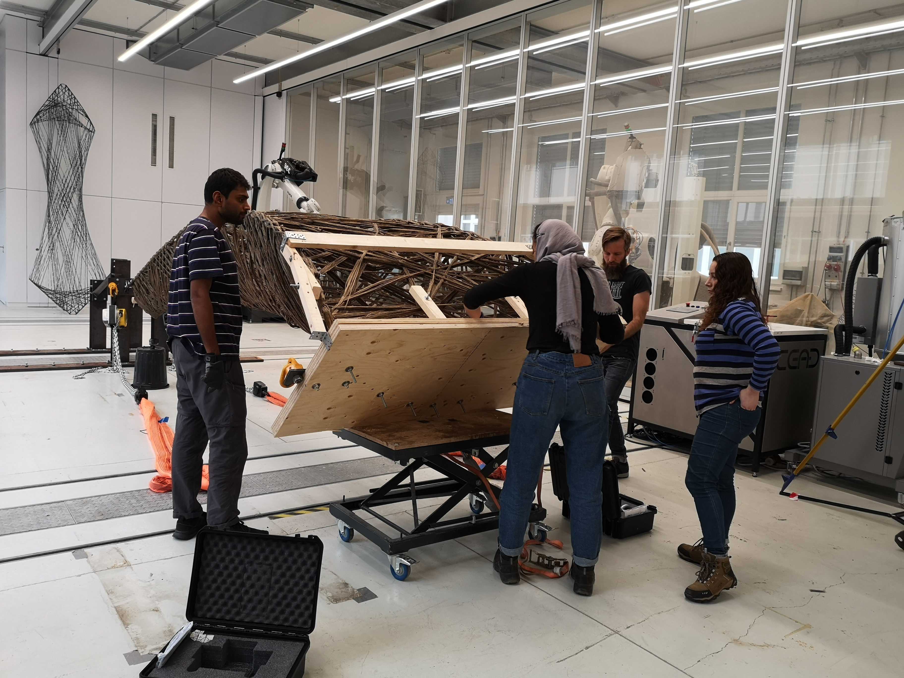
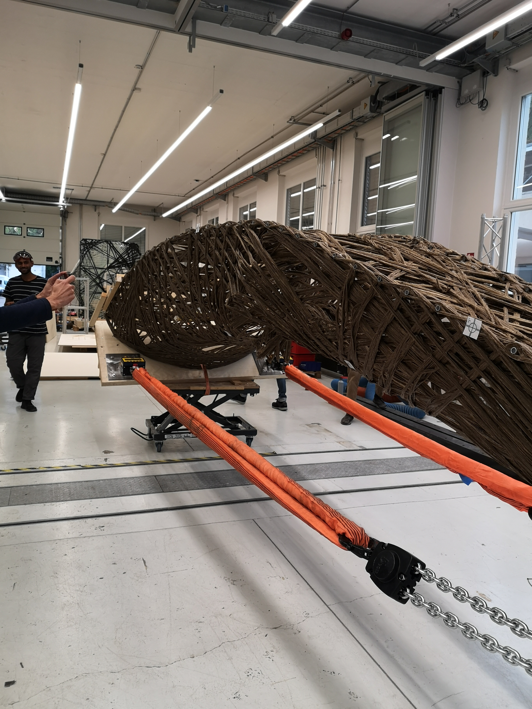
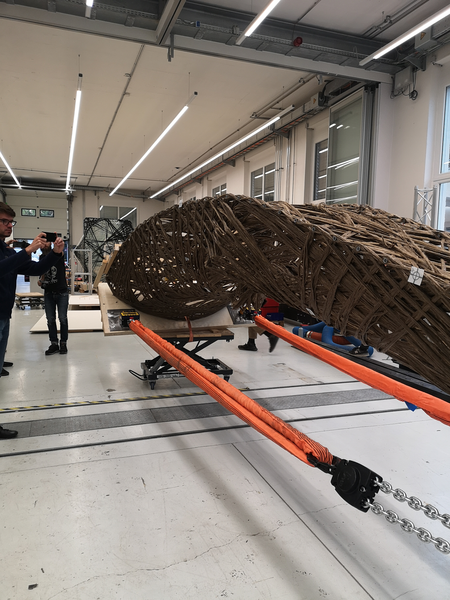
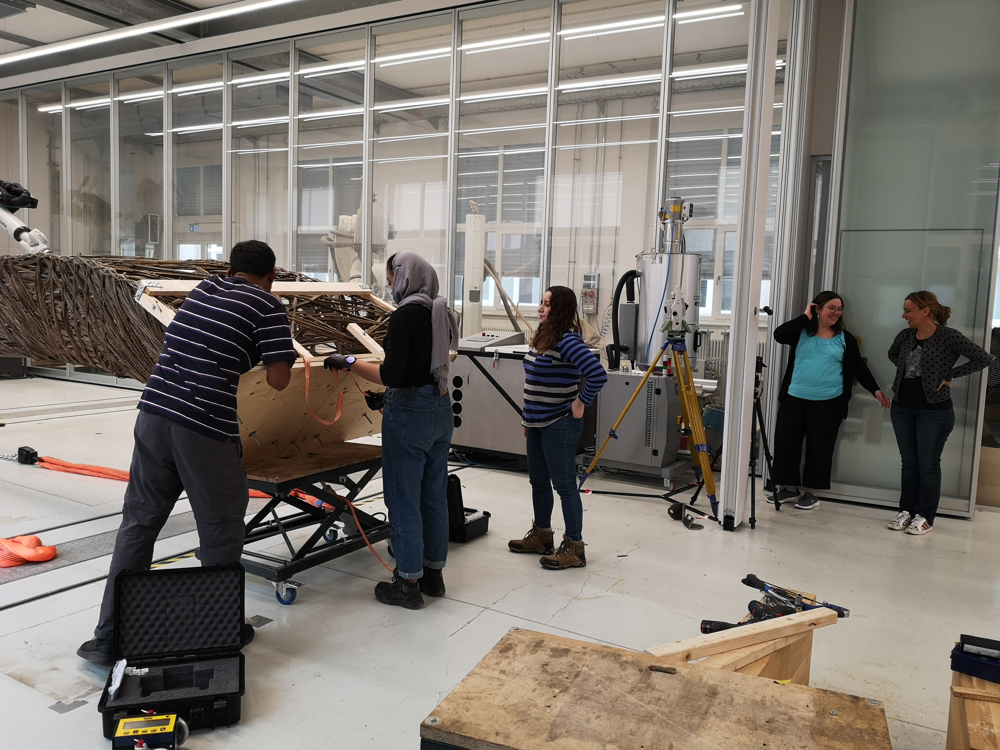

Der livMatS-Pavillon (eine Zusammenarbeit zwischen dem ICD, dem ITKE und dem Exzellenzcluster livMatS der Universität Freiburg) erweiterte die Grenzen des kernlosen Filamentwickelns durch die Verwendung von **Naturfasern** anstelle von Kohle- oder Glasfasern. Der Pavillon wurde schließlich im Botanischen Garten in Freiburg installiert, doch bevor dies geschehen konnte, mussten die Strukturbauteile rigoros getestet werden.

## Die Herausforderung

Im Gegensatz zu Kohlefaserverbundwerkstoffen, die auf Jahrzehnte an Ingenieurdaten zurückgreifen können, sind Naturfaserverbundwerkstoffe weit weniger vorhersagbar. Die mechanischen Eigenschaften variieren je nach Faserquelle, Feuchtigkeitsgehalt und Wickelmustern. Zu diesem Zeitpunkt gab es keine zuverlässige Methode, um das strukturelle Verhalten dieser naturfasergewickelten Elemente rechnerisch zu simulieren. Die einzige Möglichkeit, den Entwurf zu validieren, waren physische Belastungstests im Realmaßstab.

## Meine Rolle

Als wissenschaftliche Hilfskraft unter der Leitung von Marta Gil Pérez half ich bei der Vorbereitung und Durchführung der Belastungstests. Die Probekörper (große naturfasergewickelte Elemente, die von der ITECH-Klasse 2020 gefertigt wurden) wurden auf hydraulischen Plattformen montiert und mithilfe industrieller Lastgurte kontrollierten Kräften ausgesetzt.

## Simulation vs. Realität

Was diese Erfahrung besonders machte, war das unmittelbare Erleben der Kluft zwischen rechnerischer Vorhersage und physischem Verhalten. Spitzenforschung wie diese verfügt noch nicht über zuverlässige Methoden der Strukturanalyse allein durch Computersimulation. Um ein strukturell sicheres Ergebnis zu erzielen, sind physische Tests im Realmaßstab unerlässlich.

Martas Erfahrung und Intuition mit ähnlichen Strukturen waren grundlegend. Nach jedem Test konnte sie erkennen, welche Anpassungen am Entwurf vorgenommen werden sollten, gestützt auf eine Kombination aus Messdaten und jahrelanger praktischer Erfahrung mit Faserverbundwerkstoffen. Dieses Zusammenspiel von Simulation, Experiment und Intuition macht die Forschung an der Grenze der Bautechnologie so fesselnd.

