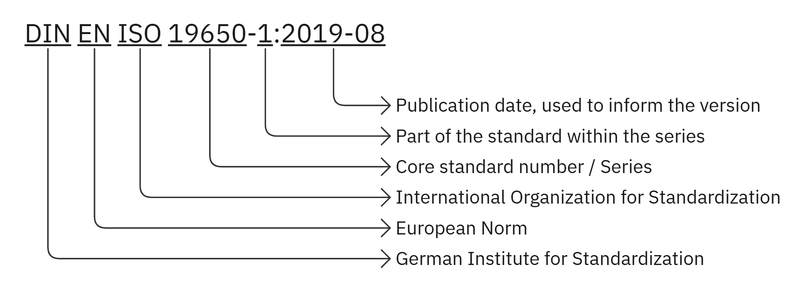
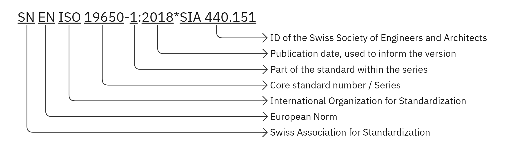
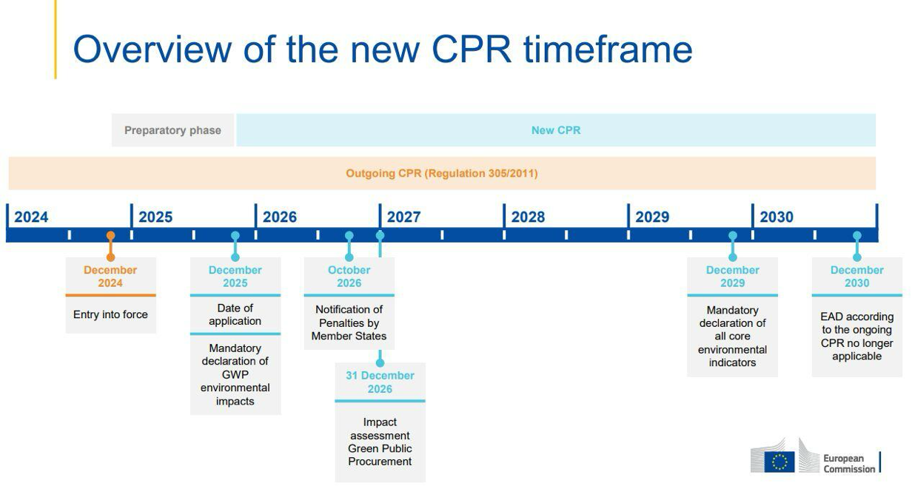
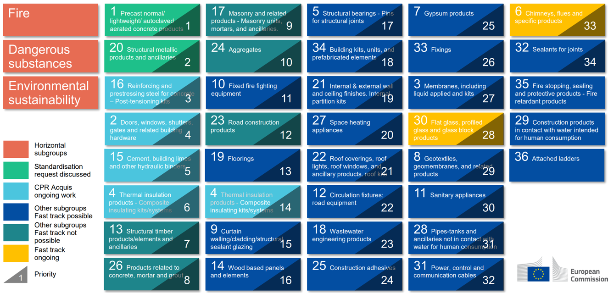
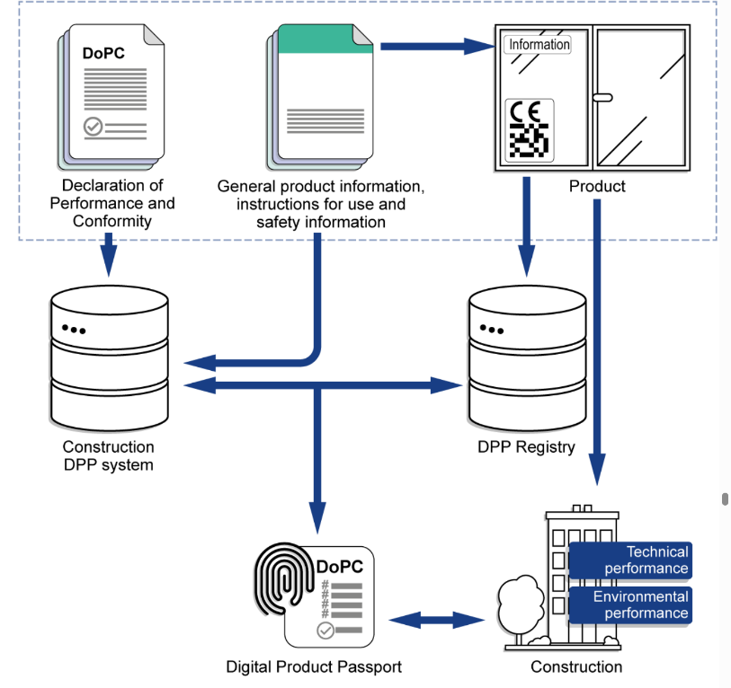
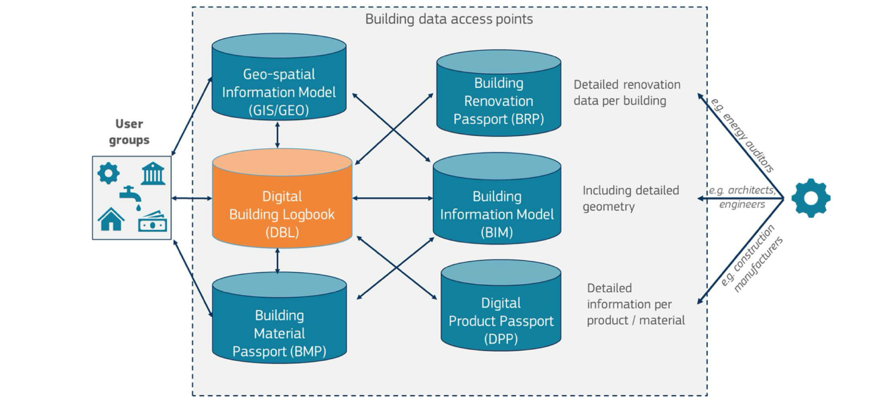

Bevor eine Plattform Holzbau-Aufbauten so dokumentieren kann, dass andere Unternehmen und Werkzeuge sie verstehen, muss jemand eine einfache Frage beantworten: Welche Normen definieren die Begriffe, die Werte und die Prüfverfahren? Dieses Arbeitspaket des Projekts [DOKwood](/de/projects/dokwood) hat sie für die deutsche und die Schweizer Holzbauindustrie beantwortet, mit Österreich als drittem Standbein des DACH-Vergleichs. Das Ergebnis ist ein Bericht, der die Landschaft von den internationalen Gremien bis zu den kantonalen Brandschutzvorschriften kartiert, und ein vorgeschlagenes internes Vokabular, das an kontrollierten Normbegriffen verankert ist.

## Methode

Der Umfang kam von den Industriepartnern. Gumpp & Maier und Schärholzbau benannten die Gremien, denen sie in der Praxis Rechenschaft schulden: ISO und CEN, DIN, VDI und DIBt in Deutschland, SNV, SIA, KBOB und VKF in der Schweiz. Ein Vergleich ähnlicher Plattformen (Ubakus, Dataholz, Lignum Data) und eine Durchsicht der internen Prozesse der Partner legten die Datengranularität und die Themenfelder fest, die es abzudecken galt.

Die Identifikation selbst war systematisch und nicht anekdotisch. Die Internationale Klassifikation für Normen (ICS) der ISO ordnet jede Norm in hierarchische Sachgebiete ein; statt Dokumente einzeln zu lesen, ging die Recherche daher die relevanten ICS-Gruppen durch (79 Holztechnologie, 91 Baustoffe und Bauwesen, 13.220 Brandschutz und so weiter) und schloss die nicht relevanten aus. Europäische und nationale Normen, die die ISO nicht übernimmt, wurden anschließend über Nautos gesucht, die Volltextplattform, die das DIN der Hochschule München bereitstellt, gefiltert nach denselben ICS-Codes und einem konsolidierten Schlüsselwortsatz aus Bau-, Material-, Umwelt- und Dokumentationsbegriffen. Regionale Regelwerke (Bauordnungen, Brandschutzrichtlinien, Beschaffungsempfehlungen) wurden gesondert erfasst, da sie keine Normen sind, aber genauso verbindlich wirken.

## Wer die Regeln schreibt

Der Bericht widmet den Organisationen ein eigenes Kapitel, weil ihre Reichweite erklärt, warum dasselbe Thema in drei Ländern drei verschiedene Dokumente haben kann. Auf internationaler Ebene erarbeiten ISO und IEC freiwillige Normen, die rechtliches Gewicht bekommen, sobald Verordnungen oder Verträge sie zitieren, während GS1 die Identifikationsschicht (GTIN, GLN, GS1 Digital Link) liefert, die ein physisches Produkt mit seinem digitalen Datensatz verknüpft. In Europa entwickelt das CEN harmonisierte Normen im Auftrag der Europäischen Kommission; ihre Anwendung begründet die Konformitätsvermutung mit EU-Recht, und die nationalen Gremien müssen sie veröffentlichen und widersprechende nationale Normen zurückziehen.

Deutschland schichtet DIN, VDI-Richtlinien und das DIBt übereinander, dessen Muster-Holzbau-Richtlinie die Brandschutz- und Standsicherheitsregeln für Holz in die Landesbauordnungen trägt. Die Schweiz übernimmt EN-Normen über die SNV, delegiert die eigentliche Autorität aber an die SIA-Normen, die technische und vertragliche Anforderungen mischen, an die KBOB-Empfehlungen für öffentliche Bauherren und an die VKF-Brandschutzvorschriften, die rechtlich verbindlich sind. Österreich harmonisiert über die von allen neun Bundesländern übernommenen OIB-Richtlinien und führt eine eigene Bauphysikreihe (ÖNORM B 8110, B 8115) sowie die Umweltdatenbank baubook.

## Normen nach Sachgebiet

Der Kern des Berichts gruppiert die gesammelten Normen nach dem, was sie regeln:

- **Materialien und Produkte.** Intrinsische Eigenschaften (Brandverhalten, Akustik, Wärme, Feuchte) und die Produktnormen für Holz und Holzwerkstoffe, von den Festigkeitsklassen der EN 338 über Brettschichtholz nach EN 14080 bis zu Brettsperrholz nach EN 16351.
- **Tragwerks- und Brandschutzbemessung.** Eurocode 5 (EN 1995) mit seinen nationalen Anhängen, Brandschutzbemessung über den Abbrand und die verbindlichen nationalen Ebenen wie die MHolzBauRL und die VKF-Richtlinien.
- **Bauphysik der Aufbauten.** Feuerwiderstand, Luft- und Trittschall, Wärmedurchgang und Feuchte für den zusammengesetzten Schichtstapel: DIN 4102, 4108 und 4109 in Deutschland, SIA 180 und 181 in der Schweiz, EN ISO 6946 für U-Werte.
- **Technische Kommunikation.** Zeichnerische Darstellung, Bemaßung und Symbole sowie Baudokumentation.
- **Digitalisierung und Daten.** Informationsmanagement nach ISO 19650, Informationsbedarfstiefe nach ISO 7817, IFC, IDS und der Stapel aus Wörterbuch und Datenvorlagen, der interoperable AEC-Software trägt: ISO 12006-3 für das Wörterbuch-Rahmenwerk, ISO 23386 für kontrollierte Merkmalsdefinitionen, ISO 23387 für die Zusammenstellung von Merkmalen zu Datenvorlagen.
- **Nachhaltigkeit.** Ökobilanz nach ISO 14040/14044, EPDs nach EN 15804 und ISO 21930 sowie ISO 22057 für EPD-Datenvorlagen in BIM.

## Der digitale Produktpass

Die folgenreichste Erkenntnis betrifft die Regulierung, nicht die Technik. Die Bauprodukteverordnung von 2024 (EU 2024/3110) trat im Januar 2025 in Kraft und führt stufenweise einen digitalen Produktpass für Bauprodukte unter harmonisierten Normen ein, womit das Bauwesen zu den ersten betroffenen Branchen gehört. Die technische Architektur des DPP wird vom CEN/CENELEC JTC 24 als Reihe von Vornormen (prEN 18216 bis 18246) geschrieben, die Datenaustausch, eindeutige Kennungen, Datenträger, Persistenz, APIs, Interoperabilität, Zugriffsrechte und Datenintegrität abdecken, mit GS1-Kennungen als erwarteter technischer Grundlage.

Für vorgefertigte Holzbauelemente, die viele Produkte zu einem gelieferten Bauteil verbinden, wird der Pass Materialherkunft, Ökobilanzdaten, Brandschutzklassifizierungen und Hinweise zum Lebensende über Disziplinen hinweg zusammenführen müssen. Das Digital Building Logbook überträgt dieselbe Idee vom Produkt auf das Gebäude, mit der Ecorys-Studie für die Europäische Kommission als Referenzrahmen und nationalen Varianten wie dem DGNB-Gebäuderessourcenpass in Deutschland und einem GS1-basierten Gebäudepass in der Schweiz.

## Was das für DOKwood bedeutet

Drei Schlussfolgerungen gingen in den Rest des Projekts ein. Erstens: Die Tragwerksbemessung ist über die Eurocodes harmonisiert, aber Brandschutz, Akustik, Wärmeschutz und Ökobilanz behalten erhebliche nationale Eigenheiten, sodass ein grenzüberschreitendes Werkzeug eine Datenarchitektur braucht, die gleichzeitig gegen deutsche und Schweizer Regeln speichern und prüfen kann. Zweitens: Die interne Terminologie der Partner wich von den Normbegriffen auf eine Weise ab, die jeden maschinenlesbaren Austausch untergraben würde, weshalb der Bericht mit dem Vorschlag eines gemeinsamen Vokabulars endet, das an ISO 12006-3, 23386 und 23387 verankert ist. Drittens: Der DPP kommt, ob sich ein Unternehmen darauf vorbereitet oder nicht, und ein normenkonformer Aufbau-Datensatz ist das richtige Substrat dafür. Aus diesem Vokabular wurde das [DOKwood bSDD-Datenwörterbuch](/de/research/dokwood-bsdd-data-dictionary).
