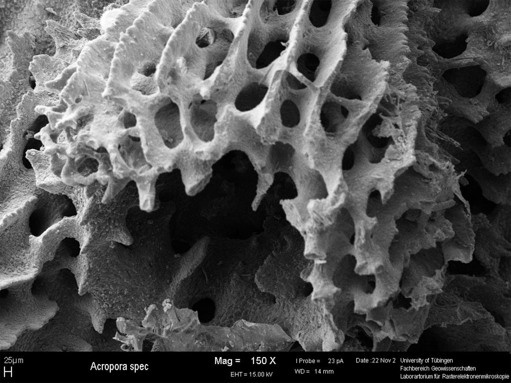
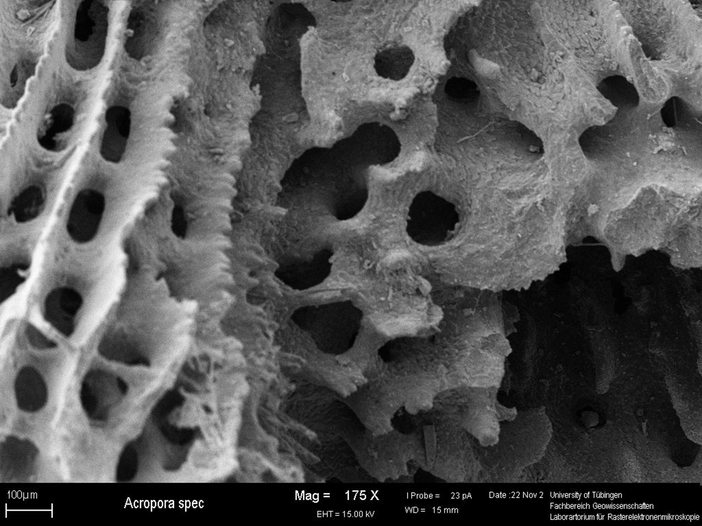
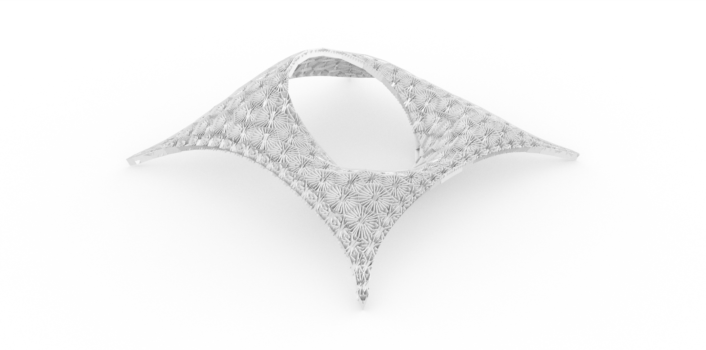
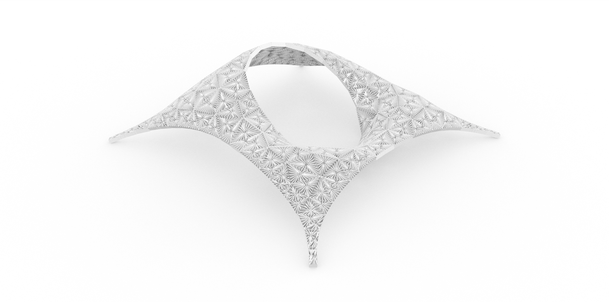
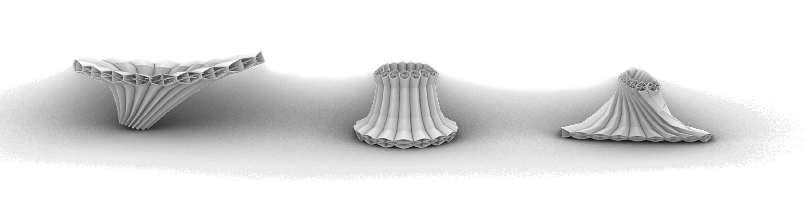
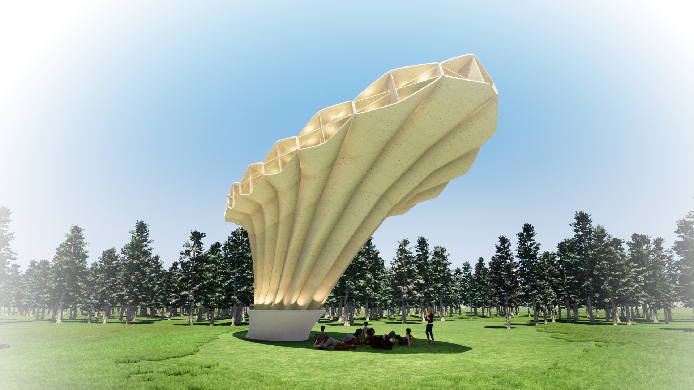

Each animal has its unique morphology, anatomy, and behavior. Most of these characteristics are highly evolved and fulfill functions with almost perfection. Biomimetics is a strategy that investigates nature's solutions for our problems.
This research started exploring static structures. This includes any kind of skeletons, shells, and other softer yet static structures.
Further research dealt with general principles found in stony corals in a big range of species and also in all scales, from the most simple structure found in corals, the polyp, going through the coral itself, and finally the reefs.
As a result, this study abstracted the relationship between different polyps forming a single coral. This modularity is then used for an architectural biomimetic application, the Acropora pavilion.

