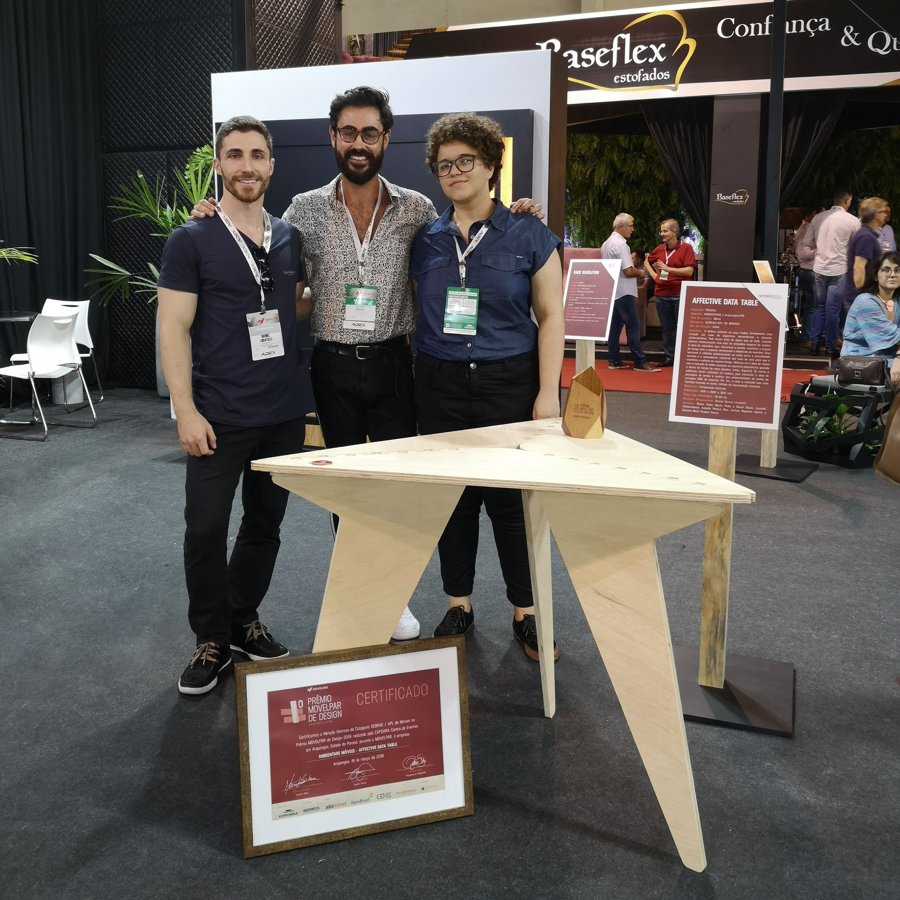
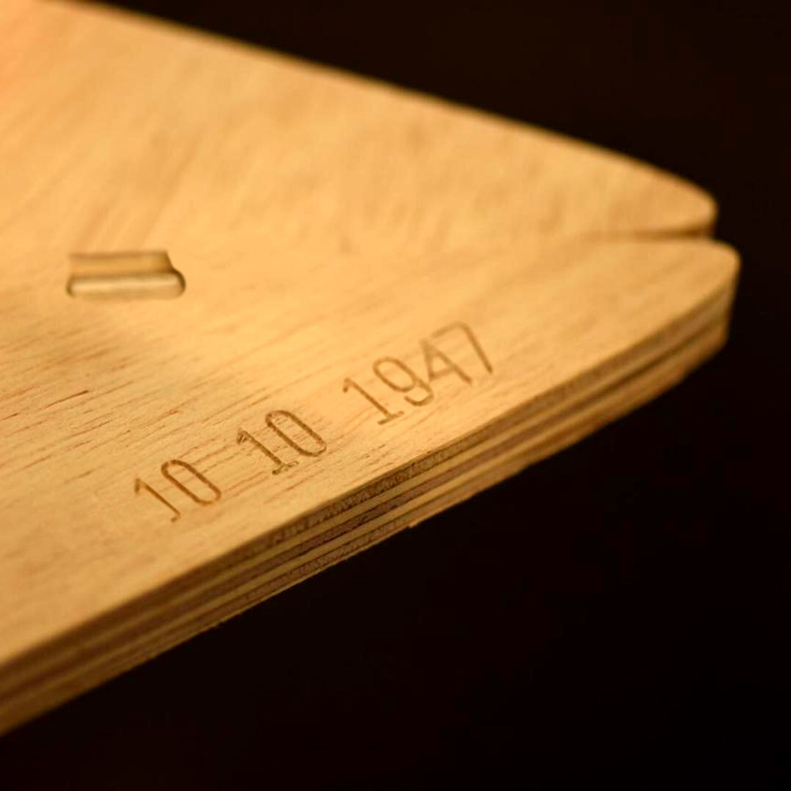
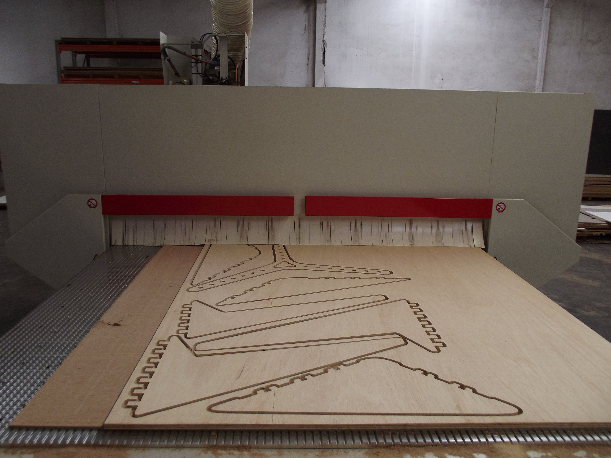
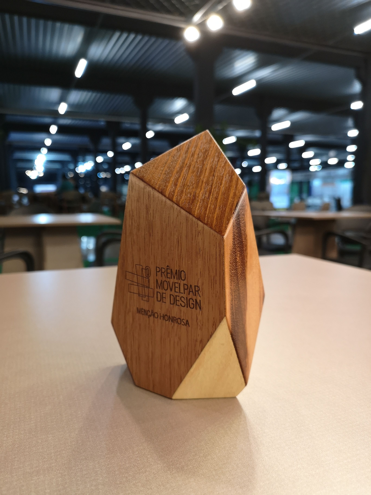

import YouTube from '@/components/YouTube.astro'

<YouTube id="tumc73ImLkg" />

I had been invited to guide the students of the University of Londrina - UEL, with the concept and design of a piece of furniture for a competition. Our team was lucky to be able to use the CNC of a local furniture manufacturer. With that in mind, we started to brainstorm ideas about mass customization in design, more specifically, how to connect people to their furniture emotionally to help minimize waste.

## Concept

A table that invites the user into the design process. Its shape emerges from a date special for the user in such a way that each table is unique, connecting them emotionally.

The emotional design associated with computational design aims to rethink the entire industrial production chain and get closer to Industry 4.0. A transformation that affects the product's entire life cycle: design, manufacturing, and consumer behavior.

The idea of time was abstracted with the insertion of personal data in the algorithm, which generated the shape of the tabletop (points, lines, angles). The creases and protrusions on the wood were used to convey the idea of the passage of time, the date is marked, carved by the machine.

Relating data and algorithms as generators of aesthetics expands the forms of attraction and reach of the consumer. This is reinforced with the user's proposal to interact in the formal conception of the object via application in e-commerce, so we approach the so-called Internet of Services (IoS) one of the pillars of Industry 4.0 (Hermann; Pentek; Otto, 2015).

This innovation is based on an application developed in MIT App Inventor and the use of Rhinoceros software with the Grasshopper plugin for parameterisation of the furniture. The choice of high-tech tools aims to highlight the company's existing ideal of raising the technological progress of production in a CNC machining centre. In this way, we reveal all the technology and bring affectivity to the forefront.

