## Abstract

This is an introductory study on the possibilities of applying computational design in architecture, focusing on *form finding*. To this end, case studies of great historical, technological, and artistic relevance were examined in order to analyze their respective design processes through reverse engineering using the Rhinoceros 3D software and its Grasshopper plug-in. It was found that biomimicry played a fundamental role in the researched projects and, therefore, serves as a guideline in this study. Finally, to consolidate the knowledge absorbed in this process, a temporary pavilion was proposed for FAU-USP.

Thesis presented at the [IASS 2017 - International Association for Shell and Spatial Structures](https://www.ingentaconnect.com/content/iass/piass/2017/00002017/00000009/art00013).

## Introduction

> Making the world's available resources serve one hundred percent of an exploding population can only be accomplished by a boldly accelerated design revolution.

*Buckminster Fuller*

The main objective of this undergraduate thesis is to develop an introductory study on the possibilities of applying computational design in architecture. To this end, a bibliography was explored that provided an overview of the most recent research in this field, which consequently led to the discovery of various blogs and online forums that currently form a small yet extremely active and collaborative community.

As the research advanced, it became clear that most references converged on a single point: biomimicry. Therefore, this topic was also studied so as to provide the same foundations of reasoning developed by renowned designers and architects in this field.

During the development phase, case studies of great historical, technological, or artistic relevance were selected so that an analysis through reverse engineering could be proposed using the Rhinoceros 3D software and its Grasshopper plug-in. Throughout this process, even without reproducing the projects with precision, it was possible to understand the design mechanisms behind each work.

To consolidate the understanding of the topic, a pavilion was proposed for FAU-USP with a low-complexity program of requirements that would allow the use and refinement of the various algorithms employed during the reverse engineering study.

### Conceptualization

For many decades, human beings have used the resources of planet Earth in a manner that will not be sustainable for much longer. It is estimated, for example, that in Brazil the construction industry produces around 50 to 70% of all urban solid waste by mass.

There are several reasons that hinder technical advancement in this area, among them real estate speculation, housing market instability, the lack of alignment in the research production process, and others. According to Ceotto, the last major evolution in the Brazilian construction sector occurred with the introduction of reinforced concrete at the end of the 1920s, and very little changed in the following decades.

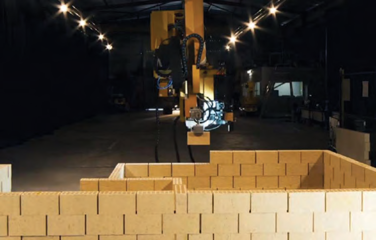

In the construction field, automation is still progressing slowly, but there are already several research projects involving robots or even drones capable of laying blocks, as well as 3D printers capable of constructing entire buildings. Amid all this technological development, humanity faces an enormous housing deficit; in Brazil alone, 6.2 million homes are lacking.

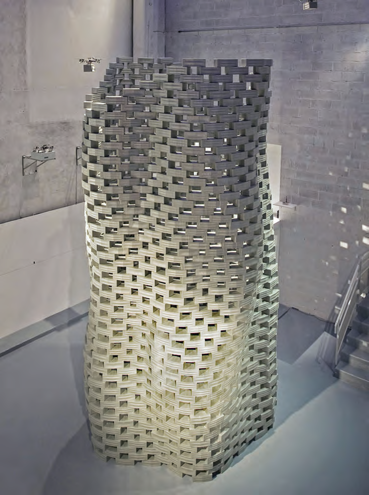

The artisanal production methodology in Brazil's construction industry is gradually being automated. The question is not whether this artisanal building process (brick by brick) will end, but rather when. As a consequence, the development of new practices in architectural production will be important in order to counterbalance the excessive use of resources while simultaneously accelerating the production of designs and constructions to meet the growing demand for new buildings.

### Computational design

In the past, in an architectural project, each person was responsible for their own drawings; that is, the development of a project depended on individual and disconnected drawings. However, with the emergence of Building Information Modeling (BIM) and software using the NURBS modeling system, projects began to be developed collaboratively. Currently, multiple people can work on a single digital model, and there is significant data reuse throughout the entire building production process, making the team's productivity much greater.

The introduction of these technologies within the AEC (Architecture, Engineering, and Construction) industry enables control of all stages of a project, from the design process, environmental and flow simulations, cost and schedule management, fabrication and assembly of components, to many other variables that can be adjusted according to the program of requirements and the capital invested in each project. Even after the construction is completed, the available data can be used to control and monitor its operation throughout its entire life cycle.

Another rapidly developing field is algorithmic architecture. Traditionally, the word algorithm refers to the process of dealing with a problem by following a finite number of steps. However, today the algorithm can be understood as a mediator between the human mind and the processing power of the computer.

The mechanism of *form finding*, a term coined by the architect Frei Otto, can be understood as an algorithm; that is, a set of instructions that determine the outcome of a final form. By changing the value of one of these instructions, the final form also changes, enabling rapid evaluation with great potential for spatial and structural optimization.

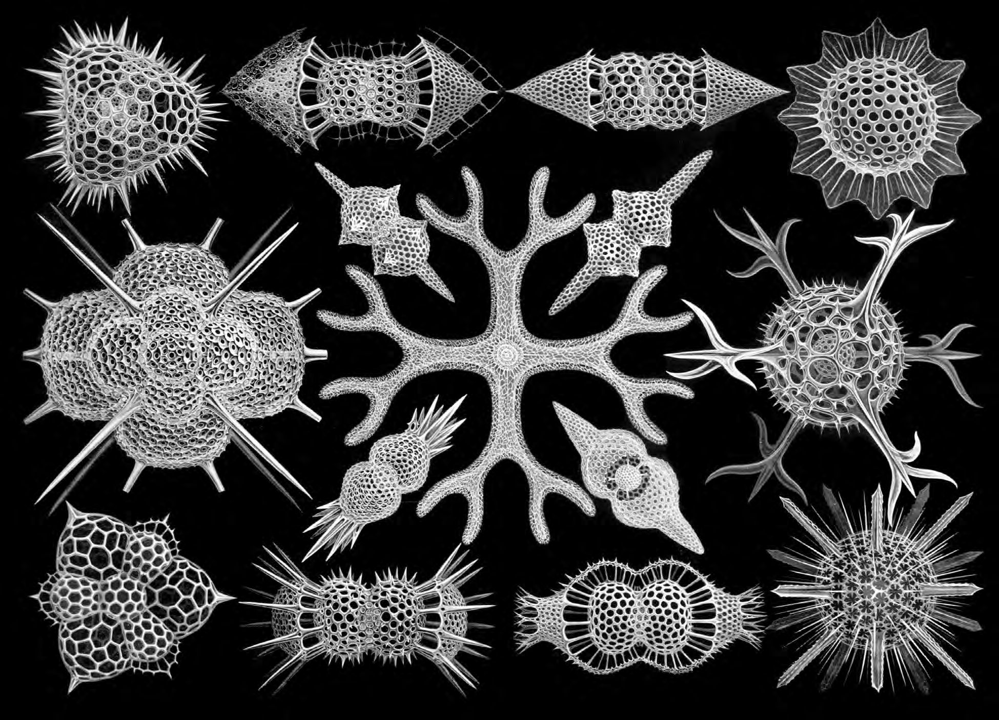

With the invention of the computer, architects and designers now have a greater capacity to deal with situations of great complexity. Geometric forms that would previously have taken days or even months to design can now be produced in much shorter periods of time.

Although this work addresses the relationship of algorithms only from the perspective of design and architecture, it is worth noting that they also have significant theoretical implications within philosophy, sociology, and other arts.

### Conclusion of the introduction

As reported, there are many variables that guide the design of a building. Currently, to take all of these responsibilities into account within a single project, either an enormous team or a great deal of time is needed to arrive at a result that does not neglect one issue or another. This is where the computer shows its full potential: by automating objective and bureaucratic variables such as the master plan, building code, fire safety code, solar exposure, ergonomics, and documentation, it allows the architect to focus on more complex issues, delving deeper into subjective definitions and concepts that the computer is not yet capable of handling.

Computing opens a new dimension for architecture and design; its constant improvement holds great potential to help solve the problems mentioned above. However, architects need to realize the importance of their role as drivers of this innovation.

This thesis does not claim to propose solutions to these problems, but rather aims to serve as a complement to the education provided by the Architecture and Urbanism program at USP. By engaging with this topic, the present study becomes more than a simple proof of professional competence; it also opens a much broader range of possibilities that were previously obscure in the academic environment, where there is still little incentive for research and teaching in this area.

## Design guideline

> Biology has become indispensable for architecture, but architecture has also become indispensable for biology.

*Frei Otto*

### Biomimicry

Approaching nature as the main guideline of a project may seem like just another subjective way of defining a design concept. However, upon analyzing the case studies that follow, it was noted that they had something in common: biomimicry.

There are three levels of biomimicry according to Benyus. The first, more superficial level, simply attempts to mimic the forms and patterns of nature regardless of the method used. The second explores the various processes that nature employs to arrive at the final result; that is, the recipes for how to make things. And the third and broadest level is that of mimicking natural ecosystems, understanding that all individuals and elements compose a single sustainable, interconnected, and interdependent biosphere.

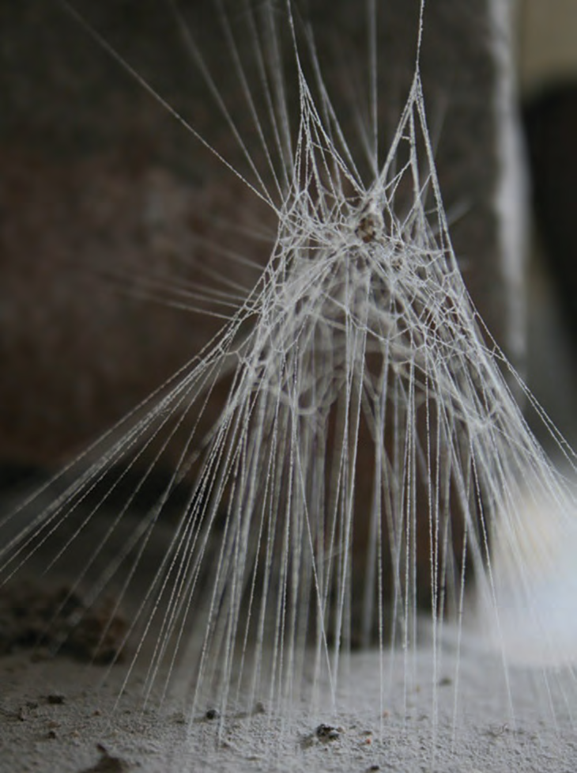

For Terzidis, in his book *Algorithmic Architecture*, when beginning a reflection on design, it is first necessary to reverse course and search for its origin. According to him, this reversal has the purpose of exploring the pre-Socratic philosophical view that states "nothing comes from nothing and nothing returns to nothing," leading to the idea that novelty itself is merely a sensory illusion.

For him, there are two paths that can be taken toward novelty. The first is the pursuit of *innovation*, which would be like "adding leaves to the tree of knowledge"; that is, developing something based on an idea that is already known. The second is the pursuit of *originality*, which would be like "adding roots to the tree of knowledge," meaning to abstract existing information as much as possible in search of its origins and discover something that is not yet known.

In this sense, contrary to common thinking, biomimicry does not address only a formal question; it is not the justification of the result. Quite the opposite: just as Terzidis proposes, it directs the search for the origin of design.

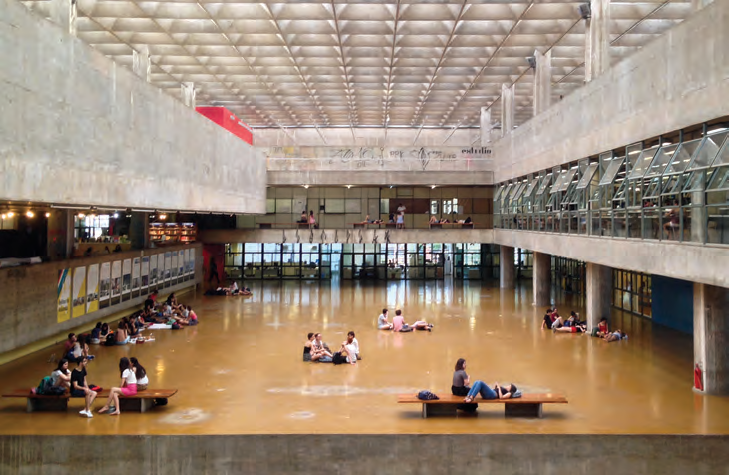

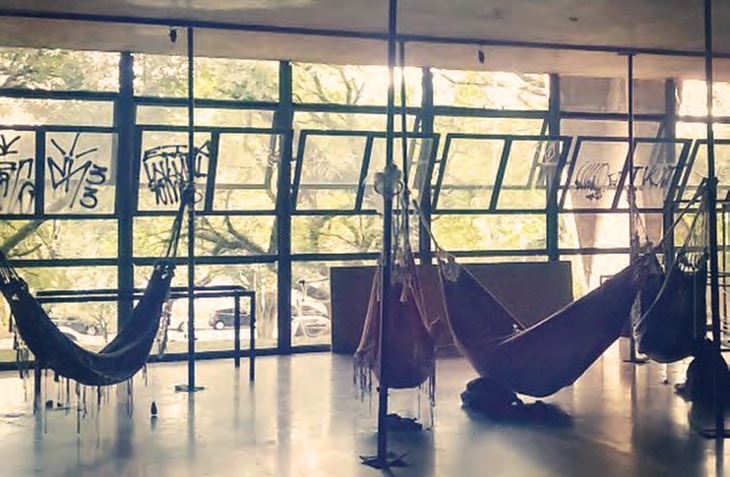

Sustainable architecture as understood today is not necessarily the natural architecture that Frei Otto referred to in his studies, for example. Once it is understood that this result is the consequence of an entire rational optimization process inspired by nature. Frei Otto called this procedure the opposite path, and it led him to develop several form finding studies.

One can conclude that this Western view of humans as a species separate from nature inhibits an immense possibility of technological exploration with mutual benefit for both humans and nature.

### Problem identification

As this work is an introductory investigation into the possibilities of computational design, a project with a low-complexity program of requirements was sought, thus allowing an immersion in this field of technological knowledge with a focus on algorithm development.

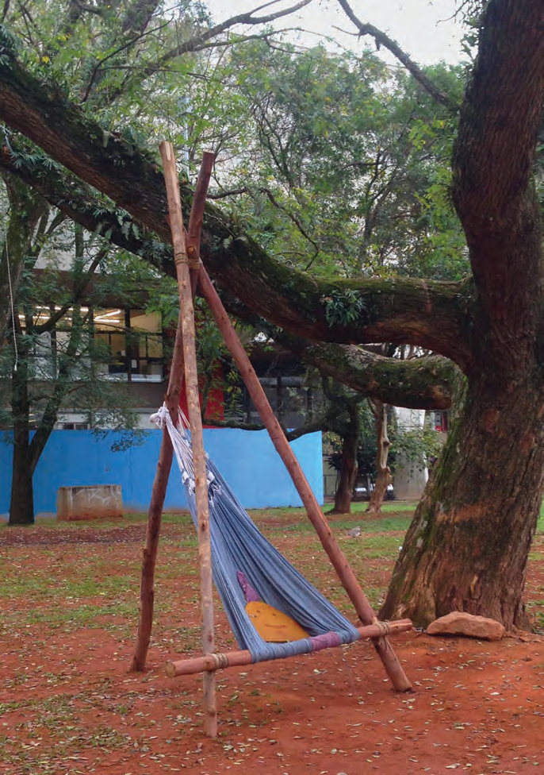

The design of the FAU-USP building is world-renowned for its brutalist architecture. Designed by Vilanova Artigas and Carlos Cascaldi, it features several spatial qualities important for an architecture school, such as ample and adaptable areas. However, despite having spaces with flexible uses, no permanent rest areas for relaxation were included.

This type of space is indispensable in a program that, in addition to running full-time, requires extra dedication to complete the various assignments demanded. As a consequence, students remain at the school for much longer than the theoretically proposed schedule.

Therefore, it was decided for this thesis to propose a temporary pavilion external to the building, in order to provide a rest and social area for the FAU-USP community.

### Selection criteria

Finally, before beginning the study of both the algorithm and its production method, it was important to keep some objectives and criteria in mind during development. After all, it is very easy to get carried away by the infinite possibilities of this type of technique and end up forgetting that, above all, the study is being done to improve the practice of architecture, which in turn is made for people. For this reason, some criteria were selected to keep the direction of this research focused on the user.

**Comfort:** It is important to consider the type of material chosen, solar exposure, and ergonomics. The study of ergonomics is one of the most important, as the main objective is for people to feel comfortable enough to even take a nap after lunch. The final result should then allow variations so that users can assume the most diverse positions: sitting, reclining, and lying down.

**Optimization:** The method of designing the project should enable the optimization of form and structure. The algorithm should produce an economical final result that uses the least amount of material possible.

**Fabricability:** It is essential that the project meets the existing fabrication possibilities. The project should take into account the available production characteristics and methods, and should preferably be prefabricated.

**Respect for Historical Heritage:** Another crucial point is that this pavilion must be temporary, since FAU-USP is a heritage-listed building and therefore does not allow any type of permanent intervention to either its structure or its surroundings.

**Identity:** With the intention of connecting FAU-USP to a different way of thinking beyond the established modernist vision.

## Case studies: algorithms

It was very important to build a reference database of renowned projects that used the principles mentioned in the previous chapters. In this way, using the reverse engineering technique, the goal was to develop algorithms that would create forms similar to those of the analyzed projects, resulting in a library of algorithmic solutions for problems that, despite being in different contexts, have similar ways of being solved.

The software used for these studies was Rhinoceros, its Grasshopper plug-in, as well as various plug-ins for Grasshopper itself, such as Kangaroo Physics, Weaverbird, and LunchBox.

### Buckminster Fuller: geodesic + tensegrity

For over five decades, Buckminster Fuller developed pioneering solutions that reflected his commitment to the potential of design innovation to create new technologies that would do "more with less." One of his main interests throughout his life was to use these discoveries to revolutionize construction and improve human habitation.

In his studies of "synergetic geometry," Fuller sought to explore the principles of design in nature. In this process, one of his inventions stood out: the geodesic dome. It is characterized as a lightweight structure with excellent cost-effectiveness, easy to assemble, and capable of covering large spaces without the need for columns or similar supports, as it distributes stress efficiently.

Another line of research pursued by Fuller was the development of tensegrity, a term he coined by combining the words *tension* and *integrity*.

Tensegrity is a self-supporting spatial structure that stabilizes itself through tension. It is composed of bars and cables, with each bar isolated and connected to other bars only through tensioned cables. Its state of self-equilibrium allows the exploration of various form finding approaches with numerous applications in architecture and design.

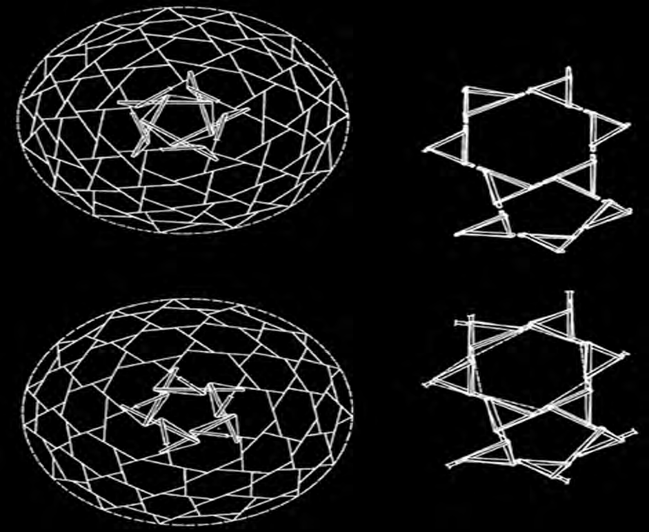

This first case study seeks to replicate precisely this geodesic-shaped tensegrity referenced in the patent summary. The main objective was to approximate Fuller's geometric studies, but it was also fundamental for understanding how the Kangaroo Physics simulator works, a Grasshopper plug-in. This component recreates physical conditions that exist in the real world, for example, gravity and the elasticity of materials.

Since tensegrities work primarily through cable tension and bar compression, this was an excellent opportunity to begin form finding studies.

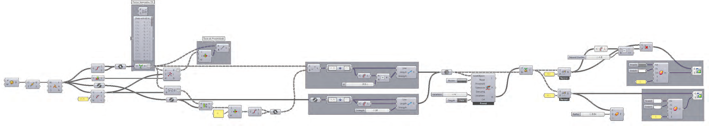

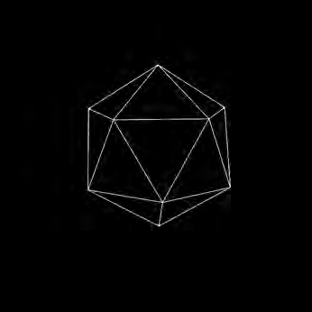

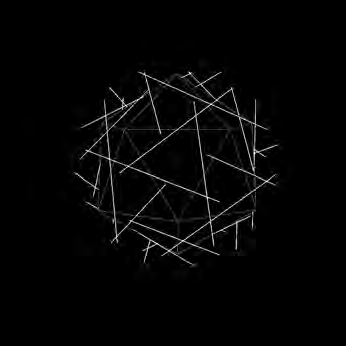

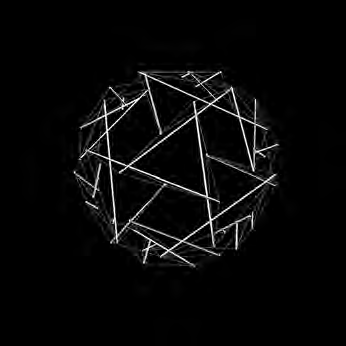

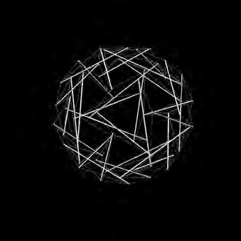

### Frei Otto: German Pavilion at Expo 1967

Buckminster Fuller and Frei Otto shared a similar ideology regarding their research; both saw in their works "(...) a cheap, durable, and highly versatile architectural solution." As a scientist, Otto spent his entire life studying the process of *form finding* in nature, and as an architect he used these processes to develop and construct various structures.

The German Pavilion project for Expo 1967 was chosen as a case study because it marks the moment when Frei Otto finally presented his lightweight architecture experiments to the world. Although the pavilion was developed in collaboration with architect Rolf Gutbrod and by a large interdisciplinary team, it was Otto's research, accumulated over many years, that guided its conception.

Most of his research used physical models with the objective of constructing minimal-area structures, investigating forces and tension paths, and understanding self-forming processes. Otto's models simulated problems in such a way that their variables could be altered as many times as necessary until optimized structural and spatial conditions were achieved. Experiments with rubber and soap film, for example, helped create minimal surfaces that were employed in tensioned membrane structures and also in cable net constructions.

To simulate the behavior of soap films, a method known as mesh relaxation was used with Grasshopper and also with the aid of the Kangaroo Physics simulator. That is, the initial mesh is altered in such a way that each segment loses its "rigidity" and begins to deform so as to reach an equilibrium of forces. The final algorithm includes a mesh refinement to avoid topographical aberrations, making it uniform.

It is important to emphasize that this algorithm is an approximation of the minimal surface of a soap film and not a faithful reproduction, as doing so would restrict the form in a way that would make it impossible to have sharp points similar to the pavilion's design.

The main benefit of this case study came from the need to learn how to manipulate topographic meshes and develop a form finding method similar to Otto's.

### Tomas Saraceno: Galaxies Forming Along Filaments

Like the architects mentioned previously, Saraceno's concerns arise from the contemporary anxiety regarding the depletion and conservation of the planet's resources.

Tomas Saraceno's concept of architecture is extremely broad. His interest in this field stems from his fascination with utopian theories and astronomical constellations. Over the past 10 years, he has been imagining and creating various prototypes that reflect new ways of perceiving nature in the pursuit of a more sustainable and emancipatory practice in architecture, proposing, for example, a floating, modular, and transnational city.

Saraceno also has a great fascination with spider webs, and already has several research projects on both the developmental process of web structures and their final geometry. One of his research projects sought to digitize, through laser-supported tomography, the geometric formation of a black widow spider's web (*Latrodectus mactans*).

His inspiration from nature led him to propose several artistic installations that explore the idea of biomimicry. In this case study, *Galaxies Forming Along Filaments*, Saraceno uses as a starting point the spider web, which, with its complex geometry, is capable of suspending extremely high weights.

To develop this case study, it was necessary to investigate the project in two ways. The first with a more formal approach, as it was necessary to understand the geometric logic of the spheres, while the second explored the design process and, for this, the application of Galapagos was required, an evolutionary algorithm within Grasshopper, in order to optimize the quantity of threads needed without affecting the final form.

This case study was especially important for requiring an approach using Galapagos. Through it, an introduction to the functioning of this type of nature-inspired algorithm was possible, and it allowed a glimpse of the great potential it has to serve not only as a tool, but as a problem solver for issues that previously required extensive work on the part of architects.

### Achim Menges: Landesgartenschau Exhibition Hall

Achim Menges is the founding director of the Institute for Computational Design (ICD) at the University of Stuttgart since 2008, one of the most recognized institutions in the field of computational design and robotic fabrication; not coincidentally, this was the same university where Frei Otto taught for 26 years.

Menges has led several cutting-edge research projects that combine morphogenetic design, biomimetic engineering, and digital fabrication. This results in interdisciplinary research with collaboration from structural engineers, computer scientists, materials scientists, and biologists.

There are numerous pavilions developed at the ICD of the University of Stuttgart; however, the *Landesgartenschau Exhibition Hall* was chosen mainly for two reasons. First, for its materiality, since it is made of wood, a much simpler and more accessible material compared to the other pavilions that use, for example, carbon fiber filaments in their production. The other motivation was that this type of planarized hexagonal pattern is widely discussed in online forums, making this an excellent opportunity to engage in this recurring discussion.

The inspiration for this project came from sea urchin shells (sand dollars), as they feature individual pieces connected by joints similar to finger-joint wood connections. The pavilion's structure is composed of plywood plates entirely prefabricated by robots that achieve efficient use of raw materials. All of this is only possible due to the integration between computational design, simulations, and topographic surveying methods.

For the production of this algorithm, the Kangaroo Physics simulator and various other Grasshopper components were used. Furthermore, the knowledge and part of the algorithm resulting from the previous case study of Tomas Saraceno was reused for this project, enabling the rapid creation of a basic hexagonal pattern.

However, despite its apparent formal simplicity, it was not possible to reach a satisfactory result regarding the planarization of the hexagonal surfaces. The study encountered a problem that would require programming skills that could not be developed in the brief timeframe of this study. The issue consists of the relationship between the pavilion's curvature and the shape of the plywood plate pattern. Upon analyzing images of the original project, one can see that in its concave parts, the plates also present a concave hexagon; that is, the hexagonal mesh pattern should change according to the pavilion's curvature, which was not achievable in this study.

## Case studies: fabrication

In addition to the case studies involving algorithms, it was also important to seek references for how the pavilion would be fabricated. Thus, projects that could provide alternatives for its production were selected; that is, projects that, given the reality of FAU-USP and the availability of materials, would present a tangible possibility for producing this pavilion.

### Nos

The *Land-shape* festival was a Danish cultural initiative that took place between 2013 and 2016 and selected various artists interested in presenting landscape interventions. The 2015 edition featured a group of three students from FAU-USP who came together around an idea: the intervention "Nos" (meaning both "us" and "knots" in Portuguese).

The concept of this intervention consisted of, drawing from the fishing culture of Denmark and Brazil, developing a net made with knots typical of fishermen that could be developed together with the entire local community. The objective of this project was to fix the net to an architectural landmark and to the ground so that it could be appropriated by the community, who would use it as they saw fit. For the execution of this project, the group based itself on the traditional production of fishing nets, which consists of a manual production passed down from generation to generation.

Popularly known as the "net knot" or "weaver's knot," this technique requires only a netting needle and ropes, but is capable of generating a mesh of large dimensions and stability by following a few simple steps that must be repeated until the required extension is complete. The result, however, always produces the same grid pattern.

### Communal XL Lace Hammock

In 2014, the AA Visiting School developed a three-week workshop in the small village of Vitanje in Slovenia. The activities took place in the then-new building of the European Space Technology Cultural Centre, called KSEVT, and explored the potential of nano-tourism in the region with a focus on the natural characteristics of the landscape and the exotic behavior of the local residents.

One of the groups in this workshop noticed that visitors to the Cultural Centre left the town immediately after seeing the exhibitions. As a result, they proposed a service with activities and accommodation strategies that would encourage people to stay in the village from a few hours to even several days. The project consisted of offering the rental of a kit that would include an extra-large lace hammock, a map with suggestions of places to explore, and a mobile phone application that would allow updates on newly available attractions.

The design and prototyping process of this hammock brings a reinterpretation of the traditional bobbin lace process, a manual textile production technique that allows the development of complex design patterns with rudimentary equipment. Traditional fabrication consists of successive crossings of textile threads using wooden bobbins to handle them, pins to fix them, and a support cushion. In contrast, for the final prototype, the participants used ropes, wooden sticks, several nails, and some foam bases.

## Proposal

Structures from nature that appear relatively simple, such as spider webs, beehives, and termite mounds, are determined primarily by the DNA of the animal that builds them; that is, their genetic program. However, even in these cases where there is a clearly defined formal identity, specific adaptations to the immediate environment in which it is being installed are still necessary: each spider web is anchored in a slightly different way from the others, for example.

Algorithmic architecture works in a similar manner and also explores these natural mechanisms, but instead of starting from a genetic program, the project is determined by the algorithm. In summary, the algorithm contains all the information necessary for the execution of a construction.

As the algorithm case studies progressed, the concept of the pavilion began to take shape. The idea of deepening the explorations of meshes and optimizing their structure using the combination of the Kangaroo Physics simulator and the Galapagos evolutionary algorithm presented an interesting potential toward biomimicry and *form finding*.

During the development of the previous chapters, much fragmented information was absorbed in parallel and in a non-linear fashion. However, during one of the many reflections on what would be convenient and comfortable when proposing a pavilion, the conclusion was reached that traditional indigenous hammocks would be a good starting point.

### Site

### Concept definition

The idea of subverting the way rest hammocks are constructed presents great potential in the field of *form finding*, and it was convenient and timely to select one of the case studies and refine it in this direction. In this way, the final product will present a solid foundation of references, meet the guidelines for comfort, fabricability, and respect for historical heritage, as well as provide an advancement in the possibilities of computational design.

Furthermore, another guideline the pavilion pursued was a clear reference to the Faculty of Architecture and Urbanism at USP. After all, FAU is frequently cited as a school with predominantly modernist thinking, and it would be interesting to associate it with an alternative way of thinking. Therefore, it was proposed that its own logo should have a relationship with the pavilion.

The choice of a pavilion that would appropriate a textile production method proved to be very convenient, since one of the first machines to store data in the form of information was precisely the loom with punch cards by Joseph-Marie Jacquard, in 1804. This means that however complicated the pavilion may appear, it is still an algorithm and will be susceptible to undergoing a process of automation and consequently customized large-scale production.

### Technique

The solution that most closely approximated the intended concept was the one used in the case study of Tomas Saraceno's artistic installation. His project *Galaxies Forming Along Filaments* allowed a free deformation of a predetermined pattern, which is very interesting for *form finding* studies.

The following presents studies of various patterns produced in Grasshopper with the aid of the Kangaroo Physics plug-in in order to generate a textile weave effect that approximates reality. The finishing touch is provided by Galapagos, an evolutionary algorithm integrated into Grasshopper.

Galapagos works similarly to the theory of evolution proposed by Charles Darwin, hence its name *Galapagos evolutionary solver*. In this study, it will initially generate 20 random individuals based on the genetic pool, which in this case will be 116 vertices found along the cubic structure, and for each of these vertices, there will be 16 possible connections with the sphere.

**Study 01: Grid mesh**

**Study 02: Truncated grid mesh**

**Study 03: Triangular mesh**

**Study 04: Truncated triangular mesh**

**Study 05: Phyllotaxis mesh**

**Study 06: Truncated phyllotaxis mesh**

**Study 07: Dual hexagonal mesh**

**Study 08: Truncated dual hexagonal mesh**

### Development

With the results obtained from the interaction of tensioned spherical meshes attached to the cubic structure, it was concluded that the best alternative for developing the design methodology would be the "Truncated dual hexagonal mesh," as it showed the greatest suitability for the comfort requirements. The final result came closest to the original sphere, which indicates greater control over the final form, in addition to being perfectly feasible to fabricate.

The structure was developed in a way that directly referenced one of the modules composing the FAU-USP logo. From this skeleton, a broad spectrum of solutions was generated.

## Detailing

### Construction method

The choice of production method could not be disconnected from the entire context presented thus far. Therefore, to produce the hexagonal mesh proposed in the previous chapter, the traditional bobbin lace technique was used, the same one employed by the AA Visiting School in the fabrication case study. Although the net development used by the AA in their *Communal XL Lace Hammock* was essentially artisanal, it is clear that this is a linear process amenable to automation. That is, upon analyzing the sequence of movements that generates the mesh forms, it becomes evident that it is possible to develop equipment that produces similar results more efficiently.

There already exist, for example, drones capable of carrying spools with ropes to produce weaves in mid-flight. Although this topic is not the focus of this work, it may be explored further in a future study. For now, the net can simply be produced manually.

The structure will be composed of 4 steel tubes of two inches in diameter and 2.5 m in length, using 4 prefabricated elbow connections with angles of 34 and 71.9 degrees.

### Transportation

To facilitate transportation, the rigid parts could not exceed 4 m in length, so that they can be easily transported in a standard car with minor adaptations. The connecting pieces would not be a problem due to their small size. The net would be less troublesome since it can be folded and compressed.

### Assembly

Assembly would occur in 3 stages: the production of the net, the assembly of the structural skeleton, and finally, the attachment and tensioning of the net with ropes. All dimensions and attachment points can be extracted and documented using Grasshopper itself, thus avoiding information discrepancies and speeding up the assembly process. Since the first two stages are independent of each other, they can occur in parallel.

### Physical model

### Render

## Final considerations

This study sought to explore some possibilities for incorporating computational design into the practice of architectural design. The immersion required during the production of this work resulted in an enormous accumulation of knowledge on both technological and philosophical-conceptual matters.

Although structural forces were not addressed here, the case studies and various other research projects revealed that this is a field with enormous potential yet to be explored. Two main methods were used here: the Kangaroo Physics simulator and the Galapagos evolutionary algorithm within Grasshopper. However, there is another plug-in called Karamba whose function is to evaluate structural aspects such as buckling and shear, for example. The initial idea was to also use it in the studies, but due to its complexity and given that this pavilion is a small-scale project, this plug-in was set aside.

The development of the algorithm is still in its early stages, but with the right refinement, an alternative construction technique using drones, for example, could be achieved.

The practice of architecture is always changing, and the need to continue this development is crucial. This is not only the key to discovering innovations and techniques, but is also determinant for the idea of design being considered a pivot in our expressions of identity and difference.
