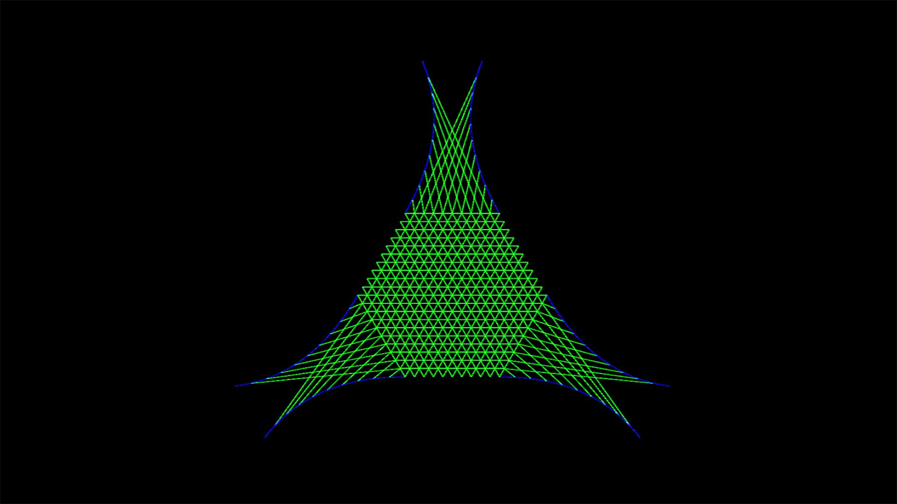
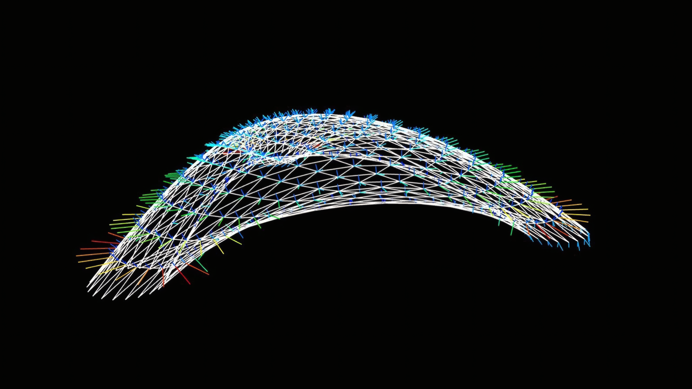
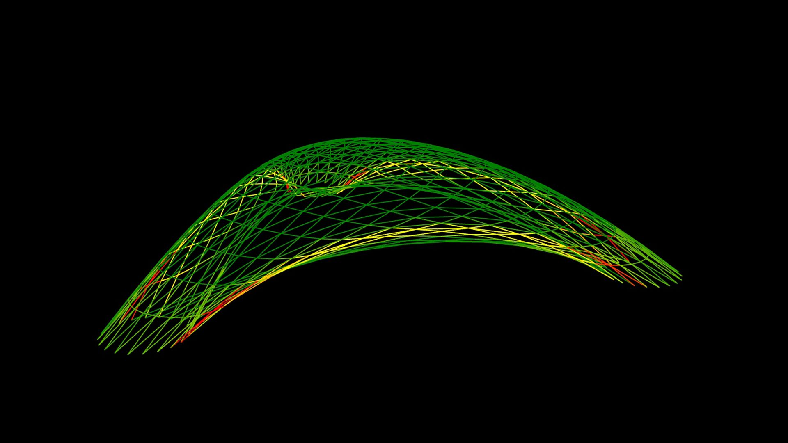
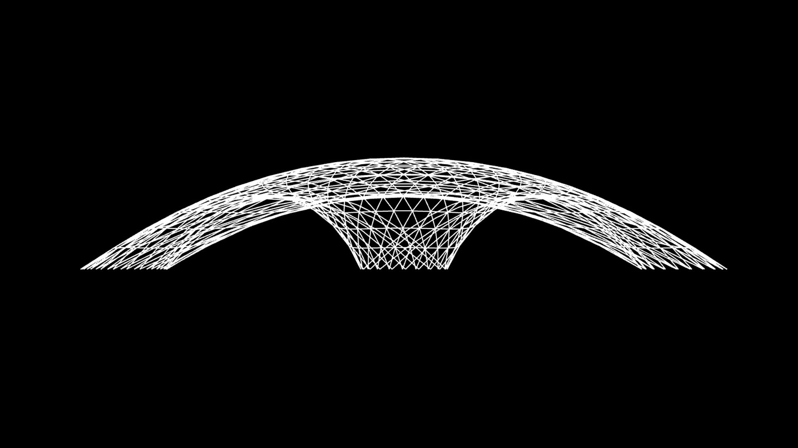
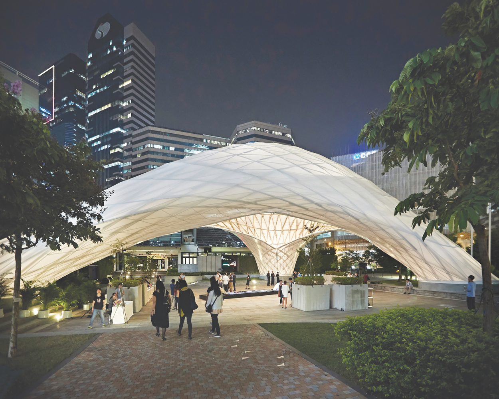

import Video from '@/components/Video.astro'

<Video autoplay src="/media/research/bending-active-bamboo/form-finding.mp4" caption="Form-finding process." />

This was the work that me and Lena Strobel did for the ITECH course Form and Structure. We were inspired by the ZCB Bamboo Pavilion, but we developed our own workflow using Grasshopper, Kangaroo Physics and K2Engineering.

## Form-Finding

For the design of the initial form, we created a two-dimensional beam layout in a triangular grid. Then we used kangaroo as a spring-particle system with loads, support and beams as bending rods constraints. The shape emerges as the beams try to straighten them.

The initial idea was to reverse-engineering the bamboo pavilion using this knowledge to change the geometry to a different polygonal shape, however, the development of this study alone required all our efforts.

The K2Engineering was crucial to the development of this work. The properties of bamboo could be used as input to produce structural analyses which were used to optimize the results.

A big challenge was the design of the arcs that structured the initial geometrical shape and how they anchor to the three circular predetermined supports. Also, additional intersection points had to be added at a later stage, as the initial outcome was not as structurally and aesthetically as intended. It was also important to use Kangaroo Zombie to make the optimization faster.

You can check more information about the original pavilion here: [ZCB Bamboo Pavilion](https://www.archdaily.com/800173/zcb-bamboo-pavilion-the-chinese-university-of-hong-kong-school-of-architecture)

