## Abstract
**Building Across Scales: A Robotic Timber Fabrication System for On-Site Press Gluing**

The research proposes a heterogeneous multi-scalar robotic construction system to further automate on-site timber construction. Specifically, it presents the next step in the automation of on-site gluing through the introduction of a custom robotic clamping device for the on-site pressuring of timber elements. Therefore at the core of the research, lies the development of the clamping robot as part of a larger robotic construction team including an industrial robot and crane in co-design with the material and building system.
Engineered timber has opened up new possibilities in the way modern timber structures are built and designed. By simply stacking timber planks on top of each other and cross-laminating them together, it is possible to achieve strong bonding between the individual layers. However, due to transportation restrictions these timber elements are limited in size, which therefore produces modular building pieces. As this presents a weak joint between the members on-site, it consequently limits the system to a linear span and results in a grid-based architecture.
This research introduces an on-site fabrication system as a strategy to go beyond these limitations. Through the integration of construction logics into the material, it presents an approach to achieve high precision during assembly and to automate the operation of a crane. Enabled by the robotic clamp it aims to continue the cross-lamination fabrication logic of engineered timber on-site to create a quasi-monolithic slab. This allows for a point supported timber slab of unlimited dimensions, which opens up for more design flexibility in the floor plan and extends the architectural design space.
## Introduction
> This research intends to further automate on-site timber construction through the development of a custom **robotic clamping **device for the pressuring of** in-situ glue connections**.
Engineered timber has opened up new possibilities in the way modern timber structures are built and designed [1]. By simply stacking timber planks on top of each other and cross-laminating them together, it is possible to achieve strong bonding between the individual layers. But on-site this logic is broken as the individual elements like beam, slabs and walls are just placed next to each other. Thereby creating weak joints between the members, which limits the system to a linear span resulting in a grid-based architecture.
Instead, this research continues the fabrication logic of engineered timber. By going up in scale it aims to create a quasi monolithic slab spanning over the entire floor to open up for more architectural freedom.
As the scale of an entire floor is much bigger than of a single CLT panel there is currently no technology to automate this approach. By developing a custom robotic clamp the intention is to automate this process.
### Relevance
#### Construction Automation
A recent UN report shows a steady increase in the urban population in the coming decades. Currently, around 55% of the world’s population lives in urban areas, and by 2050 it is expected to hit 68% [2]. This trend informs the need for a construction system that is safe, affordable, sustainable, and automated [3].
Although the construction sector is one of the largest in the world economy, it has a long history of low productivity [4]. Studies show that productivity has been continuously declining in the last decades, contrasting with steady productivity growth in other industries like manufacturing [5] (Figure 02).

There are many factors that lead to this poor performance. The industry has a broad range of regulations, it relies heavily on public-sector demands, and it is highly fragmented [4]. However, this is an opportunity for new players in the market, and one possible solution to tackle the productivity issue is the implementation of automation and robotics [5].
Although automation and robotics started to be applied in construction as early as 1970, it has not yet achieved the necessary increase in productivity to become an economically viable alternative. However, this should not be seen as a failure but a natural process when a significant shift in technology is underway [6]. Essential technological advancements like big data, wireless sensor networks, and building information modeling are fostering a favorable environment to support efficient automation and robotic systems in construction [7].
According to Thomas Bock (2016), there are two significant technology cycles in construction happening. One encompasses the traditional construction systems, while the new one refers to digitization, automation, and robotics (Figure 03). Technology cycles happen in three different phases: innovation, growth, and maturity. Right now, we are entering the second phase of this new cycle, the growth. Throughout this phase, it will eventually surpass the traditional construction systems culminating in its final phase, the maturity, leading to mass adoption throughout the industry [6].
#### Automation Setups
Since the beginning of automation in construction, many strategies have been researched, developed, and deployed. One of them is the concept of prefabrication, in which a large portion of the construction process moves to a factory setting, making it easier to mass-produce construction pieces more safely and reliably (Figure 04). This structured environment is similar to the factory of many other industries, like automotive and manufacturing, known to be favorable for applying conventional industrial robots in static locations. In the construction industry, however, the pieces still have to be transported to their final location. The transporting modules usually are much bigger than the raw material, making the cost, logistics, and local regulations limiting factors that impact the final design flexibility [8].

Another strategy that has been explored since the 1970s is the site factory. Here instead of moving the fabrication of parts to an outside factory setting, the construction site becomes the factory. In this scenario, the construction site that otherwise would be an unstructured environment now has the framework that makes it easier for robots to navigate, accelerating a building’s construction. This strategy has led, for example, to the development of flying factories for tower typologies, in which after each floor is completed, the whole factory moves one floor up (Figure 05). The problems with this strategy are that it is costly, requires too much time before the beginning of the construction to assemble the factory, and it is only feasible for repetitive tower typologies, limiting the designer’s ability to customize the global form [9] [8].
A more flexible approach to site factories is the transportable robotic timber construction platform (Figure 06). It consists of a container equipped with robots and tools that can be delivered directly to the construction site. It enables the integration of robotic assembly in already existing construction methods. The strength of the system is that it is location-independent and reconfigurable. The wide possibility to customize the platform allows for high flexibility. Therefore, it makes it possible to extend rather than replace traditional craft, increasing quality and productivity on-site [10].

A third strategy explored, especially in the research context, is the use of mobile robots in the construction of the superstructure (Figure 07). This approach is interesting because it explores the idea of distributed robotic assembly leading to the development of sophisticated algorithms that have a fail-proof decentralized construction sequence. In other words, if something goes wrong with one robot, the others would fill the gap without disrupting the whole assembly logic. Mobile robots also have more flexibility than site factories or the transportable platform, reaching places that would be impossible for a gantry system, for example. However mobile systems are much more complex to sense and control, they are less precise and their low payload limitations make them less power efficient [8].
So far, automation in construction has been mostly about creating entirely new systems. However, their acceptance in the existing construction industry is still limited. As mentioned earlier, we can see that the construction industry does not evolve as fast as compared to other industries. Consequently, it is essential to integrate already existing construction technology when trying to automate assembly processes.
Due to the unstructured and complex nature of construction, it is critical to look at the different on-site tasks because some might be more suitable for a centrally controlled large robot, like a crane. In contrast, others might benefit from a collective of hundreds of smaller robots [8]. 
Instead of developing another entirely new system, a heterogeneous robotic system could provide great value in automating on-site processes. According to Vasey et al. (2020), a heterogeneous system of robots is a “system made up of robots with varying specifications, tooling, and control logics which may be from different manufacturers or may be customized from off-the-shelf components and controllers” [9].
Looking at cutting-edge research, we can see that the combination of robots already happens to a certain degree. The sequential roof by ETH in Zürich is one example. It had a highly automated prefabrication process (Figure 08), while the on-site assembly still relied on manual work [11] (Figure 09).

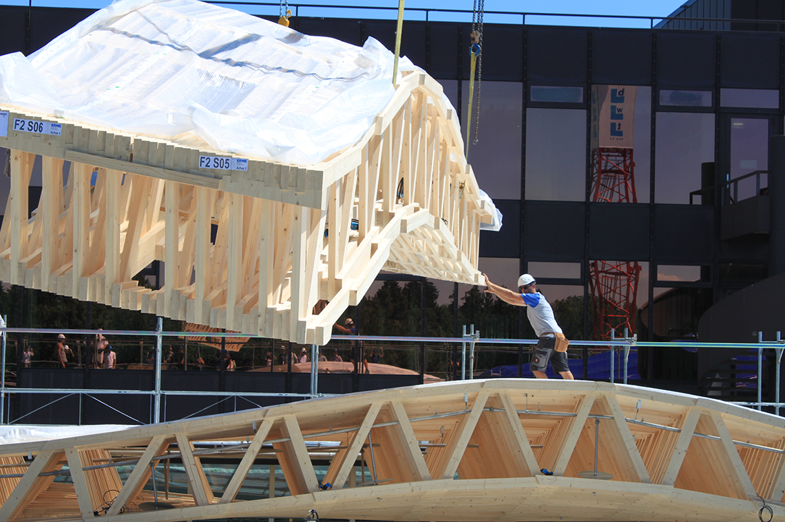
#### Timber Construction
Timber is a suitable choice to aid on-site automation processes as it is a well-established building material with a high strength-to-weight ratio and is easy to process [12]. Especially through the early implementation of state-of-the-art manufacturing technologies in timber construction and the ease with which the material can be machined enabled the automation of prefabrication techniques, for example, in computer-numerically controlled (CNC) milling in the 1970s [13]. Besides the technical and structural benefits, as awareness for sustainable construction rises, we can see a strong push towards timber from the political side. For example, the Holzbau Offensive Baden Württemberg mandates that every new public building be made with timber if possible (Figure 10) [14]. However, timber elements are limited in size due to transportation constraints, resulting in modular building pieces, which need to be joined on site. Thereby creating a weak joint between the members and subsequently producing linear spans, deriving in a directional grid-based architecture (Figure 11).

Figure 11 - Current wood construction system typologies (Kaufmann, 2018).

On-site gluing has the possibility to overcome the challenges which derive from a modular building architecture as it can create a strong bonding connection between the individual pieces. Since so far, only glue provides a sufficient enough joint for a continuous stiffness gradient, this means that glue connections are much stronger if compared to traditional methods (Figure 12) [12] and could enable a multi-axis load-bearing slab layout [15].

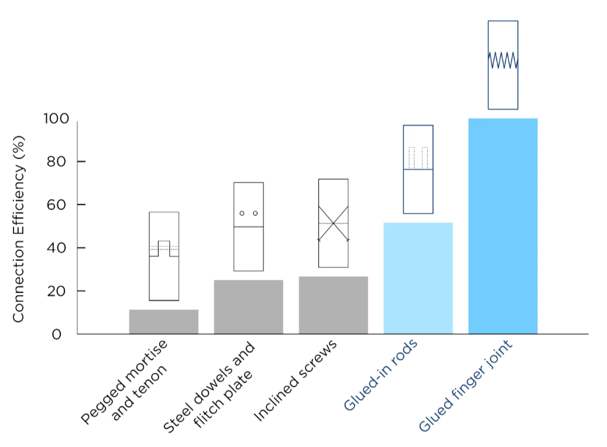
### Scope
The scope of the thesis is the automation of an in-situ glue joint integrated into a timber building system. Therefore the key aspect of the research is the development of a custom robotic device, which is responsible for the glue pressing of the in-situ connection. The co-design between the robotic clamp and the timber allowed the simplification of the robotic design and the development of a material system, which can take full advantage of the proposed technologies.
Further discussed is the possibility of automating the entire construction chain, achieved by implementing a cyber-physical timber fabrication platform (TIM) responsible for the prefabrication of on-site timber elements. Embedded sensing strategies in the robotic device allow for real-time localization and monitoring of the assembly process, enabling communication and coordination with a crane to automate the in-situ positioning of prefabricated elements.
The scope of the research can be divided into two parts:
- The investigation of a material system, which uses timber elements and the automation of an in-situ joint.
- The development of a heterogeneous robotic system, including the coordination between all actors. Starting from on-site fabrication to in-situ joinery.
Both systems need to be designed in coordination so that the limitations and parameters continuously inform each other (Figure 13).

## Research
### Context
#### On-Site Gluing
Usually, glued joints must be performed in a controlled environment, as the application is dependent on climatic parameters such as humidity and temperature. But recent research in wood-adhesive technology and material science shows a promising direction [16].
An example of a successful on-site-gluing procedure is the new technology developed by TS3 (Figure 14), which makes it possible to join different timber elements on-site to create multi-axis load-bearing panels [17, p. 3]. The downside is that the process of applying the glue is entirely manual and very labor-intensive (Figure 15). Also, the gap between the timber elements, which is sometimes a few millimeters wide, drastically increases the amount of needed glue.

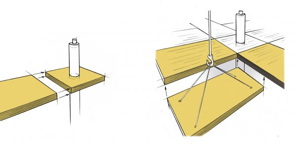
An approach to reduce the amount of glue is by using screws (Figure 16). Because by pressurizing the glue during the drying process, it is possible to achieve a strong bonding connection using only a fraction of the glue needed initially [18].
But the downside is that this process is again very laborious. Also, as the screws serve a temporary function, they are usually left in the timber because the labor costs of removing them are much higher than the screw itself.

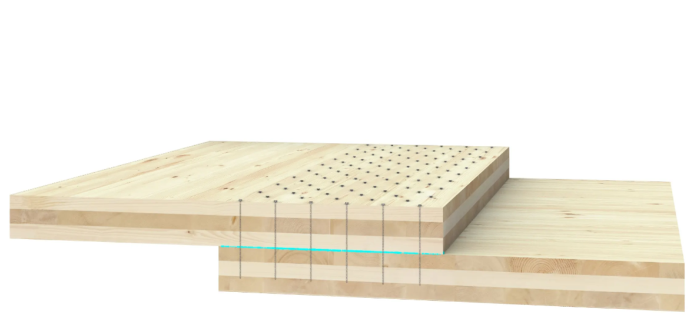
Figure 16 - Sequence showing the process of in-situ gluing using screws to generate the necessary pressure.
### State of the art
#### Chicago Horizon [19]
Chicago Horizon is a public pavilion installed in Grant Park, facing Lake Michigan (figure 17). It exemplifies modernist beauty in its minimalist composition: A timber flat roof plane is simply supported by a field of timber columns.

The aim is to create a monolithic timber slab by stacking CLT plates on top of each other and screwing them together. The solution is to have two perpendicularly stacked layers of CLT slabs (figure 18). CLT slabs are anisotropic and only span in one direction, but when they are stacked perpendicular, it adopts bidirectional properties.

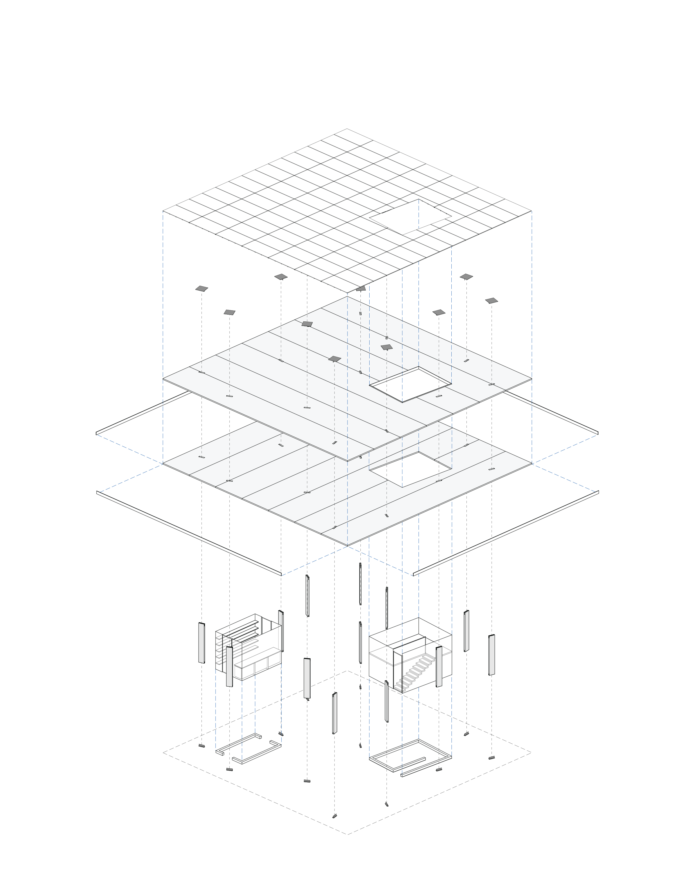
#### Mass Timber Fastening [20]
An attempt to automate screwing is the project mass timber fastening using robotic fastening machines (Figure 19), which make it possible to insert a multitude of screws at once, but they are still being operated manually and additionally the logistics of moving these machines and all of its cables from one area to another makes this process barely more efficient compared to manual screwing.

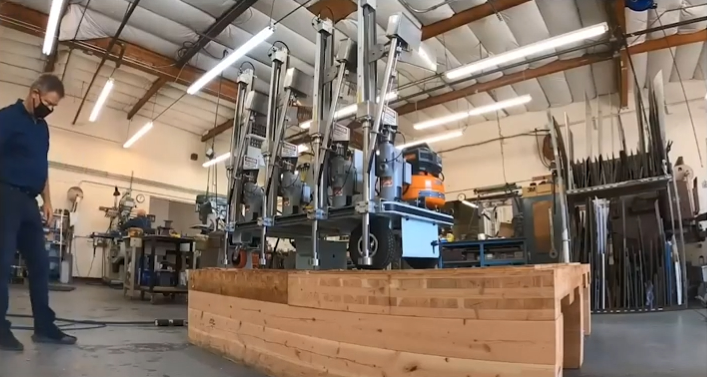
Each CLT layer comprises 3-ply Black Spruce CLT, measuring 2.4 m by 17.0 m in plan (105mm thick). In the first layer, the CLT slabs are screwed with plywood planks at the seam. The second layer of slabs, which are perpendicular to the first, is joined using the same procedure, then fastened to the layer below with an array of screws. This way, the final product combines CLT panels that are nail laminated together (NLT). Resulting in a roof structure 210 mm thick spanning up to 9m between columns. While this results in an overall small slab thickness and even allows for free column placement, it is structurally limited to a single floor. Moreover, the need for almost 50 screws per square meter lacks scalability.
#### Automatic Assembly of Jointed Timber Structure Using Distributed Robotic Clamps [21]
The project by the ETH in Zurich takes a different approach. Instead of trying to develop a big machine to automate a construction task, they use distributed clamps to assemble joints of a complex timber structure (Figure 20). Through the collaboration with an industrial arm these clamps overcome the need to provide large assembly forces and to correct for misalignment during the assembly. But the system lacks scalability as it is still limited to the reachability of an industrial robot.

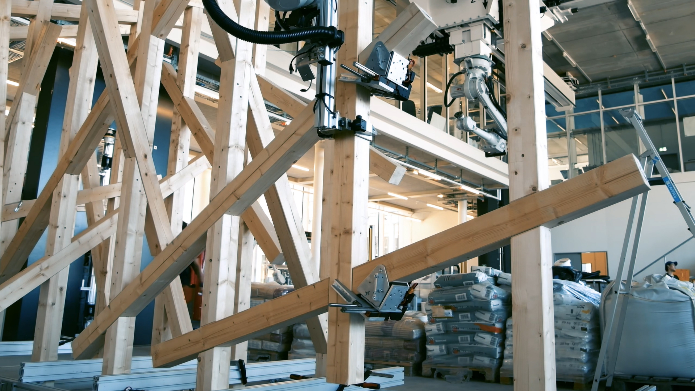
## Development
### Method
As mentioned before, our methods can be divided into two parts: One side is the investigation and development of a material system, which uses timber elements and an in-situ glue joint. And on the other the development of a heterogeneous robotic system, including the coordination between all actors, starting from on-site fabrication to in-situ joinery.
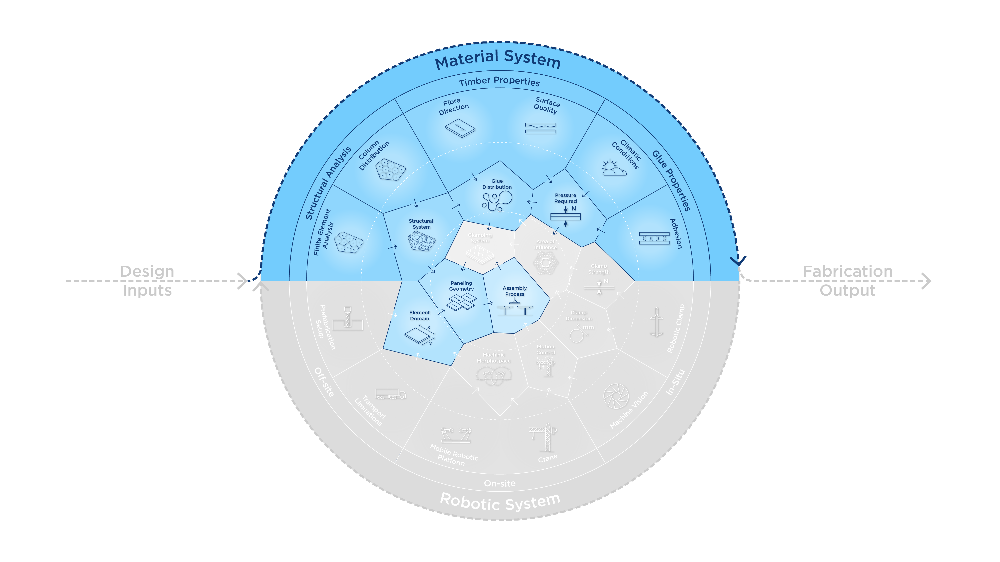
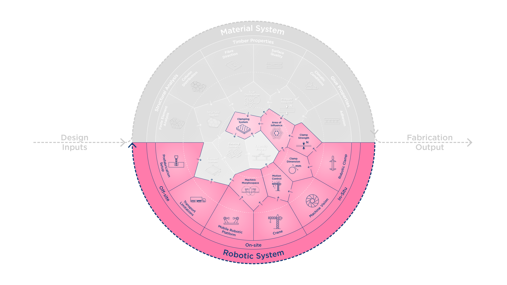
### Research Development
The research started investigating academic and industrial actors on-site and comparing them under different aspects to look for potential matches for a collaborative construction scenario. It shows that none of the actors can cover all areas by themselves, but by combining many actors, the weaknesses of each system can be compensated. For example, while distributed robots cannot achieve the payloads of a traditional crane, they strike in other areas, such as precision, as they can be customized for a specific task. By combining both systems, the crane and the distributed robots, they could benefit from each other, allowing them to perform tasks of high payload while also achieving high precision. A potential combination between the use of a crane, TIM, and distributed robot guided the next steps in this research.

Figure 23 - Comparison of different robotic actors on-site.
#### Custom Robotic Device
Building on top of available construction technology, a new robotic species was proposed for the in-situ connection. The goal was to achieve an in-situ glue connection between the different timber elements. Instead of developing a big machine to screw and achieve the needed pressure as it is being developed by the state-of-the-art “Mass Timber Fastening” (figure 24). Our research follows a direction similar to the other mentioned state-of-the-art project, “Automatic Assembly of Jointed Timber Structure Using Distributed Robotic Clamps” [21]. We thought, why not create a smaller device capable of applying the pressure just as well as a collection of screws, but that could be automatically removed afterward (figure 25).

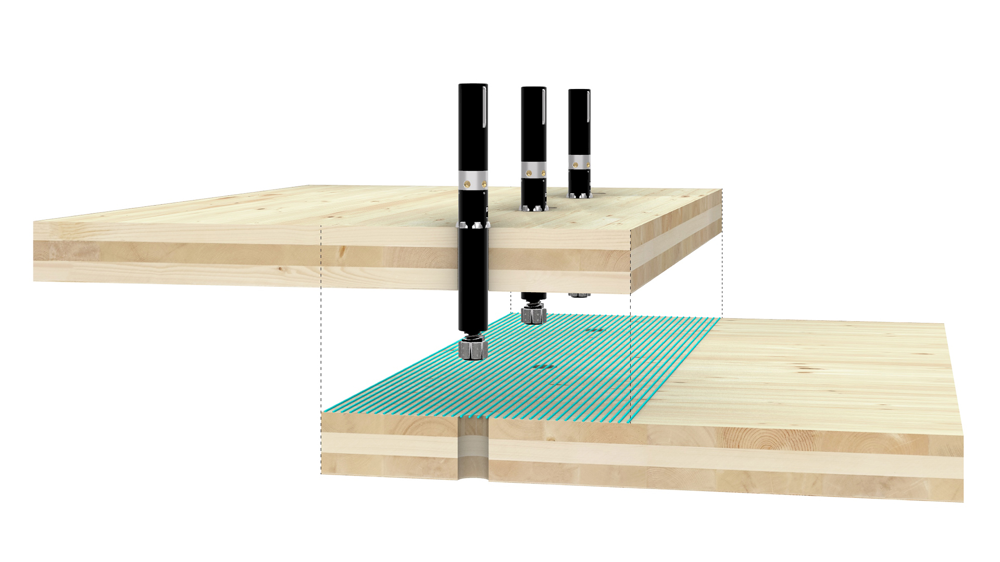
The idea on how this device works is that you have pre-drilled holes in the timber, through which the device can be inserted on-site and unfold its pressure. For this, it needs to do two things. It needs to clamp itself into the timber, and it needs to apply the pressure required for the glue to dry. After deployment, the device can then relieve its pressure from the hole to fall to the ground. This allows the automation of the in-situ connection.
Also, through the reusability of this device, it is possible to leave no metal behind in the structure, opening up more possibilities for an afterlife at the end of a structure’s life. According to Jianmei Wu, the bottleneck of disassembling timber buildings is the removal of the connections. Therefore more time is spent dismantling the structure rather than just tearing it down quickly [22].
#### Heterogeneous Robotic System
By closely linking all the different site actors together, it is possible to create a heterogeneous robotic system, which can work in different scales to complement each other. To take full advantage of the device, this system consists of three steps: a mobile industrial robot platform for the preparation of the prefabricated timber elements, which includes the application of glue onto the panels; a crane for the transportation; and lastly, the joining of elements in situ by our device. Each of these steps is closely designed with each other to achieve a collaborative workflow.

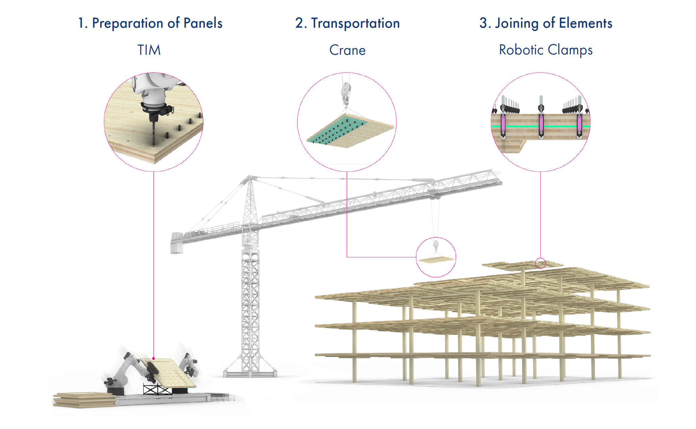
#### Building System
As design intentions and site conditions can vary, it is essential that the building system is not static but rather an adaptive framework, which can react to these. The two main compartments are made out of the material and robotic side.
If we zoom out a bit, we can see that many sub-parameters influence each other. Through a co-design of these, it is possible to achieve a fabrication system tailored towards a global design.
For example, one of the critical aspects of the paneling logic is the maximum assemblable panel size, as it is defined by the machinic morphospace [23] of the mobile robotic platform. With the setup of TIM, it would allow for 3 x 2 m panels [10]. But depending on the setup (adding a linear axis for example) these dimensions could change so that the system could work in different resolutions of plate dimensions. The following chapters will demonstrate the computational workflow of the building system, following this restriction.
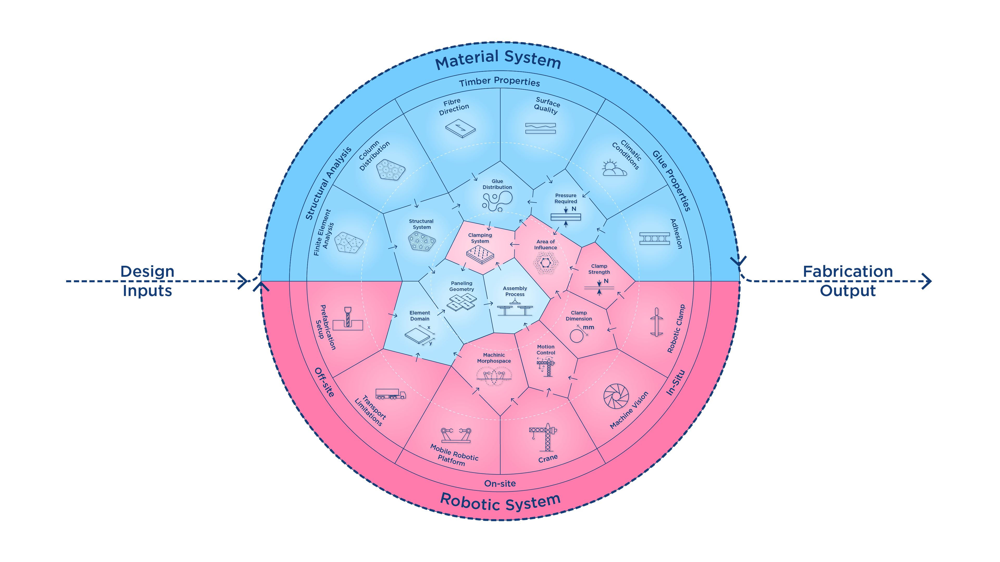
*** Paneling Logic***
The paneling logic starts from the center point of each column position. These could be fixed depending on a particular design intention. Alternatively, by giving a specific site boundary, it is possible to start with a column distribution algorithm to ensure an even scattering. With the help of Karamba3D, the bending moment of the slab is then calculated. The panels are then arranged so that the paneling seams avoid the areas with a high bending moment. This naturally ends in a “mushroom-column” aesthetic, as the maximum bending moments are usually found on top of the column and in-mid span between the columns. The panels are then stacked on top of each other, going from the column outwards with a final panel crossing the mid-span between neighboring columns. Besides the structural aspect, the paneling logic is also guided from the fabrication side and, as mentioned earlier, from the site-specific constraints like transportation limitations and the machinic morphospace of the mobile industrial platform.

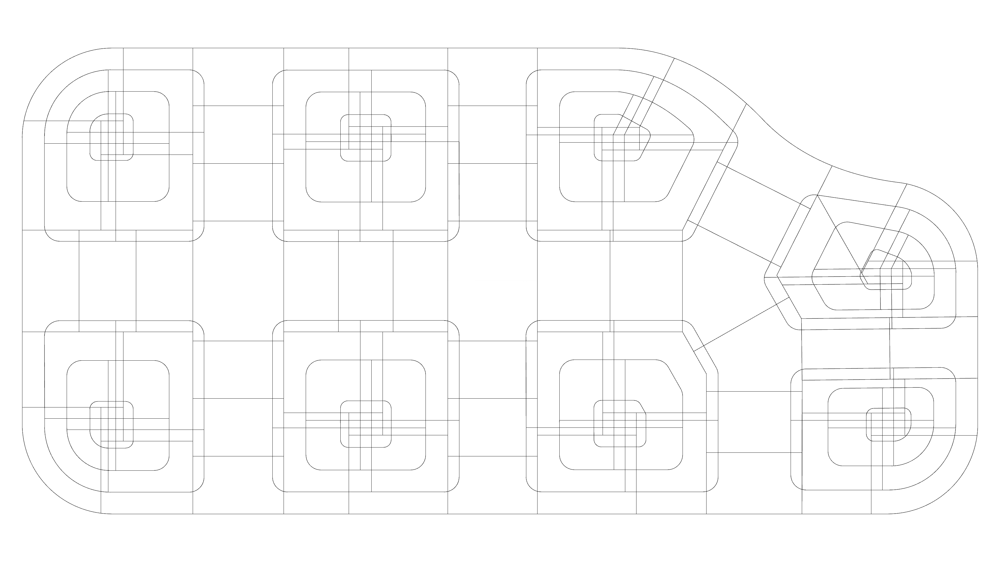

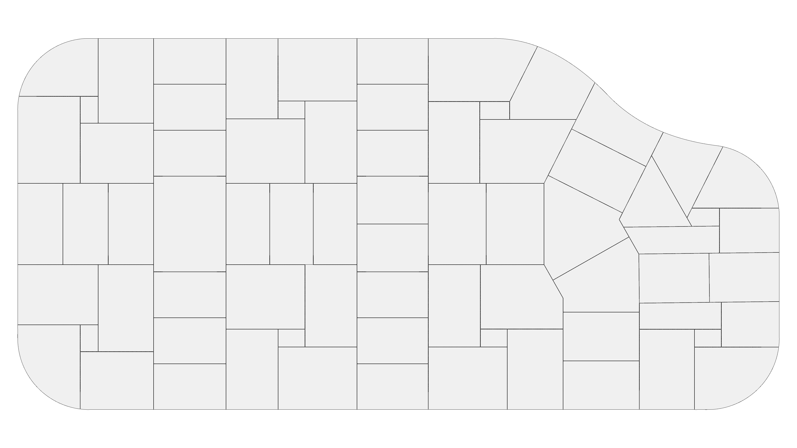
***Glue Distribution Logic***
After arriving with the paneling logic, the structural model is reanalyzed to inform the glue distribution logic, which ultimately defines the spacing of the holes of the timber system for the in-situ glue pressing. In this step of the development, a key question was: How can we reduce the glue consumption and minimize the amount of work on-site.
Since the glue is always stronger than timber and can only transfer forces in the form of shear, the initiation of system failures tends to appear as in-plane shearing-off of timber fibers adjacent to the glue interface. Therefore the cross-sectional stresses flowing from the slab into the column are calculated and divided by the in-plane shear strength of the CLT. This then results in a heat map, which highlights areas in which more glue is needed. Depending on the dimensioning of the custom robotic device, it is possible to calculate the corresponding device force and the resulting area of influence which can be pressurized. With this information, the heat map can then be populated with the right amount of robotic devices so that the required pressure level is met everywhere. The glue lines are then oriented to be later applied on-site to optimize the robotic tool path.

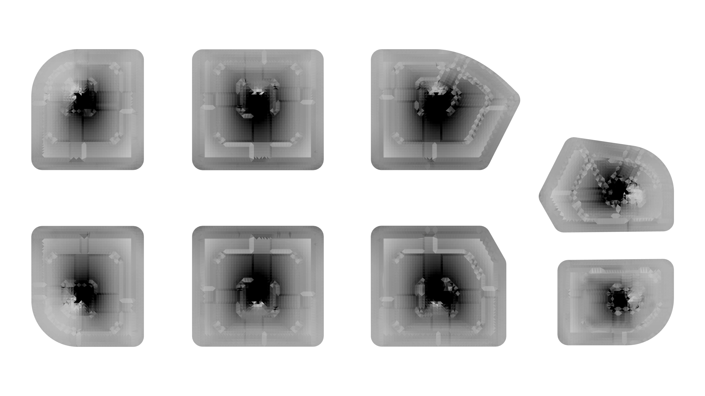

***Alignment Channels***
In order to work with the tolerances of the crane, additional information is embedded inside the material to make the process of automated assembly more efficient. This will be done by engraving alignment channels into one panel and fitting alignment dowels into the other. This system works similarly to LEGO pieces. This process is generated depending on the paneling logic and the corresponding assembly order of the individual panels.
The sequence is as follows: first, the plate is lowered until the dowels hit the underneath plate surface; then, the plate could be dragged along the surface until the wooden dowels slide into the alignment channels. Therefore it would minimize the plate’s movement in one direction; it could then be dragged through the engraved channel until the dowels would slide into their assigned holes.

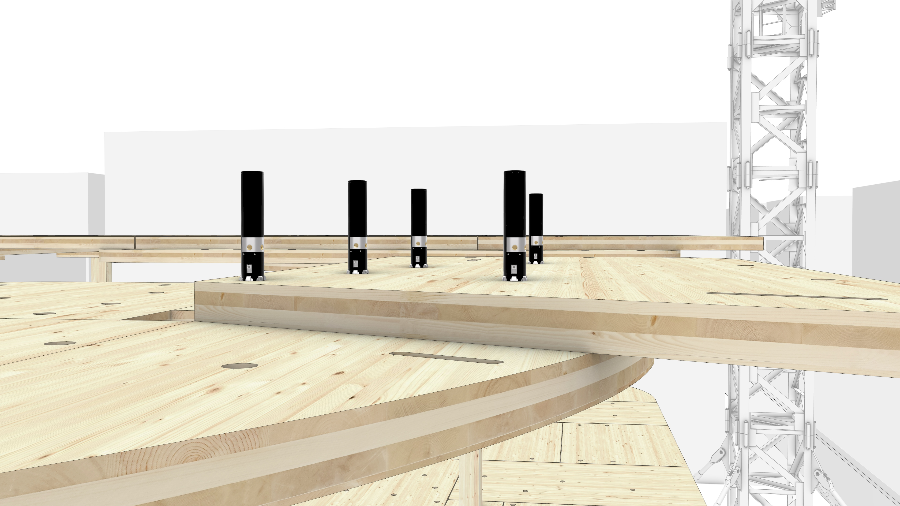
#### Construction Scenario
Going now on site, the assembly process will be demonstrated. In the first step, the prefabricated timber panels will be prepared for assembly by the mobile robotic platform (TIM) before being placed in situ.

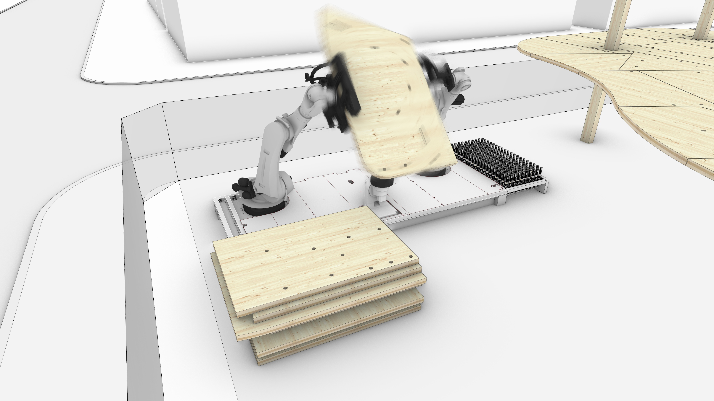

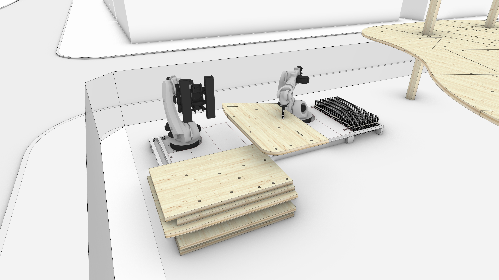

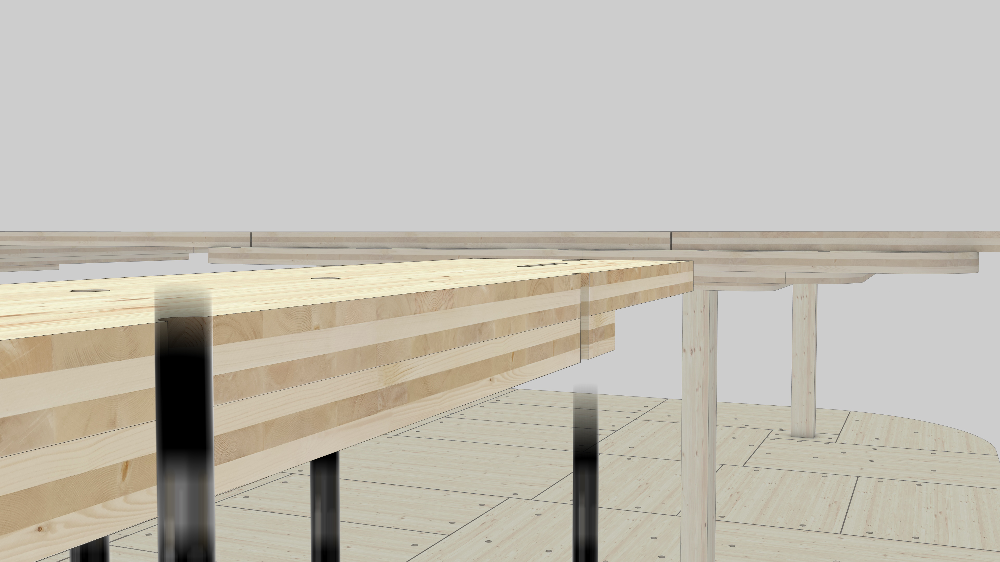
Figure 49 - And after a certain amount of time, after the glue is dried, the device will be able to relieve its pressure from the hole, allowing it to fall to the ground to be re-feed back into the system.
#### Hardware Development
The device can be split into four components: The control system and an anchor at the top, the contraction mechanism in the middle, and another anchor at the bottom.
In general, the device needs to do two things. It needs to clamp itself into the timber, and it needs to apply the pressure required for the glue to dry. One of the main challenges here is that the device needs to be as small as possible while applying as much pressure as possible.

Therefore we decided to go for a pneumatic approach, as these systems have an excellent power-to-weight ratio. They also need low maintenance, are cheap, and very robust because they are fire- and water-resistant. In order to provide the required pressure inside the device we are using a refillable CO2 cartridge. Here CO2 is stored in liquid form, which makes it possible to inflate the entire device to an operating pressure of 6 bar.
In our case, we are using a pneumatic muscle, which can be activated to carry out a linear pulling motion. When the muscle inflates, it expands radially and contracts along the axes, producing a pulling force.
This motion is then coupled with the bottom anchor. Through a spring at the bottom, the first motion of the muscle is converted into a folding motion of the anchor. Which then results in hooking into the timber.

By having both anchors positioned at the outside of the panels, it allows us to reach the biggest possible area. Depending on the depth of the two pressed panels and the strength of the device, the possible area of influence can be calculated with the before explained methods in section 3.2.4. The device itself can be controlled over a wifi connection so that the time and length of inflation can be adjusted depending on the opening and pressing time of the chosen glue.
After the glue has been dried, the CO2 can be released from the system to relieve the pressure on
the anchors so that the device can fall down to the ground for the next operation.
We have also investigated different possibilities to protect the device during the pressurizing of the glue. These included vaseline, milled edges around the inside of the hole, and other kinds of papers. In the end, we opted for a thin sheet of paper wrapped around the case of the device as it seemed to be the simplest solution. Although depending on the choice of glue, we do not see this as necessary. For example, leaving a one cm gap from the hole border while using a non-foaming glue-like 2K-PUR glue did not end in any bond being pushed into the hole.

#### Strength Test
To evaluate the strength of our device, we conducted a tension strength test. This was done by hanging the device between the ceiling and the ground and inflating the muscle with CO2.
The strength test was repeated with varying contraction lengths, ranging from 5% to 25% overall contraction of the pneumatic muscle. This was done by adjusting the tension on the ropes the muscle was hanging in. In the inflated state with a contraction of 5%, our small muscle reached around 500N, while the big muscle achieved 2000N, which is both times around half of the estimated strength of what should theoretically be possible in an industrial setup. The reason for that is that our CNC milled parts were not 100% airtight, which made it impossible to hold the maximum pressure level of what the pneumatic muscle was rated for. However, we think that with another iteration of the valve design and precise machining, the estimated strength could be matched.

#### Hole Spacing Calculating
The calculation of the area of influence for the robotic device is based on how the spacing of screws for a glue pressure application is calculated. Everything was calculated using a 200mm thick spruce slab and an adhesive amount of 300 g/m².
The first study was based on a minimum pressure of 0.1 N/mm², as this is the current requirement of the DIN NORM. By applying different spacings in between the devices, the area of influence changes and therefore also the required force which needs to be applied by each device. This relative needed force then dictates the dimensioning and diameter robotic device.
The 2nd study is based on a minimum pressure of 0.03 N/mm², as stated in a paper from the Helsinki University of Technology [18], which conducted tests at this pressure level and wrote that it is possible to accomplish a glue line which shear strength is as good as those pressed at normal pressures. And that the condition for successful gluing is that the glued surfaces are adequately smooth.
And the final study uses a minimum pressure of 0.01 N/mm², which is more optimistic, but as stated earlier, recent research in material science shows a promising direction. This would already result in an area of influence of 150.000mm² for a device with a diameter of 40mm.

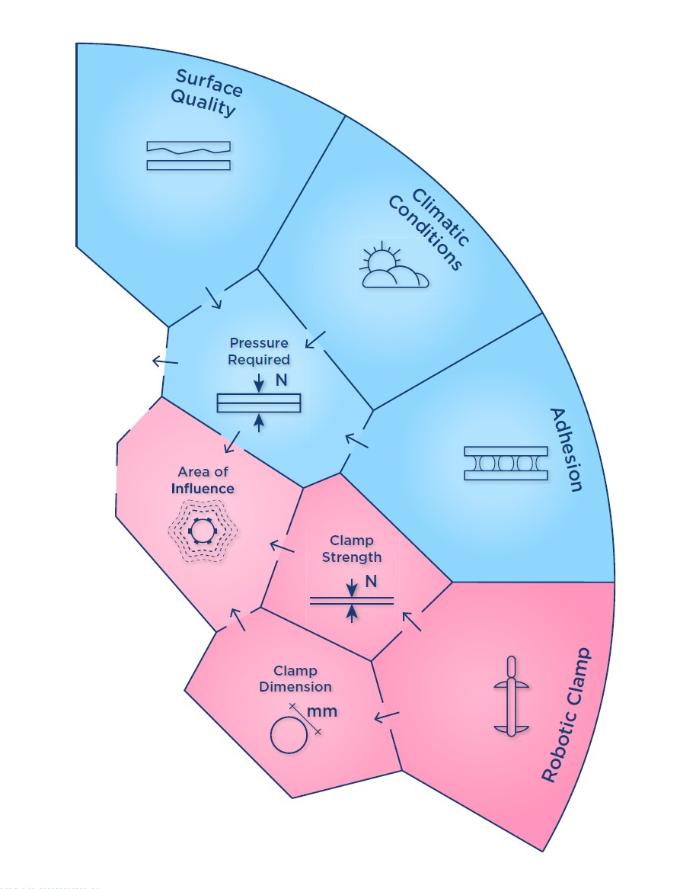
#### Alignment Strategy
While at the current step of development, we focused mainly on the pressurizing mechanism, we also thought about an extension of the device to help with the joining and the assembly of the panels. While the alignment channels in the timber help with the alignment of the panels for the last few centimeters, a camera system could help to navigate the crane during its operation to come into the threshold limit of the alignment channels. This could be done by either extending the robotic device with an embedded camera inside the bottom anchor or designing an additional device with a camera with higher processing power. Additionally, more stable pins could be used to help with the passive alignment of the elements. Alternatively, these could be wooden dowels, which could be left inside of the structure after assembly.
The idea on how the plate would be lowered until the dowels hit the timber structure’s surface, from which then the plate could be dragged along the surface until the wooden dowels slide into the alignment channel. Therefore it would minimize the plate’s movement in one direction; it could then be dragged through the engraved channel until the dowels would slide into their assigned holes.

The alignment channels were tested in two different test setups. The first one consisted of 80x50x2 cm timber plates with 1.5cm thick dowels, and the 2nd one of a 120x80x10 cm CLT plate with 4cm thick dowels. Both tests validated the geometrical concept of the alignment channel as it was possible to assemble the plates in the correct position without any manual adjustments. But the sliding of the dowels was not as straightforward as anticipated, as the friction at the tip of the dowels often let the dowels not to slide along the channel but rather create a rotation point of the plate around the axis of the dowel.
A way to approach this issue was by not having the ropes of the crane attached to a single point with free rotation at the top of the crane, but rather having four individual connection points, which are spaced apart from each other. Further iterations on the system, like adding a third dowel per panel or adding a chamfer to the channels, would need to be made in order to validate the concept as efficient enough to be operated by an autonomous crane.

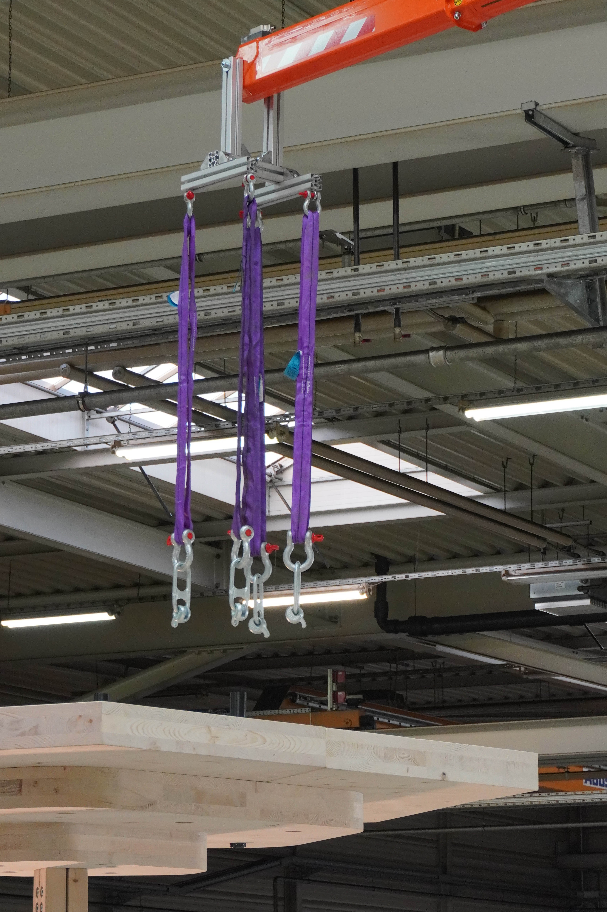
Through machine vision, the device could then detect the holes during assembly while being lowered with the crane. The distance between the holes could then be matched with the digital model to calculate the current position and rotation of the to-be-assembled panel. The whole assembly procedure could then be automated through a feedback system connected with the crane’s operating system. The dowels and alignment channels would then serve to slide the panel into its final position.
The plate would be lowered until the dowels hit the timber structure’s surface, from which then the plate could be dragged along the surface until the wooden dowels slide into the alignment channel. Therefore it would minimize the plate’s movement in one direction; it could then be dragged through the engraved channel until the dowels would slide into their assigned holes.

Figure 62 - Hole detection of the timber elements using machine vision.

Initial tests had been done to serve as a proof of concept for the proposed idea. The test was conducted by mounting an external camera to the panel, which was attached to the crane. In our case, we used the IntelRealSense D435. With the help of the realsense2 and openCV library, it was then possible to detect the holes. This was done by progressive filtering the captured image to extract their relative distance as coordinates to the camera. It consisted of a grayscale conversion of the image, followed by a blurring of the vision to reduce noise, and finally, a threshold filtering for a certain grayscale value. From this, the contours could be filtered out, and the area of these could then be checked to match with the expected pixel size of the holes. This method proved to work very reliably under good lighting conditions. But as the construction site is unstructured, these methods would need to be fine-tuned to deliver more consistent results.
#### Demonstrator
A scaled down section of the timber system was chosen to be designed as a demonstrator to validate the assembly process and to evaluate the system tolerances. It consists of a column, with three layers of CLT panels with a cross-section of 10cm cross-laminated on top of each other. Reaching a three meter diameter at the top and a total height of 2,70 meter.
The panels were milled with a 3-axis CNC machine, which included the drilling of the holes, the engraving of the alignment channels and the cutting of the contours. Afterwards the panels were brought to the IntCDC laboratory in Waiblingen to demonstrate the assembly.

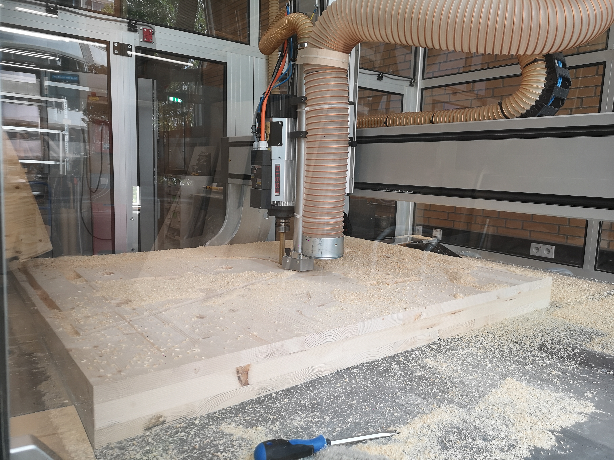

The robotic setup here consisted of TIM a mobile robotic platform tailored towards timber fabrication, a spider crane and our custom device. Additionally an end-effector was designed to help with the automated positioning of the devices and the dowels. Two processes could not be showcased for the final device assembly. On the one side the application of glue was done manually, as at this time the glue-gun of TIM was not operational and M20 bolts were used to apply the pressure in-situ, as only one operational prototype of the robotic device was not sufficient to assemble the entire structure.

Figure 66 - Picking up timber plate and placing it in the workspace area of the mobile robotic platform.

Figure 67 - Dowels being placed by the custom end-effector.

Figure 68 - Robotic device magazine.

Figure 69 - Clamping device being placed into the holes.

Figure 70  - Crane lifting plate away.

Figure 71 - Crane positioning plate on top of the structure.

Figure 72 - Detection of holes to guide the crane during assembly.

Figure 73 - Dowels sliding into the alignment channel to help with the passive alignment of the plates.

Figure 74 - Device falling out after glue-pressing, ready to be collected.

### Discussion
The assembly of the final demonstrator showcased the potential of the system being applied to a 1:1 scale. While the prototype of the proposed device did not achieve the estimated strength, we see a promising development in this direction. We are optimistic that these strength levels could be reached in further iterations. Another development point of the device presents the falling mechanism. While the mechanism works, we are concerned about the device’s longevity in a real construction scenario. Previous ideas to solve this problem include the development of a damping mechanism at the bottom of the device. Another approach could also be taken conceptionally to reconsider the necessity of the device falling to the ground.
Due to the alignment channels, it was possible to assemble the panels with very high precision without needing to adjust the position of the panels in-situ. An additional side-effect of the dowels was that they allowed the whole structure to be assembled without any scaffold, as they locked the plates in a stable enough position to proceed with the in-situ pressure application. This was especially important as the center of gravity from the leaves was not on top of the main structure at that point, which would have let them tip over otherwise. Concern points such as the dripping of the glue during the panel transportation with the crane did not occur during the assembly.
### Outlook
The proposed timber system shows the potential of creating a quasi-monolithic slab. This allows for a point-supported timber slab of unlimited dimensions, which opens up more design flexibility in the floor plan and extends the architectural design space. But to fully validate it as a working building system, more points, such as acoustic & fire safety and the integration of utilities, need to be considered.
The research demonstrated the advantages of working in a heterogeneous robotic system and showcased how through co-design with the material, it is possible to further automate on-site timber construction. The integration of construction logic into the material presents an approach to achieve high precision during assembly and automate the operation of a crane. The application of the distributed device for in-situ pressing of glue connections shows promise in automating this process. Especially with the exponential development in material adhesives and the need for timber structures to be competitive with concrete, we see a great potential of the device being used in an industrial setup.
## Addendum
### Acknowledgements
We would like to thank…
**Samuel Leder & Hans Jakob Wagner**
for their constant support during our master thesis and valuable insights, without which this thesis would not have been possible. And of course for their patience and for responding to our late evening emails
**The whole class of ITECH 2021**
for an incredible time over the last two years
**Katja Rinderspacher**
for constantly being there and guiding us through our time at the university
**Bernhard Rolle**
for giving valuable insights on cutting-edge knowledge regarding automation and cranes for on-site assembly
**Anja Lauer**
for teaching us everything about the operation of cranes and her trust in us for not crashing them
**Tzu-Ying Chen**
for her engineering advice and always taking time for our structural questions
**Sergej Klassen & Kai Stiefenhofer**
for their support and guidance during the fabrication of our demonstrator
**Michael Preisack, Michael Schneider & Michael Tondera**
for their help in the wood & metal workshop and having the patience with our heavy timber panels
**Prof. Achim Menges & Prof. Jan Knippers**
for their valuable feedback and wisdom and the chance to be part of this program
**Festo, Müllerblaustein and Henkel**
for sourcing materials and equipments necessary to bring this thesis to life
**IntCDC**
Partially supported by the Deutsche Forschungsgemeinschaft (DFG, German Research Foundation) under Germany ́s Excellence Strategy – EXC 2120/1 – 390831618
**Family & Friends**
for always having our back and cheering us on
### References
[1] H. Kaufmann, S. Krötsch, and S. Winter, Manual of multi-storey timber construction. Munich: Detail Business Information, 2018. ISBN 978-3955533946
[2] United Nations, Department of Economic and Social Affairs, and Population Division, World urbanization prospects: the 2018 revision. 2019. [Online]. Available: [https://population.un.org/wup/Publications/Files/WUP2018-Report.pdf](https://population.un.org/wup/Publications/Files/WUP2018-Report.pdf), (accessed Feb. 22, 2021) ISBN 978-92-1-148319-2
[3] K. H. Petersen, N. Napp, R. Stuart-Smith, D. Rus, and M. Kovac, “A review of collective robotic construction,” Sci. Robot., vol. 4, no. 28, p. eaau8479, Mar. 2019, doi: 10.1126/scirobotics.aau8479.
[4] F. Barbosa et al., “Reinventing Construction: A Route to Higher Productivity,” McKinsey & Company. [Online]. Available: [https://www.mckinsey.com/business-functions/operations/our-insights/reinventing-construction-through-a-productivity-revolution](https://www.mckinsey.com/business-functions/operations/our-insights/reinventing-construction-through-a-productivity-revolution), (accessed Feb. 02, 2021).
[5] T. Bock, “The future of construction automation: Technological disruption and the upcoming ubiquity of robotics,” Autom. Constr., vol. 59, pp. 113–121, Nov. 2015, doi: 10.1016/j.autcon.2015.07.022.
[6] T. Bock and T. Linner, Robot-Oriented Design: Design and Management Tools for the Deployment of Automation and Robotics in Construction. New York: Cambridge University Press, 2015. doi: 10.1017/CBO9781139924146.
[7] B. G. de Soto and M. J. Skibniewski, “Future of robotics and automation in construction,” in Construction 4.0, 1st ed., A. Sawhney, M. Riley, and J. Irizarry, Eds. Routledge, 2020, pp. 289–306. doi: 10.1201/9780429398100-15.
[8] N. Melenbrink, J. Werfel, and A. Menges, “On-site autonomous construction robots: Towards unsupervised building,” Autom. Constr., vol. 119, p. 103312, Nov. 2020, doi: 10.1016/j.autcon.2020.103312.
[9] L. Vasey, B. Felbrich, M. Prado, B. Tahanzadeh, and A. Menges, “Physically distributed multi-robot coordination and collaboration in construction: A case study in long span coreless filament winding for fiber composites,” Constr. Robot., vol. 4, no. 1–2, pp. 3–18, Jun. 2020, doi: 10.1007/s41693-020-00031-y.
[10] H. J. Wagner, M. Alvarez, O. Kyjanek, Z. Bhiri, M. Buck, and A. Menges, “Flexible and transportable robotic timber construction platform – TIM,” Autom. Constr., vol. 120, p. 103400, Dec. 2020, doi: 10.1016/j.autcon.2020.103400.
[11] J. Willmann, F. Gramazio, and M. Kohler, “New paradigms of the automatic,” in Advancing Wood Architecture, 1st ed., A. Menges, T. Schwinn, and O. D. Krieg, Eds. New York : Routledge, 2016.: Routledge, 2016, pp. 13–28. doi: 10.4324/9781315678825-2.
[12] M. H. Ramage et al., “The wood from the trees: The use of timber in construction,” Renew. Sustain. Energy Rev., vol. 68, pp. 333–359, Feb. 2017, doi: 10.1016/j.rser.2016.09.107.
[13] A. Menges, “The New Cyber-Physical Making in Architecture: Computational Construction: The New Cyber-Physical Making in Architecture: Computational Construction,” Archit. Des., vol. 85, no. 5, pp. 28–33, Sep. 2015, doi: 10.1002/ad.1950.
[14] “Ziele Handlungsfelder - Holzbau-Offensive BW.” [https://www.holzbauoffensivebw.de/de/p/ziele-der-landesregierung/ziele-handlungsfelder-1075.html](https://www.holzbauoffensivebw.de/de/p/ziele-der-landesregierung/ziele-handlungsfelder-1075.html) (accessed Oct. 19, 2021).
[15] “Design as in reinforced concrete, but build in wood,” Holz-Zentralblatt, p. 13, 2021. [Online]. Available: [https://www.ts3.biz/de/medien/pdf/Holzzentralblatt_01_2021Seite-2.pdf](https://www.ts3.biz/de/medien/pdf/Holzzentralblatt_01_2021Seite-2.pdf), access date: 24/02/2021. 
[16] H. J. Wagner, H. Chai, Zhixian Guo, A. Menges, and P. F. Yuan, “Towards an On-site Fabrication System for Bespoke, Unlimited and Monolithic Timber Slabs,” 2020, doi: 10.13140/RG.2.2.14098.68802/1.
[17] TS3, “Timber Structures 3.0.” [Online]. Available: [https://www.ts3.biz/en/technologien/index.php](https://www.ts3.biz/en/technologien/index.php), (accessed Feb. 24, 2021).
[18] M. Kairi, Schraubenverleimungen erlauben neue Möglichkeiten im Ingenieurholzbau, “Screw gluing gives new possibilities for wood engineering,” 2000. [Online]. Available: [https://www.forum-holzbau.com/pdf/matti_00.pdf](https://www.forum-holzbau.com/pdf/matti_00.pdf), (accessed Feb. 05, 2021).
[19] B. H. Schneider, A. Forrest, Y. Vobis, D. Croteau, and M. Oberholzer, “Development of a Two-way Column-supported Flat Plate in Cross Laminated Timber,” in IABSE Symposium, Vancouver 2017: Engineering the Future, Vancouver, Canada, 2017, pp. 1957–1964. doi: 10.2749/vancouver.2017.1957.
[20] “Innovating to Thrive for the Next 130 Years,” Swinerton, Oct. 19, 2020. [https://swinerton.com/blog/innovating-to-thrive-for-the-next-130-years/](https://swinerton.com/blog/innovating-to-thrive-for-the-next-130-years/) (accessed Jul. 27, 2021).
[21] P. Y. V. Leung, A. A. Apolinarska, D. Tanadini, F. Gramazio, and M. Kohler, “Automatic Assembly of Jointed Timber Structure Using Distributed Robotic Clamps,” p. 10. [https://doi.org/10.3929/ethz-b-000481928](https://doi.org/10.3929/ethz-b-000481928)
[22] J. Wu, L. Liu, and H. Xu, “Evaluation Method For Wooden Buildings Disassemblability and Case Verification,” p. 6, 2017. [https://doi.org/10.3390/su12062220](https://doi.org/10.3390/su12062220)
[23] A. Menges, “Morphospaces of Robotic Fabrication,” in Rob | Arch 2012, S. Brell-Çokcan and J. Braumann, Eds. Vienna: Springer Vienna, 2013, pp. 28–47. doi: 10.1007/978-3-7091-1465-0_3.
### Figure References
Fig. 1 - By authors
Fig. 2 - T. Bock, ‘The future of construction automation: Technological disruption and the upcoming ubiquity of robotics’, Autom. Constr., vol. 59, pp. 113–121, Nov. 2015, doi: 10.1016/j.autcon.2015.07.022.
Fig. 3 -T. Bock, ‘The future of construction automation: Technological disruption and the upcoming ubiquity of robotics’, Autom. Constr., vol. 59, pp. 113–121, Nov. 2015, doi: 10.1016/j.autcon.2015.07.022.
Fig. 4 - Fertighaus – Vorteile und Bauweise. [Online]. Available: [https://www.bau-welt.de/haus-konfigurator/fertighaus.html](https://www.bau-welt.de/haus-konfigurator/fertighaus.html)
Fig. 5 - T. Bock, ‘The future of construction automation: Technological disruption and the upcoming ubiquity of robotics’, Autom. Constr., vol. 59, pp. 113–121, Nov. 2015, doi: 10.1016/j.autcon.2015.07.022.
Fig. 6 - H. J. Wagner, M. Alvarez, O. Kyjanek, Z. Bhiri, M. Buck, and A. Menges, “Flexible and transportable robotic timber construction platform – TIM,” Automation in Construction, vol. 120, p. 103400, Dec. 2020, doi: 10.1016/j.autcon.2020.103400.
Fig. 7- S. Lut, T. Stark, L. Siriwardena, S. Bechert, H. J. Wagner, und M. Maierhofer, „Robot team enabled carbon fibre joining strategies for lightweight wood construction“, 2020
Fig. 8 - Sequential Roof. [Online]. Available: [https://ita.arch.ethz.ch/archteclab/sequential-roof-.html](https://ita.arch.ethz.ch/archteclab/sequential-roof-.html) , (accessed Feb. 24, 2021)
Fig. 9 - Arch_Tec_Lab, ETH Zurich [Online]. Available: [https://www.luechingermeyer.ch/en/project/hib-gebaeude-eth-hoenggerberg-zuerich/](https://www.luechingermeyer.ch/en/project/hib-gebaeude-eth-hoenggerberg-zuerich/)
Fig. 10 - Holzbau Offensive Baden-Württemberg [Online]. Available: [https://www.holzbauoffensivebw.de/de](https://www.holzbauoffensivebw.de/de) (accessed Nov. 01, 2021)
Fig. 11- H. Kaufmann, S. Krötsch, and S. Winter, Manual of multi-storey timber construction. Munich: Detail Business Information, 2018. ISBN 978-3955533946
Fig. 12 - M. H. Ramage et al., ‘The wood from the trees: The use of timber in construction’, Renew. Sustain. Energy Rev., vol. 68, pp. 333–359, Feb. 2017, doi: 10.1016/j.rser.2016.09.107.
Fig. 13 - By authors
Fig. 14 - Geschossdecken. [Online]. Available: [https://www.ts3.biz/de/teaser/Geschossdecken.php](https://www.ts3.biz/de/teaser/Geschossdecken.php) (accessed Nov. 01, 2021)
Fig. 15 - Rethinking Timber Building. [Online]. Available: [https://presse.atp.ag/en/news-detail/490-holzbau-neu-gedacht/1746](https://presse.atp.ag/en/news-detail/490-holzbau-neu-gedacht/1746)
Fig. 16 - By authors
Fig. 17 and Fig. 18 - B. H. Schneider, A. Forrest, Y. Vobis, D. Croteau, and M. Oberholzer, “Development of a Two-way Column-supported Flat Plate in Cross Laminated Timber,” in IABSE Symposium, Vancouver 2017: Engineering the Future, Vancouver, Canada, 2017, pp. 1957–1964. doi: 10.2749/vancouver.2017.1957
Fig. 19 - Mass Timber Fastening by Swinerton’s Innovation, 2021. [Online]. Available: [https://swinerton.com/blog/innovating-to-thrive-for-the-next-130-years/](https://swinerton.com/blog/innovating-to-thrive-for-the-next-130-years/)
Fig. 20 - P. Y. V. Leung, A. A. Apolinarska, D. Tanadini, F. Gramazio, and M. Kohler, “Automatic Assembly of Jointed Timber Structure Using Distributed Robotic Clamps,” p. 10. 
[ttps://doi.org/10.3929/ethz-b-000481928](https://doi.org/10.3929/ethz-b-000481928)
Fig. 21 to Fig. 76 - By authors
## Appendix
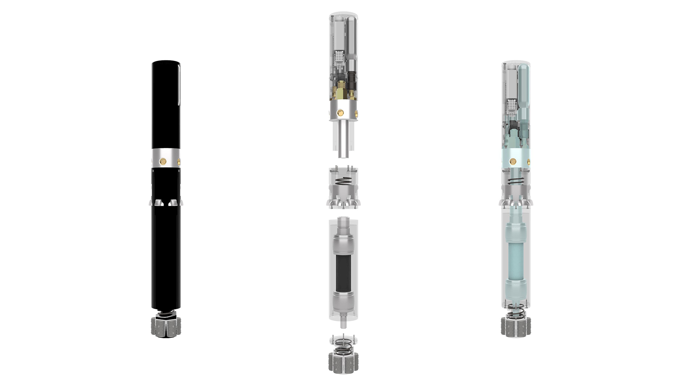
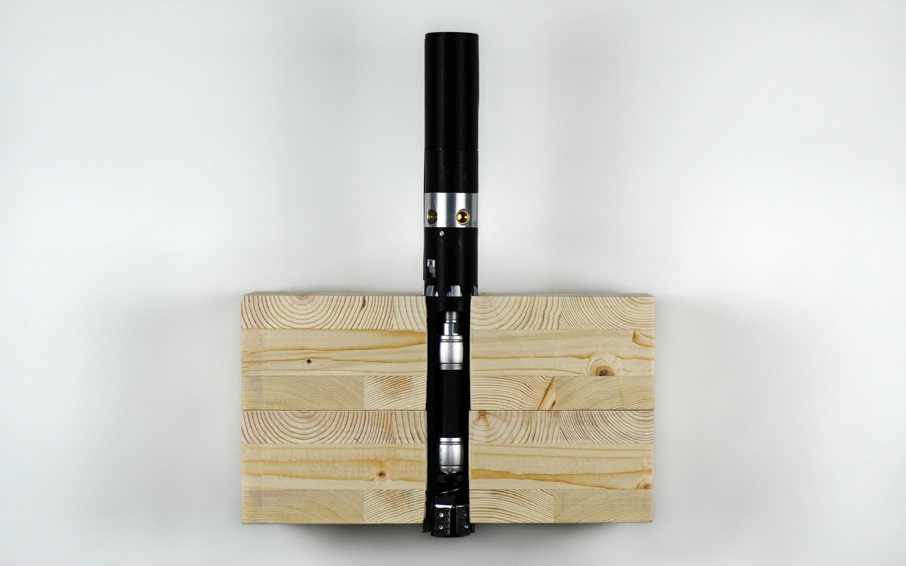

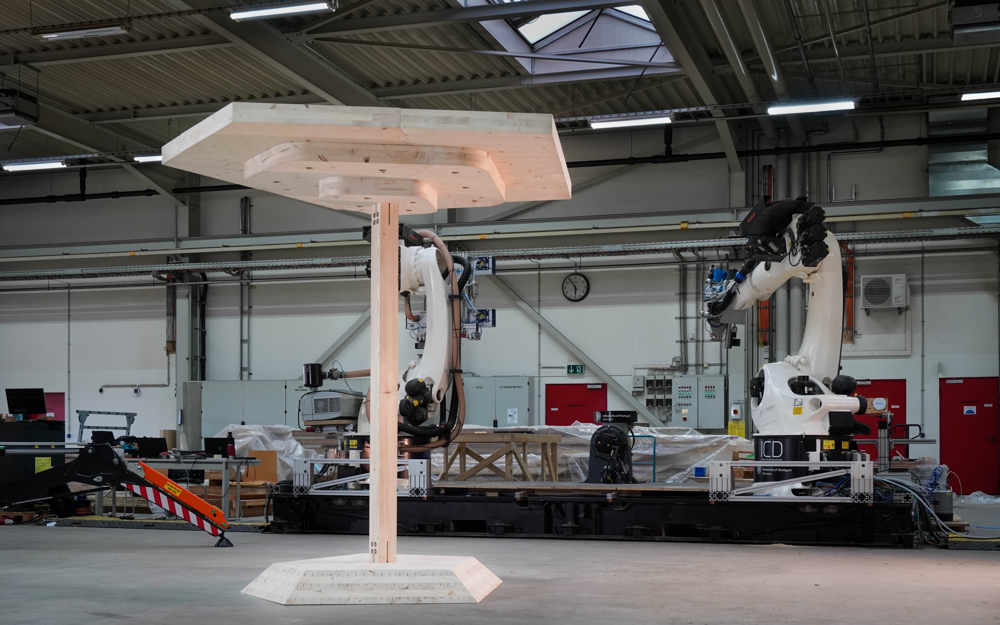
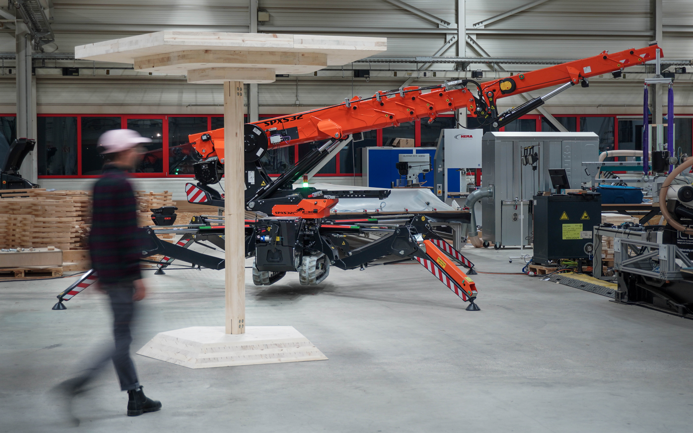

